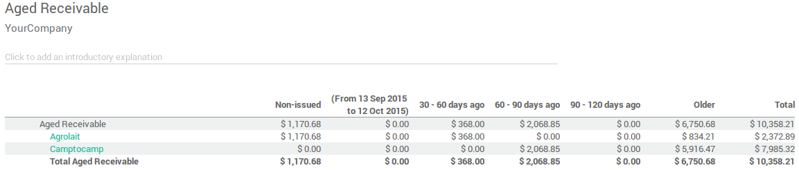
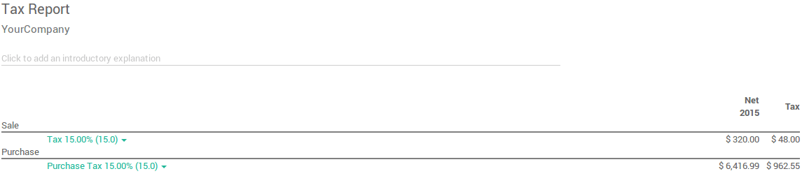

:show-content:

=========
Reporting
=========

Main reports available
======================

Besides the reports created specifically in each localisation module, a
few very useful **generic** and **dynamic reports** are available for all
countries :

-  **Balance Sheet**
-  **Profit and Loss**
-  **Executive Summary**
-  **General Ledger**
-  **Aged Payable**
-  **Aged Receivable**
-  **Cash Flow Statement**
-  **Tax Report**
-  **Bank Reconciliation**

You can annotate every reports to print them and report to your adviser.
Export to xls to manage extra analysis. Drill down in the reports to see
more details (payments, invoices, journal items, etc.).

You can also compare values with another period. Choose how many periods
you want to compare the chosen time period with. You can choose up to 12
periods back from the date of the report if you don't want to use the
default **Previous 1 Period** option.

.. _reporting/balance-sheet:

Balance Sheet
-------------

The **Balance Sheet** shows a snapshot of the assets, liabilities and equity
of your organisation as at a particular date.

.. image:: reporting/main_reports09.png

Profit and Loss
---------------

The **Profit and Loss** report (or **Income Statement**) shows your
organisation's net income, by deducting expenses from revenue for the
report period.

.. image:: reporting/main_reports10.png

Executive Summary
-----------------

The **Executive Summary** allows for a quick look at all the important
figures you need to run your company.

In very basic terms, this is what each of the items in this section is
reporting :

- **Performance:**
    - **Gross profit margin:**
        The contribution each individual sale made
        by your business less any direct costs needed to make those sales
        (things like labour, materials, etc).
    - **Net profit margin:**
        The contribution each individual sale made by
        your business less any direct costs needed to make those sales,
        as well as any fixed overheads your company has (things like
        rent, electricity, taxes you need to pay as a result of those
        sales).
    - **Return on investment (p.a.):**
        The ratio of net profit made, to the
        amount of assets the company used to make those profits.
- **Position:**
    - **Average debtor days:**
        The average number of days it takes your
        customers to pay you (fully), across all your customer invoices.
    - **Average creditor days:**
        The average number of days it takes you to
        pay your suppliers (fully) across all your bills.
    - **Short term cash forecast:**
        How much cash is expected in or out of
        your organisation in the next month i.e. balance of your **Sales
        account** for the month less the balance of your **Purchases account**
        for the month.
    - **Current assets to liabilities:**
        Also referred to as **current ratio**, this is the ratio
        of current assets (assets that could be
        turned into cash within a year) to the current liabilities
        (liabilities which will be due in the next year). This is
        typically used as as a measure of a company's ability to service
        its debt.

.. image:: reporting/main_reports01.png

General Ledger
--------------

The **General Ledger Report** shows all transactions from all accounts for a
chosen date range. The initial summary report shows the totals for each
account and from there you can view a detailed transaction report or any
exceptions. This report is useful for checking every transaction that
occurred during a certain period of time.

.. image:: reporting/main_reports05.png

.. _reporting/aged-payable:

Aged Payable
------------

Run the **Aged Payable Details** report to display information on individual
bills, credit notes and overpayments owed by you, and how long these
have gone unpaid.

.. image:: reporting/main_reports02.png

.. _reporting/aged-receivable:

Aged Receivable
---------------

The **Aged Receivables** report shows the sales invoices that were awaiting
payment during a selected month and several months prior.

Cash Flow Statement
-------------------

The **Cash Flow Statement** shows how changes in balance sheet accounts and
income affect cash and cash equivalents, and breaks the analysis down to
operating, investing and financing activities.

.. image:: reporting/main_reports03.png

.. _reporting/tax-report:

Tax Report
----------

This report allows you to see the **net** and **tax amounts** for all the taxes
grouped by type (sale/purchase).

Bank Reconciliation
-------------------

.. image:: reporting/main_reports06.png

.. toctree::
   :titlesonly:

   reporting/tax_returns
   reporting/tax_carryover
   reporting/analytic_accounting
   reporting/budget
   reporting/intrastat
   reporting/data_inalterability
   reporting/silverfin
   reporting/customize
   reporting/year_end
