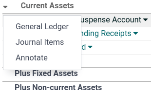
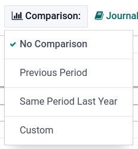
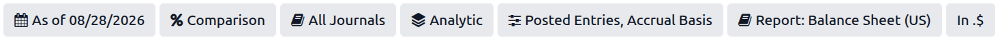

:show-content:

=========
Reporting
=========

Odoo includes **generic** and **dynamic** reports available for all countries, regardless of the
:doc:`localization package <../../finance/fiscal_localizations>` installed:

-  :ref:`accounting/reporting/balance-sheet`
-  :ref:`accounting/reporting/profit-and-loss`
-  :ref:`accounting/reporting/executive-summary`
-  :ref:`accounting/reporting/general-ledger`
-  :ref:`accounting/reporting/aged-receivable`
-  :ref:`accounting/reporting/aged-payable`
-  :ref:`accounting/reporting/cash-flow-statement`
-  :ref:`accounting/reporting/tax-report`
-  :ref:`accounting/reporting/audit-trail`

.. tip::
   You can also create :doc:`custom reports <reporting/customize>`.

To expand the lines of a report and view its details, click the :icon:`fa-caret-right`
(:guilabel:`right arrow`) on the left. Then click the :icon:`fa-caret-down` (:guilabel:`down arrow`)
to the right of the account, journal entry, payment, invoice, etc. to :guilabel:`Annotate` and view
the details.

To export reports in PDF or XLSX format, click :guilabel:`PDF` at the top or click the
:icon:`fa-caret-down` (:guilabel:`down arrow`) icon next to the :guilabel:`PDF` button and
select :guilabel:`XLSX`.

To compare values across periods, click the :guilabel:`Comparison` menu and select the periods you
want to compare.

.. _accounting/reporting/balance-sheet:

Balance Sheet
=============

The :guilabel:`Balance Sheet` shows a snapshot of your organization's assets, liabilities, and
equity at a particular date.

.. _accounting/reporting/profit-and-loss:

Profit and Loss
===============

The :guilabel:`Profit and Loss` report (or **Income Statement**) shows your company's net income by
deducting expenses from revenue for the reporting period.

.. _accounting/reporting/executive-summary:

Executive Summary
=================

The :guilabel:`Executive Summary` provides an overview of all the important figures for overseeing
your company's performance.

It includes the following items:

- :guilabel:`Performance`:
    - :guilabel:`Gross profit margin`:
        The contribution of all sales your business makes **minus** any direct costs needed to
        make those sales (labor, materials, etc.).
    - :guilabel:`Net profit margin`:
        The contribution of all sales made by your business **minus** any direct costs needed to
        make those sales *and* fixed overheads your company has (electricity, rent, taxes
        to be paid as a result of those sales, etc.).
    - :guilabel:`Return on investment (per annum)`:
        The ratio of the net profit to the amount of assets the company used to make those profits.
- :guilabel:`Position`:
    - :guilabel:`Average debtors days`:
        The average number of days it takes your customers to (fully) pay you across all your
        customer invoices.
    - :guilabel:`Average creditors days`:
        The average number of days it takes you to (fully) pay your suppliers across all your bills.
    - :guilabel:`Short-term cash forecast`:
        How much cash is expected in or out of your business in the next month, i.e., the balance of
        your **Sales account** for the month **minus** the balance of your **Purchases account** for
        the month.
    - :guilabel:`Current assets to liabilities`:
        Also referred to as the **current ratio**, this is the ratio of current assets (:dfn:`assets
        that could be turned into cash within a year`) to the current liabilities (:dfn:`liabilities
        that will be due in the next year`). It is typically used to measure a company's ability to
        service its debt.

.. _accounting/reporting/general-ledger:

General Ledger
==============

The :guilabel:`General Ledger` report shows all transactions from all accounts for a selected date
range. The initial summary report shows the totals for each account. To expand an account and view
its details, click the :icon:`fa-caret-right` (:guilabel:`right arrow`) on the left.
This report is useful for reviewing each transaction that occurred during a specific period.

.. _accounting/reporting/aged-receivable:

Aged Receivable
===============

The :guilabel:`Aged Receivable` report shows the sales invoices awaiting payment during a selected
month and several months prior.

.. _accounting/reporting/aged-payable:

Aged Payable
============

The :guilabel:`Aged Payable` report displays information on individual bills, credit notes, and
overpayments you owe and how long these have gone unpaid.

.. _accounting/reporting/cash-flow-statement:

Cash Flow Statement
===================

The :guilabel:`Cash Flow Statement` shows how changes in balance sheet accounts and income affect
cash and cash equivalents and breaks the analysis down to operating, investing, and financing
activities.

.. _accounting/reporting/tax-report:

Tax Report
==========

The :guilabel:`Tax Report` shows the :guilabel:`NET` and :guilabel:`TAX` amounts for all the
taxes grouped by type (:guilabel:`Sales`/:guilabel:`Purchases`).

.. toctree::
   :titlesonly:

   reporting/tax_returns
   reporting/tax_carryover
   reporting/analytic_accounting
   reporting/budget
   reporting/annual-report
   reporting/intrastat
   reporting/data_inalterability
   reporting/silverfin
   reporting/customize
   reporting/year_end

.. _accounting/reporting/audit-trail:

Audit Trail
===========

The :guilabel:`Audit Trail` report tracks changes made to fields that have an impact on accounting
and includes the date and time of the changes, the user who made the changes, the type of change,
the previous value, and the updated value.

In addition to being recorded in the :doc:`chatter </applications/productivity/discuss/chatter>`,
changes to records are also tracked in the audit trail, providing users a dedicated and detailed
audit trail report. The audit trail report is available for audit checks, satisfying the
requirements of the financial authorities and auditors of various countries.

To access the audit trail, navigate to :menuselection:`Accounting --> Review --> Audit Trail`.

An optional restrictive mode prevents tracked records from being deleted for more controlled
immutability. Instead of being deleted, these records can only be cancelled or archived. To enable
this restrictive mode, navigate to :menuselection:`Accounting --> Settings --> Configuration`,
scroll down to the :guilabel:`Reporting` section, and tick the checkbox beside
:guilabel:`Restrictive Audit Trail`.

.. _accounting/reporting/filters:

Report filters and options
==========================

Reporting filters and options vary on a per-report basis. The following buttons and options are
common to most reports and are located in the top bar of the report:

- A *date* filter, indicated by the :icon:`fa-calendar` :guilabel:`(calendar)` icon that precedes a
  date in the local format. Use this filter to select a specific date or date range for the report.
- A :guilabel:`% Comparison` filter, to compare reporting periods against each other.
- A *journal* filter, indicated by the :icon:`fa-book` :guilabel:`(book)` icon and a default
  setting, such as :guilabel:`All Journals`. Use this filter to specify which journals should be
  included in the report.
- An *analytic* filter, indicated by the :icon:`oi-group` :guilabel:`(group)` icon. Use this filter
  to only include analytic accounts and plans in the report.
- An *entries type* filter, indicated by the :icon:`fa-sliders` :guilabel:`(filter)` icon and a
  default setting, such as :guilabel:`Posted Entries Only, Accrual Basis`. Use this filter to
  determine which type of journal entries should be included in the report (e.g. posted or draft),
  along with the type of accounting method (e.g., accrual or :ref:`cash basis
  <accounting/cash-basis/report-filter>`).

  This filter also includes display options, such as :guilabel:`Hide lines at 0`, which removes
  zero-value lines from the report, or :guilabel:`Split Horizontally`, which keeps the report
  within the screen's fold and eliminates the need to scroll.

- A *decimal* option, which includes figures with cents by default, as indicated by your local
  currency icon (e.g., :guilabel:`In .$`). Use the other options in the drop-down menu to format
  figures in the report as whole numbers (e.g., :guilabel:`In $`), thousands (e.g.,
  :guilabel:`In K$`), or millions (e.g., :guilabel:`In M$`).

.. tip::
   With :ref:`developer mode <developer-mode>` enabled, a :doc:`report customization
   <reporting/customize>` option, indicated by the :icon:`fa-cogs` :guilabel:`(cogs)` icon is
   available in the top bar. It allows, for example, to add the :ref:`Cash Basis Method filter
   <accounting/cash-basis/report-filter>`.
