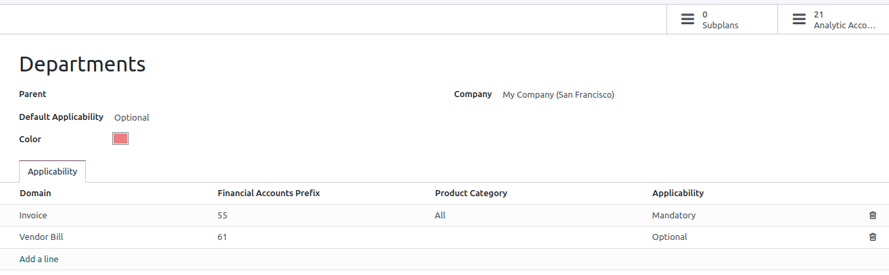
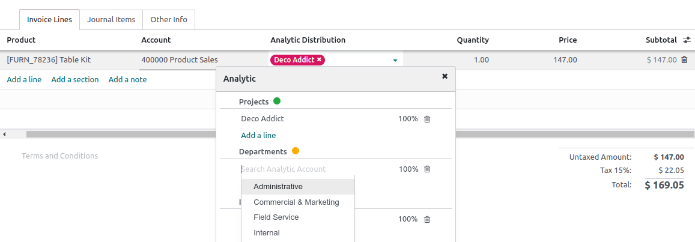

===================
Analytic accounting
===================

Analytic accounting helps you track costs and revenues, as well as analyze the profitability of a
project or service. When creating your journal entries, the analytic widget allows the distribution
of costs in one or more analytic accounts.

Configuration
=============

Enable the :guilabel:`Analytic Accounting` feature by going to :menuselection:`Accounting -->
Configuration --> Settings --> Analytics`.

Analytic accounts
=================

The analytic accounts give an overview of your costs and revenue.

Access your existing analytic accounts by going to :menuselection:`Accounting --> Configuration -->
Analytic Accounting: Analytic Accounts`. To create a new analytic account, click :guilabel:`New`,
and fill in the required information:

- :guilabel:`Analytic Account`: add the name of your analytic account;
- :guilabel:`Customer`: select the customer related to your project;
- :guilabel:`Reference`: add a reference to make it easier to find the account when you are on your
  bill;
- :guilabel:`Plan`: add an :ref:`analytic plan <analytic_accounting/analytic_plans>`;
- :guilabel:`Company`: if you are managing multiple companies, select the company for which the
  analytic account will be used;
- :guilabel:`Currency`: select the currency of the analytic account;

Then, fill in your :doc:`budget <budget>` information.

.. _analytic_accounting/analytic_plans:

Analytic plans
==============

The analytic plans allow you to analyze your accounting. For example, to track costs and revenues by
project or department.

You can access the analytic plans by going to :menuselection:`Accounting --> Configuration -->
Analytic Accounting: Analytic Plans`. Click :guilabel:`New` to create a new plan.

The following information must be completed:

- :guilabel:`Parent`: link your plan to another :guilabel:`Analytic Plan` to build a hierarchy
  between your plans;
- :guilabel:`Default Applicability`: decide how your plan behaves in the widget when creating a new
  journal entry:

   - :guilabel:`Optional`: if selected, it is not mandatory to add the analytic plan in the widget;
   - :guilabel:`Mandatory`: if selected, an orange bullet is visible in the widget next to the plan
     until the analytic distribution is done (the bullet then turns to green); it is not possible to
     confirm the entry if no analytic account is selected;
   - :guilabel:`Unavailable`: if selected, the plan is not available in the widget.

- :guilabel:`Color`: select the color of the tag related to this specific plan;
- :guilabel:`Company`: add the company to which the plan applies;

You can also fine-tune your plans' applicability by filling in the :guilabel:`Applicability` tab:

- :guilabel:`Domain`: choose to which accounting document your plan applies;
- :guilabel:`Financial Accounts Prefix`: select the prefix of the account(s) to which this plan
  should be applied;
- :guilabel:`Product Category`: decide to which product category the plan applies;
- :guilabel:`Applicability`: decide how your plan behaves in the widget when creating a new journal
   entry. The applicability you set here always overrides the default applicability.

Two smart buttons are available in the top-right corner:

   - :guilabel:`Subplans`: can be created to have a more complex analytic structure. Click the
     :guilabel:`Subplans` smart button, and then :guilabel:`New` to add a subplan;
   - :guilabel:`Analytic Accounts`: to reach the analytic accounts related to the plan.

.. note::
   - The analytic widget is prefilled based on the applicability, and the
     :ref:`Analytic Distribution Models <analytic_distribution_models>`;
   - Each analytic plan must have at least one analytic account.

Analytic distribution
=====================

Add a plan in the :guilabel:`Analytic` column when creating an invoice or bill. This field is
mandatory only if you previously linked your analytic plan to at least one analytic account. After
adding the plan, a **widget** opens where you can fill in the different information. You can add
**tags** to reflect the related analytic accounts and decide how to split the costs between the
accounts by modifying the percentage.

.. _analytic_distribution_models:

Analytic distribution models
----------------------------

The analytic distribution models automatically apply a specific distribution based on defined
criteria.

To create a new analytic distribution model, go to :menuselection:`Accounting --> Configuration -->
Analytic Distribution Models`, click :guilabel:`New` and set the conditions your model has to meet
to automatically apply:

- :guilabel:`Accounts Prefix`: this analytic distribution will apply to all financial accounts
  sharing the prefix specified;
- :guilabel:`Partner`: select a partner for which the analytic distribution will be used;
- :guilabel:`Partner Category`: this field is not visible by default: add it by clicking on the
  columns selection button, and tick the :guilabel:`Partner Category` box. Add the partner category
  for which the analytic distribution will be used;
- :guilabel:`Product`: select a product for which the analytic distribution will be used;
- :guilabel:`Product Category`: this field is not visible by default: add it by clicking on the
  columns selection button, and tick the :guilabel:`Product Category` box. Select a product category
  for which the analytic distribution will be used;
- :guilabel:`Analytic`: add the analytic accounts and their distribution;
- :guilabel:`Company`: select a company for which the analytic distribution will be used;
- :guilabel:`Analytic Distribution`: if the above conditions are met, the :guilabel:`Analytic plan`
  defined in this field as well as the distribution to be applied between the different analytic
  accounts is selected automatically on the entry.

.. tip::
   To **mass edit** several entries simultaneously, go to :menuselection:`Accounting --> Accounting
   --> Journal items`, and select the ones that need to be updated. Add the required distribution in
   the :guilabel:`Analytic Distribution` column, and click on the :guilabel:`floppy disk` icon to
   save. The analytic distribution template pops up, and you can save it for later use.
