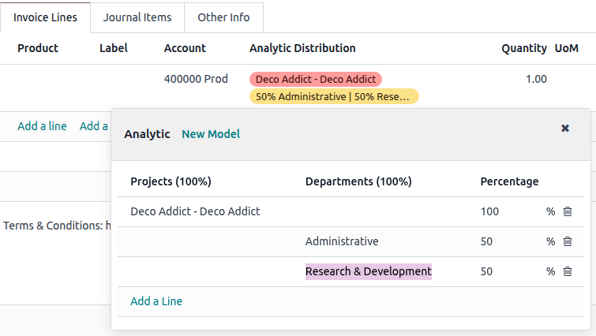

===================
Analytic accounting
===================

Analytic accounting helps track costs and revenues and analyze a project's or service's
profitability. When creating journal entries, costs can be :ref:`distributed
<accounting/analytic_accounting/analytic-distribution>` across one or more analytic accounts.

To activate this feature, go to :menuselection:`Accounting --> Configuration --> Settings` and
enable :guilabel:`Analytic Accounting` in the :guilabel:`Analytics` section.

.. seealso::
   :doc:`Analytic budget <budget>`

.. _accounting/analytic_accounting/analytic_accounts:

Analytic accounts
=================

Analytic accounts give an overview of costs and revenue.

To access analytic accounts, go to :menuselection:`Accounting --> Configuration --> Analytic
Accounts`. To create a new analytic account, click :guilabel:`New` and fill in the following
information:

- :guilabel:`Analytic Account`: Assign the name of the analytic account.
- :guilabel:`Customer`: Select the customer linked to the project, if applicable.
- :guilabel:`Reference`: Include a reference to make the account easier to find if needed.
- :guilabel:`Plan`: Link the :guilabel:`Analytic Account` to an :ref:`analytic plan
  <accounting/analytic_accounting/analytic_plans>`.
- :guilabel:`Company`: In a :doc:`multi-company </applications/general/companies/multi_company>`
  environment, select the company using the analytic account. To make the analytic account
  accessible to all companies, leave the field empty.
- :guilabel:`Currency`: Update the currency of the analytic account if needed.

Then, the :doc:`budget <budget>` information can be filled in.

.. _accounting/analytic_accounting/analytic_plans:

Analytic plans
==============

Analytic plans group :ref:`analytic accounts <accounting/analytic_accounting/analytic_accounts>`,
allowing the company to analyze its accounting, such as tracking costs and revenues by project or
department.

To access analytic plans, go to :menuselection:`Accounting --> Configuration --> Analytic Plans`.
Click :guilabel:`New` to create a new plan, add a name, and fill in the following information:

- :guilabel:`Parent`: Link the plan to another analytic plan if a hierarchy between plans must be
  built.
- :guilabel:`Default Applicability`: Define how the plan is applied when creating a new journal
  entry:

  - :guilabel:`Optional`: Adding the analytic plan is not mandatory.
  - :guilabel:`Mandatory`: The entry cannot be confirmed if no analytic account is selected.
  - :guilabel:`Unavailable`: The plan is not available.

- :guilabel:`Color`: Set a color for the tag related to this specific plan.

To fine-tune a plan's applicability, create a new line in the :guilabel:`Applicability` tab and set
the following fields:

- :guilabel:`Domain`: Choose the accounting documents to which the plan applies.
- :guilabel:`Financial Accounts Prefixes`: Enter the prefix(es) of the account(s) to which the plan
  applies.
- :guilabel:`Product Category`: Choose the product category to which the plan applies.
- :guilabel:`Applicability`: Define how the plan is applied when creating a new journal entry. The
  applicability set here always overrides the default applicability.
- :guilabel:`Company`: In a :doc:`multi-company </applications/general/companies/multi_company>`
  environment, select the company using the plan. To make the analytic plan accessible to all
  companies, leave the field empty.

Two smart buttons are available:

- :guilabel:`Subplans`: To have a more complex analytic structure. Click the smart button, then
  click :guilabel:`New` to add a subplan. This creates a parent-child relationship between the two
  plans, and the :guilabel:`Parent` field of the subplan is automatically populated with the
  original plan.
- :guilabel:`Analytic Accounts`: To access the :ref:`analytic accounts
  <accounting/analytic_accounting/analytic_accounts>` linked to the plan.

.. note::
   Each analytic plan must have at least one analytic account.

.. _accounting/analytic_accounting/analytic-distribution:

Analytic distribution
=====================

The distribution of costs in one or more analytic accounts can be set in each :ref:`invoice/bill
<accounting/analytic_accounting/distribution-invoices-bills>` or :ref:`en masse
<accounting/analytic_accounting/distribution-mass>`.

.. note::
   The analytic distribution is prefilled based on the applicability and the :ref:`analytic
   distribution models <accounting/analytic_distribution_models>`.

.. _accounting/analytic_accounting/distribution-invoices-bills:

Analytic distribution on invoices or bills
------------------------------------------

To add analytic distribution, click the :guilabel:`Analytic Distribution` column when creating an
:ref:`invoice <accounting/invoice/creation>` or :ref:`bill <accounting/vendor_bills/creation>`.

.. note::
   The :guilabel:`Analytic Distribution` field is mandatory only if the :ref:`analytic plan
   <accounting/analytic_accounting/analytic_plans>` has been set as :guilabel:`Mandatory` in either
   the :guilabel:`Default Applicability` field on an analytic plan or the :guilabel:`Applicability`
   field on an analytic plan line.

In the :guilabel:`Analytic` window, select the desired :guilabel:`Analytic Accounts` in the
different :guilabel:`Analytic Plans` displayed in columns. Then, split the costs between the
accounts by modifying the percentage.

.. _accounting/analytic_accounting/distribution-mass:

Analytic distribution en masse
------------------------------

To mass-edit analytic accounts in several entries simultaneously, go to :menuselection:`Accounting
--> Accounting --> Journal items`, and select the ones that need to be updated. Click the
:guilabel:`Analytic Distribution` column and add the required distribution in the
:guilabel:`Analytic` column, then click the :icon:`oi-close` :guilabel:`(cross)` and
:guilabel:`Confirm`. The analytic distribution is then added to the selected journal items.

.. _accounting/analytic_distribution_models:

Analytic distribution models
----------------------------

Analytic distribution models automatically apply a specific distribution based on defined criteria.

To create a new analytic distribution model, go to :menuselection:`Accounting --> Configuration -->
Analytic Distribution Models`, click :guilabel:`New`, and set the conditions the model has to meet
to apply automatically:

.. note::
   - All specified conditions of an analytic distribution model must be met for the model to be
     applied. To apply an analytic distribution model based on individual conditions, create
     separate analytic distribution models for each condition.
   - Analytic distribution models can be combined and sequenced, allowing distribution across
     multiple models if linked to different
     :ref:`analytic plans <accounting/analytic_accounting/analytic_plans>`. To adjust the order,
     drag and drop the models using the :icon:`oi-draggable` :guilabel:`(draggable)` icon.

- :guilabel:`Accounts Prefixes`: Apply the distribution model only to journal items involving
  accounts that begin with specific prefixes.
- :guilabel:`Partner`: Apply the distribution model only to journal items involving a specific
  partner.
- :guilabel:`Product`: Apply the distribution model only to journal items involving a specific
  product.
- :guilabel:`Company`: In a :doc:`multi-company </applications/general/companies/multi_company>`
  environment, apply the distribution model only to journal items involving a specific company. To
  apply it across all companies, leave the field empty.
- :guilabel:`Analytic Distribution`: :ref:`Analytic distribution
  <accounting/analytic_accounting/analytic-distribution>` that will be applied when the above
  conditions are met.

.. example::
   Any time a journal item is posted to the :guilabel:`Utilities (601000)` account, it should be
   automatically distributed in the :guilabel:`Departments` analytic plan as follows:

   - 60% to the :guilabel:`Manufacturing` analytic account
   - 30% to the :guilabel:`Marketing` analytic account
   - 10% to the :guilabel:`Admin` analytic account

   To automate this distribution, the :guilabel:`Accounts Prefix` can be set to `601`, as
   :guilabel:`Utilities (601000)` is the only account in the chart of accounts that begins with
   `601`.

   If additional accounts such as :guilabel:`Electricity (601100)` or :guilabel:`Gas (601200)` are
   available in the chart of accounts, the distribution will also apply to both since they share the
   same prefix.

To define more criteria, use the :icon:`oi-settings-adjust` :guilabel:`(adjust settings)` icon to
reveal more columns or click :guilabel:`View` on an individual analytic distribution model.

- :guilabel:`Partner Category`: Apply this distribution model only to journal items involving a
  partner in a specific category.
- :guilabel:`Product Category`: Apply this distribution model to journal items involving a product
  in a specific category.

.. tip::
   Alternatively, it is possible to create an analytic distribution model from the
   :guilabel:`Analytic` window by clicking :guilabel:`New Model`:

   - either when creating an invoice/bill and filling in the :ref:`analytic distribution
     <accounting/analytic_accounting/distribution-invoices-bills>`;
   - or when :ref:`mass-editing analytic accounts
     <accounting/analytic_accounting/distribution-mass>` in several entries simultaneously.

