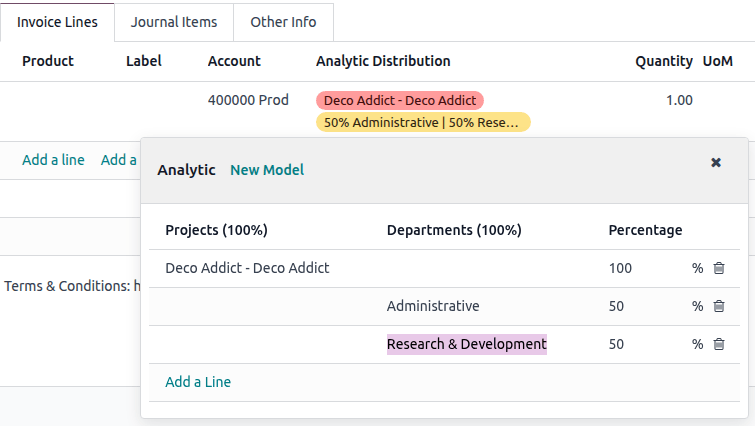

===================
Analytic accounting
===================

Analytic accounting helps track costs and revenues and analyze a project or service's profitability.
When creating journal entries, costs can be :ref:`distributed
<analytic_accounting/analytic-distribution>` across one or more analytic accounts.

To enable the :guilabel:`Analytic Accounting` feature, go to :menuselection:`Accounting -->
Configuration --> Settings` in the :guilabel:`Analytics` section.

.. seealso::
   :doc:`Analytic budget <budget>`

.. _analytic_accounting/analytic_accounts:

Analytic accounts
=================

Analytic accounts give an overview of costs and revenue.

To access analytic accounts, go to :menuselection:`Accounting --> Configuration --> Analytic
Accounts`. To create a new analytic account, click :guilabel:`New`, and fill in the following
information:

- :guilabel:`Analytic Account`: Assign the name of the analytic account.
- :guilabel:`Customer`: Select the customer linked to the project, if applicable.
- :guilabel:`Reference`: Include a reference to make the account easier to find, if needed.
- :guilabel:`Plan`: Link the :guilabel:`Analytic Account` to an :ref:`analytic plan
  <analytic_accounting/analytic_plans>`.
- :guilabel:`Company`: In a :doc:`multi-company </applications/general/multi_company>` environment,
  select which company uses the analytic account.
- :guilabel:`Currency`: Update the currency of the analytic account, if needed.

Then, the :doc:`budget <budget>` information can be filled in.

.. _analytic_accounting/analytic_plans:

Analytic plans
==============

Analytic plans allow the company to analyze its accounting, such as tracking costs and revenues
by project or department.

To access analytic plans, go to :menuselection:`Accounting --> Configuration --> Analytic Plans`.
Click :guilabel:`New` to create a new plan, add a name and fill in the following information:

- :guilabel:`Parent`: Link the plan to another analytic plan if a hierarchy between plans must be
  built.
- :guilabel:`Default Applicability`: Define how the plan is applied when creating a new journal
  entry:

  - :guilabel:`Optional`: Adding the analytic plan is not mandatory.
  - :guilabel:`Mandatory`: The entry cannot be confirmed if no analytic account is selected.
  - :guilabel:`Unavailable`: The plan is not available.

- :guilabel:`Color`: Set a color for the tag related to this specific plan.

Accounting plans' applicability can be specified in the :guilabel:`Applicability` tab:

- :guilabel:`Domain`: Assign the plan to the appropriate accounting document.
- :guilabel:`Financial Accounts Prefix`: Choose the account(s) prefix to which this plan will apply.
- :guilabel:`Product Category`: Choose the product category to which the plan applies.
- :guilabel:`Applicability`: Define how the plan is applied when creating a new journal entry. The
  applicability set here always overrides the default applicability.
- :guilabel:`Company`: In a :doc:`multi-company </applications/general/multi_company>` environment,
  select which company uses the plan.

Two smart buttons are available in the top-right corner:

- :guilabel:`Subplans`: To have a more complex analytic structure. Click :guilabel:`New` to add a
  subplan.
- :guilabel:`Analytic Accounts`: To access the :ref:`analytic accounts
  <analytic_accounting/analytic_accounts>` linked to the plan.

.. note::
   Each analytic plan must have at least one analytic account.

.. _analytic_accounting/analytic-distribution:

Analytic distribution
=====================

The distribution of costs in one or more analytic accounts can be set in each :ref:`invoice/bill
<analytic_accounting/distribution-invoices-bills>` or :ref:`in mass
<analytic_accounting/distribution-mass>`.

.. note::
   The analytic distribution is prefilled based on the applicability and the :ref:`Analytic
   Distribution Models <analytic_distribution_models>`.

.. _analytic_accounting/distribution-invoices-bills:

Analytic distribution on invoices or bills
------------------------------------------

To add analytic distribution, click the :guilabel:`Analytic Distribution` column when creating an
:ref:`invoice <accounting/invoice/creation>` or :ref:`bill <accounting/vendor_bills/creation>`.

.. note::
   The :guilabel:`Analytic Distribution` field is mandatory only if the :ref:`analytic plan
   <analytic_accounting/analytic_plans>` has been set as :guilabel:`Mandatory` in the
   :guilabel:`Default Applicability` field.

In the :guilabel:`Analytic` window, select the desired :guilabel:`Analytic Accounts` in the
different :guilabel:`Analytic Plans` displayed in columns. Then, split the costs between the
accounts by modifying the percentage.

.. _analytic_accounting/distribution-mass:

Mass-edit analytic distribution
-------------------------------

To mass-edit analytic accounts in several entries simultaneously, go to :menuselection:`Accounting
--> Accounting --> Journal items`, and select the ones that need to be updated. Click the
:guilabel:`Analytic Distribution` column and add the required distribution in the
:guilabel:`Analytic` column, then click the :icon:`oi-close` :guilabel:`(cross)` and
:guilabel:`Confirm`. The analytic distribution is then added to the selected journal.

.. _analytic_distribution_models:

Analytic distribution models
----------------------------

The analytic distribution models automatically apply a specific distribution based on defined
criteria.

To create a new analytic distribution model, go to :menuselection:`Accounting --> Configuration -->
Analytic Distribution Models`, click :guilabel:`New`, and set the conditions the model has to meet
to apply automatically:

- :guilabel:`Accounts Prefix`: Distribute to all financial accounts sharing the specified prefix.
- :guilabel:`Partner`: Choose the partner associated with the analytic distribution.
- :guilabel:`Product`: Use the distribution for the selected product.
- :guilabel:`Company`: In a :doc:`multi-company </applications/general/multi_company>` environment,
  select the company where the analytic distribution will apply.
- :guilabel:`Analytic Distribution`: :ref:`Analytic distribution
  <analytic_accounting/analytic-distribution>` that will be applied when the above conditions are
  met.

Then :guilabel:`Save`.

To define more criteria, use the :icon:`oi-settings-adjust` :guilabel:`(adjust settings)` icon to
reveal more columns or click :guilabel:`View`.

- :guilabel:`Partner Category`: Add the partner category to which to apply the analytic
  distribution.
- :guilabel:`Product Category`: Select a product category linked to this analytic distribution.

.. tip::
   Alternatively, it is possible to create an analytic distribution model from the
   :guilabel:`Analytic` window by clicking :guilabel:`New Model`:

   - either when creating an invoice/bill and filling in the :ref:`analytic distribution
     <analytic_accounting/distribution-invoices-bills>`;
   - or when :ref:`mass-editing analytic accounts <analytic_accounting/distribution-mass>` in
     several entries simultaneously.
