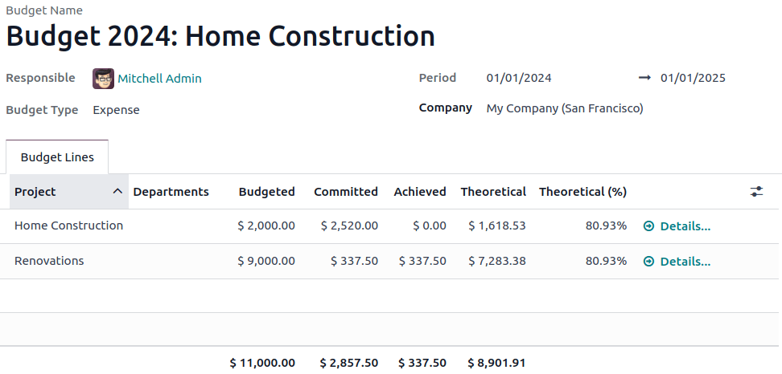

=======
Budgets
=======

:ref:`Analytic budgets <accounting/reporting/budgets/analytic-budgets>` track specific activities
and projects using analytic accounts, helping businesses make informed decisions about specific
departments, projects, or other groups of transactions. In contrast, :ref:`financial budgets
<accounting/reporting/budgets/financial>` are tied to the general ledger accounts that appear on the
profit and loss and focus on the company's overall economic position.

.. _accounting/reporting/budgets/analytic-budgets:

Analytic Budgets
================

Analytic budgets allow for allocating and tracking income and expenses in detail, breaking down
costs and revenues by specific projects, departments, or groups of transactions. Analytic budgets
can be applied across various departments or projects to measure profitability and performance. Odoo
manages analytic budgets using :doc:`analytic accounting <analytic_accounting>`.

.. _accounting/reporting/budgets/analytic-configuration:

Configuration
-------------

Go to :menuselection:`Accounting --> Configuration --> Settings`, and enable
:guilabel:`Budget Management` in the :guilabel:`Analytics` section.

.. _accounting/reporting/budgets/analytic-accounting:

Analytic accounting
-------------------

Odoo structures budgets using :ref:`plans <analytic_accounting/analytic_plans>` and
:ref:`accounts <accounting/analytic_accounting/analytic_accounts>`, which must be configured
*before* creating a budget.

.. _accounting/reporting/budgets/analytic-budget-set:

Set an analytic budget
----------------------

To create a new budget, go to :menuselection:`Accounting --> Analytic Budgets` and click
:guilabel:`New`. Make sure the following fields are appropriately completed:
:guilabel:`Budget Name`, :guilabel:`Period`, and :guilabel:`Budget Type`.

Click :guilabel:`Add a line` in the :guilabel:`Budget Lines` tab to structure the budget with the
analytic plans and accounts previously created. While the analytic plans correspond to the column
names, select the analytic accounts to define the budget lines and set the amounts for each in the
:guilabel:`Budgeted` column. Once all the budget lines are settled, click :guilabel:`Open`. If
changes need to be made once the budget is in the :guilabel:`Open` status, there are two options:

- :guilabel:`Reset to Draft`: To overwrite the data, then reopen the budget.
- :guilabel:`Revise`: A new budget will be created. Once it is set to the :guilabel:`Open` status,
  Odoo will add a :guilabel:`Rev` reference to the :guilabel:`Budget Name`. The original budget then
  has the :guilabel:`Revised` status.

.. _accounting/reporting/budgets/analytic-budget-check:

Check an analytic budget
------------------------

Once the budget is in the :guilabel:`Open` status, two additional columns are available:
:guilabel:`Committed` and :guilabel:`Achieved`. These columns' amounts are automatically calculated
based on the related analytic distribution of journal items. When the analytic distribution of a
journal item within the budget's period is updated, the budget's columns for the analytic account(s)
selected in the distribution update automatically. The :guilabel:`Achieved` amount reflects the
current result according to the items of confirmed journal entries for the associated analytic
account. In contrast, the :guilabel:`Committed` amount displays the full value of the
:guilabel:`Achieved` amount, plus any confirmed sales or purchase orders that have not yet been
invoiced or billed.

.. note::
   - When a line in a request for quotation or purchase order includes an :guilabel:`analytic
     distribution`, a :guilabel:`Budget` smart button appears, providing a link to the budget report
     for more details.
   - For budgets in the :guilabel:`Open` status, if a request for quotation or a purchase order is
     created using the associated analytic distribution and exceeds the allocated budget amount, the
     corresponding purchase order line is highlighted in red.

To reveal the :guilabel:`Theoretical` amount or percentage, use the :icon:`oi-settings-adjust`
(:guilabel:`settings adjust`) icon in the far right of the budget top row. The
:guilabel:`Theoretical` represents the amount of money that could theoretically have been spent or
should have been received based on the current date relative to the start/end dates. To open the
:ref:`budget report <accounting/reporting/budgets/analytic-budget-reporting>`, click
:guilabel:`Details` and filter the budget lines and columns of the pivot table.

.. note::
   Deleting a budget is only allowed in the :guilabel:`Draft` and :guilabel:`Cancelled` stages.

To view all the different budget lines of one or multiple budgets directly from the
:guilabel:`Budgets` list view, select the budget(s) and click :guilabel:`Budget Lines`.

.. _accounting/reporting/budgets/analytic-budget-generate:

Generate periodic budgets
-------------------------

The :guilabel:`Generate` button allows the creation of periodic budgets (monthly, quarterly, and
yearly) according to the :guilabel:`Analytic Plans` selected.
Odoo generates a new budget for each :guilabel:`Period` between the start and end dates:

- If a single analytic plan is selected, each budget includes a line for each account in that
  analytic plan.
- If multiple analytic plans are selected, each budget includes a line for each unique combination
  involving one account per analytic plan.

To generate periodic budgets, follow these steps:

#. In the :guilabel:`Budgets` list view, click :guilabel:`Generate`.
#. In the :guilabel:`Generate Budget` window, set the dates and select the :guilabel:`Period` and
   the :guilabel:`Analytic Plans`.

   .. image:: budget/generate-budgets.png
      :alt: all the options to generate periodical budgets

#. Click :guilabel:`Split` to create the periodic budgets.
#. Click :guilabel:`Budgets` in the top-left corner to return to the :guilabel:`Budgets` list view.
#. One by one, click on the different periodic budgets in :guilabel:`Draft` status to open them and
   set the amounts in the :guilabel:`Budgeted` column for each analytic account linked to the
   chosen analytic plans.
#. Click :guilabel:`Open` for each periodic budget.

.. _accounting/reporting/budgets/analytic-budget-reporting:

Reporting
---------

To perform various reporting actions, go to :menuselection:`Accounting --> Reporting -->
Budget Report`, then:

- Track, analyze, and compare budget data.
- Filter and group data using the :icon:`fa-plus-square` (:guilabel:`plus-square`) or
  :icon:`fa-minus-square` :guilabel:`(minus-square)` icon.
- Drill down into the report to see more detail on the actual amounts and transactions.
- Export for further analysis or reporting needs.

.. _accounting/reporting/budgets/financial:

Financial budgets
=================

Financial budgets, available on the :guilabel:`Profit and Loss` report, are structured around
specific income and expense accounts and transactions for official financial reporting and
compliance purposes.

.. _accounting/reporting/budgets/financial-budget-set:

Set a financial budget
----------------------

To create a new financial budget, follow these steps:

#. Go to :menuselection:`Accounting --> Reporting --> Profit and Loss` to open the
   :ref:`Profit and Loss <accounting/reporting/profit-and-loss>` report.
#. Use the :icon:`fa-calendar` :guilabel:`(calendar)` button to use the date selector and choose a
   period.
#. Click the :icon:`fa-bar-chart` :guilabel:`Budget` button and name the budget. A new column
   labeled with the budget name will appear next to the :guilabel:`Balance` column.
#. Assign amounts to each account that needs analysis.
#. A new :guilabel:`%` column will appear to the right of the new budget column, indicating the
   current status.

Different budgets can be created using these steps for comparison purposes.

.. note::
   The date selector enables the division of periods and navigation between periods, automatically
   updating the amounts accordingly.
