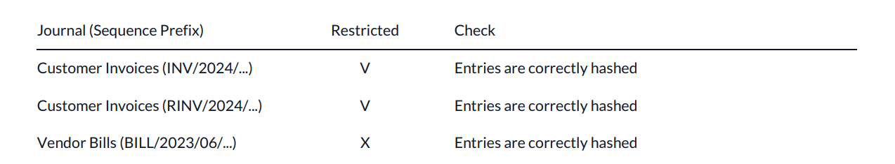

================================
Data inalterability check report
================================

Tax authorities in some countries require companies to **prove their posted accounting entries are
unaltered**, meaning that once an entry has been secured, it can no longer be changed.

To do so, Odoo creates a unique fingerprint for each secured entry thanks to the **SHA-256 algorithm**.
This fingerprint is called a hash. The hash is generated by taking an entry's essential data
(the values of the `name`, `date`, `journal_id`, `company_id`, `debit`, `credit`, `account_id`, and
`partner_id` fields), concatenating it, and inputting it to the SHA-256 hash function, which then
outputs a fixed size (256-bit) string of characters. The hash function is deterministic (:dfn:`the
same input always creates the same output`): any minor modification to the original data would
completely change the resulting hash. Consequently, the SHA-256 algorithm is often used, among
others, for data integrity verification purposes.

In addition, the previous entry's hash is always added to the next entry to form a **hash chain**.
This is used to ensure a new entry is not added afterward between two secured entries, as doing so
would break the hash chain.

.. note::
   Hashes generated by the SHA-256 algorithm are theoretically not unique, as there is a finite
   number of possible values. However, this number is exceptionally high: 2²⁵⁶, which is a lot
   bigger than the number of atoms in the known universe. This is why hashes are considered unique
   in practice.

.. _data-inalterability/inalterability_features:

Inalterability features
=======================

Inalterability features can be enabled by activating the :ref:`secure posted entries with hash
<data-inalterability/restricted>` option on any journal or using the :ref:`secure entries wizard
<data-inalterability/wizard>`.

- Two indicators are added to the journal entry's form view.
  They show whether the entry is secured or not.

  - A :icon:`fa-lock` or :icon:`fa-unlock` (:guilabel:`lock icon`) next to the :guilabel:`Posted` state.
  - A :guilabel:`Secured` checkbox in the :guilabel:`Other info` tab.

- A :guilabel:`Not Secured` filter is available on journal entries and journal items' list views.
  It can be used to find posted journal entries that are not secured yet.
- The option to open the :ref:`secure entries wizard <data-inalterability/wizard>` is displayed in the
  :guilabel:`Accounting` menu.

.. _data-inalterability/restricted:

Secure posted entries with hash
===============================

To activate the hashing function on a specific journal, go to :menuselection:`Accounting -->
Configuration --> Journals`. Open a sales, purchase, or miscellaneous journal, go to the
:guilabel:`Advanced Settings` tab, and enable :guilabel:`Secure Posted Entries with Hash`.
Journals for which the feature is activated are called "restricted".

To compute the hash of an entry, Odoo retrieves the predecessor entries of the chain (i.e., the
entries with the same sequence prefix) and hashes them in a continuous way from the last hashed
entry to the new entry to hash.

.. warning::
   Once you post an entry in a restricted journal, you cannot disable the feature anymore, nor edit
   any secured entry.

.. _data-inalterability/wizard:

Secure entries wizard
=====================

You can also use the :guilabel:`Secure Entries` Wizard to secure all journal entries,
in **all** journals, up to a specific date.

.. note::
   The wizard operates independently of the journal settings and journal types.

To open it, activate the :ref:`developer mode <developer-mode>`, go to :menuselection:`Accounting
--> Accounting`, and click on :guilabel:`Secure Entries`. If the :ref:`inalterability features
<data-inalterability/inalterability_features>` are activated, it is also visible outside the debug
mode.

To secure entries, select a date up to which all entries should be secured and press
:guilabel:`Secure Entries`.

.. warning::
   After securing the entries, you can no longer edit them.

.. note::
   It can happen that entries that are past the selected date are secured.
   This is possible since the hash chain corresponds to the sequence prefix,
   ordered by sequence number.

.. _data-inalterability/report:

Report download
===============

To download the data inalterability check report, go to :menuselection:`Accounting --> Configuration
--> Settings --> Reporting` and click on :guilabel:`Download the Data Inalterability Check Report`.

The report's first section is an overview of all journal sequence prefixes containing hashed entries.
In the :guilabel:`Restricted` column, you can see whether or not a journal has the :ref:`secure
posted entries with hash <data-inalterability/restricted>` option (V) activated or not (X). The
:guilabel:`Check` column tells you whether all entries are correctly hashed.

The second section gives a more detailed result of the data consistency check for each hashed
journal sequence prefix. You can view the first hashed entry and its corresponding hash,
as well as the last hashed entry and its corresponding hash.

.. image:: data_inalterability/data-consistency-check.png
   :align: center
   :alt: Data consistency check report for a journal
