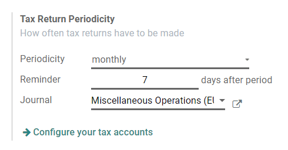
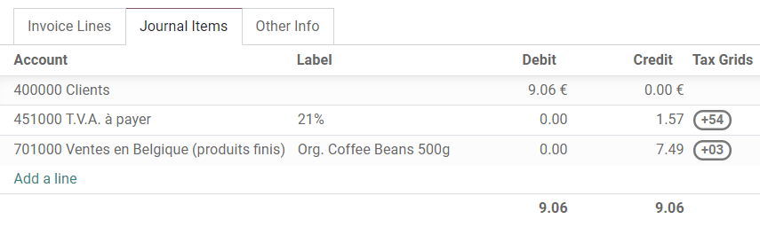
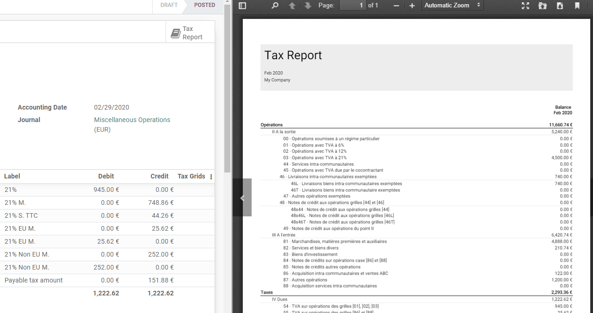

============================
Tax return (VAT declaration)
============================

Companies that are registered for **VAT (Value Added Tax)** must file a **Tax return** on a monthly
or quarterly basis, depending on their turnover and the regulation of the country in which they are
registered. A Tax return - or VAT return - gives the tax authorities information about the taxable
transactions made by the company, the *output tax* it has charged its customers, and the *input tax*
its vendors have charged it. Based on these values, the company can calculate the tax amount they
have to pay or be refunded.

.. note::
   You can find information about VAT and its mechanism on `this page from the European Commission
   <https://ec.europa.eu/taxation_customs/business/vat/what-is-vat_en>`_.

.. todo:: add doc about intracom listing

Prerequisites
=============

Tax Return Periodicity
----------------------

The configuration of the **Tax Return Periodicity** allows Odoo Accounting to compute your Tax
Return correctly and also to send you a reminder to never miss a tax return deadline.

To do so, go to :menuselection:`Accounting --> Configuration --> Settings --> Fiscal Periods`,
and go to the **Tax Return Periodicity** section.

- **Periodicity**: define here whether you file your tax return each month or every three months.
- **Reminder**: define when Odoo should remind you to file your tax return.
- **Journal**: select the journal in which to record the tax return.

.. note::
   This is usually configured during the :doc:`app's initial set up
   <../../getting_started/initial_configuration/setup>`.

Tax Grids
---------

Odoo generates Tax Reports based on the **Tax Grids** settings that are configured on your taxes.
Therefore, it is crucial to make sure that all the recorded transactions use the right taxes. You
can see on each Journal Item which Tax Grid is used for that transaction.

To configure your taxes' Tax Grids, go to :menuselection:`Accounting --> Configuration --> Taxes`,
and open the tax you want to modify. There, you can edit your tax settings, along with the tax
grids that are used to record invoices or credit notes.

.. image:: tax_returns/tax_return_taxes.png
   :align: center
   :alt: Configure taxes and their tax grids in Odoo Accounting

.. note::
   Taxes and reports are usually already pre-configured: a *Fiscal Localization Package* is
   installed according to the country you select at the creation of your database. :doc:`Click here
   <../../fiscal_localizations/overview/fiscal_localization_packages>` for more information about
   Fiscal Localization Packages.

.. _tax_return_lock:

Close a tax period
==================

Tax Lock Date
-------------

Any new transaction which accounting date is prior to the **Tax Lock Date** has its tax values moved
to the next open tax period. This is useful to make sure that no change can be made to a report once
its period is closed.

Therefore, we recommend locking your tax date before working on your *Closing Journal Entry*. This
way, other users can't modify or add transactions that would have an impact on the Closing Journal
Entry, which helps you avoid some tax declaration errors.

To check the current **Tax Lock Date**, or to edit it, go to :menuselection:`Accounting -->
Accounting --> Lock Dates`.

.. image:: tax_returns/tax_return_lock.png
   :align: center
   :alt: Lock your tax for a specific period in Odoo Acounting

Tax Report
----------

Once all the transactions involving taxes have been posted for the period you want to report, open
your **Tax Report**.

To do so, go to :menuselection:`Accounting --> Reporting --> Tax Report`. You can also click
on *TAX Report* from your *Accounting Overview*.

Make sure to select the right period you want to declare by using the date filter. You can see an
overview of your tax report. Then, click on the button *Closing Journal Entry*.

.. image:: tax_returns/tax_return_closing.png
   :align: center
   :alt: Select the period for the tax return and create a closing journal entry in Odoo Accounting

After having reviewed the generated Journal Entry, click on *Post*. In addition to posting the entry,
Odoo automatically creates a PDF file with the **Tax Report** that you can download from the chatter
and preview on the right column. It includes all the values to report to the tax authorities, along
with the amount you have to pay or be refunded.

.. note::
   If you forgot to :ref:`lock your tax date <tax_return_lock>` before clicking on *Closing Journal
   Entry*, then Odoo automatically locks your fiscal period on the same date as the Accounting Date
   of your entry. This automatic lock happens when you click on *Post*. This safety mechanism can
   prevent some fiscal errors, but it is advised to lock your tax date manually before, as described
   above.

.. seealso::
   * :doc:`../../taxation/taxes/taxes`
   * :doc:`../../getting_started/initial_configuration/setup`
   * :doc:`../../fiscal_localizations/overview/fiscal_localization_packages`