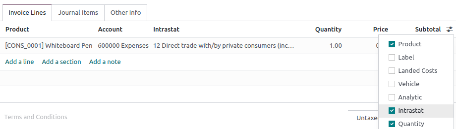

=========
Intrastat
=========

Intrastat is the data collection and statistics production system for goods traded among EU member
states. It collects data on:

- Commercial transactions of goods for use, consumption, investment, or resale with ownership
  transfer;
- Goods movements without transfer of ownership (e.g., stock relocations or moves of goods
  before or after outsourced production or processing, and after maintenance or repair);
- Returns of goods.

.. note::
   Although the Intrastat system continues to be used, the term Intrastat is not used in the `latest
   legislation <http://data.europa.eu/eli/reg/2019/2152/2022-01-01>`_, referring instead to
   *intra-Union trade in goods statistics*.

.. seealso::
   `Eurostat Statistics Explained - Glossary: Intrastat
   <https://ec.europa.eu/eurostat/statistics-explained/index.php?title=Glossary:Intrastat>`_

.. _intrastat/general-configuration:

General configuration
=====================

Enable the Intrastat report by going to :menuselection:`Accounting --> Configuration --> Settings`.
Under the :guilabel:`Customer Invoices` section, tick :guilabel:`Intrastat` and then
:guilabel:`Save`.

.. _intrastat/default-transaction-codes:

Default transaction codes: invoice and refund
---------------------------------------------

You can set a default :ref:`transaction code <intrastat/transaction-code>` for all newly created
invoice and refund transactions. Under :menuselection:`Accounting --> Configuration --> Settings`,
select a :guilabel:`Default invoice transaction code` and/or a :guilabel:`Default refund transaction
code` and then :guilabel:`Save`. The code will be set automatically on all respective invoice lines.

.. _intrastat/region-code:

Region code
-----------

The region code is **only used by Belgian companies**. Under :menuselection:`Accounting -->
Configuration --> Settings`, select the :guilabel:`Company Intrastat Region` where the company is
located and then :guilabel:`Save`.

.. tip::
   If your warehouses are located in more than one region, you can define the region code at the
   level of each warehouse instead. To do so, go to :menuselection:`Inventory --> Configuration -->
   Warehouses`, select a warehouse, set its :guilabel:`Intrastat region`, and then :guilabel:`Save`.

   .. image:: intrastat/warehouse-region.png
      :align: center
      :alt: Adding the Intrastat region to a warehouse

.. _intrastat/product-configuration:

Product configuration
=====================

All products must be properly configured to be included in the Intrastat report.

.. _intrastat/commodity-code:

Commodity code
--------------

Commodity codes are internationally recognized reference numbers used to classify goods depending on
their **nature**. Intrastat uses the `Combined Nomenclature <https://taxation-customs.ec.europa.eu/customs-4/calculation-customs-duties/customs-tariff/combined-nomenclature_en>`_.

To add a commodity code, go to :menuselection:`Accounting --> Customers --> Products` and select a
product. Under the :guilabel:`Accounting` tab, set the product's :guilabel:`Commodity Code`.

.. seealso::
   `National Bank of Belgium - Intrastat commodity codes
   <https://www.nbb.be/en/statistics/foreign-trade/nomenclature-and-codes>`_

.. _intrastat/quantity:

Quantity: weight and supplementary unit
---------------------------------------

Depending on the nature of the goods, it is necessary to specify either the product's weight in
kilos (without packaging) or the product's supplementary unit, such as square meter (`m2`), number
of items (`p/st`), liter (`l`), or gram (`g`).

To add a product's weight or supplementary unit, go to :menuselection:`Accounting --> Customers -->
Products` and select a product. Under the :guilabel:`Accounting` tab, depending on the commodity
code set, either fill in the product :guilabel:`Weight` or its :guilabel:`Supplementary Units`.

.. _intrastat/origin-country:

Country of origin
-----------------

To add the product's country of origin, go to :menuselection:`Accounting --> Customers --> Products`
and select a product. Under the :guilabel:`Accounting` tab, set the :guilabel:`Country of Origin`.

.. _intrastat/invoice-bill-configuration:

Invoices and bills configuration
================================

Once products are properly configured, several settings must be configured on the invoices and bills
you create.

.. _intrastat/transaction-code:

Transaction code
----------------

Transaction codes are used to identify a transaction's nature. :ref:`Default transaction codes
<intrastat/default-transaction-codes>` can be set for invoice and refund transactions.

To set a transaction code on an invoice line, create an invoice or a bill, click the columns
selection button, tick :guilabel:`Intrastat`, and use the newly-added :guilabel:`Intrastat` column
to select a transaction code.

.. seealso::
   `National Bank of Belgium - Intrastat: Nature of transactions from January 2022
   <https://www.nbb.be/doc/dd/onegate/data/new_natures_of_transaction_2022_en.pdf>`_

.. _intrastat/partner-country:

Partner country
---------------

The partner country represents the vendor's country for bills and the customer's country for
invoices. It is automatically filled in using the country set in the contact's :guilabel:`Country`
field.

To edit the partner country manually, create an invoice or a bill, click the :guilabel:`Other Info`
tab, and select the :guilabel:`Intrastat Country`.

.. _intrastat/transport-code:

Transport code
--------------

The transport code identifies the presumed **mode of transport** used to send the goods (arrival or
dispatch).

To add the transport code, create an invoice or a bill, go to the :guilabel:`Other info` tab,
and select the :guilabel:`Intrastat Transport Mode`.

.. _intrastat/value:

Value of the goods
------------------

The value of a good is the untaxed :guilabel:`Subtotal` (:guilabel:`Price` multiplied by
:guilabel:`Quantity`) of an invoice line.

.. _intrastat/partner:

Partner configuration
=====================

Two fields from the partner's contact form are used with Intrastat: :guilabel:`VAT` and
:guilabel:`Country`. The country can be :ref:`manually set <intrastat/partner-country>` on the
invoice or bill.

Generate the Intrastat report
=============================

Generate the report by going to :menuselection:`Accounting --> Reporting --> Audit Reports:
Intrastat Report`. It is automatically computed based on the :ref:`default configuration
<intrastat/general-configuration>` and the information found on the :ref:`products
<intrastat/product-configuration>`, :ref:`invoices and bills
<intrastat/invoice-bill-configuration>`, and :ref:`partners <intrastat/partner>`.

Export the report as a PDF, XLSX, or XML file to post it to your legal administration.

Each report line refers to a single invoice line and contains the following information:

- Invoice or bill reference number;
- System, which is a code automatically generated depending on whether the document is an invoice
  (dispatch) or a bill (arrival);
- :ref:`Country <intrastat/partner-country>`, which is the vendor's country for arrivals and the
  customer's country for dispatches;
- :ref:`Transaction Code <intrastat/transaction-code>`;
- (If your company is located in Belgium) :ref:`Region Code <intrastat/region-code>`;
- :ref:`Commodity Code <intrastat/commodity-code>`;
- :ref:`Origin Country <intrastat/origin-country>`;
- :ref:`Partner VAT <intrastat/partner>`;
- :ref:`Transport Code <intrastat/transport-code>`;
- :doc:`Incoterm Code <../customer_invoices/incoterms>`;
- :ref:`Weight <intrastat/quantity>`;
- :ref:`Supplementary Units <intrastat/quantity>`; and
- :ref:`Value <intrastat/value>`, which is always expressed in euros even if the original invoice or
  bill used another currency.
