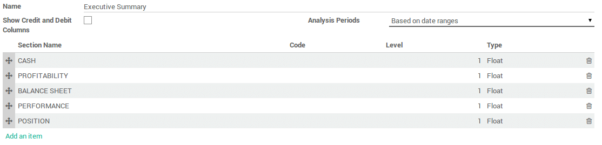

==================================================
Create a customized reports with your own formulas
==================================================

Overview
========

Odoo 13 comes with a powerful and easy-to-use reporting framework.
Creating new reports (such as a tax report or a balance sheet or
income statement with specific groupings and layout ) to suit your
needs is now easier than ever.

Activate the developer mode
===========================

In order to have access to the financial report creation interface, the
:ref:`developer mode <developer-mode>` needs to be activated.

Create your financial report
============================

First, you need to create your financial report. To do that, go to
:menuselection:`Accounting --> Configuration --> Financial Reports`

Once the name is entered, there are two other parameters that need to be
configured:

-  **Show Credit and Debit Columns**

-  **Analysis Period** :

   -  Based on date ranges (e.g. Profit and Loss)

   -  Based on a single date (e.g. Balance Sheet)

   -  Based on date ranges with 'older' and 'total' columns and last 3
      months (e.g. Aged Partner Balances)

   -  Bases on date ranges and cash basis method (e.g. Cash Flow
      Statement)

Add lines in your custom reports
=================================

After you've created the report, you need to fill it with lines. They
all need a **name**, a **code** (that is used to refer to the line), a 
**sequence number** and a **level** (Used for the line rendering).

.. image:: customize/customize04.png
   :align: center

In the **formulas** field you can add one or more formulas to assign a
value to the balance column (and debit and credit column if applicable –
separated by ;)

You have several objects available in the formula :

-  ``Ndays`` : The number of days in the selected period (for reports with a
   date range).

-  Another report, referenced by its code. Use ``.balance`` to get its
   balance value (also available are ``.credit``, ``.debit`` and
   ``.amount_residual``)

A line can also be based on the sum of account move lines on a selected
domain. In which case you need to fill the domain field with an Odoo
domain on the account move line object. Then an extra object is
available in the formulas field, namely ``sum``, the sum of the account
move lines in the domain. You can also use the group by field to group
the account move lines by one of their columns.

Other useful fields :

-  **Type** : Type of the result of the formula.

-  **Is growth good when positive** : Used when computing the comparison
   column. Check if growth is good (displayed in green) or not.

-  **Special date changer** : If a specific line in a report should not use
   the same dates as the rest of the report.

-  **Show domain** : How the domain of a line is displayed. Can be foldable
   (``default``, hidden at the start but can be unfolded), ``always``
   (always displayed) or ``never`` (never shown).

.. seealso::
    * :doc:`main_reports`
