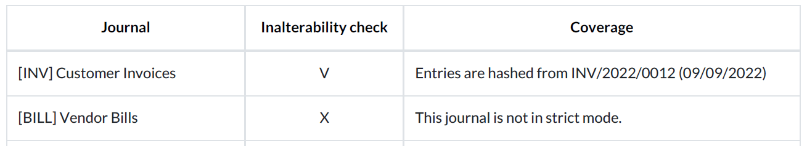
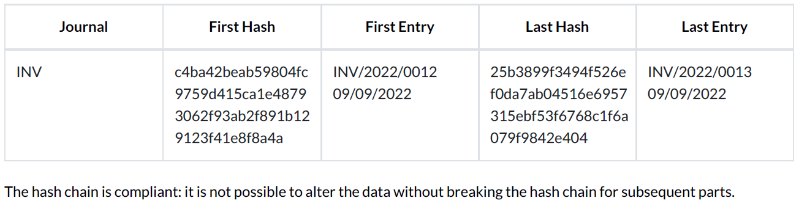

================================
Data inalterability check report
================================

Tax authorities in some countries require companies to **prove their posted accounting entries are
inalterable**, meaning that once an entry has been posted, it can no longer be changed.

To do so, Odoo can use the **SHA-256 algorithm** to create a unique fingerprint for each posted
entry. This fingerprint is called a hash. The hash is generated by taking an entry's essential data
(the values of the `date`, `journal_id`, `company_id`, `debit`, `credit`, `account_id`, and
`partner_id` fields), concatenating it, and inputting it to the SHA-256 hash function, which then
outputs a fixed size (256-bit) string of characters. The hash function is deterministic (:dfn:`the
same input always creates the same output`): any minor modification to the original data would
completely change the resulting hash. Consequently, the SHA-256 algorithm is often used, among
others, for data integrity verification purposes.

In addition, the previous entry's hash is always added to the next entry to form a **hash chain**.
This is used to ensure a new entry is not added afterward between two posted entries, as doing so
would break the hash chain.

.. note::
   Hashes generated by the SHA-256 algorithm are theoretically not unique, as there is a finite
   number of possible values. However, this number is exceptionally high: 2²⁵⁶, which is a lot
   bigger than the number of atoms in the known universe. This is why hashes are considered unique
   in practice.

.. _data-inalterability/lock:

Lock posted entries with hash
=============================

To start using the hashing function, go to :menuselection:`Accounting --> Configuration > Journals`.
Open the journal for which you want to activate the feature, go to the :guilabel:`Advanced Settings`
tab, and enable :guilabel:`Lock Posted Entries with Hash`.

.. warning::
   Once you post an entry on a locked journal, you cannot disable the feature anymore, nor edit any
   posted entry.

.. _data-inalterability/report:

Report download
===============

To download the data inalterability check report, go to :menuselection:`Accounting --> Configuration
--> Settings --> Reporting` and click on :guilabel:`Download the Data Inalterability Check Report`.

The report's first section is an overview of all your journals and their configuration. Under the
inalterability check column, you can see whether or not a journal's posted entries are locked with
a hash (V) or not (X). The coverage column tells you when a journal's posted entries started being
locked.

The second section gives you the result of the data consistency check for each hashed journal. You
can view the first hashed entry and its corresponding hash and the last hashed entry and its
corresponding hash.

