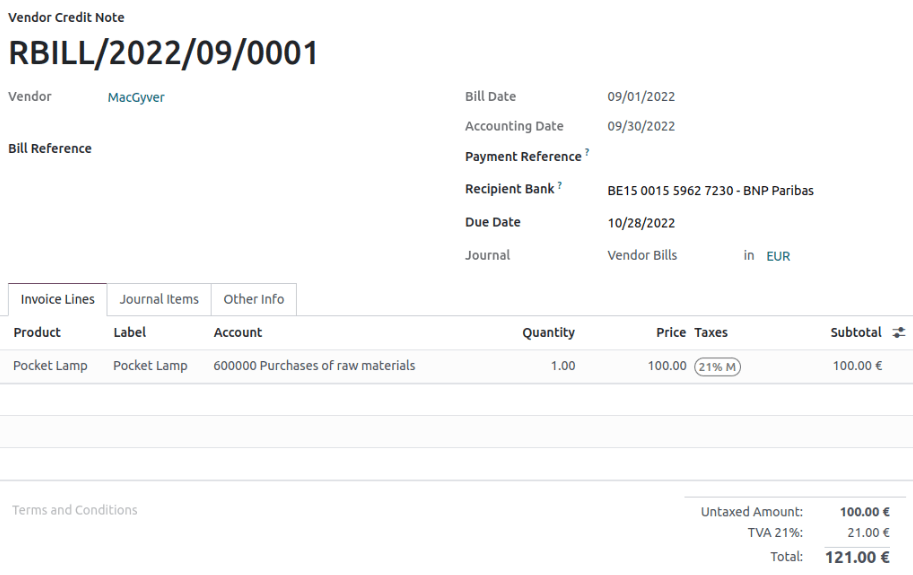

=============
Tax carryover
=============

When performing tax reports, the **tax carryover** feature allows carrying amounts from one period
to another without creating new entries.

It has been created to meet the legal requirements of specific locations, where amounts must be
transferred from period to period (for example, because the total of the line is negative).

The feature is activated by default in countries where it is required, such as Belgium, France, and
Italy. There is no specific configuration required.

Let’s take an example of a Belgian company that created a credit note of 100 for one of their
customers. The due tax is 21%.

In this case, as per local regulation, grid 81 of the tax report may contain a negative amount. But
it must be declared to the government as zero, and the negative amount should be carried over to the
next period.

If we go to :menuselection:`Accounting app --> Reporting --> Tax Report`, a pop-up on line 81
explains that the amount will be carried over in the next period.

.. image:: tax_carryover/pop-up.png
   :align: center
   :alt: pop-up message stating the amount will be carried over to the next period

At the time of the tax closing period, the tax report shows that the amount was carried over from
the previous period. It also indicates the amount that will be carried over to this line in the next
period based on the existing transactions and the carryover from the previous period.

.. image:: tax_carryover/tax-return.png
   :align: center
   :alt: Illustration of the tax return
