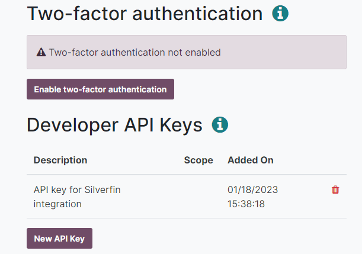

=====================
Silverfin integration
=====================

`Silverfin <https://www.silverfin.com>`_ is a third-party service provider that offers a cloud
platform for accountants.

Odoo and Silverfin provide an integration to automate the synchronisation of data.

Configuration
=============

To configure this integration, you need to input the following data into your Silverfin account:

- user's email address
- :ref:`Odoo API key <silverfin/api-key>`
- URL of the Odoo database
- name of your Odoo database

.. _silverfin/api-key:

Odoo API key
------------

To create a new API key, navigate to `Odoo's website <https://www.odoo.com>`_  and sign in with your
administrator account. Next, open `your account security settings in developer mode
<https://www.odoo.com/my/security?debug=1>`_, click on :guilabel:`New API Key`, confirm your
password, give a descriptive name to your new key, and copy the new API key.

.. important::
   - You can copy the API key only at its creation, and you cannot retrieve it later.
   - The API key provides full access to your user account. Store it securely.
   - If you need it again, create a new API key.
   - You can delete your existing API keys from this same page.

.. seealso::
   :doc:`/developer/api/external_api`
