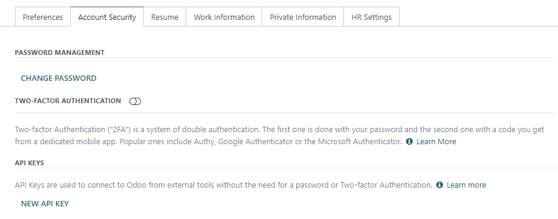

=====================
Silverfin integration
=====================

`Silverfin <https://www.silverfin.com>`_ is a third-party service provider that offers a cloud
platform for accountants.

Odoo and Silverfin provide an integration to automate the synchronization of data.

Configuration
=============

To configure this integration, you need to input the following data into your Silverfin account:

- user's email address
- :ref:`Odoo API key <silverfin/api-key>`
- URL of the Odoo database
- name of your Odoo database

.. _silverfin/api-key:

Odoo API key
------------

You can create Odoo external API keys either :ref:`for a single database <silverfin/api-singledb>`
(hosting: Odoo Online, On-premise, and Odoo.sh) or :ref:`for all databases managed by a single user
<silverfin/api-multipledb>` (hosting: Odoo Online).

.. important::
   - These API keys are personal and provide full access to your user account. Store it securely.
   - You can copy the API key only at its creation. It is not possible to retrieve it later.
   - If you need it again, create a new API key (and delete the old one).

.. seealso::
   :doc:`/developer/reference/external_api`

.. _silverfin/api-singledb:

Per database
~~~~~~~~~~~~

To add an API key to a **single** database, connect to the database, enable the :ref:`developer
mode <developer-mode>`, click on the user menu, and then :guilabel:`My Profile` /
:guilabel:`Preferences`. Under the :guilabel:`Account Security` tab, click on :guilabel:`New API
Key`, confirm your password, give a descriptive name to your new key, and copy the API key.

.. seealso::
   :ref:`api/external_api/keys`

.. _silverfin/api-multipledb:

For all databases (fiduciaries)
~~~~~~~~~~~~~~~~~~~~~~~~~~~~~~~

To add an API key to **all** databases managed by a single user at the same time **(the easiest
method for fiduciaries)**, navigate to `Odoo's website <https://www.odoo.com>`_  and sign in with
your administrator account. Next, open `your account security settings in developer mode
<https://www.odoo.com/my/security?debug=1>`_, click on :guilabel:`New API Key`, confirm your
password, give a descriptive name to your new key, and copy the new API key.

.. tip::
   Open the `database manager <https://www.odoo.com/my/databases>`_ to view all databases that will
   be linked to the single API key.

.. image:: silverfin/api-key-user.png
   :alt: creation of an Odoo external API key for an Odoo user
