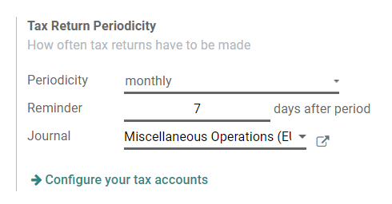
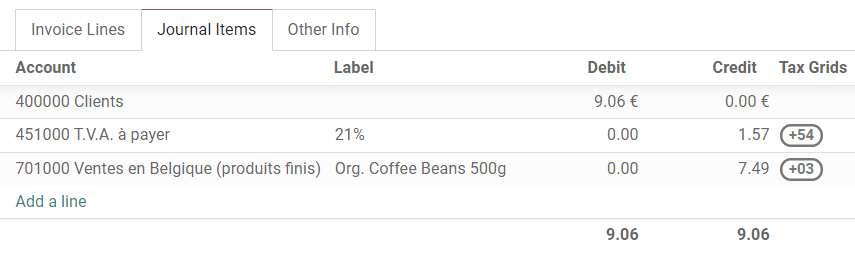
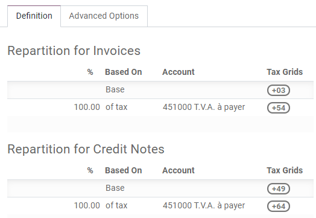
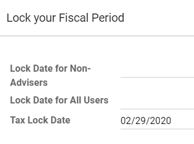

============================
Tax return (VAT declaration)
============================

Companies with a registered :abbr:`VAT (Value Added Tax)` number must submit a **tax return** on
a monthly or quarterly basis, depending on their turnover and the registration regulation. A tax
return - or VAT return - gives the tax authorities information about the taxable transactions made
by the company. The **output tax** is charged on the number of goods and services sold by a
business, while the **input tax** is the tax added to the price when goods or services are
purchased. Based on these values, the company can calculate the tax amount they have to pay or be
refunded.

.. note::
   You can find additional information about VAT and its mechanism on this page from the European
   Commission: `"What is VAT?" <https://ec.europa.eu/taxation_customs/business/vat/what-is-vat_en>`_.

.. _tax-returns/prerequisites:

Prerequisites
=============

.. _tax-returns/periodicity:

Tax Return Periodicity
----------------------

The configuration of the **Tax Return Periodicity** allows Odoo to compute your tax return correctly
and also to send you a reminder to never miss a tax return deadline.

To do so, go to :menuselection:`Accounting --> Configuration --> Settings`. Under the
:guilabel:`Tax Return Periodicity`, you can set:

- :guilabel:`Periodicity`: define here whether you submit your tax return on a monthly or quarterly
  basis;
- :guilabel:`Reminder`: define when Odoo should remind you to submit your tax return;
- :guilabel:`Journal`: select the journal in which to record the tax return.

.. note::
   This is usually configured during the :doc:`app's initial set up <../get_started>`.

.. _tax-returns/tax-grids:

Tax Grids
---------

Odoo generates tax reports based on the :guilabel:`Tax Grids` settings that are configured on your
taxes. Therefore, it is crucial to make sure that all recorded transactions use the right taxes.
You can see the :guilabel:`Tax Grids` by opening the :guilabel:`Journal Items` tab of any
invoice and bill.

To configure your tax grids, go to :menuselection:`Accounting --> Configuration --> Taxes`,
and open the tax you want to modify. There, you can edit your tax settings, along with the tax
grids that are used to record invoices or credit notes.

.. note::
   Taxes and reports are usually already pre-configured in Odoo: a :ref:`fiscal localization package
   <fiscal_localizations/packages>` is installed according to the country you select at the creation
   of your database.

.. _tax-returns/close:

Close a tax period
==================

.. _tax-returns/lock-date:

Tax Lock Date
-------------

Any new transaction whose accounting date prior to the :guilabel:`Tax Lock Date` has its tax values
moved to the next open tax period. This is useful to make sure that no change can be made to a
report once its period is closed.

Therefore, we recommend locking your tax date before working on your
:guilabel:`Closing Journal Entry`.
This way, other users cannot modify or add transactions that would have an impact on the
:guilabel:`Closing Journal Entry`, which can help you avoid some tax declaration errors.

To check the current :guilabel:`Tax Lock Date`, or to edit it, go to
:menuselection:`Accounting --> Accounting --> Actions: Lock Dates`.

.. _tax-returns/report:

Tax Report
----------

Once all the transactions involving taxes have been posted for the period you want to report, open
your :guilabel:`Tax Report` by going to :menuselection:`Accounting --> Reporting -->
Audit Reports: Tax Report`. Make sure to select the right period you want to declare by using the
date filter, this way you can have an overview of your tax report. From this view, you can easily
access different formats of your tax report, such as `PDF` and XLSX. These include all the values to
report to the tax authorities, along with the amount you have to pay or be refunded.

.. image:: tax_returns/tax_return_report.png
   :align: center
   :alt: download the PDF with your Tax Report in Odoo Accounting

.. note::
   If you forgot to lock your tax date before clicking on :guilabel:`Closing Journal Entry`, then
   Odoo automatically locks your fiscal period on the same date as the accounting date of your
   entry. This safety mechanism can prevent some fiscal errors, but it is advised to lock your tax
   date manually before, as described above.

.. seealso::
   * :doc:`../taxes`
   * :doc:`../get_started`
   * :doc:`../../fiscal_localizations`
