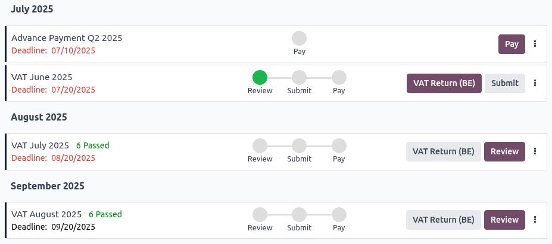

=======================
Tax return (VAT report)
=======================

Companies with a registered :abbr:`VAT (Value Added Tax)` number are required to submit a tax return
monthly or quarterly, depending on their turnover and the applicable regulatory requirements. A tax
return - or VAT report - provides the tax authorities with information about the taxable
transactions made by the company. The **output tax** is charged on the sale of goods and services,
while the **input tax** refers to the tax included in the price of purchased goods or services.
Based on these values, the company can calculate the tax amount they must pay or be refunded.

.. seealso::
   - `European Commission documentation on VAT
     <https://ec.europa.eu/taxation_customs/business/vat/what-is-vat_en>`_.
   - :doc:`../taxes`
   - :doc:`../get_started`
   - :doc:`../../fiscal_localizations`

.. _accounting/tax-returns/configuration:

Configuration
=============

.. _accounting/tax-returns/periodicity:

Tax return periodicity
----------------------

The configuration of the tax return periodicity allows Odoo to compute tax returns correctly and
automatically send reminders to make sure that deadlines are met.

To do so, go to :menuselection:`Accounting --> Configuration --> Settings`, navigate to the
:guilabel:`Tax Return Periodicity` section, and update the following fields, if needed:

- :guilabel:`Periodicity`: Define whether the tax return is submitted monthly or quarterly.
- :guilabel:`Reminder`: Define when Odoo should send reminders to submit the tax return.
- :guilabel:`Journal`: Update the journal where the tax return is recorded, if needed.

.. note::
   This information is usually configured during the :doc:`app's initial setup <../get_started>`.

.. _accounting/tax-returns/tax-grids:

Tax grids
---------

Odoo generates tax reports based on the :guilabel:`Tax Grids` settings configured for each tax. All
recorded transactions must apply the correct tax rates to ensure accurate reporting.

:guilabel:`Tax Grids` are displayed in the :guilabel:`Journal Items` tab of any invoice or bill.

To configure tax grids for taxes, go to :menuselection:`Accounting --> Configuration --> Taxes`,
open the relevant tax, and edit the tax settings and the tax grids used to record invoices or
refunds.

.. note::
   Taxes and reports are usually pre-configured according to the country selected for the
   :doc:`company <../../../general/companies>`.

.. _accounting/tax-returns/tax-return-journal:

Tax returns journal
-------------------

On the Accounting dashboard, complete the following actions displayed in the :guilabel:`Tax Returns`
journal before creating tax returns:

- :guilabel:`Set Company Data`: :ref:`Configure the company details <general/companies/company>`.
- :guilabel:`Set Periods`: In the :guilabel:`Accounting Periods` window, fill in the
  :guilabel:`Opening date`, :guilabel:`Fiscal Year End`, and update the :guilabel:`Periodicity` if
  needed.
- :guilabel:`Review Chart of Accounts`

.. _accounting/tax-returns/close:

Close a tax period
==================

.. _accounting/tax-returns/lock-date:

Tax return lock date
--------------------

Setting a tax lock date prevents changes that could impact VAT-related journal entries. Locking the
period before processing the :guilabel:`Closing Journal Entry` helps ensure the accuracy of the
final report and reduces the risk of tax errors.

To view or edit the current :guilabel:`Lock Tax Return` date, go to :menuselection:`Accounting -->
Accounting --> Lock Dates`.

.. note::
   Any new transaction whose accounting date is before the :guilabel:`Lock Tax Return` date has its
   tax values moved to the next open tax period, preventing any changes to a report after its period
   is closed.

.. _accounting/tax-returns/report:

Tax return
----------

On the Accounting Dashboard, the :guilabel:`Tax Returns` journal displays automatic reminders to
avoid missing important tasks and deadlines.

After completing all :ref:`configurations <accounting/tax-returns/configuration>` and posting all
tax-related transactions for the reporting period, click :guilabel:`Tax Returns` on the
:guilabel:`Tax Returns` journal from the Accounting dashboard. Alternatively, go to
:menuselection:`Accounting --> Accounting --> Tax Returns`.

The :guilabel:`Tax Return` view displays a chronological list of all pending :ref:`tax returns (VAT
report) <accounting/tax-returns/vat-report>` and :ref:`advance payments
<accounting/tax-returns/advance-payments>` (based on the :doc:`fiscal localization
<../../fiscal_localizations>`). Each item on the list includes:

- A period (month or quarter).
- A deadline date.
- The related company and :ref:`branch(es) <general/branches>`, if applicable.
- Action steps, such as :ref:`Review <accounting/tax-returns/vat-return-review>`, :ref:`Submit
  <accounting/tax-returns/vat-return-submit>`, and :ref:`Pay
  <accounting/tax-returns/vat-return-pay>`, which turn green when completed.
- Action buttons: These are displayed as primary (purple) and secondary (grey) buttons to indicate
  their priority.
- A :icon:`fa-ellipsis-v` :guilabel:`(vertical ellipsis)` menu for additional options.

.. note::
   - Before the tax return is reviewed, the number of :guilabel:`Pending` or :guilabel:`Passed` tax
     validation checks is displayed in red or green, respectively.
   - If the :guilabel:`Deadline` date has passed, it appears in red.

.. tip::
   - To export all tax returns from the selected period, click the :icon:`fa-cog` (:guilabel:`gear`)
     icon, then click :guilabel:`Export all` to download the tax returns XLSX.
   - All status changes are logged in the chatter. Click on any tax return or advance payment line
     to view the chatter.

.. _accounting/tax-returns/vat-report:

VAT report
~~~~~~~~~~

Each pending tax return (VAT report) follows these steps: :ref:`review
<accounting/tax-returns/vat-return-review>`, :ref:`submit
<accounting/tax-returns/vat-return-submit>`, and :ref:`pay <accounting/tax-returns/vat-return-pay>`.

To access a tax return, click the local VAT report button (e.g., :guilabel:`VAT Return (BE)` or
:guilabel:`Tax Report (US)`, depending on the :doc:`fiscal localization
<../../fiscal_localizations>`) or the :guilabel:`Generic Tax report` button on the tax return line
in the :guilabel:`Tax Return` view.

.. Tip::
   - Click :guilabel:`PDF` or :guilabel:`XLSX` to generate a PDF or XLSX file, respectively.
   - Click the :icon:`fa-cog` (:guilabel:`gear`) icon and :guilabel:`Copy to Documents` to save the
     report to the :doc:`Documents <../../../productivity/documents>` app. Select the format to
     :guilabel:`Export to`, the :guilabel:`Documents Name`, the :guilabel:`Folder` to store it in,
     and add any :guilabel:`Tags`. Then click :guilabel:`Export`.

To create a new return, click :guilabel:`New`, select the relevant :guilabel:`Return Type`, and
fill in the required :guilabel:`Dates`. Then, click :guilabel:`Generate Return`. The following
returns can be generated:

- :guilabel:`Annual Closing: Corporate Tax`
- :guilabel:`VAT` (return)
- :guilabel:`VAT Listing` (Belgium-specific)
- :guilabel:`EC Sales List` (EU-specific)
- :guilabel:`Advance Payment` (Belgium-specific)
- :guilabel:`Intrastat` (EU-specific)

.. _accounting/tax-returns/vat-return-review:

Review
******

To start the review of a tax return, click :guilabel:`Review` on the relevant tax return line:

- If all automatic tax validation checks have passed, the tax return has completed the
  :guilabel:`Review` step, and the tax return can be :ref:`submitted
  <accounting/tax-returns/vat-return-submit>`. If needed, click :guilabel:`See Checks` to view all
  checks.
- If any automatic tax validation checks are pending, the :guilabel:`Tax Checks` view displays the
  following, depending on the :doc:`fiscal localization <../../fiscal_localizations>`:

  - :guilabel:`Bank Matching`: This check is used to identify any missing bills; it is optional for
    VAT reports.
  - :guilabel:`Bill attachments`: Bills must have attached documents as proof in case of an audit.
  - :guilabel:`Company data`: Missing information (e.g., VAT number or country) can lead to errors
    in tax reports or exemptions.
  - :guilabel:`Draft entries`: Any draft invoices and bills within the corresponding period must be
    reviewed and posted, or assigned a different accounting date.
  - :guilabel:`No negative amount in VAT report`: Some countries only allow positive values in tax
    returns, as a negative amount could indicate misconfigurations.
  - :guilabel:`Taxes and countries matching`: Taxes applied on invoices and bills must match the
    customer’s country.

  Each check card is either marked with a :icon:`fa-check` :guilabel:`(pass)` or :icon:`fa-times`
  :guilabel:`(fail)`. Once a check is passed, the line turns green. If a check fails, there are two
  options:

  - Click on the failed check's card to fix the issue.
  - Click :guilabel:`Validate` to pass the check without fixing the issue.

  The following actions can be performed on each check card:

  - Add a check approver: Hover over the relevant check card and click the :icon:`fa-user-plus`
    :guilabel:`(user-plus)` icon to add the approver who confirms the review. The check approver's
    name is then displayed on the check card.
  - Add notes and a note approver: Click the :icon:`fa-pencil-square-o` :guilabel:`(pencil-square)`
    icon to access the check form view, where notes and an approver's name can be added. The notes
    approver's name is then displayed on the check card.
  - Manage activities: Click the :icon:`fa-clock-o` :guilabel:`(clock)` icon to schedule a new
    activity or the :icon:`fa-check` :guilabel:`(check)` icon to view planned activities.

  Once all checks have passed, click :guilabel:`Review`.

.. tip::
   - To view all the validation checks for a tax return, click the :icon:`fa-ellipsis-v`
     :guilabel:`(vertical ellipsis)` icon on the corresponding tax return line in the
     :guilabel:`Tax Return` view and select :guilabel:`View Checks`.
   - Once a tax report has been reviewed but not yet submitted, additional invoices or bills from
     that period can still be posted and included in the closing entry. To do so, click the
     :icon:`fa-ellipsis-v` :guilabel:`(vertical ellipsis)` icon on the relevant tax return line in
     the :guilabel:`Tax return` view and select :guilabel:`Reset` to review checks before submitting
     the tax return.

.. _accounting/tax-returns/vat-return-submit:

Submit
******

Once a tax return has completed the :ref:`Review <accounting/tax-returns/vat-return-review>` step,
proceed as follows:

#. In the :guilabel:`Tax Return` view, click the local VAT report button (e.g., :guilabel:`VAT
   Return (BE)` or :guilabel:`Tax Report (US)`, depending on the :doc:`fiscal localization
   <../../fiscal_localizations>`) or the :guilabel:`Generic Tax report` button on the relevant tax
   return line to preview the tax return report.
#. Once the tax return report has been verified, go back to the :guilabel:`Tax Return` view and
   click :guilabel:`Submit`.
#. In the pop-up window, follow the local :guilabel:`Instructions`, and click :guilabel:`Mark as
   Submitted` or :ref:`Mark Paid <accounting/tax-returns/vat-return-pay>`.

On submitting the tax return, the :ref:`Lock Tax Return <accounting/tax-returns/lock-date>` date is
automatically updated, and the closing journal entry is posted in the :guilabel:`Tax Returns`
journal.

The submitted tax return contains all the values tax authorities need, and the amount to be paid or
refunded.

.. tip::
   - To display all posted closing journal entries, click the :guilabel:`Tax Returns` journal in
     the Accounting dashboard.
   - To display the tax return entry posted, click the :icon:`fa-ellipsis-v` :guilabel:`(vertical
     ellipsis)` icon and select :guilabel:`View Entry`. The following options are available if
     needed:

     - :guilabel:`Reverse Entry`
     - :guilabel:`Reset to Draft`: The :guilabel:`Lock Tax Return` date must be manually removed
       using a :ref:`lock date exception <accounting/year-end/lock-date-exception>` to reset a tax
       return entry to draft.

.. note::
   If the :guilabel:`Lock Tax Return` date is not locked before submitting the tax return, the
   fiscal period is automatically locked on the same date as the accounting date of the closing
   journal entry. While this feature helps prevent certain fiscal errors, it is recommended to set
   the :ref:`Lock Tax Return date <accounting/tax-returns/lock-date>` manually beforehand.

.. important::
   After the tax report for a period has been posted, that period is locked to prevent new
   VAT-related journal entries from being created. Corrections to customer invoices or vendor bills
   must be recorded
   in the following period.

.. _accounting/tax-returns/vat-return-pay:

Pay
***

Once a tax return is submitted, a :guilabel:`Payment` window appears if a tax payment is required.
It displays all necessary payment details to complete the transaction, including a QR code
for the banking app, if available for the country's :doc:`fiscal localization
<../../fiscal_localizations>` package. There are two options:

- Click :guilabel:`Mark Paid` after completing the payment: the corresponding tax return line
  disappears from the :guilabel:`Tax Return` view.
- Click :guilabel:`Pay Later`: the corresponding tax return line remains visible in the
  :guilabel:`Tax Return` view, indicating the amount due. Click the :icon:`fa-paperclip`
  :guilabel:`(paperclip)` icon to access the PDF and XLSX files of the submitted tax return.

  .. image:: tax_returns/tax-return-submitted.png
     :alt: view when tax return is submitted

.. _accounting/tax-returns/advance-payments:

Advance tax payments
~~~~~~~~~~~~~~~~~~~~

.. note::
   Advance tax payments are specific to local :doc:`fiscal localizations
   <../../fiscal_localizations>` and the requirements of certain countries' tax systems.

In the :guilabel:`Tax Return` view, click :guilabel:`Pay` on the relevant advance tax payment line
that needs to be processed.

In the :guilabel:`Advance Payment` window, follow the local recommendations, fill in the required
local fields, and use the provided payment details to finalize the transaction. Two options are
available:

- Click :guilabel:`Mark Paid` once the payment is processed: The corresponding advance tax payment
  line disappears from the :guilabel:`Tax Return` view.
- Click :guilabel:`Pay Later`: The corresponding advance tax payment line remains visible in the
  :guilabel:`Tax Return` view.

.. tip::
   To mark a tax payment that has already been completed, click the :icon:`fa-ellipsis-v`
   :guilabel:`(vertical ellipsis)` icon and select :guilabel:`Mark as Completed`.
