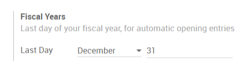
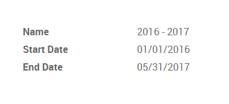

===================
Manage Fiscal Years
===================

In most cases, the fiscal years last 12 months. If it is your case, you
just have to define what is the last day of your fiscal year in the
accounting settings. By default, it is set on the 31st December.

However, there might be some exceptions. For example, if it is the first
fiscal year of your business, it could last more or less than 12 months.
In this case, some additional configuration is required.

Go in :menuselection:`accounting --> configuration --> settings` and activate
the fiscal years.

.. image:: fiscal_year/fiscal_year02.png
    :align: center

You can then configure your fiscal years in
:menuselection:`accounting --> configuration --> fiscal years`.

.. note::
    You only have to create fiscal years if they last more or less
    than 12 months.

.. seealso::

    * :doc:`close_fiscal_year`
