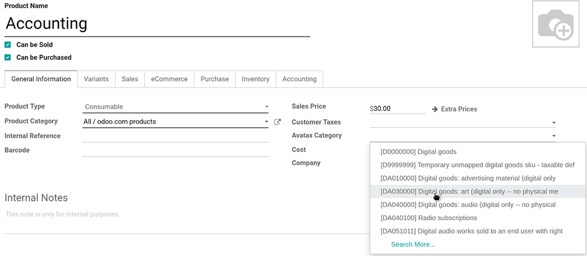
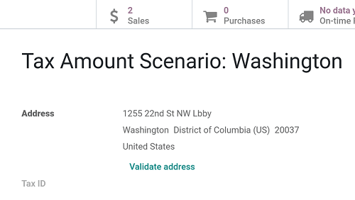
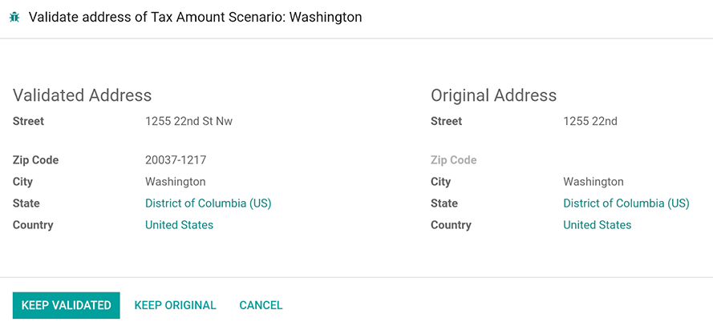

==================
Avatax integration
==================

Avatax is a tax calculation provider that can be integrated in Odoo.

.. _avatax/credentials:

Credential configuration
========================

To integrate Avatax with Odoo, go to :menuselection:`Accounting --> Configuration --> Settings -->
Taxes` and add your Avatax credentials in the :guilabel:`Avatax` section.

.. tip::
   If you do not yet have credentials, click on :guilabel:`How to Get Credentials`.

.. image:: avatax/avatax-configuration-settings.png
   :align: center
   :alt: Configure Avatax settings

.. _avatax/tax-mapping:

Tax mapping
===========

The Avatax integration is available on Sale Orders and Invoices with the included Avatax fiscal
position.

Before using the integration, specify an :guilabel:`Avatax Category` on the product categories.

.. image:: avatax/avatax-category.png
   :align: center
   :alt: Specify Avatax Category on products

Avatax Categories may be overridden or set on individual products as well.

.. _avatax/address-mapping:

Address validation
==================

Manually validate customer addresses by clicking the :guilabel:`Validate address` link in the
customer form view.

If preferred, choose to keep the newly validated address or the original address in the wizard that
pops up.

.. _avatax/tax-calculation:

Tax calculation
===============

Automatically calculate taxes on Odoo quotations and invoices with Avatax by confirming the
documents. Alternatively, calculate the taxes manually by clicking the :guilabel:`Compute taxes
using Avatax` button while these documents are in draft mode.

Use the :guilabel:`Avalara Code` field that's available on customers, quotations, and invoices to
cross-reference data in Odoo and Avatax.

.. seealso::
   - :doc:`fiscal_positions`
