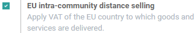

===================================
EU intra-community distance selling
===================================

**Distance sales within the European Union** include cross-border sales of goods and services to a
private consumer (B2C) in another EU Member State when the seller doesn't meet face-to-face with the
customer. Organizations must ensure that the VAT on distance sales is paid to the Member State in
which the goods or services are delivered.

.. note::
   This remains true even if your organization is located outside of the European Union.

While this regulation mainly applies to :doc:`eCommerce <../../../../websites/ecommerce>` sales to
private EU consumers, it is also valid for mail order sales and telesales.

The Union **One-Stop Shop (OSS)** is an online portal where businesses can register for the OSS and
declare their intra-community distance sales. Each EU member state integrates an online OSS portal.

The **EU intra-community Distance Selling** feature helps your organization comply with this
regulation by creating and configuring new :doc:`fiscal positions <fiscal_positions>` and
:doc:`taxes <taxes>` based on your company's country.

.. seealso::
   - `European Commission: OSS | Taxation and Customs Union
     <https://ec.europa.eu/taxation_customs/business/vat/oss_en>`_

.. _eu_distance_selling/configuration:

Configuration
=============

Go to :menuselection:`Accounting/Invoicing --> Settings --> Taxes`, then enable **EU intra-community
Distance Selling** (or **EU Digital Goods VAT** if you created your database before July 1, 2021),
and *Save*.

.. important::
   Please :ref:`upgrade the module <general/upgrade>` `l10n_eu_service` if you already installed it
   before **July 1, 2021**, or if you activated the feature **EU Digital Goods VAT** in the
   Accounting settings. Then, make sure to :ref:`refresh the tax mapping
   <eu_distance_selling/refresh-mapping>`.

.. _eu_distance_selling/taxes:

Fiscal Positions and Taxes
==========================

Once enabled, the feature automatically creates all the necessary taxes and fiscal positions needed
for each EU member state, based on your company's country.

We highly recommend checking that the proposed mapping is suitable for the products and services you
sell before using it.

.. _eu_distance_selling/refresh-mapping:

Refresh tax mapping
-------------------

Whenever you add or modify taxes, you can update automatically your fiscal positions.

To do so, go to :menuselection:`Accounting/Invoicing --> Settings --> Taxes --> EU intra-community
Distance Selling` and click on the *Refresh tax mapping* button.

.. seealso::
   - :doc:`fiscal_positions`
   - :doc:`taxes`
