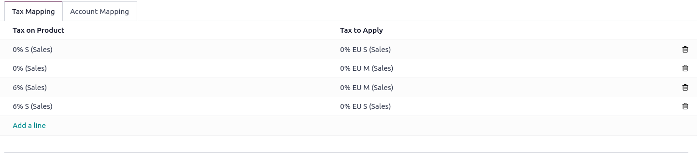
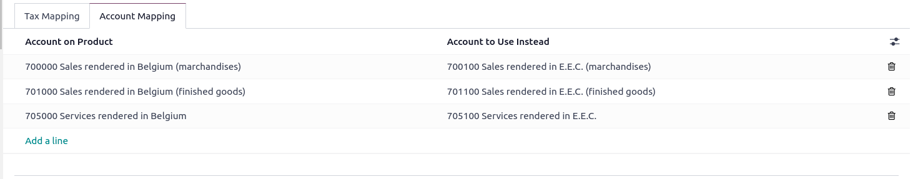
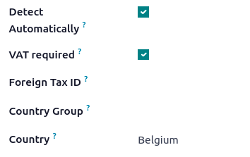
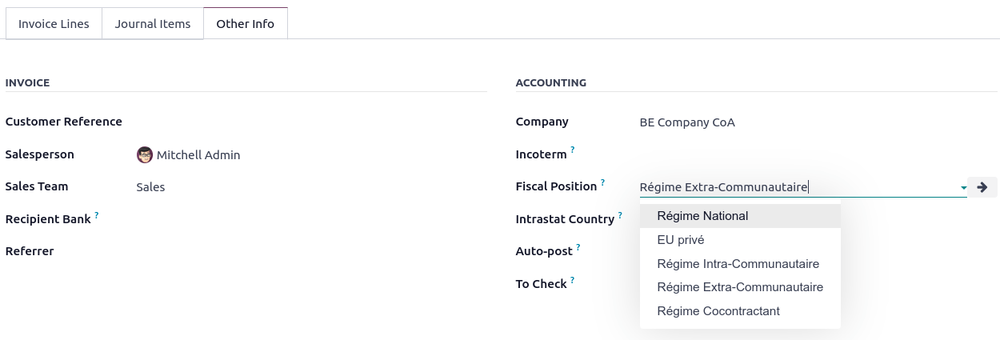
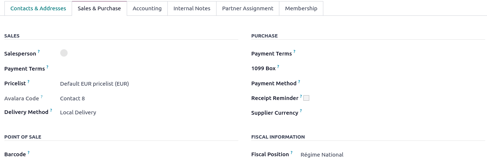

==========================================
Fiscal positions (tax and account mapping)
==========================================

Default taxes and accounts are set on products and customers to create new transactions on the fly.
However, different taxes and different accounts for transactions might be necessary according to
customers' and providers' localizations and business types.

**Fiscal Positions** allow the creation of sets of rules to automatically adapt the taxes and the
accounts used for a transaction.

.. image:: fiscal_positions/fiscal-positions-intra-community.png
   :align: center
   :alt:   Example: Belgian to Intra-Community tax mapping with Fiscal Positions in Odoo Accounting

They can be applied :ref:`automatically <fiscal_positions/automatic>`, :ref:`manually <fiscal_positions/partner>`
or be directly :ref:`assigned to a partner <fiscal_positions/transaction>`.

.. note::
   A few Fiscal Positions are already preconfigured on your database, as part of your :ref:`fiscal
   localization package <fiscal_localizations/packages>`.

Configuration
=============

 .. _fiscal_positions/mapping:

Tax and account mapping
-----------------------

To edit or create a fiscal position, go to :menuselection:`Accounting --> Configuration --> Fiscal
Positions`, and open the entry you want to modify or click on :guilabel:`New`.

The mapping of taxes and accounts is based on the default taxes and accounts defined in the
products forms.

- To map to another tax or account, fill out the right column (**Tax to Apply**/**Account to Use
  Instead**).

- To remove a tax, rather than replacing it with another, leave the field :guilabel:`Tax to Apply`
  empty.
- To replace a tax with multiple other taxes, add multiple lines with the same
  :guilabel:`Tax on Product`.

.. note::
   The mapping only works with *active* taxes. Therefore, make sure they are active by going to
   :menuselection:`Accounting --> Configuration --> Taxes`.

.. _fiscal_positions/automatic:

Application
===========

Automatic application
---------------------

You can configure your Fiscal Positions to be applied automatically, following a set of conditions.
To do so, open the Fiscal Position you want to modify and tick the :guilabel:`Detect Automatically`
button. In this view, other configurations can be activated:

- :guilabel:`VAT Required`: The VAT number must be indicated in the customer's contact form.
- :guilabel:`Country Group` and :guilabel:`Country`: The Fiscal Position is applied to these
  countries.

.. note::
   Taxes on **eCommerce orders** are automatically updated once the visitor has logged in or filled
   out their billing details.

.. important::
   The Fiscal Positions' **sequence** - the order in which they are arranged - defines which
   Fiscal Position to apply if the conditions are met in multiple Fiscal Positions.

   For example, if the first Fiscal Position targets *country A*, and the second Fiscal Position
   targets a *Country Group* that also comprises *country A*, only the first Fiscal Position will be
   applied to customers from *country A*.

.. _fiscal_positions/transaction:

Manual application
------------------

To manually select a fiscal position, go to the :guilabel:`Other Info` tab of the sales order,
invoice, or bill and select the right :guilabel:`Fiscal Position` before adding product lines.

.. _fiscal_positions/partner:

Assign to a partner
-------------------

You can manually define which fiscal position must be used by default for a specific partner. To do
so, go to :menuselection:`Accounting --> Customers --> Customers`, open the customer's contact form,
go to the :guilabel:`Sales & Purchase` tab, and edit the :guilabel:`Fiscal Position` field in
the :guilabel:`Fiscal information` section.

.. note::
   If a country has been selected in the partner's contact form, when creating an invoice, this
   country's tax is automatically applied. Should no country be selected in the contact form, the
   tax applied follows the settings in the fiscal position form.

.. seealso::

  * :doc:`taxes`
  * :doc:`taxcloud`
  * :doc:`B2B_B2C`
