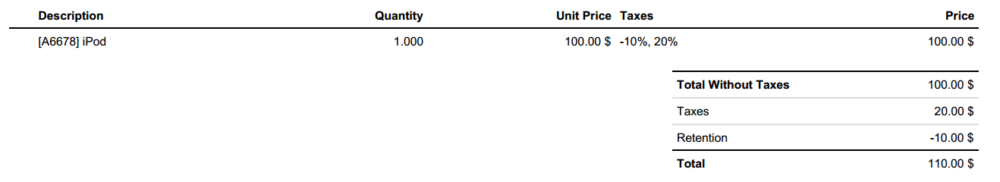
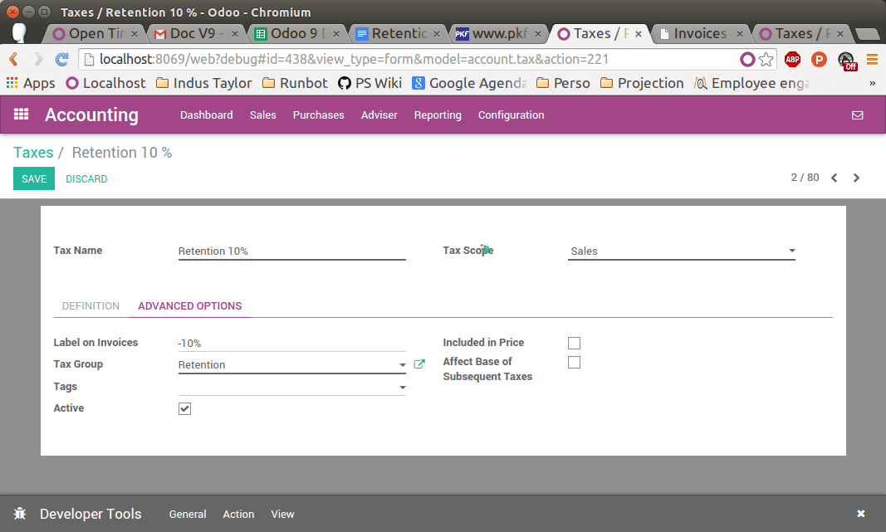
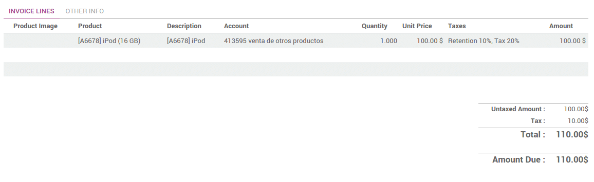

========================
Manage withholding taxes
========================

A withholding tax, also called a retention tax, is a government
requirement for the payer of a customer invoice to withhold or deduct
tax from the payment, and pay that tax to the government. In most
jurisdictions, withholding tax applies to employment income.

With normal taxes, the tax is added to the subtotal to give you the
total to pay. As opposed to normal taxes, withholding taxes are deducted
from the amount to pay, as the tax will be paid by the customer.

As, an example, in Colombia you may have the following invoice:

In this example, the **company** who sent the invoice owes $20 of taxes to
the **government** and the **customer** owes $10 of taxes to the **government**.

Configuration
=============

In Odoo, a withholding tax is defined by creating a negative tax. For a
retention of 10%, you would configure the following tax (accessible
through :menuselection:`Configuration --> Taxes`):

.. image:: retention/retention04.png
   :align: center

In order to make it appear as a retention on the invoice, you should set
a specific tax group **Retention** on your tax, in the **Advanced Options**
tab.

Once the tax is defined, you can use it in your products, sales order or
invoices.

.. tip::
    If the retention is a percentage of a regular tax, create a Tax with a
    **Tax Computation** as a **Tax Group** and set the two taxes in this group
    (normal tax and retention).

Applying retention taxes on invoices
====================================

Once your tax is created, you can use it on customer forms, sales order
or customer invoices. You can apply several taxes on a single customer
invoice line.

.. note::
    When you see the customer invoice on the screen, you get only a
    **Taxes line** summarizing all the taxes (normal taxes & retentions).
    But when you print or send the invoice, Odoo does the correct
    grouping amongst all the taxes.

The printed invoice will show the different amounts in each tax group.

.. seealso::

  * :doc:`taxes`
