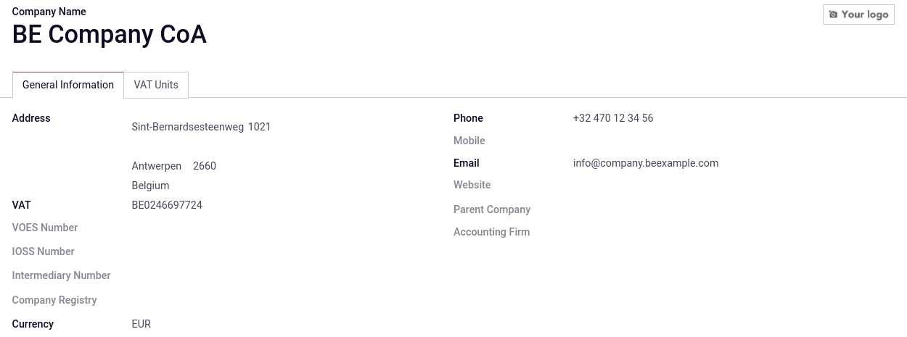

=========
VAT units
=========

.. note::
   This is only applicable to multi-company environments.

A **VAT unit** is a group of VAT-taxable enterprises that are legally independent of each other, but
are closely linked financially, organizationally, and economically and therefore considered one and
the same VAT-taxable enterprise. **VAT units** are not mandatory, but if created, constituent
companies of the unit must belong to the same **country**, use the same **currency**, and one
company must be designated as **representative company** of the **VAT unit**.

**VAT units** receive a specific **tax ID** intended only for **tax returns**. Constituent companies
of the unit keep their own **tax ID** used for **commercial** purposes.

.. example::
   Enterprise **A** owes 300.000,00€ of VAT taxes and enterprise **B** can recover 280.000,00€ of
   VAT taxes. They form up as a **VAT unit** so that the two amounts balance out, and must
   conjointly only pay 20.000,00€ of VAT taxes.

Configuration
=============

To configure a **VAT unit**, go to :menuselection:`Settings --> General Settings`, scroll down to
the :guilabel:`Companies` section, and click :guilabel:`Manage Companies`. Select the company to
serve the **representative** role, and in the :guilabel:`General Information` tab, fill in the
mandatory fields: :guilabel:`Company Name`, :guilabel:`Address`, :guilabel:`VAT`, :guilabel:`Currency`,
:guilabel:`Phone`, and :guilabel:`Email`.

Then, click on the :guilabel:`VAT Units` tab, :guilabel:`Add a line`, and either select an existing
**VAT unit**, or :guilabel:`Create` a new one. Enter a **name** for the unit, :guilabel:`Country` of
the constituent companies, the :guilabel:`Companies`, the :guilabel:`Main Company` that serves the
**representative** role, and the :guilabel:`Tax ID` of the **VAT unit**.

.. image:: vat_units/vat-unit.png
   :align: center
   :alt: VAT units tab

Fiscal position
---------------

.. :doc:`

Tax report
==========

tt