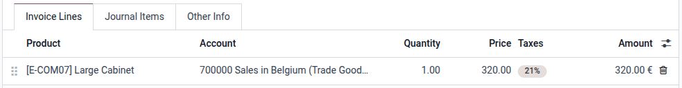
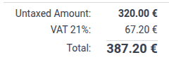
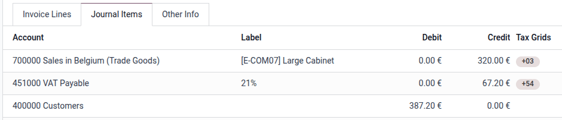
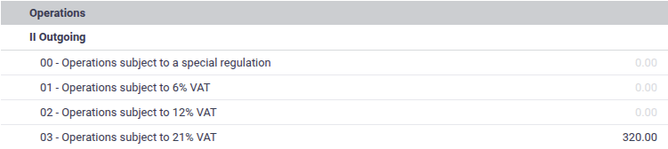
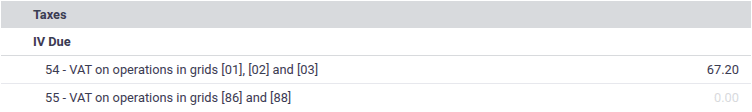
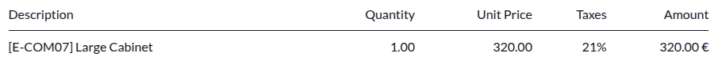
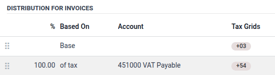
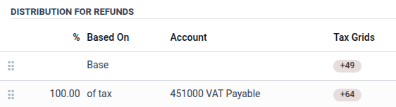

:show-content:

=====
Taxes
=====

Tax regulations generally require companies to compute tax amounts on sales, keep a record of
accumulated tax debit and credit, and periodically file this information in tax returns.

Overview
========

In general, managing taxes in Odoo involves the following steps:

#. Taxes are added on individual lines of documents created via the Sales, Purchase, Accounting, and
   Point of Sale apps.
#. Odoo automatically computes tax amounts on the documents.
#. On accounting documents, Odoo generates journal items to keep track of tax debit and tax credit.
#. The total base, tax debit, and tax credit for a period can be viewed in the tax return report
   and used to file a tax return.

Taxes on sales and purchases
----------------------------

Most sales and purchase documents have a :guilabel:`Taxes` field where taxes can be applied to
individual lines. This includes :doc:`invoices <customer_invoices>` and :doc:`vendor bills
<vendor_bills>` in the Accounting app, :doc:`sales quotations <../../sales/sales/sales_quotations>`
in the Sales app, and :doc:`purchase orders <../../inventory_and_mrp/purchase/manage_deals/rfq>` in
the Purchase app.

.. note::
   When adding a product to a sale or purchase line, the taxes :ref:`assigned to the product
   <taxes/product>` are automatically applied to the line.

   In the :doc:`Point of Sale <../../sales/point_of_sale>` app, the taxes :ref:`assigned to the
   products <taxes/product>` are applied directly to the order and cannot be changed except by a
   :doc:`fiscal position <taxes/fiscal_positions>`.

Automatic computation of tax amounts
------------------------------------

Applying a tax to a sale or purchase line allows Odoo to automatically compute the tax amount based
on the sale or purchase line's subtotal and the tax's configuration. The details of the computation
are explained in the :doc:`Tax computation documentation <taxes/tax_computation>`.

Automatic generation of tax journal items
-----------------------------------------

Upon applying a tax on an :doc:`invoice <customer_invoices>` or :doc:`vendor bill <vendor_bills>`, a
tax payable journal item is automatically generated with the tax amount. This keeps track of the tax
debit or credit associated with the transaction.

Furthermore, the tax amount is added to the amount due on the receivable or payable journal item.

Finally, :ref:`Tax Grids <accounting/tax-returns/tax-grids>` are added both to the automatically
created tax payable journal item and to the invoice line on which the tax is applied. These tags are
used to retrieve the journal items corresponding to the tax's base and tax amount in the :doc:`Tax
Return <reporting/tax_returns>` report.

.. note::
   If :doc:`Cash Basis <taxes/cash_basis>` is enabled, upon reconciling the invoice or vendor bill
   with the payment, an additional journal entry is created to represent the creation of the tax
   debit or credit at that point in time.

Filing tax returns
------------------

The :doc:`Tax Return <reporting/tax_returns>` report aggregates the base and tax amounts from
invoices and vendor bills over a given period and presents it in a format tailored to the
:doc:`fiscal localization <../fiscal_localizations>`.

The amounts presented in the tax return report can be used to complete tax declarations that need to
be periodically submitted to the government. In most cases, there is a one-to-one correspondence
between the lines of the tax return and the official tax declaration, allowing amounts to simply be
copied from one to the other.

.. _taxes/configuration:

Basic tax configuration
=======================

Follow these basic steps to set up taxes:

#. Enable any relevant :ref:`company-wide options <taxes/configuration/company>`.
#. Activate any needed :ref:`pre-configured taxes <taxes/list_activation>`.
#. Assign taxes on your :ref:`products <taxes/product>`.

.. _taxes/configuration/company:

Company-wide options
--------------------

To access these configuration options, go to :menuselection:`Accounting --> Configuration
--> Settings` and scroll down to :guilabel:`Taxes`.

.. _taxes/default:

Default taxes
~~~~~~~~~~~~~

The default :guilabel:`Sales Tax` and :guilabel:`Purchase Tax` are automatically set on products
when creating new products.

If :ref:`Accounting Firms <accounting/fiduciaries>` mode is enabled, the default sales tax is
automatically set on new invoice lines, and the default purchase tax is automatically set on new
vendor bill lines.

:guilabel:`Prices` can be changed to :guilabel:`Tax Included` to treat all taxes as :ref:`tax
included <taxes/included-in-price>` by default. This would be appropriate if all of a company's
pricing is done tax-included. If only some of a company's pricing is tax-included, individual taxes
can be set as :guilabel:`Tax Included`.

EU intra-community distance selling
~~~~~~~~~~~~~~~~~~~~~~~~~~~~~~~~~~~

Activate this option if you are based in the EU and sell to consumers in other EU countries to apply
local VAT rates.

.. seealso::
   :doc:`EU intra-community distance selling<taxes/eu_distance_selling>`

Cash basis
~~~~~~~~~~

Activate this option if taxes must be accounted for on a cash rather than accruals basis. Some
countries mandate cash basis accounting; in that case, this option will be activated by default by
the :doc:`fiscal localization package <../fiscal_localizations>`.

.. seealso::
   :doc:`Cash basis <taxes/cash_basis>`

.. _taxes/list_activation:

Activate pre-configured taxes
-----------------------------

The list of taxes can be accessed by going to :menuselection:`Accounting --> Configuration -->
Taxes`.

Generally, inactive taxes are created for most sales tax rates by the :doc:`fiscal localization
<../fiscal_localizations>` package, but only the main tax rate is active by default. To activate an
inactive tax, click the toggle in the :guilabel:`Active` column.

.. _taxes/product:

Assign taxes on products
------------------------

To configure the taxes used for each product, go to :menuselection:`Accounting --> Customers -->
Products`, select the product to configure, and fill the :guilabel:`Sales Taxes` and
:guilabel:`Purchase Taxes` fields. These taxes are automatically applied when adding the product to
an invoice, vendor bill, sales order, purchase order, or point of sale order.

.. tip::
   Use the :ref:`Default Taxes <taxes/default>` company-wide setting to automatically fill these
   fields on new products.

.. _taxes/configuration/advanced:

Advanced tax configuration
==========================

The following aspects of a tax can be customized:

- How the tax :ref:`appears in the backend <taxes/configuration/back-end>`
- How the tax :ref:`appears to customers <taxes/configuration/customer>`
- The details of the :doc:`tax computation <taxes/tax_computation>`
- How tax payable journal items are :ref:`created <taxes/definition-tab>`
- How to configure the tax to :ref:`replace <taxes/tax-mapping>` other taxes according to
  :doc:`fiscal positions <taxes/fiscal_positions>`.

To open a tax's configuration, go to :menuselection:`Accounting --> Configuration --> Taxes`, then
click the tax name.

.. _taxes/configuration/back-end:

Configure backend appearance and availability
---------------------------------------------

The following options determine how a tax is displayed to users in the Odoo back-end.

.. _taxes/name:

Tax name
~~~~~~~~

The :guilabel:`Tax Name` appears for backend users in the :guilabel:`Taxes` field in :doc:`sales
orders <../../sales/sales>`, :doc:`invoices <customer_invoices>`, product forms, etc.

.. _taxes/scope:

Tax type
~~~~~~~~

The :guilabel:`Tax Type` determines where the tax is available to be selected.

- **Sales**: Customer invoices, product customer taxes, etc.
- **Purchase**: Vendor bills, product vendor taxes, etc.
- **None**

.. tip::
   Use :guilabel:`None` for taxes that you want to include in a :ref:`Group of Taxes
   <taxes/computation>` but that you do not want to list along with other sales or purchase taxes.

Tax scope
~~~~~~~~~

The :guilabel:`Tax Scope` restricts the use of taxes to a type of product, either **goods** or
**services**.

Description
~~~~~~~~~~~

The :guilabel:`Description` can be edited for the purpose of internal documentation.

.. _taxes/configuration/customer:

Configure how the tax appears to customers
------------------------------------------

.. _taxes/label-invoices:

Label on invoices
~~~~~~~~~~~~~~~~~

The :guilabel:`Label on Invoices` appears on invoice lines in invoice PDFs and on the customer
portal.

.. _taxes/tax-group:

Tax group
~~~~~~~~~

The :guilabel:`Tax Group` is shown in the totals section of the invoice, in invoice PDFs and on the
customer portal. Multiple taxes that belong to the same tax group are aggregated together into a
single tax amount.

.. image:: taxes/invoice-portal-total.png
   :alt: The Tax Group shows in the totals section when viewed in the customer portal.

.. _taxes/definition-tab:

Configure how tax journal items are created
-------------------------------------------

The :guilabel:`Distribution for Invoices` and :guilabel:`Distribution for Refunds` sections control
the generation of tax payable journal items in invoices and credit notes, respectively. They also
determine which :ref:`tax grids <accounting/tax-returns/tax-grids>` are set on invoice lines when
this tax is applied.

Each of these sections should contain one :guilabel:`Base` line, one or more :guilabel:`% of tax`
lines amounting to 100% (e.g. one 100% line, or two 50% lines), and optionally, one or more
:guilabel:`% of tax` lines amounting to -100.00%.

The :guilabel:`Base` line can have one or more :guilabel:`Tax Grids` set, which are added to the
invoice line on which the tax is applied.

The :guilabel:`% of tax` lines control the creation of tax payable journal items. The tax amount is
distributed according to the percentages on these lines, and each line is then used as a template to
create a tax payable journal item with the same :guilabel:`Account` and :guilabel:`Tax Grids`. If
the :guilabel:`Account` is not specified, it defaults to the account of the original invoice line on
which the tax is applied.

Typical cases include:

- one :guilabel:`100% of tax` line: this is the most common case where the tax amount should appear
  on a single tax payable journal item.
- one :guilabel:`100% of tax` and one :guilabel:`-100% of tax` line: this is appropriate if the tax
  simultaneously generates both a tax debit and a tax credit which cancel each other out (e.g. EU
  intra-community reverse-charge VAT).
- one :guilabel:`50% of tax` line that specifies a tax payable account and another
  :guilabel:`50% of tax` line that does not specify an account: this is appropriate for partially
  deductible purchase VAT, where part of the tax must be considered an expense rather than a tax
  credit asset that can offset tax liability.

.. _taxes/tax-mapping:

Tax mapping
-----------

Taxes can be combined with :doc:`fiscal positions <taxes/fiscal_positions>` to map taxes to each
other so that the correct tax is applied based on the customer's or vendor's location and business
type.

When configuring a tax, leave the :guilabel:`Fiscal Position` field blank to make the tax
immediately available across all fiscal positions, or select specific fiscal positions where this
tax should be used to replace other taxes with it. If one or more fiscal positions are selected, use
the :guilabel:`Replaces` field to select all of the taxes that this tax should replace for the
selected fiscal position(s).

To replace one tax with multiple other taxes, configure each of the replacement taxes to replace the
default product tax.

.. example::
   As a sales tax, the :guilabel:`0% Exports` tax applies to quotations, sales orders, and invoices
   that use the :guilabel:`Foreign Trade` fiscal position. On those records, any time that the
   :guilabel:`15%` tax would be used, the :guilabel:`0% Exports` tax is used instead.

   .. image:: taxes/tax-mapping-example.png
      :alt: The **0% Exports** tax record

.. note::
   Since the first fiscal position in the sequence is considered the company's default, the taxes
   set on products are expected to be used with that fiscal position, so the :guilabel:`Replaces`
   field is not displayed on it.

.. tip::
   To more easily view which taxes are replaced, use the :icon:`oi-settings-adjust`
   :guilabel:`adjust settings` in the taxes list view and display the :guilabel:`Replaces` field.

   .. image:: taxes/tax-mapping-list.png
      :alt: The **Replaces** field shown in the list view

.. note::
   Tax mapping only works with :ref:`active <taxes/list_activation>` taxes.

Extra taxes
===========

"Extra taxes" is a broad term referring to additional taxes beyond the standard or basic taxes
imposed by governments. These extra taxes can be **luxury** taxes, **environmental** taxes,
**import** or **export duties** taxes, etc.

.. note::
   The method to compute these taxes varies across different countries. We recommend consulting your
   country's regulations to understand how to calculate them for your business.

To compute an extra tax in Odoo, :ref:`create a tax <taxes/configuration>`, enter a tax name, select
a :ref:`Tax Computation <taxes/configuration>`, set an :guilabel:`Amount`, and in the
:guilabel:`Advanced Options` tab, enable :guilabel:`Affect Base of Subsequent Taxes`. Then, drag and
drop the taxes in the :ref:`order they should be computed <taxes/base-subsequent>`.

.. example::
   - In Belgium, the formula to compute an environmental tax is: `(product price + environmental
     tax) x sales tax`. Therefore, our environmental tax has to come *before* the sales tax in the
     computation sequence.
   - In our case, we created a 5% environmental tax (Ecotax) and put it *before* the Belgian base
     tax of 21%.

   .. image:: taxes/ecotax.png
      :alt: Environmental tax sequence in Belgium.

.. seealso::
  - :doc:`taxes/tax_computation`
  - :doc:`taxes/fiscal_positions`
  - :doc:`taxes/B2B_B2C`
  - :doc:`reporting/tax_returns`

.. toctree::
   :titlesonly:

   taxes/cash_basis
   taxes/tax_computation
   taxes/retention
   taxes/vat_verification
   taxes/fiscal_positions
   taxes/avatax
   taxes/eu_distance_selling
   taxes/B2B_B2C
