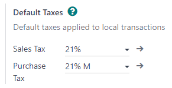
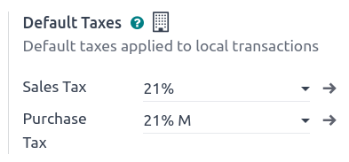
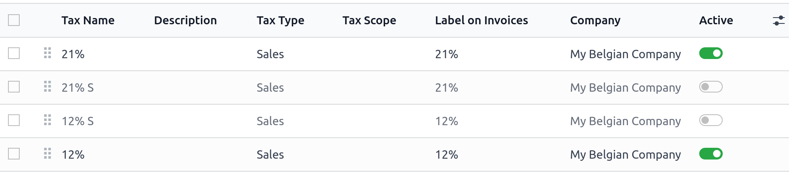
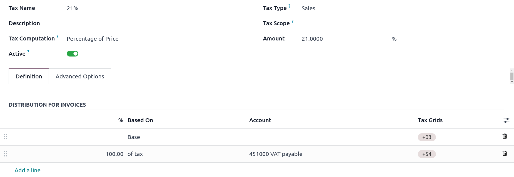
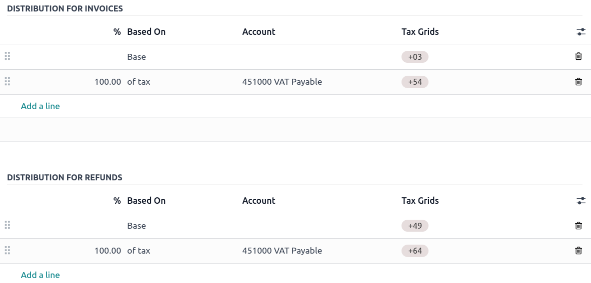
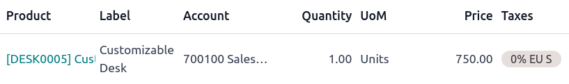

:show-content:

=====
Taxes
=====

There are numerous types of **taxes**, and their application varies greatly, depending mostly on
your company's localization. To make sure they are recorded with accuracy, Odoo's tax engine
supports all kinds of uses and computations.

.. _taxes/default:

Default taxes
=============

**Default taxes** define which taxes are automatically selected when creating a new product. They
are also used to prefill the :guilabel:`Taxes` field when adding a new line on an invoice in
:ref:`Accounting Firms <fiduciaries>` mode.

To change your **default taxes**, go to :menuselection:`Accounting --> Configuration --> Settings
--> Taxes --> Default Taxes`, select the appropriate taxes for your default sales tax and purchase
tax, and click on :guilabel:`Save`.

.. note::
   **Default taxes** are automatically set up according to the country selected at the creation of
   your database, or when you set up a :ref:`fiscal localization package
   <fiscal_localizations/packages>` for your company.

.. _taxes/list_activation:

Activate sales taxes from the list view
=======================================

As part of your :ref:`fiscal localization package <fiscal_localizations/packages>`, most of your
country's sales taxes are already preconfigured on your database. However, only a few taxes are
activated by default. To activate taxes relevant to your business, go to :menuselection:`Accounting
--> Configuration --> Taxes` and enable the toggle button under the :guilabel:`Active` column.

.. _taxes/configuration:

Configuration
=============

To edit or create a **tax**, go to :menuselection:`Accounting --> Configuration --> Taxes` and open
a tax or click on :guilabel:`New`.

Basic options
-------------

.. _taxes/name:

Tax name
~~~~~~~~

The **tax name** is displayed for backend users in the :guilabel:`Taxes` field in
:doc:`sales orders <../../sales/sales>`, :doc:`invoices <customer_invoices>`, product forms, etc.

.. _taxes/computation:

Tax computation
~~~~~~~~~~~~~~~

- **Group of Taxes**

  The tax is a combination of multiple sub-taxes. You can add as many taxes as you want, in the
  order you want them to be applied.

  .. important::
     Make sure that the tax sequence is correct, as the order in which they are may impact the
     taxes' amounts computation, especially if one of the taxes :ref:`affects the base of the
     subsequent ones <taxes/base-subsequent>`.

- **Fixed**

  The tax has a fixed amount in the default currency. The amount remains the same, regardless of the
  sales price.

.. example::
   A product has a sales price of $1000, and we apply a $10 *fixed* tax. We then have:

   +-------------+-------------+----------+----------+
   | Product     | Price       | Tax      | Total    |
   | sales price | without tax |          |          |
   +=============+=============+==========+==========+
   | 1,000       | 1,000       | 10       | 1,010.00 |
   +-------------+-------------+----------+----------+

- **Percentage of price**

  The *sales price* is the taxable basis: the tax amount is computed by multiplying the sales price
  by the tax percentage.

.. example::
   A product has a sales price of $1000, and we apply a *10% of Price* tax. We then have:

   +-------------+-------------+----------+----------+
   | Product     | Price       | Tax      | Total    |
   | sales price | without tax |          |          |
   +=============+=============+==========+==========+
   | 1,000       | 1,000       | 100      | 1,100.00 |
   +-------------+-------------+----------+----------+

- **Percentage of Price Tax Included**

  The **total** is the taxable basis: the tax amount is a percentage of the total.

.. example::
   A product has a Sales Price of $1000, and we apply a *10% of Price Tax Included* tax. We then
   have:

   +-------------+-------------+----------+----------+
   | Product     | Price       | Tax      | Total    |
   | sales price | without tax |          |          |
   +=============+=============+==========+==========+
   | 1,000       | 1,000       | 111.11   | 1,111.11 |
   +-------------+-------------+----------+----------+

- **Python code**

  A tax defined as **Python code** consists of two snippets of Python code that are executed in a
  local environment containing data such as the unit price, product or partner.
  :guilabel:`Python Code` defines the amount of the tax, and :guilabel:`Applicable Code` defines if
  the tax is to be applied. The formula is found at the bottom of the :guilabel:`Definition` tab.

.. example::
   :guilabel:`Python Code`: `result = price_unit * 0.10`
   :guilabel:`Applicable Code`: `result = true`

.. _taxes/active:

Active
~~~~~~

Only **active** taxes can be added to new documents.

.. important::
   It is not possible to delete taxes that have already been used. Instead, you can deactivate them
   to prevent future use.

.. note::
   This field can be modified from the :ref:`list view <taxes/list_activation>`.

.. _taxes/scope:

Tax type
~~~~~~~~

The :guilabel:`Tax Type` determines the tax application, which also restricts where it is displayed.

- **Sales**: Customer invoices, product customer taxes, etc.
- **Purchase**: Vendor bills, product vendor taxes, etc.
- **None**

.. tip::
   You can use :guilabel:`None` for taxes that you want to include in a :ref:`Group of Taxes
   <taxes/computation>` but that you do not want to list along with other sales or purchase taxes.

Tax scope
~~~~~~~~~

The :guilabel:`Tax Scope` restricts the use of taxes to a type of product, either **goods** or
**services**.

.. _taxes/definition-tab:

Definition tab
--------------

Allocate with precision the amount of the taxable basis or percentages of the computed tax to
multiple accounts and tax grids.

- **Based On**:

  - :guilabel:`Base`: the price on the invoice line
  - :guilabel:`% of tax`: a percentage of the computed tax.

- **Account**: if defined, an additional journal item is recorded.
- **Tax Grids**:  used to generate :doc:`tax reports <reporting/tax_returns>`
  automatically, according to your country's regulations.

.. _taxes/advanced-tab:

Advanced options tab
--------------------

.. _taxes/label-invoices:

Label on invoices
~~~~~~~~~~~~~~~~~

The tax label is displayed on each invoice line in the :guilabel:`Taxes` column. This is visible to
*front-end* users on exported invoices, in customer portals, etc.

.. _taxes/tax-group:

Tax group
~~~~~~~~~

Select which **tax group** the tax belongs to. The tax group name is the displayed above the
**total** line on exported invoices and in customer portals.

Tax groups include different iterations of the same tax. This can be useful when you must record
the same tax differently according to :doc:`fiscal positions <taxes/fiscal_positions>`.

.. example::

   .. image:: taxes/invoice-tax-group.png
      :alt: The Tax Group name is different from the Label on Invoices

   In the example above, the :guilabel:`0% EU S` tax for intra-community customers in Europe records
   the amount on specific accounts and tax grids. However, it remains a 0% tax to the customer. This
   is why the label indicates :guilabel:`0% EU S`, and the tax group name above the
   :guilabel:`Total` line indicates :guilabel:`VAT 0%`.

.. important::
   Taxes have three different labels, each one having a specific use. Refer to the following table
   to see where they are displayed.

   +------------------+-------------------------+-------------------------+
   | :ref:`Tax Name   | :ref:`Label on Invoice  | :ref:`Tax Group         |
   | <taxes/name>`    | <taxes/label-invoices>` | <taxes/tax-group>`      |
   +==================+=========================+=========================+
   | Backend          | :guilabel:`Taxes` column| Above the               |
   |                  | on exported invoices    | :guilabel:`Total` line  |
   |                  |                         | on exported invoices    |
   +------------------+-------------------------+-------------------------+

.. _taxes/analytic-cost:

Include in analytic cost
~~~~~~~~~~~~~~~~~~~~~~~~

With this option activated, the tax amount is assigned to the same **analytic account** as the
invoice line.

.. _taxes/included-in-price:

Included in price
~~~~~~~~~~~~~~~~~

With this option activated, the total (including the tax) equals the **sales price**.

`Total = Sales Price = Computed Tax-Excluded price + Tax`

.. example::
   A product has a sales price of $1000, and we apply a *10% of Price* tax, which is *included in
   the price*. We then have:

   +-------------+-------------+----------+----------+
   | Product     | Price       | Tax      | Total    |
   | sales price | without tax |          |          |
   +=============+=============+==========+==========+
   | 1,000       | 900.10      | 90.9     | 1,000.00 |
   +-------------+-------------+----------+----------+

.. note::
   If you need to define prices accurately, both tax-included and tax-excluded, please refer to the
   following documentation: :doc:`taxes/B2B_B2C`.

.. note::
   By default, only the :guilabel:`Tax excluded` column is displayed on invoices. To display the
   :guilabel:`Tax included` column, click the **dropdown toggle** button and check
   :guilabel:`Tax incl.`.

   .. image:: taxes/toggle-button.png

.. _taxes/base-subsequent:

Affect base of subsequent taxes
~~~~~~~~~~~~~~~~~~~~~~~~~~~~~~~

With this option, the total tax-included becomes the taxable basis for the other taxes applied to
the same product.

You can configure a new :ref:`group of taxes <taxes/computation>` to include this tax or add it
directly to a product line.

.. image:: taxes/subsequent-line.png
   :alt: The eco-tax is taken into the basis of the 21% VAT tax

.. warning::
   The order in which you add the taxes on a product line has no effect on how amounts are computed.
   If you add taxes directly on a product line, only the tax sequence determines the order in which
   they are applied.

   To reorder the sequence, go to :menuselection:`Accounting --> Configuration --> Taxes`, and drag
   and drop the lines with the handles next to the tax names.

   .. image:: taxes/list-sequence.png
      :alt: The taxes' sequence in Odoo determines which tax is applied first

.. seealso::
  - :doc:`taxes/fiscal_positions`
  - :doc:`taxes/B2B_B2C`
  - :doc:`taxes/taxcloud`
  - :doc:`reporting/tax_returns`

.. toctree::
   :titlesonly:

   taxes/cash_basis
   taxes/retention
   taxes/vat_verification
   taxes/fiscal_positions
   taxes/avatax
   taxes/taxcloud
   taxes/eu_distance_selling
   taxes/B2B_B2C
