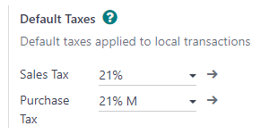
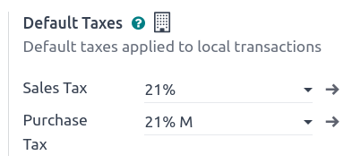
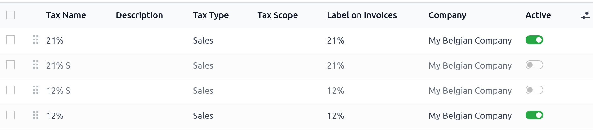
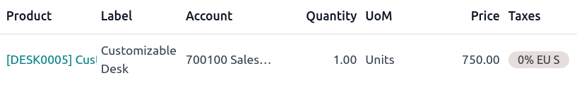

:show-content:

=====
Taxes
=====

Odoo makes it easy to keep up with tax obligations - computing tax amounts on sales, keeping track
of tax debit and credit, and completing tax declarations.

Using Odoo to handle taxes involves:

1. :ref:`Initial configuration <taxes/configuration>`: setting company-wide options, adjusting the
   taxes' configuration if need be, and assigning taxes to products.
2. :ref:`Daily operations <taxes/operations>`: using taxes in documents created in the Sales,
   Purchase, Accounting, and Point of Sale apps.
3. :ref:`Tax reporting <taxes/returns>`: visualizing tax figures for a tax period, completing tax
   returns and performing tax closing operations.

.. _taxes/configuration:

Initial configuration
=====================

.. _taxes/configuration/company:

Company-wide options
--------------------

To access these configuration options, go to :menuselection:`Accounting --> Configuration
--> Settings` and scroll down to :guilabel:`Taxes`.

.. _taxes/default:

Default taxes
~~~~~~~~~~~~~

**Default taxes** define which taxes are automatically selected when creating a new product. They
are also used to prefill the :guilabel:`Taxes` field when adding a new line on an invoice in
:ref:`Accounting Firms <accounting/fiduciaries>` mode.

<<<<<<< e08f490fcc5f5d8a07f4cbb7db603accec8c640e

To change your **default taxes**, go to :menuselection:`Accounting --> Configuration --> Settings`,
scroll down to the :guilabel:`Taxes` section, select the appropriate default sales and purchase
taxes in the :guilabel:`Default Taxes` field, and click on :guilabel:`Save`.

.. note::
   **Default taxes** are automatically set up according to the country selected at the creation of
   your database, or when you set up a :ref:`fiscal localization package
   <fiscal_localizations/packages>` for your company.

||||||| 4e817af403fd9df706b7de9821ec03351557e052

To change your **default taxes**, go to :menuselection:`Accounting --> Configuration --> Settings
--> Taxes --> Default Taxes`, select the appropriate taxes for your default sales tax and purchase
tax, and click on :guilabel:`Save`.

.. note::
   **Default taxes** are automatically set up according to the country selected at the creation of
   your database, or when you set up a :ref:`fiscal localization package
   <fiscal_localizations/packages>` for your company.

=======
>>>>>>> a4bd0f82dd338d12200b7e88a03d6a9c1f27b592
.. _taxes/list_activation:

View and activate taxes
-----------------------

To view the list of taxes, go to :menuselection:`Accounting --> Configuration --> Taxes`.

Odoo's :ref:`fiscal localization packages <fiscal_localizations/packages>` create pre-configured
versions for most sales taxes, but only the most common are activated by default. Use the toggle
button under the :guilabel:`Active` column to activate any needed taxes.

.. _taxes/configuration/modify:

Modify a tax
------------

To modify a tax, open the taxes list by going to :menuselection:`Accounting --> Configuration -->
Taxes`, then click the tax name.

.. _taxes/configuration/back-end:

Configure back-end appearance and availability
~~~~~~~~~~~~~~~~~~~~~~~~~~~~~~~~~~~~~~~~~~~~~~

The following options control how a tax appears to users in the Odoo back-end.

.. _taxes/name:

Tax name
********

The :guilabel:`Tax Name` appears for backend users in the :guilabel:`Taxes` field in :doc:`sales
orders <../../sales/sales>`, :doc:`invoices <customer_invoices>`, product forms, etc.

.. _taxes/scope:

Tax type
********

The :guilabel:`Tax Type` determines where the tax is available to be selected.

- **Sales**: Customer invoices, product customer taxes, etc.
- **Purchase**: Vendor bills, product vendor taxes, etc.
- **None**

.. tip::
   You can use :guilabel:`None` for taxes that you want to include in a :ref:`Group of Taxes
   <taxes/computation>` but that you do not want to list along with other sales or purchase taxes.

Tax scope
*********

The :guilabel:`Tax Scope` restricts the use of taxes to a type of product, either **goods** or
**services**.

<<<<<<< e08f490fcc5f5d8a07f4cbb7db603accec8c640e
.. _taxes/tax-mapping:

Tax mapping
-----------

Taxes can be combined with :doc:`fiscal positions <taxes/fiscal_positions>` to map taxes to each
other so that the correct tax is applied based on the customer's or vendor's location and business
type.

When configuring a tax, leave the :guilabel:`Fiscal Position` field blank to apply the tax across
all fiscal positions or select specific fiscal positions where this tax should be used. If one or
multiple fiscal positions are selected, use the :guilabel:`Replaces` field to select all of the
taxes that this tax should replace for the selected fiscal position(s).

To replace one tax with multiple other taxes, configure each of the replacement taxes to replace the
default product tax.

.. example::
   As a sales tax, the :guilabel:`0% Exports` tax applies to quotations, sales orders, and invoices
   that use the :guilabel:`Foreign Trade` fiscal position. On those records, any time that the
   :guilabel:`15%` tax would be used, the :guilabel:`0% Exports` tax is used instead.

.. note::
   Since the first fiscal position in the sequence is considered the company's default, the taxes
   set on products are expected to be used with that fiscal position, so the :guilabel:`Replaces`
   field is not displayed on it.

   .. image:: taxes/tax-mapping-example.png
      :alt: The **0% Exports** tax record

.. tip::
   To more easily view which taxes are replaced, use the :icon:`oi-settings-adjust`
   :guilabel:`adjust settings` in the taxes list view and display the :guilabel:`Replaces` field.

   .. image:: taxes/tax-mapping-list.png
      :alt: The **Replaces** field shown in the list view

.. note::
   Tax mapping only works with :ref:`taxes/active` taxes.

.. _taxes/definition-tab:
||||||| 4e817af403fd9df706b7de9821ec03351557e052
.. _taxes/definition-tab:
=======
.. _taxes/configuration/customer:
>>>>>>> a4bd0f82dd338d12200b7e88a03d6a9c1f27b592

Configure how the tax appears to your customers
~~~~~~~~~~~~~~~~~~~~~~~~~~~~~~~~~~~~~~~~~~~~~~~

.. _taxes/label-invoices:

Label on invoices
*****************

The tax label is displayed on each invoice line in the :guilabel:`Taxes` column. This is visible to
*front-end* users on exported invoices, in customer portals, etc.

.. _taxes/tax-group:

Tax group
*********

Select which **tax group** the tax belongs to. The tax group name is displayed above the
**total** line on exported invoices and in customer portals.

Tax groups include different iterations of the same tax. This can be useful when you must record
the same tax differently according to :doc:`fiscal positions <taxes/fiscal_positions>`.

.. example::

   .. image:: taxes/invoice-tax-group.png
      :alt: The Tax Group name is different from the Label on Invoices

   In the example above, the :guilabel:`0% EU S` tax for intra-community customers in Europe records
   the amount on specific accounts and tax grids. However, it remains a 0% tax to the customer. This
   is why the label indicates :guilabel:`0% EU S`, and the tax group name above the
   :guilabel:`Total` line indicates :guilabel:`VAT 0%`.

.. _taxes/configuration/computation:

Configure the tax computation
~~~~~~~~~~~~~~~~~~~~~~~~~~~~~

.. _taxes/configuration/tax-repartition:

Configure how tax journal items are created
~~~~~~~~~~~~~~~~~~~~~~~~~~~~~~~~~~~~~~~~~~~

.. _taxes/configuration/create:

Create a new tax
----------------

Depending on your business' needs, you may need to create some taxes yourself.

.. tip::
   It's often easier to duplicate an existing tax than to create a new tax from scratch. To
   duplicate a tax, click :icon:`fa-cog`, then click :guilabel:`Duplicate`.

Fiscal positions
----------------

See the fiscal positions page.

Set taxes on products
---------------------

In order for Odoo to know which taxes to use when adding a product to an sales or purchase order,
invoice, or PoS order, the :guilabel:`Sales Taxes` and :guilabel:`Purchase Taxes` fields need to be
filled on the product.

To configure these taxes, go to :menuselection:`Accounting --> Customers --> Products`, select the
product to configure, and fill the :guilabel:`Sales Taxes` and :guilabel:`Purchase Taxes` fields.

.. tip::
   Use the Default Taxes company-wide setting to automatically fill these fields on new products.

.. _taxes/operations:

Applying taxes in daily operations
==================================

.. _taxes/returns:

Completing tax returns
======================

Extra taxes
===========

"Extra taxes" is a broad term referring to additional taxes beyond the standard or basic taxes
imposed by governments. These extra taxes can be **luxury** taxes, **environmental** taxes,
**import** or **export duties** taxes, etc.

.. note::
   The method to compute these taxes varies across different countries. We recommend consulting your
   country's regulations to understand how to calculate them for your business.

To compute an extra tax in Odoo, :ref:`create a tax <taxes/configuration>`, enter a tax name, select
a :ref:`Tax Computation <taxes/configuration>`, set an :guilabel:`Amount`, and in the
:guilabel:`Advanced Options` tab, enable :guilabel:`Affect Base of Subsequent Taxes`. Then, drag and
drop the taxes in the :ref:`order they should be computed <taxes/base-subsequent>`.

.. example::
   - In Belgium, the formula to compute an environmental tax is: `(product price + environmental
     tax) x sales tax`. Therefore, our environmental tax has to come *before* the sales tax in the
     computation sequence.
   - In our case, we created a 5% environmental tax (Ecotax) and put it *before* the Belgian base
     tax of 21%.

   .. image:: taxes/ecotax.png
      :alt: Environmental tax sequence in Belgium.

.. seealso::
  - :doc:`taxes/fiscal_positions`
  - :doc:`taxes/B2B_B2C`
  - :doc:`reporting/tax_returns`

.. toctree::
   :titlesonly:

   taxes/cash_basis
   taxes/retention
   taxes/vat_verification
   taxes/fiscal_positions
   taxes/avatax
   taxes/eu_distance_selling
   taxes/B2B_B2C
   taxes/tax_computation
