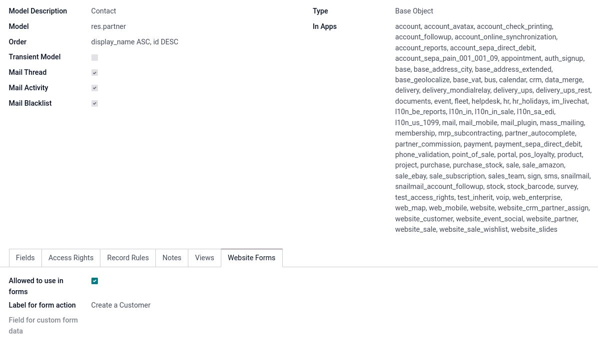
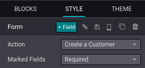
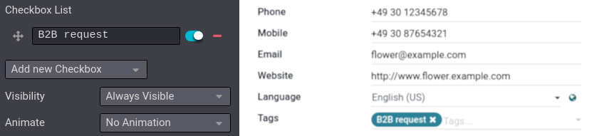
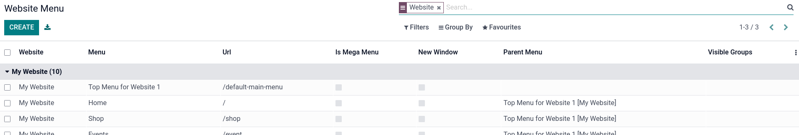

=================================================
B2B (tax-excluded) and B2C (tax-included) pricing
=================================================

When working with **B2B** and **B2C** customers, depending on the legislation where your business
operates, you may need to use different prices depending on the customer's nature. For a **B2B**
customer, a *tax-excluded* price would be used, where as for a **B2C** customer, a *tax-included*
price would be used.

Odoo handles both tax-excluded and tax-included pricing, however, only one pricing type can be used
at a time per product. I.e., it is impossible to have both tax-excluded *and* tax-included pricing
simultaneously on a single product.

.. note::
   If all your prices are **exclusively** either tax-excluded *or* tax-included, you can still
   create sales order with a tax-excluded or tax-included price. This documentation is only for the
   specific use case of both tax-included *and* tax-excluded pricing for the same product.

Configuration
=============

If you sell both **tax-excluded** and **tax-included** products simultaneously and need to juggle
with both B2B and B2C customers:

#. Before any configuration, make sure to have :guilabel:`Tax-Excluded` selected in
   :menuselection:`Settings --> Website --> Pricing (section)` and in :menuselection:`Settings -->
   Accounting --> Customer Invoices (section)`

#. Go to :menuselection:`Accounting --> Customers --> Products`, select a product, and in the
   :guilabel:`General Information` tab, set a :guilabel:`Sales Price` (tax-excl.), and a
   :guilabel:`Customer Taxes` (tax itself).

#. Then, create a :doc:`price list </applications/sales/sales/products_prices/prices/pricing>` under
   :menuselection:`Website --> Products --> Pricelists --> Create`. The price list is intended for
   **B2C** customers, so name it accordingly to recognize it easily ('B2C customers', for example).
   Click :guilabel:`Add a line`, select a **product**, and set a *tax-included* :guilabel:`Price`
   for that product. Make sure to :guilabel:`Save`.

#.  Go to :menuselection:`Accounting --> Configuration --> Fiscal Positions --> Create`. The
    :doc:`fiscal position <fiscal_positions>` is intended for **B2B** customers, so name it
    accordingly to recognize it easily ('B2B customers', for example). In the
    :guilabel:`Tax Mapping` tab, click :guilabel:`Add a line` and select the
    :guilabel:`Customer Taxes` set on the **product form** at step one of this list. In the
    :guilabel:`Tax to Apply` column, select the tax to apply for **B2B** customers according to your
    accounting. Make sure to :guilabel:`Save`.

#.  Next, go to :menuselection:`Accounting --> Customers --> Customers`, select a **customer**, and
    in the :guilabel:`Sales & Purchase` tab, set the **B2C price list** for **B2C customers** in the
    :guilabel:`Pricelist` field; or set the **B2B fiscal position** for **B2B customers** in the
    :guilabel:`Fiscal Position` field. Repeat this step for every customer.

eCommerce display
-----------------

To display both **B2B** and **B2C** prices on a single eCommerce, activate the
:doc:`developer mode </applications/general/developer_mode>`. Then, go to
:menuselection:`Settings --> General Settings` and at the very top of the page, click
:guilabel:`Users & Companies`. Access either :guilabel:`Technical / Tax display B2B` or
:guilabel:`Technical / Tax display B2C` and under the :guilabel:`Users` tab, click :guilabel:`Add a
line` to add customers to their **respective groups**, i.e., add **B2B** customers to the
**B2B group** and **B2C** customers to the **B2C group**.

This way, **B2B** customers only see the **B2B** price on your eCommerce, and **B2C** customers only
see the **B2C** price.

Hide content from non-B2B users
===============================

Usually, a B2B website does not allow to see either the catalog or the prices without being logged
in. To restrict these accesses to only your B2B customers, you can create a specific form for users
to request a B2B account, allowing them to access your catalog and prices.

Configuration
-------------

Go to :menuselection:`Website --> Configuration --> Settings`, scroll down to the
:guilabel:`Features` section, and under :guilabel:`Customer Account`, check
:guilabel:`On invitation`. Make sure to :guilabel:`Save`. Then, activate the
:doc:`developer mode </applications/general/developer_mode>`, go to
:menuselection:`Settings --> Technical --> Models`, and search for `res.partner`. Click on that
**model**, click the :guilabel:`Website Forms`, and make sure :guilabel:`Allowed to use in forms` is
enabled and :guilabel:`Label for form action` is set to :guilabel:`Create a Customer`. Do not forget
to :guilabel:`Save`.

Then, go to :guilabel:`Contacts --> Configuration --> Contact Tags`. :guilabel:`Create` a new tag,
and **name** it in a recognizable manner; the tag will be used later in this setup. Make sure it is
:guilabel:`Active` and :guilabel:`Save`.

.. tip::
   You can access **Models** by hitting `CTRL/COMMAND (⌘) + K` and searching for `/models`.
.. seealso::
   :doc:`/applications/general/users/portal`

Page form
---------

To create a **page form** where customers can land on and request access to your shop, go to
:menuselection:`Website --> Go to Website --> + New`, and click :guilabel:`Page`. Enter a **page
title**, enable :guilabel:`Add to menu`, and click :guilabel:`Create`. Then, click the
:guilabel:`Submit` and from the **website builder menu**, set the :guilabel:`Action` type to
:guilabel:`Create a Customer`.

Next, **add** or **delete** the fields according to your needs, **rename** them if necessary, and
mark them as :guilabel:`Required` (if necessary) in the **website builder**. Add a field by clicking
:guilabel:`+Field`, set its type to :guilabel:`Tags`, and remove any other unnecessary tags by
clicking :`-` under the :guilabel:`Checkbox List` in the **website builder**, leave only the tag(s)
related to B2B account requests. Tick the **toggle** button to automatically have this button
checked when customers fill in the form. Finally, set the :guilabel:`Visibility` to
:guilabel:`Hidden`. This way, when customers submit the form, their **contact card** will
be marked with the tag(s) used in the form, making them easily recognizable. :guilabel:`Save` when
done. Once the form is ready, click :guilabel:`Publish`.

Submitted requests can be found under the **Contacts** with the related tag(s). Click the **contact
card** of a customer with the tag(s), then :menuselection:`(⚙) Action --> Grant portal access`, and
finally :guilabel:`Grant access`. The customer now has access to your B2B catalog and products.

.. example::
   This is what the customer sees with the aforementioned configuration.

   .. image:: B2B_B2C/request-form.png
      :alt: B2B account request form.

HTML editing
------------

Hide the shop
~~~~~~~~~~~~~

To hide the **shop** page from **public users** (non-logged-in users), go on your **shop** page in
the **Website** app, click :menuselection:`Customize --> HTML/CSS/JS Editor` and in the **HTML**
editor, change the line `
` to
`
`, and click
:guilabel:`Save`. Then, to hide the **menu** itself, go to :menuselection:`Website --> Configuration
--> Menus`, select the desired website, and click your **shop** page. Under :guilabel:`Group Name`,
click :guilabel:`Add a line`, and add :guilabel:`User types / Internal User` and
`User types / Portal` to the list. :guilabel:`Save` when done.

.. note::
   The :doc:`developer mdode </applications/general/developer_mode>` must be activated to access
   :menuselection:`Website --> Configuration --> Menus`.

.. seealso::
   :doc:`/applications/general/users/access_rights`

Next, go to your **website** and create a **new page** (:menuselection:`+ New --> Page`). Give the
page a recognizable name, and **uncheck** :guilabel:`Add to menu`. The goal of this page is to
inform customers they need to be logged-in to see the **shop** page and **redirect** them to the
account request **form**. You can design the page however you like.

.. example::
   In this case, we used a **Heading** block, with a **Text** block, and a **Button** redirecting
   to the `/b2b-account-request` URL of our website.

   .. image:: B2B_B2C/page-redirect.png
      :alt: Example of a redirect page build.

