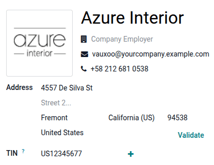

:show-content:

===================
Avalara integration
===================

Avalara's AvaTax is a cloud-based tax software. Integrating AvaTax with Odoo provides real-time and
region-specific sales tax calculations when users sell and invoice items in Odoo. AvaTax tax
calculation is supported for customers in every United Nations chartered country, including for
inter-border transactions.

.. important::
   While the AvaTax calculation is supported for *customers* around the world, AvaTax is only
   available for integration with *databases/companies* whose :ref:`fiscal country
   <accounting/avalara/fiscal_country>` is set to the :doc:`United States
   <../../fiscal_localizations/united_states>`, :doc:`Canada <../../fiscal_localizations/canada>`,
   or :doc:`Brazil <../../fiscal_localizations/brazil>`.

   Whereas this page explains the process for companies in the United States and Canada, the process
   differs for companies in Brazil and is documented on the :doc:`Brazilian localization page
   <../../fiscal_localizations/brazil>`.

AvaTax takes into account location-based tax rates for each state, county, and city. It improves
remittance accuracy by paying close attention to laws, rules, jurisdiction boundaries, and special
circumstances (like tax holidays and product exemptions).

.. important::
   - AvaTax uses the company address by default. To use the warehouse address, enable :ref:`Allow
     Ship Later <pos/shop/ship>` in the **POS** app settings.
   - Excise tax is **not** supported. This includes tobacco/vape taxes, fuel taxes, and other
     specific industries.

.. seealso::
   `Avalara AvaTax overview
   <https://community.avalara.com/support/s/document-item?language=en_US&bundleId=dqa1657870670369_dqa1657870670369&topicId=jec1667533227433.html&_LANG=enus>`_

Module installation
===================

Using AvaTax requires :ref:`installing <general/install>` the AvaTax module(s). To do so, open
the :guilabel:`Apps` app, remove the :guilabel:`Apps` filter in the :guilabel:`Search` bar, type in
`AvaTax`, and press :kbd:`Enter` to display the available modules related to AvaTax:

- :guilabel:`Avatax` (`account_avatax`): Default AvaTax module that adds the base AvaTax features
  for tax calculation.
- :guilabel:`Avatax for SO` (`account_avatax_sale`): Includes the information needed for tax
  calculation on sales orders in Odoo.
- :guilabel:`Avatax for Inventory` (`account_avatax_stock`): Includes tax calculation in Odoo
  Inventory.

Should AvaTax be needed for geo-localization or with the :doc:`Amazon Connector
<../../../sales/sales/amazon_connector/features>`, :ref:`install <general/install>` those modules
individually:

- :guilabel:`Avatax for geo localization` (`account_avatax_geolocalize`): Includes the features
  required for integration of AvaTax into geo-localization in Odoo.
- :guilabel:`Amazon/Avatax Bridge` (`sale_amazon_avatax`): tax calculation features between the
  *Amazon Connector* and Odoo.

Additional modules related to the :doc:`Brazilian fiscal localization
<../../fiscal_localizations/brazil>` are also available.

.. seealso::
   For additional information on the fiscal localizations themselves, view the following
   :doc:`fiscal localization <../../fiscal_localizations>` documentation:

   - :doc:`../../fiscal_localizations/canada`
   - :doc:`../../fiscal_localizations/united_states`
   - :doc:`../../fiscal_localizations/brazil`

.. _accounting/avalara/integrations:

Available integrations
======================

For users in the United States and Canada, there are two options for AvaTax integration:

- Avalara Included: An affordable :doc:`In-App purchase service
  <../../../essentials/in_app_purchase>` designed for SMBs with essential tax calculation needs.
- Avalara Direct: A robust solution for high-volume or complex businesses, with tailored support
  provided directly by Avalara.

.. list-table::
   :header-rows: 1
   :stub-columns: 1

   * -
     - Avalara Included
     - Avalara Direct
   * - Best fit
     - SMBs / Lower Volume
     - Mid-Market/ Enterprise
   * - AvaTax Engine
     - ✅
     - ✅
   * - Cost per Transaction
     - $ Credit-based
     - $$ Contract-based
   * - Account Managed by
     - Odoo IAP
     - Avalara Direct
   * - Odoo Technical Support
     - ✅
     - ✅
   * - Annual Transaction Limit
     - 5,000
     - Unlimited Custom
   * - 1st tier Support by
     - Odoo
     - Avalara
   * - Avalara Direct Support
     - Limited
     - ✅
   * - Return Prep & Filing
     - ⚠️ Add-on only
     - ⚠️ Add-on only
   * - Tax Remittance
     - ⚠️ Add-on only
     - ⚠️ Add-on only

.. _accounting/avalara/included:

Avalara Included
----------------

*Avalara Included* is an affordable in-app tax calculation service designed for small and
medium-sized businesses with essential tax compliance needs. Built on *Avalara's AvaTax* platform,
it integrates with Odoo to provide real-time, region-specific tax calculations for sales, purchases,
and invoices.

*Avalara Included* is available for databases/companies with locations in the United States and
Canada.

.. seealso::
   `Avalara's support documents
   <https://community.avalara.com/support/s/resources?language=en_US>`_

.. important::
   - Businesses that exceed 5,000 transactions annually must instead use an
     :ref:`accounting/avalara/direct` plan to ensure uninterrupted service at higher transaction
     volumes. To migrate from *Avalara Included* to *Avalara Direct*, speak with your account
     manager.
   - In :doc:`multicompany environments <../../../general/companies/multi_company>`, *Avalara
     Included* credentials cannot be shared between companies. Instead, :ref:`create a unique
     Avalara Included account <accounting/avalara/included-create>` with a unique email address for
     each individual company in the database.

.. _accounting/avalara/included-iap:

In-App purchase credits
~~~~~~~~~~~~~~~~~~~~~~~

*Avalara Included* requires users to purchase credits on the `Odoo IAP page
<https://iap.odoo.com/iap/in-app-services/865>`_.

One credit is consumed every time an invoice or credit note is posted with an Avatax fiscal
position. Select the package that best fits the demand, based on the estimated number of
transactions.

.. _accounting/avalara/included-config:

Configuration
~~~~~~~~~~~~~

*Avalara Included* is available both for Odoo users who do not yet have an Avalara account and need
to :ref:`create <accounting/avalara/included-create>` one and for Odoo users with an existing
Avalara account that they would like to :ref:`migrate <accounting/avalara/included-migrate>` to the
*Avalara Included* plan.

.. _accounting/avalara/included-create:

Create an Avalara Included account
**********************************

.. important::
   The Avalara account activation **must** be done on the production database. If the account is
   created from a test database that does not have an associated valid enterprise account, an error
   message may appear indicating that no valid enterprise contract was found.

To activate and use the *Avalara Included* feature, follow these steps:

#. Navigate to :menuselection:`Accounting --> Configuration --> Settings`.
#. In the :guilabel:`Taxes` section, enable :guilabel:`AvaTax`.

.. image:: avalara/avalara-included.png
   :alt: The AvaTax settings in Odoo's Accounting app.

#. Select :guilabel:`Avalara Included` as the account type and enter a valid email address. This
   email address is used to link the company's information to the *Avalara Included* account.
#. Click :icon:`fa-plug` :guilabel:`Connect to Avalara Included` to establish the connection between
   the Odoo database and the new Avalara account.
#. Accept `Avalara's terms and conditions <https://legal.avalara.com/>`_.
#. At this point, the Avalara account is created and an email is automatically sent to the
   associated email address. Follow the instructions in the email to activate the account by
   creating a password and registering in the Avalara Portal.

Test connection
^^^^^^^^^^^^^^^

After creating an *Avalara Included* account, click :guilabel:`Test connection`. This ensures the
email added in the :guilabel:`AvaTax Portal Email` field is correct and a connection is made between
Odoo and the AvaTax :abbr:`API (application programming interface)`.

Sync parameters
^^^^^^^^^^^^^^^

Upon finishing the configuration and settings of the AvaTax section, click the :guilabel:`Sync
Parameters` button to synchronize the exemption codes from AvaTax.

Create a basic company profile
******************************

To complete the Avalara account setup, `create a basic company profile
<https://www.odoo.com/r/2k0>`_.

Collect essential business details for the next step: locations where tax is collected,
products/services sold (and their sales locations), and customer tax exemptions, if applicable.
Follow the Avalara documentation for creating a basic company profile:

#. `Add company information
   <https://www.odoo.com/r/XZDW>`_.
#. `Add where the company collects and pays tax
   <https://www.odoo.com/r/E6g>`_.
#. `Verify jurisdictions and activate the company
   <https://www.odoo.com/r/NIy>`_.
#. `Add other company locations for location-based filing
   <https://www.odoo.com/r/GF4>`_.
#. `Add a marketplace to the company profile
   <https://www.odoo.com/r/QA5>`_.

.. note::
   After finishing these configurations that are specific to *Avalara Included*, be sure to complete
   the :ref:`configurations <accounting/avalara/odoo-configuration>` that are common to both
   *Avalara Included* and *Avalara Direct*.

.. _accounting/avalara/included-migrate:

Migrate to Avalara Included
~~~~~~~~~~~~~~~~~~~~~~~~~~~

Companies currently using *Avalara Direct* in production that have fewer than 5,000 annual
transactions, including invoices and credit notes, are eligible to migrate their account plan to
*Avalara Included*.

.. important::
   Migrating from *Avalara Direct* to *Avalara Included* changes the Avalara account from a monthly
   contract model to an in-app purchase model, where transaction credits can be purchased based on
   volume. First-level support is also transferred to Odoo.

To migrate to *Avalara Included*, follow these steps:

#. Navigate to :menuselection:`Accounting --> Configuration --> Settings`.
#. In the :guilabel:`Taxes` section, under :guilabel:`AvaTax`, verify that the
   :guilabel:`Integration Method` is set to :guilabel:`Avalara Direct`.
#. In the :guilabel:`Environment` field, select :guilabel:`Production`. Confirm that the
   :guilabel:`API ID` and :guilabel:`API KEY` are correctly configured.
#. Click :icon:`fa-plug` :guilabel:`Migrate to Avalara Included`. A confirmation message appears
   outlining the changes to Avalara services and pricing before proceeding with the migration.
#. Review the differences between each integration carefully before confirming the migration.

Once the migration is complete, a confirmation message appears indicating that the account was
successfully migrated to *Avalara Included*.

.. note::
   Because the migration process uses the same email address associated with the *Avalara Direct*
   account, access to the *Avalara* portal remains available with the existing email address. No
   additional email configuration is required in Odoo.

.. important::
   Once the migration is complete, :ref:`IAP credits <accounting/avalara/included-iap>` must be
   purchased to continue using the AvaTax engine.

.. _accounting/avalara/direct:

Avalara Direct
--------------

*Avalara Direct* is an in-app tax calculation service designed for mid-market and enterprise
businesses with a high volume of transactions (5000+ per year) and more complex needs. Built on
*Avalara's AvaTax* engine, *Avalara Direct* integrates with Odoo to provide real-time,
region-specific tax calculations for sales, purchases, and invoices.

*Avalara Direct* is available for databases/companies with locations in the United States and
Canada.

.. seealso::
   `Avalara's support documents
   <https://community.avalara.com/support/s/resources?language=en_US>`_

.. note::
   Most small and medium-sized businesses should instead use :ref:`accounting/avalara/included`.
   Existing *Avalara Direct* users with fewer than 5,000 annual transactions can :ref:`migrate to
   Avalara Included <accounting/avalara/included-migrate>`.

.. _accounting/avalara/direct-config:

Configuration
~~~~~~~~~~~~~

.. _accounting/avalara/direct-create-account:

Create an account
*****************

To use AvaTax, an account with Avalara is required for the setup. If one has not been set up yet,
`connect with Avalara to purchase a license
<https://www.avalara.com/us/en/get-started.html?campaignID=701Uz00000kcMwLIAU&utm_campaign=AMER_PROS_Unpaid-Synd_General-Contact_07_2025_ODOO-Page---Contact-Us&marketing_channel=web_referral&vendor=partner&paid_unpaid=unpaid&target_audience=prospect>`_.

.. tip::
   Upon account setup, take note of the AvaTax :guilabel:`Account ID`. This will be needed in the
   :ref:`Odoo setup <accounting/avalara/credentials>`. In Odoo, this number is the :guilabel:`API
   ID`.

Then, `create a basic company profile <https://www.odoo.com/r/2k0>`_.

.. _accounting/avalara/direct-create-basic-company-profile:

Create a basic company profile
******************************

Collect essential business details for the next step: locations where tax is collected,
products/services sold (and their sales locations), and customer tax exemptions, if applicable.
Follow the Avalara documentation for creating a basic company profile:

#. `Add company information
   <https://www.odoo.com/r/XZDW>`_.
#. `Tell us where the company collects and pays tax
   <https://www.odoo.com/r/E6g>`_.
#. `Verify jurisdictions and activate the company
   <https://www.odoo.com/r/NIy>`_.
#. `Add other company locations for location-based filing
   <https://www.odoo.com/r/GF4>`_.
#. `Add a marketplace to the company profile
   <https://www.odoo.com/r/QA5>`_.

.. _accounting/avalara/direct-connect-avalara:

Connect to Avalara
******************

After creating the basic company profile in Avalara, connect Avalara and Odoo.

Navigate to either Avalara's `sandbox <https://sandbox.admin.avalara.com/>`_ or `production
<https://admin.avalara.com/>`_ environment, depending on which type of Avalara account you wish to
integrate.

.. seealso::
   `Sandbox vs production environments in Avalara
   <https://knowledge.avalara.com/bundle/hxd9079947903116/page/hvk7450989081223.html>`_.

Log in to create the :guilabel:`License Key`. Go to :menuselection:`Settings --> License and API
Keys`. In the :guilabel:`License key and client secrets` tab, click :guilabel:`Generate License
Key`.

.. important::
   Generating a new license key breaks the connection with existing business apps using the AvaTax
   integration. Make sure to update these apps with the new license key.

If this is the first :abbr:`API (application programming interface)` integration being made with
AvaTax and Odoo, click :guilabel:`Generate license key`.

If this is an additional license key, ensure the previous connection can be broken. There is
**only** one license key associated with each of the Avalara sandbox and production accounts.

.. warning::
   Copy this key to a safe place. It is strongly encouraged to back up the license key for
   future reference. This key **cannot** be retrieved after leaving this screen.

.. _accounting/avalara/credentials:

Odoo AvaTax settings
********************

To integrate AvaTax with Odoo, follow these steps:

#. Go to :menuselection:`Accounting --> Configuration --> Settings`.
#. Scroll to the :guilabel:`Taxes` section and enable :guilabel:`AvaTax`.
#. In the :guilabel:`Integration Method` field, select :guilabel:`Avalara Direct`.

   .. image:: avalara/avalara-direct-settings.png
      :alt: Configure AvaTax settings

#. Select the :guilabel:`Environment` in which the company wishes to use AvaTax. It can either be
   :guilabel:`Sandbox` or :guilabel:`Production`.
#. Enter the AvaTax :guilabel:`Account ID` in the :guilabel:`API ID` field, and the
   :guilabel:`License Key` in the :guilabel:`API Key` field.

   .. tip::
      - The :guilabel:`Account ID` can be found by logging into the AvaTax (`sandbox
        <https://sandbox.admin.avalara.com/>`_ or `production <https://admin.avalara.com/>`_)
        portal:

        #. In the upper-right corner, click on :icon:`fa-user-circle-o` :guilabel:`Account`.
        #. The :guilabel:`Account ID` is displayed at the top of the menu.

      - Learn more about how to access the :ref:`License Key
        <accounting/avalara/direct-connect-avalara>`.

#. Enter the Avalara company code for the company being configured in the :guilabel:`Company Code`
   field. Avalara interprets this as :guilabel:`DEFAULT` if it is not set.

   .. note::
      The :guilabel:`Company Code` can be accessed by logging into the *Avalara* portal
      (`sandbox <https://sandbox.admin.avalara.com/>`_ or `production
      <https://admin.avalara.com/>`_) and navigating to :menuselection:`Settings --> All Settings`.
      The code is displayed in the :guilabel:`Company Code` column.

Test connection
^^^^^^^^^^^^^^^

After entering the :guilabel:`API ID` and :guilabel:`API KEY`, click :guilabel:`Test connection`.
This ensures the :guilabel:`API ID` and :guilabel:`API KEY` are correct, and a connection is made
between Odoo and AvaTax.

Sync parameters
^^^^^^^^^^^^^^^

Upon finishing the configuration and settings of the AvaTax section, click the :guilabel:`Sync
Parameters` button to synchronize the exemption codes from AvaTax.

.. note::
   After finishing these configurations that are specific to *Avalara Direct*, be sure to complete
   the :ref:`configurations <accounting/avalara/odoo-configuration>` that are common to both
   *Avalara Included* and *Avalara Direct*.

.. _accounting/avalara/odoo-configuration:

Odoo configuration
==================

Regardless of which :ref:`Avalara integration <accounting/avalara/integrations>` a company uses,
there are some additional configurations in Odoo that are required before using AvaTax to ensure tax
calculations are made accurately.

.. _accounting/avalara/fiscal_country:

Fiscal country
--------------

To set the :guilabel:`Fiscal Country`, navigate to :menuselection:`Accounting --> Configuration -->
Settings`.

Under the :guilabel:`Taxes` section, set the :guilabel:`Fiscal Country` feature to :guilabel:`United
States` or :guilabel:`Canada`. Then, click :guilabel:`Save`.

.. seealso::
   :doc:`../../fiscal_localizations`

Company settings
----------------

All companies operating in the Odoo database should have a full and complete address listed in the
settings. Open the :guilabel:`Settings` app, and scroll to the :guilabel:`Companies` section. If
the database has only a single company, click :icon:`oi-arrow-right` :guilabel:`Update Info` to
update the company details.

If there are multiple companies operating in the database, click :icon:`oi-arrow-right`
:guilabel:`Manage Companies`, then click on each company in the list to update its information.

The :guilabel:`Street`, :guilabel:`Street2`, :guilabel:`City`, :guilabel:`State`, :guilabel:`ZIP`,
and :guilabel:`Country` must all be up to date for each company to ensure accurate tax calculations
and smooth end-of-year accounting operations.

.. seealso::
   :doc:`../../../general/companies`

Transaction options
-------------------

To configure AvaTax-related transactional settings, go to :menuselection:`Accounting -->
Configuration --> Settings` and enable the relevant options in the :guilabel:`AvaTax` section:

- :guilabel:`Use UPC`: to use Universal Product Code (UPC) for transactions instead of
  custom-defined codes in Avalara. Consult a certified public accountant (CPA) for specific
  guidance.
- :guilabel:`Commit Transactions`: to add the Odoo database's transactions to AvaTax reports.

Address validation
------------------

The *Address Validation* feature ensures that the most up-to-date address by postal standards is set
on a contact in Odoo. This is important to provide accurate tax calculations for customers.

.. important::
   The :guilabel:`Address Validation` feature only works with partners/customers in North America.

To enable address validation, go to :menuselection:`Accounting --> Configuration --> Settings`,
scroll to the :guilabel:`Taxes` section, and under :guilabel:`AvaTax`, tick the checkbox next to
:guilabel:`Address Validation`.

:guilabel:`Save` the settings to display the :guilabel:`Validate` link on North American contact
records. Each contact's address must be validated individually:

To :guilabel:`Validate` an address, open the :guilabel:`Contacts` app and select a contact. With
the :guilabel:`Address Validation` feature enabled, the :guilabel:`Validate` link appears beside the
:guilabel:`Address`.

Click :guilabel:`Validate` to open a pop-up window with a :guilabel:`Validated Address` and
:guilabel:`Original Address` listed. If the :guilabel:`Validated Address` is the correct mailing
address for tax purposes, click :guilabel:`Save Validated`.

.. warning::
   All previously-entered addresses for contacts in the Odoo database need to be validated using the
   validation process outlined above.

.. important::
   For accurate tax calculations, it is best practice to enter a complete address for the contacts
   saved in the database. However, AvaTax can still function by implementing a best effort attempt
   using only the :guilabel:`Country`, :guilabel:`State`, and :guilabel:`ZIP`. These are the
   three minimum required fields.

.. _accounting/avalara/fiscal_positions:

Fiscal positions
----------------

:doc:`fiscal_positions` are used to determine which tax rates should apply based on the customer.
They are also used for :ref:`account mapping <fiscal_positions/account-mapping>`.

To configure a fiscal position for AvaTax:

#. Navigate to :menuselection:`Accounting --> Configuration --> Fiscal positions`.
#. Click the default :guilabel:`Automatic Tax Mapping (AvaTax)` in the list or :ref:`create a new
   fiscal position <fiscal_positions/configuration>`.
#. Ensure that :guilabel:`Use AvaTax API` is enabled on the fiscal position form view.
#. Optionally, enable :guilabel:`Detect Automatically` to :ref:`automatically
   <fiscal_positions/automatic>` apply the fiscal position to transaction records in Odoo that match
   the fiscal position's set conditions.

.. important::
   If the :guilabel:`Detect Automatically` feature is disabled, a fiscal position must be :ref:`set
   for each customer <accounting/fiscal_positions/partner>`.

AvaTax accounts
~~~~~~~~~~~~~~~

Once :guilabel:`Use AvaTax API` has been enabled for a fiscal position, set the relevant accounts in
the :guilabel:`AvaTax Invoice Account` and :guilabel:`AvaTax Refund Account` fields in the
:guilabel:`AvaTax` tab to ensure smooth end-of-year record keeping. Consult a certified public
accountant (CPA) for specific guidance on setting both accounts.

AvaTax product category codes
-----------------------------

AvaTax categorizes products using product category codes to ensure that the correct taxes are
applied to each product. Before using the integration, specify an AvaTax product category code on
each product category or individual product.

To set an AvaTax product category code for a product category, navigate to
:menuselection:`Accounting --> Configuration --> Product Categories` and select the relevant
product category. Then, select the AvaTax product category from the :guilabel:`AvaTax Category`
drop-down menu, or click :guilabel:`Search More` to open the complete list of options.

To set an AvaTax product category code for an individual product, navigate to
:menuselection:`Accounting --> Customers --> Products` and remove the default :guilabel:`Sales`
filter. Select the relevant product, then select the AvaTax product category from the
:guilabel:`AvaTax Category` drop-down menu, or click :guilabel:`Search More` to open the complete
list of options.

.. important::
   Every product must have an AvaTax category, whether defined directly on the product form or
   on the product category the product belongs to.

.. note::
   If both the product and its category have an :guilabel:`AvaTax Category` set, the product's
   :guilabel:`AvaTax Category` takes precedence.

.. seealso::
   - :doc:`fiscal_positions`
   - :doc:`avalara/avatax_use`
   - :doc:`avalara/avalara_portal`
   - `US Tax Compliance: Avatax elearning video
     <https://www.odoo.com/slides/slide/us-tax-compliance-avatax-2858?fullscreen=1>`_

.. toctree::
   :titlesonly:

   avalara/avatax_use
   avalara/avalara_portal
