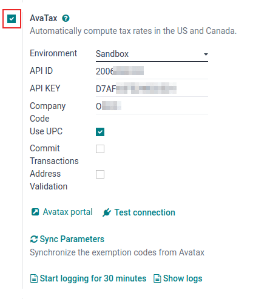
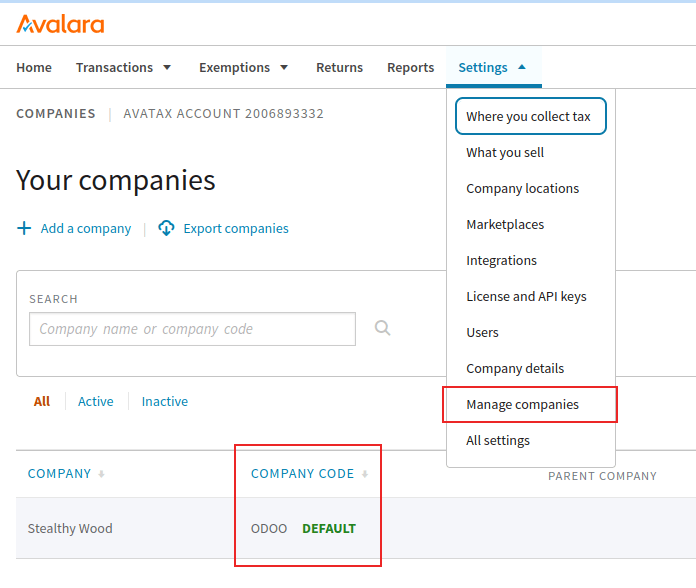
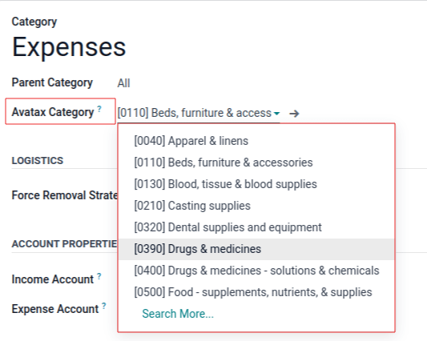
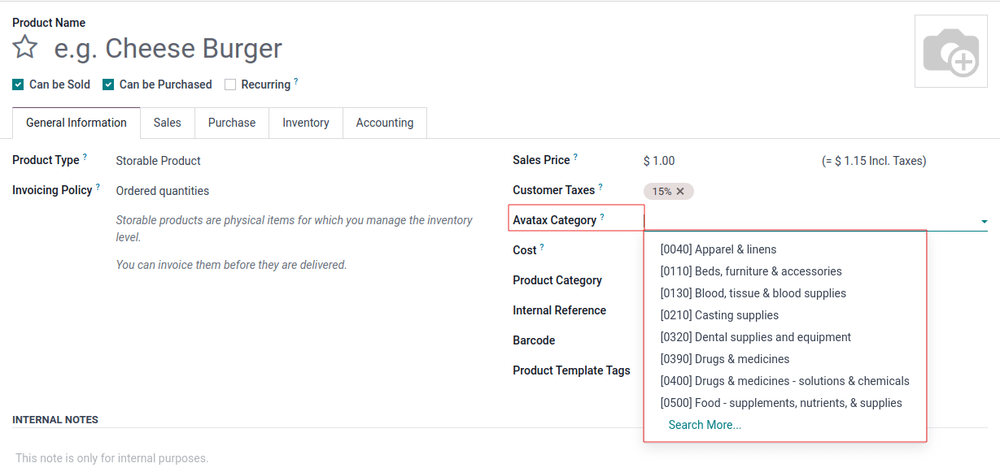

:show-content:

==================
AvaTax integration
==================

Avalara's *AvaTax* is a cloud-based tax software. Integrating *AvaTax* with Odoo provides real-time
and region-specific tax calculations when users sell, purchase, and invoice items in Odoo. *AvaTax*
tax calculation is supported with every United Nations charted country, including inter-border
transactions.

.. important::
   *AvaTax* is only available for integration with databases/companies that have locations in the
   United States, Canada, and Brazil. This means the fiscal position/country of a database can only
   be set to the United States, Canada, or Brazil. For more information, reference this
   documentation: :ref:`avatax/fiscal_country`.

*AvaTax* accounts for location-based tax rates for each state, county, and city. It improves
remittance accuracy by paying close attention to laws, rules, jurisdiction boundaries, and special
circumstances (like, tax holidays, and product exemptions). Companies who integrate with *AvaTax*
can maintain control of tax-calculations in-house with this simple :abbr:`API (application
programming interface)` integration.

.. important::
   Some limitations exist in Odoo while using *AvaTax* for tax calculation:

   - *AvaTax* is **not** supported in Odoo's *Point of Sale* app, because a dynamic tax calculation
     model is excessive for transactions within a single delivery address, such as stores or
     restaurants.
   - *AvaTax* and Odoo use the company address and **not** the warehouse address.
   - Exercise tax is **not** supported. This includes tobacco/vape taxes, fuel taxes, and other
     specific industries.

.. seealso::
   Avalara's support documents: `About AvaTax
   <https://community.avalara.com/support/s/document-item?language=en_US&bundleId=dqa1657870670369_dqa1657870670369&topicId=About_AvaTax.html&_LANG=enus>`_

Set up on AvaTax
================

To use *AvaTax*, an account with Avalara is required for the setup. If one has not been set up yet,
connect with Avalara to purchase a license: `Avalara: Let's Talk
<https://www.avalara.com/us/en/get-started.html>`_.

.. tip::
   Upon account setup, take note of the *AvaTax* :guilabel:`Account ID`. This will be needed in the
   :ref:`Odoo setup <avatax/credentials>`. In Odoo, this number is the :guilabel:`API ID`.

Then, `create a basic company profile
<https://community.avalara.com/support/s/document-item?bundleId=dqa1657870670369_dqa1657870670369&topicId=Create_a_Basic_company_profile.html&_LANG=enus>`_.

Create basic company profile
----------------------------

Collect essential business details for the next step: locations where tax is collected,
products/services sold (and their sales locations), and customer tax exemptions, if applicable.
Follow the Avalara documentation for creating a basic company profile:

#. `Add company information
   <https://community.avalara.com/support/s/document-item?bundleId=dqa1657870670369_dqa1657870670369&topicId=Add_your_company_information.html&_LANG=enus>`_.
#. `Tell us where the company collects and pays tax
   <https://community.avalara.com/support/s/document-item?bundleId=dqa1657870670369_dqa1657870670369&topicId=Tell_us_where_you_collect_and_pay_tax.html&_LANG=enus>`_.
#. `Verify jurisdictions and activate the company
   <https://community.avalara.com/support/s/document-item?bundleId=dqa1657870670369_dqa1657870670369&topicId=Verify_your_jurisdictions_and_activate_your_company.html&_LANG=enus>`_.
#. `Add other company locations for location-based filing
   <https://community.avalara.com/support/s/document-item?bundleId=dqa1657870670369_dqa1657870670369&topicId=Add_other_company_locations_for_location-based_filing.html&_LANG=enus>`_.
#. `Add a marketplace to the company profile
   <https://community.avalara.com/support/s/document-item?bundleId=dqa1657870670369_dqa1657870670369&topicId=Add_marketplace_transactions_to_your_company_profile.html&_LANG=enus>`_.

.. _avatax/create_avalara_credentials:

Connect to AvaTax
-----------------

After creating the basic company profile in Avalara, connect to *AvaTax*. This step links Odoo and
*AvaTax* bidirectionally.

Navigate to either Avalara's `sandbox <https://sandbox.admin.avalara.com/>`_ or `production
<https://admin.avalara.com/>`_ environment. This will depend on which type of Avalara account the
company would like to integrate.

.. seealso::
   `Sandbox vs production environments in Avalara
   <https://knowledge.avalara.com/bundle/fzc1692293626742/page/sandbox-vs-production.html>`_.

Log in to create the :guilabel:`License Key`. Go to :menuselection:`Settings --> License and API
Keys`. Click :guilabel:`Generate License Key`.

.. note::
   A warning appears stating: `If your business app is connected to Avalara solutions, the
   connection will be broken until you update the app with the new license key. This action cannot
   be undone.`

   Generating a new license key breaks the connection with existing business apps using the *AvaTax*
   integration. Make sure to update these apps with the new license key.

If this will be the first :abbr:`API (application programming interface)` integration being made
with *AvaTax* and Odoo, then click :guilabel:`Generate license key`.

If this is an additional license key, ensure the previous connection can be broken. There is
**only** one license key associated with each of the Avalara sandbox and production accounts.

.. important::
   Copy this key to a safe place. It is **strongly encouraged** to backup the license key for future
   reference. This key cannot be retrieved after leaving this screen.

Odoo configuration
==================

Before using *AvaTax*, there are some additional configurations in Odoo to ensure tax calculations
are made accurately.

Verify that the Odoo database contains necessary data. The country initially set up in the database
determines the fiscal position, and aids *AvaTax* in calculating accurate tax rates.

.. _avatax/fiscal_country:

Fiscal country
--------------

To set the :guilabel:`Fiscal Country`, navigate to :menuselection:`Accounting app --> Configuration
--> Settings`.

.. seealso::
   :doc:`../../fiscal_localizations`

Under the :guilabel:`Taxes` section, set the :guilabel:`Fiscal Country` feature to :guilabel:`United
States`, :guilabel:`Canada`, or :guilabel:`Brazil`. Then, click :guilabel:`Save`.

Company settings
----------------

All companies operating under the Odoo database should have a full and complete address listed in
the settings. Navigate to the :menuselection:`Settings app`, and under the :guilabel:`Companies`
section, ensure there is only one company operating the Odoo database. Click :guilabel:`Update Info`
to open a separate page to update company details.

If there are multiple companies operating in the database, click :guilabel:`Manage Companies` to
load a list of companies to select from. Update company information by clicking into the specific
company.

Database administrators should ensure that the :guilabel:`Street...`, :guilabel:`Street2...`,
:guilabel:`City`, :guilabel:`State`, :guilabel:`ZIP`, and :guilabel:`Country` are all updated for
the companies.

This ensures accurate tax calculations and smooth end-of-year accounting operations.

.. seealso::
   - :doc:`../../../general/companies`
   - :doc:`../get_started`

Module installation
-------------------

Next, ensure that the Odoo *AvaTax* module is installed. To do so, navigate to the
:menuselection:`Apps application`. In the :guilabel:`Search...` bar, type in `avatax`, and press
:kbd:`Enter`. The following results populate:

.. list-table::
   :header-rows: 1
   :widths: 25 25 50

   * - Name
     - Technical name
     - Description
   * - :guilabel:`Avatax`
     - `account_avatax`
     - Default *AvaTax* module. This module adds the base *AvaTax* features for tax calculation.
   * - :guilabel:`Avatax for geo localization`
     - `account_avatax_geolocalize`
     - This module includes the features required for integration of *AvaTax* into geo-localization
       in Odoo.
   * - :guilabel:`Avatax for SO`
     - `account_avatax_sale`
     - Includes the information needed for tax calculation on sales orders in Odoo.
   * - :guilabel:`Avatax for Inventory`
     - `account_avatax_stock`
     - Includes tax calculation in Odoo Inventory.
   * - :guilabel:`Amazon/Avatax Bridge`
     - `sale_amazon_avatax`
     - Includes tax calculation features between the *Amazon Connector* and Odoo.
   * - :guilabel:`Avatax Brazil`
     - `l10n_br_avatax`
     - Includes information for tax calculation in the Brazil localization.
   * - :guilabel:`Avatax Brazil for Services`
     - `l10n_br_avatax_services`
     - This module includes the required features for tax calculation for services in the Brazil
       localization.
   * - :guilabel:`Avatax Brazil Sale for Services`
     - `l10n_br_edi_sale_services`
     - This module includes the required features for tax calculation for the sale of services in
       the Brazil localization. This includes electronic data interchange (EDI).
   * - :guilabel:`Test SOs for the Brazilian AvaTax`
     - `l10n_br_test_avatax_sale`
     - This module includes the required features for test sales orders in the Brazil localization.

Click the :guilabel:`Install` button on the module labeled, :guilabel:`Avatax`: `account_avatax`.
Doing so installs the following modules:

- :guilabel:`Avatax`: `account_avatax`
- :guilabel:`Avatax for SO`: `account_avatax_sale`
- :guilabel:`Avatax for Inventory`: `account_avatax_stock`

Should *AvaTax* be needed for geo-localization, or with the *Amazon Connector*, then install those
modules individually by clicking on :guilabel:`Install` on :guilabel:`Avatax for geo localization`
and :guilabel:`Amazon/Avatax Bridge`, respectively.

.. seealso::
   For localization specific *AvaTax* instructions, view the following :doc:`fiscal localization
   <../../fiscal_localizations>` documentation:

   - :doc:`../../fiscal_localizations/brazil`

.. _avatax/credentials:

Odoo AvaTax settings
--------------------

To integrate the *AvaTax* :abbr:`API (application programming interface)` with Odoo, go to
:menuselection:`Accounting app --> Configuration --> Settings` section. The :guilabel:`AvaTax`
fields in the :guilabel:`Taxes` section is where the *AvaTax* configurations are made, and the
credentials are entered in.

First, tick the checkbox to the left of the :guilabel:`AvaTax` settings, to activate *AvaTax* on the
database. This is a quick, convenient way to activate and deactivate *AvaTax* tax calculation on the
Odoo database.

Prerequisites
~~~~~~~~~~~~~

First, select the :guilabel:`Environment` in which the company wishes to use *AvaTax* in. It can
either be :guilabel:`Sandbox` or :guilabel:`Production`.

.. seealso::
   For help determining which *AvaTax* environment to use (either :guilabel:`Production` or
   :guilabel:`Sandbox`), visit: `Sandbox vs Production environments
   <https://knowledge.avalara.com/bundle/fzc1692293626742/page/sandbox-vs-production.html>`_.

Credentials
~~~~~~~~~~~

Now, the credentials can be entered in. The *AvaTax* :guilabel:`Account ID` should be entered in the
:guilabel:`API ID` field, and the :guilabel:`License Key` should be entered in the :guilabel:`API
Key` field.

.. important::
   The :guilabel:`Account ID` can be found by logging into the *AvaTax* portal (`sandbox
   <https://sandbox.admin.avalara.com/>`_ or `production <https://admin.avalara.com/>`_). In the
   upper-right corner, click on the initials of the user and :guilabel:`Account`. The
   :guilabel:`Account ID` is listed first.

   To access the :guilabel:`License Key` see this documentation:
   :ref:`avatax/create_avalara_credentials`.

For the :guilabel:`Company Code` field, enter the Avalara company code for the company being
configured. Avalara interprets this as `DEFAULT`, if it is not set. The :guilabel:`Company Code` can
be accessed in the Avalara management portal.

First, log into the *AvaTax* portal (`sandbox <https://sandbox.admin.avalara.com/>`_ or `production
<https://admin.avalara.com/>`_). Then, navigate to :menuselection:`Settings --> Manage Companies`.
The :guilabel:`Company Code` value is located in the row of the :guilabel:`Company` in the
:guilabel:`Company Code` column.

Transaction options
~~~~~~~~~~~~~~~~~~~

There are two transactional settings in the Odoo *AvaTax* settings that can be configured:
:guilabel:`Use UPC` and :guilabel:`Commit Transactions`.

If the checkbox next to :guilabel:`Use UPC` is ticked, the transactions will use Universal Product
Codes (UPC), instead of custom defined codes in Avalara. Consult a certified public accountant (CPA)
for specific guidance.

Should the :guilabel:`Commit Transactions` checkbox be ticked, then, the transactions in the Odoo
database will be committed for reporting in *AvaTax*.

Address validation
~~~~~~~~~~~~~~~~~~

The *Address Validation* feature ensures that the most up-to-date address by postal standards is set
on a contact in Odoo. This is important to provide accurate tax calculations for customers.

.. important::
   The :guilabel:`Address Validation` feature only works with partners/customers in North America.

Additionally, tick the checkbox next to the :guilabel:`Address validation` field.

.. important::
   For accurate tax calculations, it is best practice to enter a complete address for the contacts
   saved in the database. However, *AvaTax* can still function by implementing a best effort attempt
   using only the :guilabel:`Country`, :guilabel:`State`, and :guilabel:`Zip code`. These are the
   three minimum required fields.

:guilabel:`Save` the settings to implement the configuration.

.. tip::
   Manually :guilabel:`Validate` the address by navigating to the :menuselection:`Contacts app`, and
   selecting a contact. Now that the *AvaTax* module has been configured on the database, a
   :guilabel:`Validate` button appears directly below the :guilabel:`Address`.

   Click :guilabel:`Validate`, and a pop-up window appears with a :guilabel:`Validated Address` and
   :guilabel:`Original Address` listed. If the :guilabel:`Validated Address` is the correct mailing
   address for tax purposes, click :guilabel:`Save Validated`.

   .. image:: avatax/validate-address.png
      :align: center
      :alt: Validate address pop-up window in Odoo with "Save Validated" button and "Validated
            Address" highlighted.

.. warning::
   All previously-entered addresses for contacts in the Odoo database will need to be validated
   using the manually validate process outlined above. Addresses are not automatically validated if
   they were entered previously. This only occurs upon tax calculation.

Test connection
~~~~~~~~~~~~~~~

After entering all the above information into the *AvaTax* setup on Odoo, click :guilabel:`Test
connection`. This ensures the :guilabel:`API ID` and :guilabel:`API KEY` are correct, and a
connection is made between Odoo and the *AvaTax* application programming interface (API).

Sync parameters
~~~~~~~~~~~~~~~

Upon finishing the configuration and settings of the *AvaTax* section, click the :guilabel:`Sync
Parameters` button. This action synchronizes the exemption codes from *AvaTax*.

.. _avatax/fiscal_positions:

Fiscal position
---------------

Next, navigate to :menuselection:`Accounting app --> Configuration --> Accounting: Fiscal
Positions`. A :guilabel:`Fiscal Position` is listed named, :guilabel:`Automatic Tax Mapping
(AvaTax)`. Click it to open *AvaTax's* fiscal position configuration page.

Here, ensure that the :guilabel:`Use AvaTax API` checkbox is ticked.

Optionally, tick the checkbox next to the field labeled: :guilabel:`Detect Automatically`. Should
this option be ticked, then, Odoo will automatically apply this :guilabel:`Fiscal Position` for
transactions in Odoo.

Enabling :guilabel:`Detect Automatically` also makes specific parameters, such as :guilabel:`VAT
required`, :guilabel:`Foreign Tax ID`, :guilabel:`Country Group`, :guilabel:`Country`,
:guilabel:`Federal States`, or :guilabel:`Zip Range` appear. Filling these parameters filters the
:guilabel:`Fiscal Position` usage. Leaving them blank ensures all calculations are made using this
:guilabel:`Fiscal Position`.

.. warning::
   Should the :guilabel:`Detect Automatically` checkbox not be ticked, each customer will need to
   have the :guilabel:`Fiscal Position` set on their :guilabel:`Sales and Purchase` tab of the
   contact record. To do so, navigate to :menuselection:`Sales app --> Order --> Customers`, or
   :menuselection:`Contacts app --> Contacts`. Then, select a customer or contact to set the fiscal
   position on.

   Navigate to the :guilabel:`Sales and Purchase` tab, and down to the section labeled,
   :guilabel:`Fiscal Position`. Set the :guilabel:`Fiscal Position` field to the fiscal position
   for the customer.

.. seealso::
   :doc:`fiscal_positions`

AvaTax accounts
~~~~~~~~~~~~~~~

Upon selecting the checkbox option for :guilabel:`Use AvaTax API` a new :guilabel:`AvaTax` tab
appears. Click into this tab to reveal two different settings.

The first setting is the :guilabel:`AvaTax Invoice Account`, while the second is, :guilabel:`AvaTax
Refund Account`. Ensure both accounts are set for smooth end-of-year record keeping. Consult a
certified public accountant (CPA) for specific guidance on setting both accounts.

Click :guilabel:`Save` to implement the changes.

Tax mapping
-----------

The *AvaTax* integration is available on sale orders and invoices with the included *AvaTax* fiscal
position.

.. tip::
   Additionally, there is a :guilabel:`Tax Mapping` tab and :guilabel:`Account Mapping` tab in the
   :guilabel:`Automatic Tax Mapping (AvaTax)` fiscal position, where mapping for products can also
   be configured. To access :guilabel:`Fiscal Positions` navigate to :menuselection:`Accounting app
   --> Configuration --> Accounting: Fiscal Positions`.

Product category mapping
~~~~~~~~~~~~~~~~~~~~~~~~

Before using the integration, specify an :guilabel:`Avatax Category` on the product categories.
Navigate to :menuselection:`Inventory app --> Configuration --> Product Categories`. Select the
product category to add the :guilabel:`AvaTax Category` to. In the :guilabel:`AvaTax Category`
field, select a category from the drop-down menu, or :guilabel:`Search More...` to open the complete
list of options.

Product mapping
~~~~~~~~~~~~~~~

*AvaTax* Categories may be set on individual products, as well. To set the :guilabel:`Avatax
Category` navigate to :menuselection:`Inventory app --> Products --> Products`. Select the product
to add the :guilabel:`Avatax Category` to. Under the :guilabel:`General Information` tab, on the
far-right, is a selector field labeled: :guilabel:`Avatax Category`. Finally, click the drop-down
menu, and select a category, or :guilabel:`Search More...` to find one that is not listed.

.. note::
   If both the product, and its category, have an :guilabel:`AvaTax Category` set, the product's
   :guilabel:`AvaTax Category` takes precedence.

.. important::
   Mapping an :guilabel:`AvaTax Category` on either the *Product* or *Product Category* should be
   completed for every *Product* or *Product Category*, depending the route that is chosen.

.. seealso::
   - :doc:`fiscal_positions`
   - :doc:`avatax/avatax_use`
   - :doc:`avatax/avalara_portal`
   - `US Tax Compliance: Avatax elearning video
     <https://www.odoo.com/slides/slide/us-tax-compliance-avatax-2858?fullscreen=1>`_

.. toctree::
   :titlesonly:

   avatax/avatax_use
   avatax/avalara_portal
