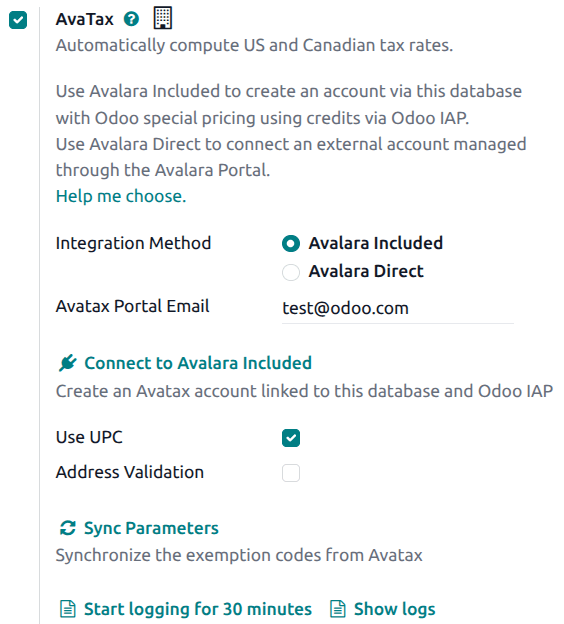

================
Avalara Included
================

*Avalara Included* is an affordable in-app tax calculation service designed for small and
medium-sized businesses with essential tax compliance needs. Built on *Avalara's AvaTax* platform,
*Avalara Included* integrates with Odoo to provide real-time, region-specific tax calculations for
sales, purchases, and invoices.

Available for databases/companies with locations in the United States, Canada, and Brazil, *Avalara
Included* automatically calculates precise tax rates at the state, county, and city levels. The
service continuously accounts for changing tax laws, jurisdiction boundaries, and special
circumstances such as tax holidays and product exemptions to help improve remittance accuracy and
simplify tax compliance processes.

.. important::
   Some limitations exist in Odoo while using AvaTax for tax calculation:

    - AvaTax uses the company address by default. To use the address of the specific warehouse that
      is listed in the :guilabel:`Warehouse` field on a sales order, enable :ref:`Allow Ship Later
      <pos/shop/ship>` in the **POS** app settings.
    - Excise tax is **not** supported. This includes tobacco/vape taxes, fuel taxes, and other
      specific industries.

.. seealso::
   Avalara's support documents: `About AvaTax
   <https://community.avalara.com/support/s/document-item?language=en_US>`_

Available integrations
======================

For users in the United States and Canada, there are two options for AvaTax integration:

- *Avalara Included*: An affordable In-App purchase service designed for SMBs with essential tax
  calculation needs.

- *Avalara Direct*: A robust solution for high-volume or complex businesses, offering advanced
  features like tax filing and exemption management.

+--------------------------+---------------------+-------------------------+
|                          | Avalara Included    |  Avalara Direct         |
+==========================+=====================+=========================+
| Best fit                 | SMBs / Lower Volume | Mid-Market / Enterprise |
+--------------------------+---------------------+-------------------------+
| AvaTax Engine            |          ✅         |            ✅           |
+--------------------------+---------------------+-------------------------+
| Cost per Transaction     |   $ Credit-based    |   $$ Contract-based     |
+--------------------------+---------------------+-------------------------+
| Account Managed by       |      Odoo IAP       |     Avalara Direct      |
+--------------------------+---------------------+-------------------------+
| Odoo Technical Support   |          ✅         |            ✅           |
+--------------------------+---------------------+-------------------------+
| Annual Transaction Limit |        5,000        |    Unlimited Custom     |
+--------------------------+---------------------+-------------------------+
| 1st tier Support by      |         Odoo        |         Avalara         |
+--------------------------+---------------------+-------------------------+
| Avalara Direct Support   |       Limited       |            ✅           |
+--------------------------+---------------------+-------------------------+
| Return Prep & Filing     |    ⚠️ Add-on only   |      ⚠️ Add-on only     |
+--------------------------+---------------------+-------------------------+
| Tax Remittance           |    ⚠️ Add-on only   |      ⚠️ Add-on only     |
+--------------------------+---------------------+-------------------------+

.. important::
   Businesses that exceed 5,000 transactions annually must transition to an *Avalara Direct* plan to
   ensure uninterrupted service at higher transaction volumes.

.. _accounting/avalara_included/iap-credits:

In-App purchase credits
-----------------------

Avalara Included requires users to purchase credits on the `Odoo IAP page
<https://iap.odoo.com/iap/in-app-services/865>`_.

How do credits work?
~~~~~~~~~~~~~~~~~~~~

One credit is consumed every time an invoice or credit note is posted with an *Avatax* fiscal
position. Select the package that best fits the demand, based on the estimated transactions.

Configuration
=============

*Avalara Included* is available both for Odoo users who do not yet have an Avalara account and need
to :ref:`create <accounting/avalara_included/create>` one and for Odoo users with an existing
Avalara account that they would like to :ref:`migrate <accounting/avalara_included/migrate>` to the
*Avalara Included* plan.

.. _accounting/avalara_included/create:

Create an Avalara Included account
----------------------------------

.. important::
   The Avalara account activation **must** be done on the production database. If the account is
   created from a sandbox database that does not have an associated valid enterprise account, the
   following error message may appear:

   `Odoo was unable to register with the AvaTax proxy for My US Company INVALID_DBUUID - No valid
   enterprise contract!`

To activate and use the *Avalara Included* feature, first navigate to :menuselection:`Accounting -->
Configuration --> Settings`. Then, in the :guilabel:`Taxes` section, enable the :guilabel:`AvaTax`
checkbox.

Next, select :guilabel:`Avalara Included` as the account type and enter a valid email address. This
email address is used to link the company's information to the *Avalara Included* account.

After the information has been entered, click :icon:`fa-plug` :guilabel:`Connect to Avalara
Included` to establish the connection between the Odoo database and the new Avalara account.

.. important::
   As part of the account creation, `Avalara's terms and conditions <https://legal.avalara.com/>`_
   must be accepted.

After accepting the terms and conditions, the Avalara account is created and an email is
automatically sent to the associated email address. Follow the instructions in the email to activate
the account by creating a password and registering in the Avalara Portal.

To complete the Avalara account setup, create a :ref:`company profile
<accounting/avatax/create-basic-company-profile>`.

.. _accounting/avalara_included/migrate:

Migrate to Avalara Included
---------------------------

Companies currently using *Avalara Direct* in production that have fewer than 5,000 annual
transactions, including invoices and credit notes, are eligible to migrate their account plan to
*Avalara Included*.

.. important::
   Migrating from *Avalara Direct* to *Avalara Included* changes the Avalara account from a monthly
   contract model to an in-app purchase model, where transaction credits can be purchased based on
   volume. First-level support is also transferred to Odoo.

To begin, navigate to :menuselection:`Accounting --> Configuration --> Settings`. In the
:guilabel:`Taxes` section, under :guilabel:`Avatax` verify that the :guilabel:`Integration Method`
is set to :guilabel:`Avalara Direct`. In the :guilabel:`Environment` field, select
:guilabel:`Production`. Confirm that the :guilabel:`API ID` and :guilabel:`API KEY` are correctly
configured. Click :icon:`fa-plug` :guilabel:`Migrate to Avalara Included`.

After the button is clicked, a confirmation message appears outlining the changes to Avalara
services and pricing before proceeding with the migration. Review the differences between each
integration carefully before confirming the migration.

Once the migration is complete, a confirmation message appears indicating that the account was
successfully migrated to *Avalara Included*.

Because the migration process uses the same email address associated with the *Avalara Direct*
account, access to the *Avalara* portal remains available with the existing email address. No
additional email configuration is required in Odoo.

.. important::
   It is at this point that :ref:`IAP credits <accounting/avalara_included/iap-credits>` must be
   purchased to continue using the *AvaTax* engine.
