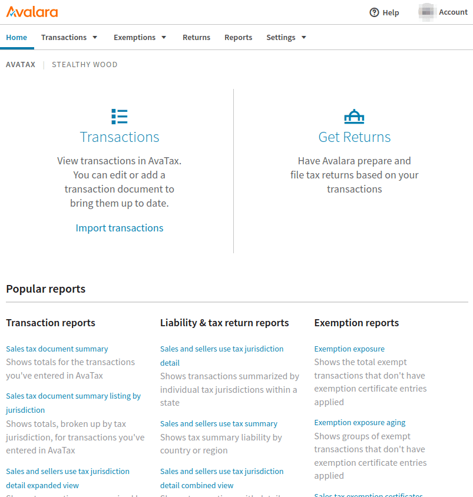
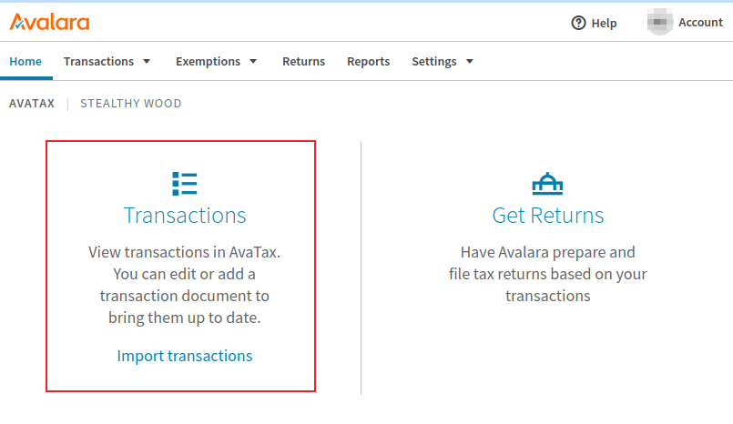
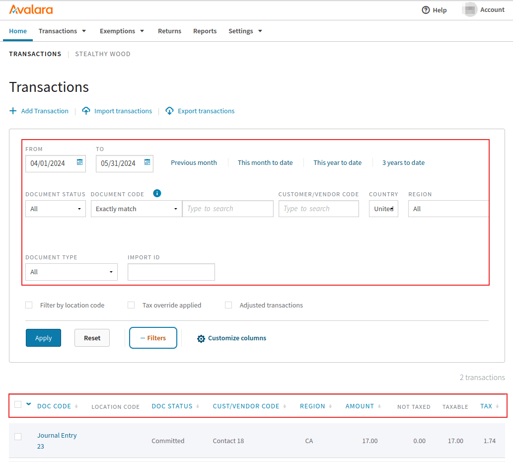
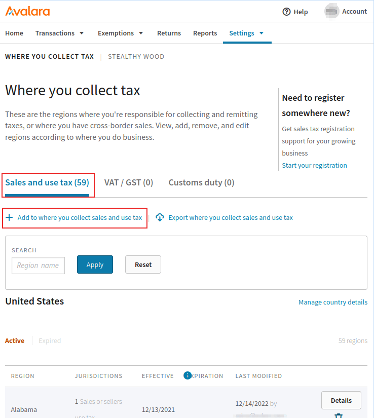
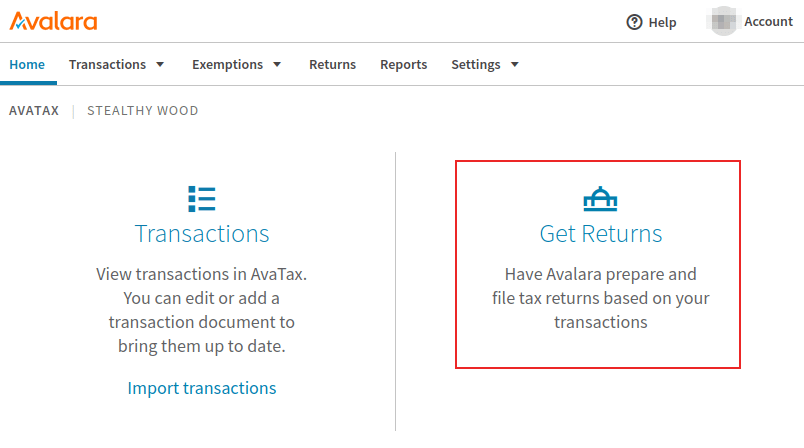

.. _avatax/portal:

=======================
Avalara (Avatax) portal
=======================

Avalara's (*AvaTax*) management console offers account management options including: viewing/editing
the transactions sent from Odoo to *AvaTax*, details on how the taxes are calculated, tax reporting,
tax exemption management, and tax return resources.

.. tip::
   Avalara is the software developer of the tax software, *AvaTax*.

To access the console, first, navigate to either Avalara's `sandbox
<https://sandbox.admin.avalara.com/>`_ or `production <https://admin.avalara.com/>`_ environment.
This will depend on which type of account was set in the :doc:`integration <../avatax>`. Log in to
the management console.

.. seealso::
   For more information see Avalara's documentation: `Activate your Communications Customer Portal
   account
   <https://community.avalara.com/support/s/document-item?language=en_US&bundleId=qvv1656594440497&topicId=Activate_your_Communications_Customer_Portal_account.html&_LANG=enus>`_.

.. _avalara/portal-transactions:

Transactions
============

To access transactions, click in the :guilabel:`Transactions` link on the main dashboard upon
logging into the :ref:`avatax/portal`. To manually access the *Transactions* page, while logged into
the Avalara console, navigate to :menuselection:`Transactions --> Transactions`.

Edit transaction
----------------

Click into a transaction to reveal more details about the transaction. These details include
sections on :guilabel:`Invoice detail`, :guilabel:`Additional info`, and :guilabel:`Customer info`.
Click :icon:`fa-pencil` :guilabel:`Edit document details` to make changes to the transaction.

A :guilabel:`Discount` can be added to adjust the invoice. This is especially useful in cases where
the transaction has already synced with Avalara / *AvaTax*, and changes need to be made afterward.

.. _avalara/portal-filter:

Filter
------

Filter transactions on the :guilabel:`Transactions` page, by setting the :guilabel:`From` and
:guilabel:`To` fields, and configuring other fields to filter by, including:

- :guilabel:`Document Status`: any of the following options, :guilabel:`All`, :guilabel:`Voided`,
  :guilabel:`Committed`, :guilabel:`Uncommitted`, or :guilabel:`Locked`.
- :guilabel:`Document Code`: any of the following options, :guilabel:`Exactly match`,
  :guilabel:`Starts with`, or :guilabel:`Contains`.
- :guilabel:`Customer/Vendor Code`: the customer/vendor code in Odoo (e.g. `Contact18`).
- :guilabel:`Country`: the country this tax was calculated in; this is a text field.
- :guilabel:`Region`: the region of the country, which varies based on the :guilabel:`Country`
  selection.

Click :icon:`fa-plus` :guilabel:`Filters` to access the following filter conditions:

- :guilabel:`Document Type`: any of the following selections, :guilabel:`All`, :guilabel:`Sales
  Invoice`, :guilabel:`Purchase Invoice`, :guilabel:`Return Invoice`, :guilabel:`Inventory Transfer
  Inbound Invoice`, :guilabel:`Inventory Transfer Outbound Invoice`, or :guilabel:`Customs
  Invoice`.
- :guilabel:`Import ID`: represents the import ID of the document.

Sort by
-------

On the :guilabel:`Transactions` page, transactions will be listed below, according to the set
:ref:`avalara/portal-filter`, located in the top half of the page. The following columns are
available by default, to sort by ascending or descending order:

- :guilabel:`Doc Code`: either of the following options, :guilabel:`Exactly match`,
  :guilabel:`Starts with`, or :guilabel:`Contains`.
- :guilabel:`Doc Status`: either of the following options, :guilabel:`All`, :guilabel:`Voided`,
  :guilabel:`Committed`, :guilabel:`Uncommitted`, or :guilabel:`Locked`.
- :guilabel:`Cust/Vendor Code` : this is the customer/vendor code in Odoo (e.g. Contact18).
- :guilabel:`Region`: this is the region of the country, this will vary based on the
  :guilabel:`Country` selection.
- :guilabel:`Amount`: the numeric amount of the total amount on the Odoo document.
- :guilabel:`Tax`: the numeric amount of the tax applied to the total.

Customize columns
~~~~~~~~~~~~~~~~~

Additional columns can be added by clicking the :icon:`fa-cog` :guilabel:`Customize columns`. On the
resulting popover window, click the drop-down menu for the :guilabel:`column` that should be
changed.

The following columns can be added for additional transactional information:

- :guilabel:`AvaTax calculated`: the amount of tax calculated by *AvaTax*.
- :guilabel:`Country`: the country this tax was calculated in; this is a text field.
- :guilabel:`Cust/vendor code`: the customer/vendor code in Odoo (e.g. `Contact18`).
- :guilabel:`Currency`: the standardized abbreviation for the currency the amount total is in.
- :guilabel:`Doc date`: the document's date of creation.
- :guilabel:`Doc status`: any of the following options, :guilabel:`All`, :guilabel:`Voided`,
  :guilabel:`Committed`, :guilabel:`Uncommitted`, or :guilabel:`Locked`.
- :guilabel:`Doc type`: any of the following selections, :guilabel:`All`, :guilabel:`Sales
  Invoice`, :guilabel:`Purchase Invoice`, :guilabel:`Return Invoice`, :guilabel:`Inventory Transfer
  Inbound Invoice`, :guilabel:`Inventory Transfer Outbound Invoice`, or :guilabel:`Customs
  Invoice`.
- :guilabel:`Import ID`: represents the import ID of the document.
- :guilabel:`Last modified`: timestamp of the last time the document was modified.
- :guilabel:`Location code`: the location code used to calculate the tax, based on the delivery
  address.
- :guilabel:`PO number`: the purchase order number.
- :guilabel:`Reference code`: the Odoo reference code (e.g. NV/2024/00003)
- :guilabel:`Region`: the region of the country,which varies based on the :guilabel:`Country`
  selection.
- :guilabel:`Salesperson code`: the numeric ID of the user assigned to the sales order in Odoo.
- :guilabel:`Tax date`: the month/day/year of the tax calculation.
- :guilabel:`Tax override type`: where an exemption would appear, should there be none, the field
  populates with :guilabel:`None`.

To add a new column click the :icon:`fa-plus` :guilabel:`Column`.

.. seealso::
   For more information on *AvaTax* transactions, refer to this Avalara documentation: `Transactions
   <https://community.avalara.com/support/s/document-item?language=en_US&bundleId=qvv1656594440497&topicId=transactions.html&_LANG=enus>`_.

Import-export
-------------

While on the :ref:`avalara/portal-transactions`, click :icon:`fa-download` :guilabel:`Import
transactions` or :icon:`fa-upload` :guilabel:`Export transactions` to import or export transactions.

Reports
-------

To access reporting, navigate to the :menuselection:`Reports` link in the top menu of the Avalara
management console. Next, select from one of the available reporting tabs: :guilabel:`Transactions
reports`, :guilabel:`Liability & tax return reports`, or :guilabel:`Exemption reports`.

.. tip::
   Additionally, there is a :guilabel:`Favorites` tab and :guilabel:`Downloads` tab. The
   :guilabel:`Favorites` tab contains any favorited report configurations for the Avalara user. The
   :guilabel:`Downloads` tab contains a list view where the user can download the high-volume
   transaction reports created in the last 30 days.

Make a selection for the :guilabel:`Report Category`, and the :guilabel:`Report Name`, under the
:guilabel:`Select a report` section.

Next, fill out the :guilabel:`Select report details` section. These options will vary based on the
tab selected above.

Depending on the report size, the following two options are available in the section labeled,
:guilabel:`Select the approximate number of transactions for your report`: :guilabel:`Create and
download the report instantly` (for small reports) and :guilabel:`Create and download the report in
the background` (for larger reports). Select one or the other depending on the volume of
transactions in this report.

Finally, under the section labeled, :guilabel:`Report preview and export` make a selection of the
file type to download. Either a :guilabel:`.PDF` or :guilabel:`.XLS` can be chosen. Alternatively,
the file can be previewed by selecting the :guilabel:`Preview` option.

After making all the configurations, click :guilabel:`Create report` to download the report. Click
:icon:`fa-star-o` :guilabel:`Make this report a favorite` to save the report configuration to the
user's favorites.

After the report is created, click :icon:`fa-download` :guilabel:`Download` to download the file to
the device.

.. tip::
   Select a pre-configured report from the :guilabel:`Frequently used reports` section of the
   reporting dashboard.

   Access this list by clicking on the :guilabel:`Reports` option in the top menu of the Avalara
   management console, and scroll to the bottom of the page.

.. seealso::
   `See Avalara's documentation: Reports in AvaTax
   <https://community.avalara.com/support/s/document-item?language=en_US&bundleId=rjq1671176624730&topicId=Reports_in_AvaTax.html&_LANG=enus>`_.

Add more jurisdictions
======================

Additional jurisdictions (tax locations) can be added in the Avalara management console. Navigate to
either Avalara's `sandbox <https://sandbox.admin.avalara.com/>`_ or `production
<https://admin.avalara.com/>`_ environment. This will depend on which type of account was set in the
:doc:`integration <../avatax>`.

Next, navigate to :menuselection:`Settings --> Where you collect tax`. Choose between the three
different tabs, depending on the business need. The first tab is :guilabel:`Sales and use tax`,
where tax can be collected for the United States. Click the :icon:`fa-plus` :guilabel:`Add to where
you collect sales and use tax` to add another location where the company collects sales and use tax.

The second option, is the :guilabel:`VAT/GST` tab where the :icon:`fa-plus` :guilabel:`Add a country
or territory where you collect VAT/GST` can be selected to add another country or territory where
the company collects VAT/GST.

Finally, on the far-right, is the :guilabel:`Customs duty` tab, where a country can be added where
the company collects customs duty. Simply click on the :icon:`fa-plus` :guilabel:`Add a country
where you calculate customs duty` icon below the tab.

         sales and use tax tab highlighted.

.. seealso::
   `See Avalara's documentation: Add local jurisdiction taxes
   <https://community.avalara.com/support/s/document-item?language=en_US&bundleId=bla1700809896571_bla1700809896571&topicId=nbw1698727575499.html&_LANG=enus>`_.

Tax exemption certificate
=========================

Tax exemption certificates for customers can be added into the Avalara management console, so that
*AvaTax* is aware of which customers may be exempt from paying certain taxes. To add an *exception
certificate* navigate to :menuselection:`Exemptions --> Customer certificates`. From there, click on
the :icon:`fa-plus` :guilabel:`Add a certificate` to configure an exemption.

.. warning::
   An Avalara subscription to Exemption Certificate Management (ECM) is required in order to attach
   certificate images, and to be ready for an audit. For more on subscribing to this add-on, visit
   `Avalara
   <https://community.avalara.com/support/s/document-item?language=en_US&bundleId=hff1682048150115_hff1682048150115&topicId=fol1682356576230.html&_LANG=enus>`_.

End-of-year operations
======================

Avalara's services include tax return services, for when it is time to file taxes at the end of the
year. To access Avalara's tax services log, into the `management portal
<https://admin.avalara.com/>`_. Then, from the main dashboard, click :guilabel:`Returns`. Avalara
will prompt the Avalara user to log in for security purposes, and redirect the user to the *Returns*
portal.

Click :guilabel:`Get started` to begin the tax return process. For more information, refer to this
Avalara documentation: `About Managed Returns
<https://community.avalara.com/support/s/document-item?language=en_US&bundleId=hps1656397152776_hps1656397152776&topicId=Learn_about_Managed_Returns.html&_LANG=enus>`_.

.. tip::
   Alternatively, click on the :menuselection:`Returns` button in the top menu of the Avalara
   management console.

.. seealso::
   - :doc:`../avatax`
   - :doc:`avatax_use`
   - `US Tax Compliance: Avatax elearning video
     <https://www.odoo.com/slides/slide/us-tax-compliance-avatax-2858?fullscreen=1>`_
