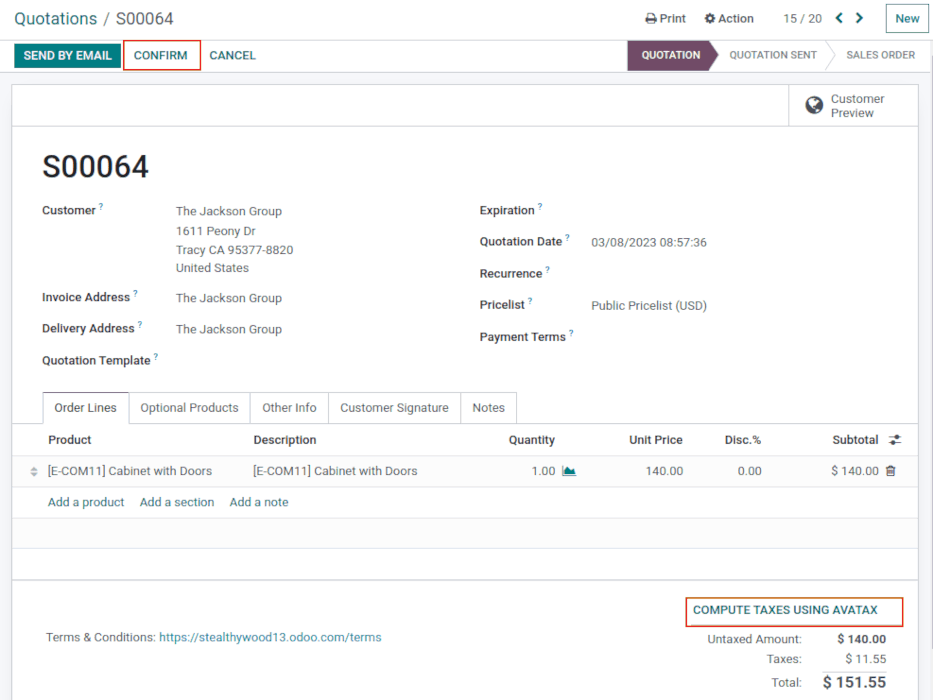
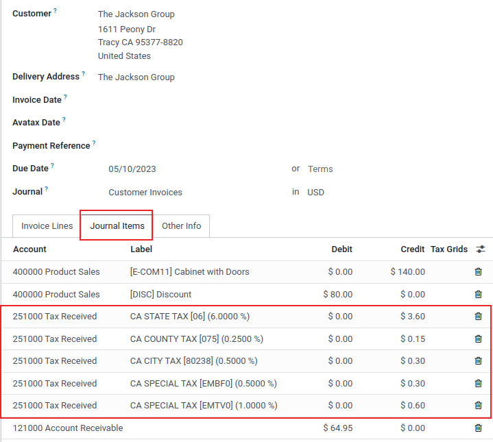
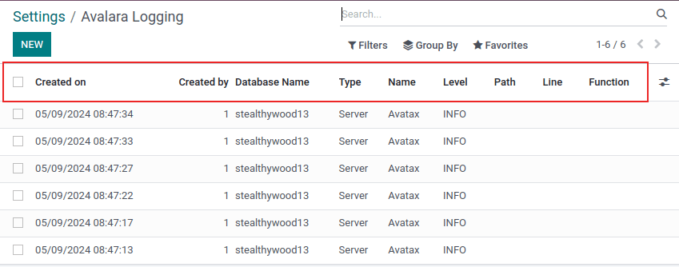

==========
AvaTax use
==========

AvaTax is a tax calculation software that can be integrated with Odoo in the United States and
Canada. Once the :doc:`integration setup <../avatax>` is complete, the calculated tax is simple and
automatic.

Tax calculation
===============

Automatically calculate taxes on Odoo quotations and invoices with AvaTax by confirming the
documents during the sales flow. Alternatively, calculate the taxes manually by clicking the
:guilabel:`Compute Taxes` button, while these documents are in draft stage.

.. tip::
   Clicking the :guilabel:`Compute Taxes` button recalculates taxes, if any product lines are edited
   on the invoice.

The tax calculation is triggered during the following :ref:`automatic trigger
<avatax/automatic-triggers>` and :ref:`manual trigger <avatax/manual-triggers>` circumstances.

.. _avatax/automatic-triggers:

Automatic triggers
------------------

- When the sales rep sends the quote by email with :guilabel:`Send by email` button (pop-up).
- When the customer views the online quote on the portal.
- When a quote is confirmed and becomes a sales order.
- When the customer views the invoice on the portal.
- When a draft invoice is validated.
- When the customer views the subscription in the portal.
- When a subscription generates an invoice.
- When the customer gets to the last screen of the eCommerce checkout.

.. _avatax/manual-triggers:

Manual triggers
---------------

- :guilabel:`Compute Taxes` button at the bottom of the quote.
- :guilabel:`Compute Taxes` button at the top of the invoice.

Use each of these buttons to manually re-calculate the sales tax.

.. tip::
   Use the :guilabel:`Avalara Partner Code` field that is available on customer records, quotations,
   and invoices to cross-reference data in Odoo and AvaTax. This field is located under the
   :menuselection:`Other info` tab of the sales order or quotation in the :guilabel:`Sales` section.

   On the customer record, navigate to *Contacts app* and select a contact. Then open the
   :guilabel:`Sales & Purchase` tab and the :guilabel:`Avalara Partner Code` under the
   :guilabel:`Sales` section.

.. important::
   The :guilabel:`Automatic Tax Mapping (AvaTax)` fiscal position is also applied on those Odoo
   documents, like subscriptions.

.. seealso::
   - :doc:`../fiscal_positions`

AvaTax synchronization
======================

Synchronization occurs with AvaTax, when the *invoice* is created in Odoo. This means the sales tax
is recorded with Avalara (AvaTax software developer).

To do so, navigate to :menuselection:`Sales app --> Orders --> Quotations`. Select a quotation from
the list.

After confirming a quotation and validating the delivery, click :guilabel:`Create Invoice`. Indicate
whether it is a :guilabel:`Regular invoice`, :guilabel:`Down payment (percentage)`, or
:guilabel:`Down payment (fixed amount)`.

Then click :guilabel:`Create and view invoice`. The recorded taxes can be seen in the
:guilabel:`Journal Items` tab of the invoice. There will be different taxes depending on the
location of the :guilabel:`Delivery Address`.

Finally, press the :guilabel:`Confirm` button to complete the invoice and synchronize with the
AvaTax portal.

.. warning::
   An invoice cannot be :guilabel:`Reset to draft` because this causes de-synchronization with the
   AvaTax Portal. Instead, click :guilabel:`Add credit note` and state: `Sync with AvaTax Portal`.
   See this documentation: :doc:`../../../accounting/customer_invoices/credit_notes`.

Fixed price discounts
=====================

Add a fixed price discount to a valuable customer, by clicking :guilabel:`Add a line` on the
customer's invoice. Add the product discount, and set the :guilabel:`Price` to either a positive or
negative value. To recalculate the taxes, click :guilabel:`Compute Taxes`.

.. tip::
   Tax calculation can even be done on negative subtotals and credit notes.

Logging
=======

It is possible to log Avalara/*AvaTax* actions in Odoo for further analysis, or verification of
functionality. Logging is accessible through the *AvaTax* settings.

To start logging *AvaTax* actions, first, navigate to the :menuselection:`Accounting app -->
Configuration --> Settings`.

Then, in the :guilabel:`Taxes` section, under the :guilabel:`AvaTax` settings, click
:guilabel:`Start logging for 30 minutes`.

Upon starting the log process, Odoo will log all Avalara/*AvaTax* actions performed in the database.

To view the logs, click on :guilabel:`Show logs` to the right of the :guilabel:`Start logging for 30
minutes`. This reveals a detailed list of Avalara/*AvaTax* actions. This list is sortable by the
following columns:

- :guilabel:`Created on`: timestamp of the *AvaTax* calculation.
- :guilabel:`Created by`: numeric value of the user in the database.
- :guilabel:`Database name`: name of the database.
- :guilabel:`Type`: two values can be chosen for this field, :guilabel:`Server` or
  :guilabel:`Client`.
- :guilabel:`Name`: Avalara service name. In this case, it will be *AvaTax*.
- :guilabel:`Level`: by default, this will be `INFO`.
- :guilabel:`Path`: indicates the path taken to make the calculation.
- :guilabel:`Line`: indicates the line the calculation is made on.
- :guilabel:`Function`: indicates the calculation taken on the line.

Click into the log line to reveal another field, called :guilabel:`Message`.

This field populates a raw transcription of the transaction, which involves the creation (or
adjustment) of a sales invoice using the Avalara *AvaTax* API.

The transaction includes details, such as addresses for shipping from and to, line items describing
the products or services, tax codes, tax amounts, and other relevant information.

The :guilabel:`Message` contains the calculated taxes for different jurisdictions and confirms the
creation (or adjustment) of the transaction.

.. tip::
   Custom fields can be made using Odoo *Studio*. Click the :icon:`fa-ellipsis-v`
   :guilabel:`(ellipsis)` menu to the far-right of the header row. Then click :icon:`fa-plus`
   :guilabel:`Add custom field`. This action opens Odoo *Studio*.

.. important::
   Odoo *Studio* requires a *custom* pricing plan. Consult the database's customer success manager
   for more information on switching plans. Or to see if Odoo *Studio* is included in the database's
   current pricing plan. See this documentation: :doc:`../../../../studio`.

.. seealso::
   - :doc:`../avatax`
   - :doc:`avalara_portal`
   - `US Tax Compliance: Avatax elearning video
     <https://www.odoo.com/slides/slide/us-tax-compliance-avatax-2858?fullscreen=1>`_
   - :doc:`../fiscal_positions`

