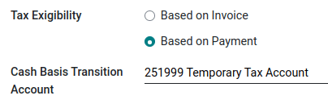

================
Cash basis taxes
================

Cash basis taxes are due when the payment is made, as opposed to standard taxes that are due when
the invoice is confirmed. Reporting your income and expenses to the government based on the cash
basis method is mandatory in some countries and under some conditions.

.. example::
   You sell a product in the 1st quarter of your fiscal year, and the payment is received in the 2nd
   quarter. Based on the cash basis method, the tax you must pay is for the 2nd quarter.

Configuration
-------------

Go to :menuselection:`Accounting --> Configuration --> Settings` and under the :guilabel:`Taxes`
section, enable :guilabel:`Cash Basis`.

Then, define the :guilabel:`Tax Cash Basis Journal`. Click on the external link button next to the
journal to update its default properties such as the :guilabel:`Journal Name`, :guilabel:`Type` or
:guilabel:`Short Code`.

.. image:: cash_basis/tax_cash_basis_journal.png
    :align: center
    :alt: Select your Tax Cash Basis Journal and click on the external link

.. note::
   By default, the journal entries of the :guilabel:`Cash Basis Taxes` journal are named using the
   :guilabel:`CABA` short code.

Once this is done, go to :menuselection:`Accounting --> Configuration --> Accounting: Taxes` to
configure your taxes. You can either :guilabel:`Create` a new tax or update an existing one by
clicking on it.

The :guilabel:`Account` column reflects the proper transitional accounts to post taxes until the
payment is registered.

.. image:: cash_basis/account_column.png
    :align: center
    :alt: Fill in the account column with a transitional accounts where taxes go until the payment
       is registered

In the :guilabel:`Advanced Options` tab, decide of the :guilabel:`Tax Exigilibity`. Select
:guilabel:`Based on Payment`, so the tax is due when the payment of the invoice is received. You can
then also define the :guilabel:`Cash Basis Transition Account` where the tax amount is recorded as
long as the original invoice has not been reconciled.

        reconciliation.

Impact of cash basis taxes on accounting
----------------------------------------

To illustrate the impact of cash basis taxes on accounting transactions, let's take an example with
the sales of a product that costs 1,000$, with a cash basis tax of 15%.

.. image:: cash_basis/customer_invoice_with_cbt.png
    :align: center
    :alt:

The following entries are created in your accounting, and the tax report is currently empty.

+----------------------------+----------------------------+
|**Customer journal (INV)**                               |
+============================+============================+
| **Debit**                  |**Credit**                  |
+----------------------------+----------------------------+
| Receivable $1,150          |                            |
+----------------------------+----------------------------+
|                            |Income $1,000               |
+----------------------------+----------------------------+
|                            |Temporary tax account $150  |
+----------------------------+----------------------------+

When the payment is then received, it is registered as below :

+----------------------------+----------------------------+
| **Bank journal (BANK)**                                 |
+============================+============================+
| **Debit**                  |**Credit**                  |
+----------------------------+----------------------------+
| Bank $1,150                |                            |
+----------------------------+----------------------------+
|                            |Receivable $1,150           |
+----------------------------+----------------------------+

.. note::
    Once the payment is registered, you can use the :guilabel:`Cash Basis Entries` smart button on
    the invoice to access them directly.

Finally, upon reconciliation of the invoice with the payment, the below entry is automatically
created:

+----------------------------+----------------------------+
| **Tax Cash Basis Journal (Caba)**                       |
+============================+============================+
| **Debit**                  |**Credit**                  |
+----------------------------+----------------------------+
| Income account $1,000      |                            |
+----------------------------+----------------------------+
| Temporary tax account $150 |                            |
+----------------------------+----------------------------+
|                            |  Income account $1,000     |
+----------------------------+----------------------------+
|                            | Tax Received $150          |
+----------------------------+----------------------------+

The journal items :guilabel:`Income account` vs. :guilabel:`Income account` are neutral, but they
are needed to ensure correct tax reports in Odoo with accurate base tax amounts.

Using a default :guilabel:`Base Tax Received Account` is recommended so your balance is at zero and
your income account is not polluted by unnecessary accounting movements. To do so, go to
:menuselection:`Configuration --> Settings --> Taxes`, and select a
:guilabel:`Base Tax Received Account` under :guilabel:`Cash Basis`.
