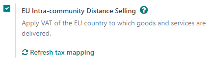
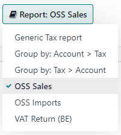

===================================
EU intra-community distance selling
===================================

EU intra-community distance selling involves the cross-border trade of goods and services from
vendors registered for VAT purposes to individuals (B2C) located in a European Union member state.
The transaction is conducted remotely, typically through online platforms, mail orders, telephone,
or other means of communication.

EU intra-community distance selling is subject to specific VAT rules and regulations. The vendor
must charge VAT per the VAT rate applicable in the buyer's country.

.. note::
   This remains applicable even if the vendor is located outside of the European Union.

Configuration
=============

The **EU Intra-community Distance Selling** feature helps you comply with this regulation by
creating and configuring new **fiscal positions** and **taxes** based on your company's country. To
enable it, go to :menuselection:`Accounting --> Configuration --> Settings --> Taxes`, tick
:guilabel:`EU Intra-community Distance Selling`, and :guilabel:`Save`.

.. tip::
   Whenever you add or modify taxes, you can automatically update your fiscal positions. To do so,
   go to :menuselection:`Accounting/Invoicing --> Settings --> Taxes --> EU Intra-community Distance
   Selling` and click on the :guilabel:`Refresh tax mapping`.

.. note::
   We highly recommend checking that the proposed mapping is suitable for the products and services
   you sell before using it.

.. seealso::
   - :doc:`../taxes`
   - :doc:`../../fiscal_localizations`
   - :doc:`fiscal_positions`

One-Stop Shop (OSS)
===================

The :abbr:`OSS (One-Stop Shop)` system introduced by the European Union simplifies VAT collection
for **cross-border** sales of goods and services. It primarily applies to business-to-consumer
**(B2C)** cases. With the OSS, businesses can register for VAT in their home country and use a
single online portal to handle VAT obligations for their sales within the EU. There are **two
primary schemes**: the **Union OSS** scheme for cross-border services and the **Import OSS** scheme
for goods valued at or below €150.

Reports
-------

To generate **OSS sales** or **OSS imports** reports and submit them onto the OSS portal, go to
:menuselection:`Accounting --> Reporting --> Tax Report`, click :guilabel:`Report: Generic Tax
report`, and select either :guilabel:`OSS Sales` or :guilabel:`OSS Imports`. Once selected, click on
:guilabel:`PDF`, :guilabel:`XLSX`, or :guilabel:`XML` in the top-left corner. This generates the
currently-opened report in the selected format. Once generated, log into the platform of your
competent federal authority to submit it onto the OSS portal.

.. seealso::
   - `European Commission: OSS | Taxation and Customs Union <https://ec.europa.eu/taxation_customs/business/vat/oss_en>`_
