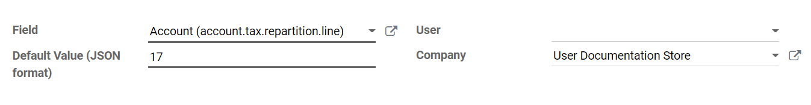

====================
TaxCloud integration
====================

TaxCloud calculates the sales tax rate in real time for every state, city, and special jurisdiction
in the United States. It keeps track of which products are exempt from sales tax and in which states
each exemption applies.

TaxCloud registration
=====================

Register an account on `TaxCloud.com <https://taxcloud.com/register>`_ and complete the setup.
Once you go live, get the :guilabel:`TaxCloud API Keys` by clicking on :guilabel:`Stores`, then
:guilabel:`Get Details`.

.. image:: taxcloud/taxcloud-api-keys.png
   :align: center
   :alt: Example of a store's TaxCloud API Keys

Enable TaxCloud
===============

#. Go to :menuselection:`Accounting Dashboard --> Configuration --> Settings` and in the
   :guilabel:`Taxes` section enable :guilabel:`TaxCloud`.
#. Add the store's :guilabel:`Login ID` under :guilabel:`API ID` and the store's :guilabel:`Key`
   under :guilabel:`API KEY`. Click on :guilabel:`Save`.
#. Click the :guilabel:`Refresh` button (:guilabel:`🗘`) next to :guilabel:`Default Category` to
   import the TIC :dfn:`Taxability Information Codes` product categories from TaxCloud. Some
   categories may imply specific tax rates or exemptions.
#. Select a :guilabel:`Default Category` and :guilabel:`Save`. The :guilabel:`Default Category` is
   applied when no :guilabel:`TaxCloud Category` is set on your products or product categories,
   or when no product is found on an order/invoice.

   .. image:: taxcloud/taxcloud-settings.png
      :align: center
      :alt: Filling in TaxCloud API Keys in Odoo

Set TaxCloud categories on products
===================================

If you need to use more than one TIC category (i.e., the :guilabel:`Default Category`), go to the
product's :guilabel:`General Information` tab and select a :guilabel:`TaxCloud Category`.

If you want to configure multiple products simultaneously, ensure they share the same
:guilabel:`Product Category` and click on the external link button (:guilabel:`🡕`) to set a
:guilabel:`TaxCloud Category` on the :guilabel:`Product Category` instead.

.. note::
   If you set a :guilabel:`TaxCloud Category` on a product and another on its :guilabel:`Product
   Category`, Odoo only considers the :guilabel:`TaxCloud Category` found on the product itself.

   A :guilabel:`TaxCloud Category` set on a **parent product category** does not apply to its
   **child product categories**. For example, if you set :guilabel:`TaxCloud Category` on the *All*
   :guilabel:`Product Category`, it is not applied to the *All/Sales* :guilabel:`Product Category`.

.. important::
   Make sure your company address is complete, including the state and the ZIP code. Go to
   :menuselection:`Settings --> Companies: Update Info` to open and edit your company address.

Automatically post taxes in the correct tax payable account
===========================================================

To make sure the new taxes generated by the TaxCloud integration are created with the correct
**Tax Payable** account, create a **user-defined default**. This process should be repeated for each
one of your companies that uses TaxCloud.

.. warning::
   A user-defined default impacts all records at creation. It means that **every** new tax is
   set up to record income in the specified Tax Payable account unless the tax is manually edited to
   specify a different income account (or if another user-defined default takes precedence).

To do so, go to :menuselection:`Accounting Dashboard --> Configuration --> Accounting: Chart of
Accounts`, find the company's :guilabel:`Tax Payable` account, and click on :guilabel:`Setup`. Take
note of the number after `id=` in the URL string; it is the **Tax Payable account ID** and will
be used later.

.. image:: taxcloud/tax-payable-id.png
   :align: center
   :alt: Example of Tax Payable account id in the URL string

Activate the :ref:`developer mode <developer-mode>`, then go to :menuselection:`Settings -->
Technical --> Actions: User-defined Defaults` and click on :guilabel:`Create`.

Click on :guilabel:`Field` drop-down menu and then on :guilabel:`Search More...`.

.. image:: taxcloud/user-defaults-search-more.png
   :alt: User-defined Defaults Field search
   :align: center

Use the search bar to filter for the :guilabel:`Tax Repartition Line` model, and use it a second
time to filter for the :guilabel:`Account` field. Select the line with :guilabel:`Tax Repartition
Line` under the :guilabel:`Model` column.

.. image:: taxcloud/user-defaults-search-filters.png
   :alt: Searching for the Tax Repartition Line model and Account field
   :align: center

Once you are back to the :guilabel:`User-defined Defaults` creation, enter the **Tax Payable account
ID** you took note of earlier under the :guilabel:`Default Value (JSON format)` field.

Select the company for which this configuration should apply under the :guilabel:`Company` field and
click :guilabel:`Save`.

Automatically detect the fiscal position
========================================

Sales taxes are calculated in Odoo based on :doc:`fiscal positions <fiscal_positions>`. A fiscal
position for the United States is created when enabling TaxCloud.

You can configure Odoo to automatically detect to which customers the fiscal position should be
applied. To do so, go to :menuselection:`Accounting Dashboard --> Configuration --> Accounting:
Fiscal Positions` and select :guilabel:`Automatic Tax Mapping (TaxCloud)`. Enable :guilabel:`Detect
Automatically` and then :guilabel:`Save`.

.. image:: taxcloud/fiscal-position-detect.png
   :align: center
   :alt: Detect Automatically setting on the TaxCloud fiscal position

Now, this fiscal position is automatically set on any order or invoice if the customer country is
*United States*. This triggers the automated tax computation.

.. note::
   To get the sales taxes on a sales order, confirm it or click the :guilabel:`Update Taxes` button
   next to :guilabel:`Add Shipping`.

Interaction with coupons and promotions
=======================================

If you use the **Coupon** or **Promotion Programs**, the integration with TaxCloud might behave
unexpectedly. Indeed, as TaxCloud does not accept lines with negative amounts as part of the tax
computation, the amount of the lines added by the promotion program must be deduced from the total
of the lines it impacts.

.. important::
   This means, amongst other complications, that orders using coupons or promotions with a TaxCloud
   fiscal position **must** be invoiced completely - you cannot create invoices for partial
   deliveries, etc.

Another unexpected behavior is possible. For example, you sell a product for which you have a
promotion program that provides a 50% discount. If the product's tax rate is 7%, the tax rate
computed from the TaxCloud integration displays 3.5%. This happens because the discount is included
in the price sent to TaxCloud. However, in Odoo, the discount is on another line entirely. Still,
the tax computation is correct. Indeed, a 3.5% tax on the full price is the equivalent of a 7% tax
on half the price, but this might be unexpected from a user point of view.

.. seealso::
   :doc:`fiscal_positions`
