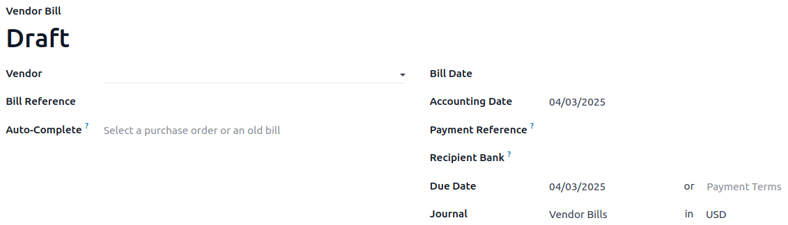

:show-content:

============
Vendor bills
============

In Odoo, we can register vendor bills **manually** or **automatically**, while the
**Aged Payable report** provides an overview of all outstanding bills to help us pay the correct
amounts on time.

.. seealso::
   - Tutorial `Registering a vendor bill <https://www.odoo.com/slides/slide/registering-a-vendor-bill-1683?fullscreen=1>`_
   - :doc:`/applications/inventory_and_mrp/purchase/manage_deals/manage`

Bill creation
=============

Manually
--------

Create a vendor bill manually by going to :menuselection:`Accounting --> Vendors --> Bills` and
clicking :guilabel:`Create`.

Automatically
-------------

Vendor bills can be automatically created by **sending an email** to an :ref:`email alias
<invoice-digitization/email-alias>` associated with the purchase journal, or by **uploading a PDF**
in :menuselection:`Accounting --> Vendors --> Bills` and then clicking :guilabel:`Upload`.

Bill completion
===============

Whether the bill is created manually or automatically, make sure the following fields are
appropriately completed:

- :guilabel:`Vendor`: Odoo automatically fills some information based on the vendor's registered
  information, previous purchase orders, or bills.
- :guilabel:`Bill Reference`: add the sales order reference provided by the vendor and is used to do
  the :ref:`matching <payments/matching>` when you receive the products.
- :guilabel:`Auto-Complete`: select a past bill/purchase order to automatically complete the
  document. The :guilabel:`Vendor` field should be completed prior to completing this field.
- :guilabel:`Bill Date`: is the issuance date of the document.
- :guilabel:`Accounting Date`: is the date on which the document is registered in your accounting.
- :guilabel:`Payment Reference`: when registering the payment, it is automatically indicated in the
  :guilabel:`Memo` field.
- :guilabel:`Recipient Bank`: to indicate to which account number the payment has to be made.
- :guilabel:`Due Date` or :guilabel:`Terms` to pay the bill.
- :guilabel:`Journal`: select in which journal the bill should be recorded and the :doc:`Currency
  <get_started/multi_currency>`.

.. note::
   - Bills can be :doc:`digitized <vendor_bills/invoice_digitization>` for
     automatic completion by clicking :guilabel:`Send for Digitization`.
   - If you upload the bill, the PDF document is displayed on the right of the screen, allowing you
     to easily fill in the bill information.

Bill confirmation
=================

Click :guilabel:`Confirm` when the document is completed. The status of your document changes to
:guilabel:`Posted` and a journal entry is generated based on the configuration on the invoice.

.. note::
   Once confirmed, it is no longer possible to update it. Click :guilabel:`Reset to draft` if
   changes are required.

Bill Payment
============

Upon payment of the vendor bill, click on :guilabel:`Register Payment`. A new window pops up.

Select the :guilabel:`Journal`, the :guilabel:`Payment Method`, the :guilabel:`Amount` you wish to
pay (full or partial payment), and the :guilabel:`Currency`. Odoo fills the :guilabel:`Memo` field
automatically if the :guilabel:`Payment Reference` has been set correctly in the vendor bill. If
the field is empty, we recommend you select the vendor invoice number as a reference.

Once confirmed, an :guilabel:`In Payment` banner appears on the bill until it is :doc:`reconciled
<bank/reconciliation>`.

Aged payable report
===================

To get an overview of your open vendor bills and their related due dates, you can use the
**Aged Payable report**. Go to :menuselection:`Accounting --> Reporting --> Partner Reports: Aged
payable`.

Click on a vendor's name to open up the details of all outstanding bills, the amounts due, the due
dates, etc.

.. Note::
   - By clicking the :guilabel:`Save` button, you can export the information available on the screen
     as a PDF or XLSX file and save it in the folder of your choice.
   - You might receive several bills for the same purchase order if your vendor is in back-order and
     is sending you invoices as they ship the products, or if your vendor is sending you a partial
     bill or asking for a deposit.

.. toctree::
   :titlesonly:

   vendor_bills/invoice_digitization
   vendor_bills/assets
   vendor_bills/deferred_expenses
