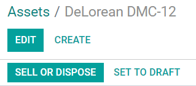

===================================
Non-current assets and fixed assets
===================================

**Non-current Assets**, also known as **long-term assets**, are investments that are expected to be
realized after one year. They are capitalized rather than being expensed and appear on the company's
balance sheet. Depending on their nature, they may undergo **depreciation**.

**Fixed Assets** are a type of Non-current Assets and include the properties bought for their
productive aspects, such as buildings, vehicles, equipment, land, and software.

For example, let's say we buy a car for $ 27,000. We plan to amortize it over five years, and we
will sell it for $ 7,000 afterward. Using the linear, or straight-line, depreciation method,
$ 4,000 are expensed each year as **depreciation expenses**. After five years, the **Accumulated
Depreciation** amount reported on the balance sheet equals $ 20,000, leaving us with $ 7,000 of
**Not Depreciable Value**, or Salvage value.

Odoo Accounting handles depreciation by creating all depreciation entries automatically in *draft
mode*. They are then posted periodically.

Odoo supports the following **Depreciation Methods**:

- Straight Line
- Declining
- Declining Then Straight Line

.. note::
   The server checks once a day if an entry must be posted. It might then take up to 24 hours before
   you see a change from *draft* to *posted*.

Prerequisites
=============

Such transactions must be posted on an **Assets Account** rather than on the default
expense account.

Configure an Assets Account
---------------------------

To configure your account in the **Chart of Accounts**, go to :menuselection:`Accounting -->
Configuration --> Chart of Accounts`, click on *Create*, and fill out the form.

.. image:: assets/assets01.png
   :align: center
   :alt: Configuration of an Assets Account in Odoo Accounting

.. note::
   This account's type must be either *Fixed Assets* or *Non-current Assets*.

Post an expense to the right account
------------------------------------

Select the account on a draft bill
~~~~~~~~~~~~~~~~~~~~~~~~~~~~~~~~~~

On a draft bill, select the right account for all the assets you are buying.

.. image:: assets/assets02.png
   :align: center
   :alt: Selection of an Assets Account on a draft bill in Odoo Accounting

.. _product-assets-account:

Choose a different Expense Account for specific products
~~~~~~~~~~~~~~~~~~~~~~~~~~~~~~~~~~~~~~~~~~~~~~~~~~~~~~~~

Start editing the product, go to the *Accounting* tab, select the right **Expense Account**, and
save.

.. image:: assets/assets03.png
   :align: center
   :alt: Change of the Assets Account for a product in Odoo

.. tip::
   It is possible to :ref:`automate the creation of assets entries <assets-automation>` for these
   products.

.. _journal-assets-account:

Change the account of a posted journal item
~~~~~~~~~~~~~~~~~~~~~~~~~~~~~~~~~~~~~~~~~~~

To do so, open your Purchases Journal by going to :menuselection:`Accounting --> Accounting -->
Purchases`, select the journal item you want to modify, click on the account, and select the right
one.

.. image:: assets/assets04.png
   :align: center
   :alt: Modification of a posted journal item's account in Odoo Accounting

Assets entries
==============

.. _create-assets-entry:

Create a new entry
------------------

An **Asset entry** automatically generates all journal entries in *draft mode*. They are then posted
one by one at the right time.

To create a new entry, go to :menuselection:`Accounting --> Accounting --> Assets`, click on
*Create*, and fill out the form.

Click on **select related purchases** to link an existing journal item to this new entry. Some
fields are then automatically filled out, and the journal item is now listed under the **Related
Purchase** tab.

.. image:: assets/assets05.png
   :align: center
   :alt: Assets entry in Odoo Accounting

Once done, you can click on *Compute Depreciation* (next to the *Confirm* button) to generate all
the values of the **Depreciation Board**. This board shows you all the entries that Odoo will post
to depreciate your asset, and at which date.

.. image:: assets/assets06.png
   :align: center
   :alt: Depreciation Board in Odoo Accounting

What does "Prorata Temporis" mean?
~~~~~~~~~~~~~~~~~~~~~~~~~~~~~~~~~~

The **Prorata Temporis** feature is useful to depreciate your assets the most accurately possible.

With this feature, the first entry on the Depreciation Board is computed based on the time left
between the *Prorata Date* and the *First Depreciation Date* rather than the default amount of time
between depreciations.

For example, the Depreciation Board above has its first depreciation with an amount of $ 241.10
rather than $ 4,000.00. Consequently, the last entry is also lower and has an amount of $ 3758.90.

What are the different Depreciation Methods
~~~~~~~~~~~~~~~~~~~~~~~~~~~~~~~~~~~~~~~~~~~

The **Straight Line Depreciation Method** divides the initial Depreciable Value by the number of
depreciations planned. All depreciation entries have the same amount.

The **Declining Depreciation Method** multiplies the Depreciable Value by the **Declining Factor**
for each entry. Each depreciation entry has a lower amount than the previous entry. The last
depreciation entry doesn't use the declining factor but instead has an amount corresponding to the
balance of the depreciable value so that it reaches $0 by the end of the specified duration.

The **Declining Then Straight Line Depreciation Method** uses the Declining Method, but with a
minimum Depreciation equal to the Straight Line Method. This method ensures a fast depreciation
at the beginning, followed by a constant one afterward.

Assets from the Purchases Journal
---------------------------------

You can create an asset entry from a specific journal item in your **Purchases Journal**.

To do so, open your Purchases Journal by going to :menuselection:`Accounting --> Accounting -->
Purchases`, and select the journal item you want to record as an asset. Make sure that it is posted
in the right account (see: :ref:`journal-assets-account`).

Then, click on *Action*, select **Create Asset**, and fill out the form the same way you would do to
:ref:`create a new entry <create-assets-entry>`.

.. image:: assets/assets07.png
   :align: center
   :alt: Create Asset Entry from a journal item in Odoo Accounting

Modification of an Asset
========================

You can modify the values of an asset to increase or decrease its value.

To do so, open the asset you want to modify, and click on *Modify Depreciation*. Then, fill out the
form with the new depreciation values and click on *Modify*.

A **decrease in value** posts a new Journal Entry for the **Value Decrease** and modifies all the
future *unposted* Journal Entries listed in the Depreciation Board.

An **increase in value** requires you to fill out additional fields related to the account movements
and creates a new Asset entry with the **Value Increase**. The Gross Increase Asset Entry can be
accessed with a Smart Button.

.. image:: assets/assets08.png
   :align: center
   :alt: Gross Increase smart button in Odoo Accounting

Disposal of Fixed Assets
========================

To **sell** an asset or **dispose** of it implies that it must be removed from the Balance Sheet.

To do so, open the asset you want to dispose of, click on *Sell or Dispose*, and fill out the form.

Odoo Accounting then generates all the journal entries necessary to dispose of the asset, including
the gain or loss on sale, which is based on the difference between the asset's book value at the
time of the sale and the amount it is sold for.

.. note::
   To record the sale of an asset, you must first post the related Customer Invoice so you can link
   the sale of the asset with it.

Assets Models
=============

You can create **Assets Models** to create your Asset entries faster. It is particularly useful if
you recurrently buy the same kind of assets.

To create a model, go to :menuselection:`Accounting --> Configuration --> Assets Models`, click on
*Create*, and fill out the form the same way you would do to create a new entry.

.. tip::
   You can also convert a *confirmed Asset entry* into a model by opening it from
   :menuselection:`Accounting --> Accounting --> Assets` and then, by clicking on the button *Save
   Model*.

Apply an Asset Model to a new entry
-----------------------------------

When you create a new Asset entry,  fill out the **Fixed Asset Account** with the right asset
account.

New buttons with all the models linked to that account appear at the top of the form. Clicking on a
model button fills out the form according to that model.

.. image:: assets/assets10.png
   :align: center
   :alt: Assets model button in Odoo Accounting

.. _assets-automation:

Automate the Assets
===================

When you create or edit an account of which the type is either *Non-current Assets* or *Fixed
Assets*, you can configure it to create assets for the expenses that are credited on it
automatically.

You have three choices for the **Automate Assets** field:

#. **No:** this is the default value. Nothing happens.
#. **Create in draft:** whenever a transaction is posted on the account, a draft *Assets entry* is
   created, but not validated. You must first fill out the form in :menuselection:`Accounting -->
   Accounting --> Assets`.
#. **Create and validate:** you must also select an Asset Model (see: `Assets Models`_). Whenever a
   transaction is posted on the account, an *Assets entry* is created and immediately validated.

.. image:: assets/assets11.png
   :align: center
   :alt: Automate Assets on an account in Odoo Accounting

.. tip::
   You can, for example, select this account as the default **Expense Account** of a product to
   fully automate its purchase. (see: :ref:`product-assets-account`).

.. seealso::
  * :doc:`../get_started/chart_of_accounts`
