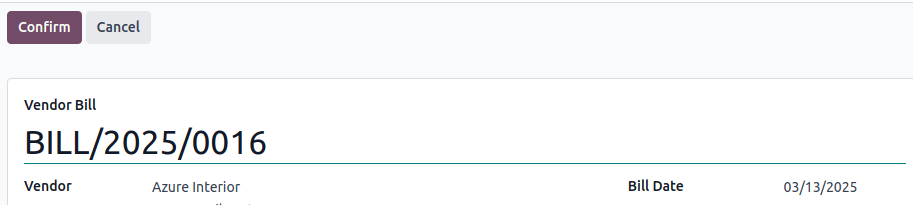
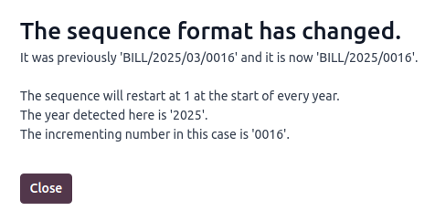
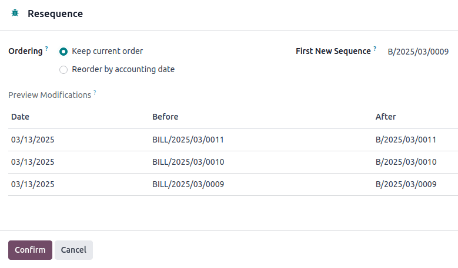

====================
Vendor bill sequence
====================

When confirming a vendor bill, Odoo generates a unique vendor bill reference number. By default, it
uses the sequence format `BILL/year/month/incrementing-number` (e.g., `BILL/2025/01/00001`), which
restarts from `00001` each year.

However, it is possible to :ref:`change the sequence format <accounting/vendor_bills/resequencing>`
and its periodicity, and to :ref:`mass-resequence vendor bills
<accounting/vendor_bills/mass-resequencing>`.

.. note::
   Changes made to reference numbers are logged in the chatter.

.. _accounting/vendor_bills/resequencing:

Changing the default sequence
=============================

To customize the default sequence, open the last confirmed vendor bill, click :guilabel:`Reset to
Draft`, and edit the vendor bill's reference number.

Odoo then explains how the detected format will be applied to all future vendor bills. For example,
if the current vendor bill's month is withdrawn, the sequence's periodicity will change to every
year instead of every month.

.. tip::
   The sequence format can be edited directly when creating the first vendor bill of a given
   sequence period.

.. _accounting/vendor_bills/mass-resequencing:

Mass-resequencing vendor bills
==============================

It can be helpful to resequence multiple vendor bill numbers. For example, when importing vendor
bills from another accounting system and the reference originates from the previous software,
continuity for the current year must be maintained without restarting from the beginning.

.. note::
   This feature is only available to users with administrator or advisor access.

Follow these steps to resequence vendor bill numbers:

#. Activate the :ref:`developer mode <developer-mode>`.
#. In the vendor bills list view, select the vendor bills that need a new sequence.
#. Click the :icon:`fa-cog` :guilabel:`Actions` menu and select :guilabel:`Resequence`.
#. In the :guilabel:`Ordering` field, choose to

   - :guilabel:`Keep current order`: The order of the numbers remains the same.
   - :guilabel:`Reorder by accounting date`: The number is reordered by accounting date.

#. Set the :guilabel:`First New Sequence`.
#. :guilabel:`Preview Modifications` and click :guilabel:`Confirm`.

.. note::
   - To indicate where the sequence change began, the first vendor bill in the new sequence is
     highlighted in red in the :guilabel:`Vendor Bills` list. This visual marker is permanent
     and purely informational.
   - If there are any irregularities in the new sequence, such as gaps, cancelled, or deleted
     entries within the open period, a :guilabel:`Gaps in the sequence` message appears in the
     :guilabel:`Vendor Bills` journal on the Accounting dashboard. To view more details about the
     related vendor bill(s), click :guilabel:`Gaps in the sequence`. This visual marker is temporary
     and will disappear once the entry's accounting date is on or after the lock date.

.. tip::
   Resequencing is not possible:

   - When entries are before a lock date.
   - When the sequence leads to a duplicate.
   - When the range is invalid. For example, if the :guilabel:`Bill Date` doesn't align with the
     date in the new sequence, such as using a 2024 sequence (BILL/2024/MM/XXXX) for an vendor bill
     dated in 2025.

   In these cases, a :guilabel:`Validation Error` message appears.
