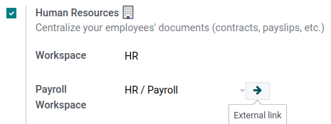
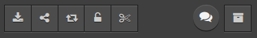
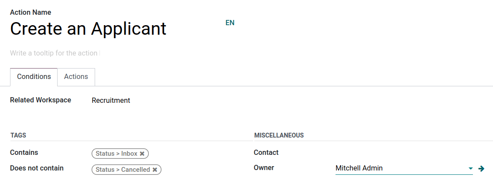
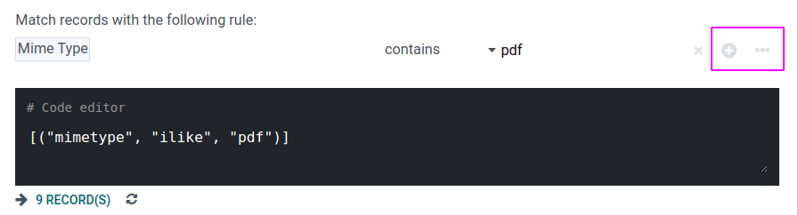
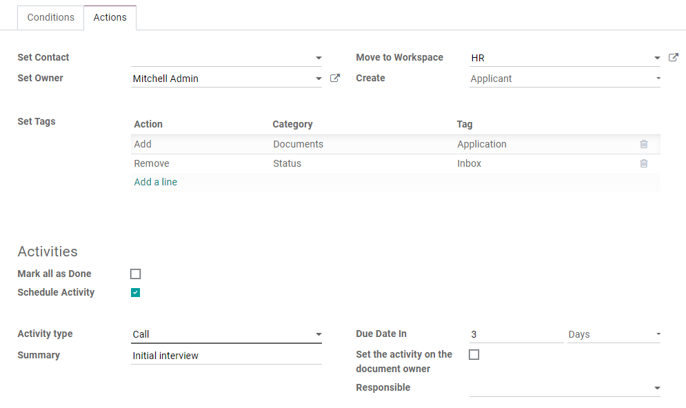

=========
Documents
=========

**Odoo Documents** allows you to store, view, and manage files within Odoo.

You can upload any file (max 64MB per file on Odoo Online) and organize them in various workspaces.

.. seealso::
   - `Odoo Documents: product page <https://www.odoo.com/app/documents>`_
   - `Odoo Tutorials: Documents basics [video]
     <https://www.odoo.com/slides/slide/documents-basics-674>`_
   - `Odoo Tutorials: Using Documents with your Accounting App [video] <https://www.odoo.com/slides/slide/using-documents-with-your-accounting-app-675?fullscreen=1#>`_

Configuration
=============

By going to :menuselection:`Documents --> Configuration --> Settings`, you can enable the
centralization of files attached to a specific area of your activity. For example, by ticking
:guilabel:`Human Resources`, your HR documents are automatically available in the HR workspace,
while documents related to Payroll are automatically available in the Payroll sub-workspace . You
can change the default workspace using the dropdown menu and edit its properties by clicking the
internal link button (:guilabel:`➔`).

.. note::
   - If you enable the centralization of your accounting files and documents, it is necessary to
     click on :guilabel:`Journals` and define each journal independently to allow automatic
     synchronization.

     .. image:: documents/accounting-files-centralization.png
        :alt: Enable the centralization of files attached to your accounting.

   - If you select a new workspace, existing documents aren't moved. Only newly created documents
     will be found under the new workspace.

Workspaces
==========

Workspaces are hierarchical folders having their own set of tags and :ref:`actions
<documents/workflow-actions>`. Default workspaces exist, but you can create your own by going to
:menuselection:`Documents --> Configuration --> Workspaces` and clicking :guilabel:`New`. On the new
page, fill in the following information:

- :guilabel:`Name`
- :guilabel:`Parent Workspace`: if you want to create a sub-workspace, select its :guilabel:`Parent
  Workspace`

Tags
----

Tags are used within workspaces to add a level of differentiation between documents. They are
organized per category, and filters can be used to sort them.

Tags can be created from the :guilabel:`Tags` tab. Click :guilabel:`Add a line`, create the
:guilabel:`Tag Category`, and :guilabel:`Name` your tags.

.. note::
   - The tags of a parent workspace apply to the child workspaces automatically;
   - Tags can be created and modified by going to :menuselection:`Configuration --> Tags`;
   - Tags can also be created or edited by clicking the gear icon :guilabel:`⚙` on the left menu.

Access rights
-------------

To manage your workspace access rights, go to :menuselection:`Documents --> Configuration -->
Workspaces`, open the workspace you want to edit, and go to the :guilabel:`Access Rights` tab.
You can add :guilabel:`Write Groups` that can view, create, and edit the workspace's documents.
You can also add :guilabel:`Read Groups` that can only view the workspace's documents.

Description
-----------

You can add descriptive information to your workspace by going to :menuselection:`Documents -->
Configuration --> Workspaces`, opening the workspace you want to describe and going to the
:guilabel:`Description` tab.

.. note::
   Workspaces can also be created and edited by clicking the gear icon :guilabel:`⚙` on the left
   menu.

   .. image:: documents/sub-workspaces-creation.png
      :alt: Create sub-workspaces from the left menu

Documents management
====================

When selecting or opening a document, the right panel displays different options. On the top,
additional options might be available: :guilabel:`Download`, :guilabel:`Share`, :guilabel:`Replace`,
:guilabel:`Lock` or :guilabel:`Split`. It is also possible to :guilabel:`Open chatter` or
:guilabel:`Archive` the document.

Then, you can modify the name of your file by clicking on :guilabel:`Document`. A
:guilabel:`Contact` or an :guilabel:`Owner` can be assigned. The related :guilabel:`Workspace` can
be modified and it is possible to access the related :guilabel:`Journal Entry` or add
:guilabel:`Tags`.

.. note::
   - The :guilabel:`Contact` is the person related to the document and assigned to it. He can only
     view the document and not modify it. I.e.: an existing supplier in your database is the contact
     for their bill.
   - The person who creates a document is, by default :guilabel:`Owner` of it and has complete
     rights to it. It is possible to replace the owner of a document. I.e., an employee
     must be owner of a document to be able to see it in "My Profile".

Different :ref:`Actions <documents/workflow-actions>` are available at the bottom of the right
panel, depending on the workspace where your document is stored.

Split PDF documents
-------------------

Select the PDF you want to split, and click the scissors icon. A new view displays all the pages of
the document.

By default, each page of the document will be split when clicking :guilabel:`Split`. To remove a
split between two pages, click on the scissors icon.

.. image:: documents/split-pdf.png
   :alt: split your documents

.. tip::
   To merge documents from your dashboard, select them and click the scissors icon. Click on the
   scissors between the two documents and click :guilabel:`Split` to merge the documents.

Additional features
-------------------

Select a workspace and click the arrow next to the :guilabel:`Upload` button to access additional
features:

Request
~~~~~~~

You can create "missing documents" and organize them as documents, to remind users to download them.

Select the workspace where the file should be stored, click :guilabel:`Upload`, then
:guilabel:`Request`. Add the :guilabel:`Document Name`, select the person you need it from in the
:guilabel:`Request To` field, fill in the :guilabel:`Due Date In`, confirm the
:guilabel:`Workspace`, the document should belong to, and add :guilabel:`Tags` and a
:guilabel:`Note`, if needed. Then, click :guilabel:`Request`. A placeholder for the missing document
is created in the workspace.

When your document is available, click the placeholder to upload it.

You can see all missing documents by going to the **Activity** view and to the :guilabel:`Requested
Document` column.

.. tip::
   From the :guilabel:`Activity` view, you can send a **reminder email** to users from whom you are
   expecting a document. Go to the :guilabel:`Requested Document` column, click on ⋮ and
   :guilabel:`Document Request: Reminder`.

   Click on a date to see the details of a specific request. You can update it by clicking on the
   pen icon, :guilabel:`Preview` the content of the reminder email, or :guilabel:`Send Now` to send
   a reminder email.

   .. image:: documents/reminder-email.png
      :alt: send a reminder email from the Activity view

Add a link
~~~~~~~~~~

To add a link to your documents dashboard, click on :guilabel:`Add a Link`, enter the
:guilabel:`URL`, and :guilabel:`Name` it.

Share
~~~~~

You can create a share link to a document or all documents of a workspace. It allows anyone to
download the file(s) or upload files to a workspace.

To do so, select the workspace or the document and click the arrow next to the :guilabel:`Upload`
button then :guilabel:`Share`. On the pop-up, the share :guilabel:`URL` is displayed.
:guilabel:`Copy` it to share it with anyone. :guilabel:`Name` the share link and set a validity date
for the URL by filling in the :guilabel:`Valid Until` field. Tick the :guilabel:`Include Sub
Folders` box if you also want to share a workspace's sub-folders. To let users upload their own
documents, select :guilabel:`Download and Upload`.

.. note::
   It is possible to only share one or more documents (without their workspace) by selecting them
   and clicking :guilabel:`Share`.

New spreadsheet
~~~~~~~~~~~~~~~

To create a new :doc:`spreadsheet <spreadsheet>`, click :guilabel:`New Spreadsheet`. You can select
a :guilabel:`Blank spreadsheet` or an :doc:`existing template <spreadsheet/templates>`.

.. _documents/workflow-actions:

Workflow actions
================

Workflow actions help manage documents and overall business operations. These are automated actions
that can be created and customized for each workspace. With a single click you can, for example,
create, move, sign, and add tags to a document, and process bills.

These workflow actions appear on the right panel when a document meets the set criteria.

Create workflow actions
-----------------------

To create workflow actions, go to :menuselection:`Documents --> Configuration --> Actions` and click
:guilabel:`New`.

.. note::
   An action applies to all **sub-workspaces** under the :guilabel:`Related Workspace` you selected.

Set the conditions
------------------

You can :guilabel:`Create` a new :guilabel:`Action` or edit an existing one. You can define the
:guilabel:`Action Name` and then set the conditions that trigger the appearance of the action button
(:guilabel:`▶`) on the right-side panel when selecting a file.

There are three basic types of conditions you can set:

#. :guilabel:`Tags`: you can use the :guilabel:`Contains` and :guilabel:`Does not contain`
   conditions, meaning the files *must have* or *mustn't have* the tags set here.

#. :guilabel:`Contact`: the files must be associated with the contact set here.

#. :guilabel:`Owner`: the files must be associated with the owner set here.

.. tip::
   If you don't set any conditions, the action button appears for all files inside the selected
   workspace.

Advanced condition type: domain
~~~~~~~~~~~~~~~~~~~~~~~~~~~~~~~

.. important::
   It is recommended to have some knowledge of Odoo development to configure *Domain* filters
   properly.

The :ref:`developer mode <developer-mode>` needs to be activated to access the :guilabel:`Domain`
condition from the :guilabel:`Actions` tab. Once done, select the :guilabel:`Domain` condition type
and click :guilabel:`Add condition`.

To create a rule, you typically select a :guilabel:`field`, an :guilabel:`operator`, and a
:guilabel:`value`. For example, if you want to add a workflow action to all the PDF files inside a
workspace, set the :guilabel:`field` to *Mime Type*, the :guilabel:`operator` to *contains*, and the
pdf :guilabel:`value`.

Click :guilabel:`Add New Rule` (plus icon) and :guilabel:`Add branch` to add conditions and
sub-conditions. You can then specify if your rule should match :guilabel:`all` or :guilabel:`any`
conditions. You can also edit the rule directly using the :guilabel:`Code editor`.

Configure the actions
---------------------

Select the :guilabel:`Actions` tab to set up your action. You can simultaneously:

- **Set Contact**: add a contact to the file, or replace an existing contact with a new one.
- **Set Owner**: add an owner to the file, or replace an existing owner with a new one.
- **Move to Workspace**: move the file to any workspace.
- **Create**: create one of the following items attached to the file in your database:

   - **Link to record**: link the document to a record (i.e. link to a vehicle in Fleet);
   - **Product template**: create a product you can edit directly;
   - **Task**: create a Project task you can edit directly;
   - **Signature PDF template**: create a new Sign template to send out;
   - **PDF to sign**: create a PDF to sign;
   - **Applicant**: create a new HR application you can edit directly;
   - **Vendor bill**: create a vendor bill using OCR and AI to scrape information from the file
     content;
   - **Customer invoice**: create a customer invoice using OCR and AI to scrape information from
     the file;
   - **Vendor credit note**: create a vendor credit note using OCR and AI to scrape information
     from the file;
   - **Credit note**: create a customer credit note using OCR and AI to scrape information from
     the file;
   - **Miscellaneous Operations**: create a record in :guilabel:`Miscellaneous Operations`
     in Accounting;
   - **Bank Statement**: create a Bank Statement in Finance;
   - **Expense**: create an expense automatically based on a file's content.

- **Set Tags**: add, remove, and replace any number of tags.
- **Activities - Mark all as Done**: mark all activities linked to the file as done.
- **Activities - Schedule Activity**: create a new activity linked to the file as configured in
  the action. You can choose to set the activity on the document owner.

Digitize documents with AI and optical character recognition (OCR)
==================================================================

Documents available in the Finance workspace can be digitized. Select the document to digitize,
click :guilabel:`Create Bill`, :guilabel:`Create Customer Invoice`, or
:guilabel:`Create credit note`, and then click :guilabel:`Send for Digitization`.

.. seealso::
   :doc:`AI-powered document digitization <../finance/accounting/vendor_bills/invoice_digitization>`
