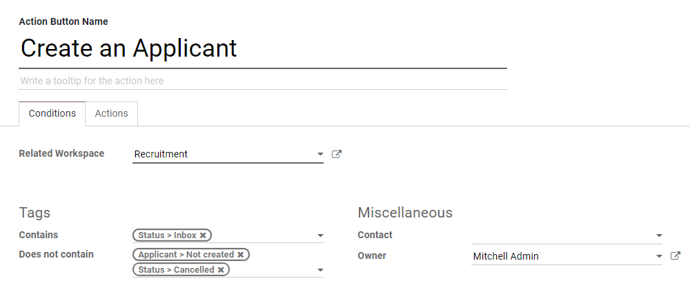
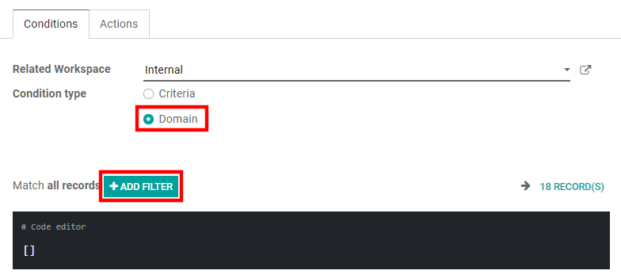
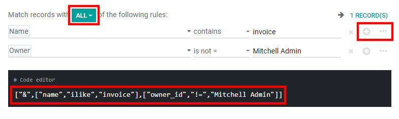

=========
Documents
=========

**Odoo Documents** allows you to store, view and manage files within Odoo.

You can upload any type of file (max 64MB per file on Odoo Online), and organize them in various
workspaces.

.. seealso::
   - `Odoo Documents: product page <https://www.odoo.com/app/documents>`_
   - `Odoo Tutorials: Documents basics <https://www.odoo.com/slides/slide/documents-basics-674>`_
   - `Odoo Tutorials: Using Documents with your Accounting App
     <https://www.odoo.com/slides/slide/using-documents-with-your-accounting-app-675?fullscreen=1#>`_

Configuration
=============

By going to :menuselection:`Documents --> Configuration --> Settings`, you can enable the
centralization of files attached to a specific area of your activity. For example, by ticking
:guilabel:`Human Resources`, your HR documents are automatically available in the HR workspace,
while documents related to Payroll are automatically available in the Payroll sub-workspace . You
can change the default workspace by using the dropdown menu and edit its properties by clicking the
internal link button (:guilabel:`➔`).

.. image:: documents/files-centralization.png
   :align: center
   :alt: Enable the centralization of files attached to a specific area of your activity.

.. note::
   - If you enable the centralization of your accounting files and documents, it is necessary to
     click on :guilabel:`Journals` and define each journal independently to allow automatic
     synchronization.

     .. image:: documents/accounting-files-centralization.png
      :align: center
      :alt: Enable the centralization of files attached to your accounting.

   - If you select a new workspace, existing documents aren't moved. Only newly created documents
     will be found under the new workspace.

Workspaces
==========

Workspaces are hierarchical folders having their own set of tags and actions. Default workspaces
exist, but you can create your own by going to :menuselection:`Documents --> Configuration -->
Workspaces` and clicking on :guilabel:`Create`.

.. note::
   :guilabel:`Workspaces` and :guilabel:`Sub-workspaces` can be created, edited, or deleted by
   clicking on the gear icon :guilabel:`⚙` on the left menu.

.. image:: documents/sub-workspaces-creation.png
   :align: center
   :alt: Create sub-workspaces from the left menu

Tags
====

Tags are used within workspaces to add a level of differentiation between documents. They are
organized per category and filters can be used to sort them.

.. note::
   - The tags of a parent workspace apply to the child workspaces automatically.
   - Tags can be created and modified by going to :menuselection:`Configuration --> Tags`.
   - Tags can also be created, edited, or deleted, by clicking on the gear icon :guilabel:`⚙`, on
     the left menu.

Documents management
====================

When clicking on a specific document, the right panel displays different options. On the top,
additional options might be available: :guilabel:`Download`, :guilabel:`Share`, :guilabel:`Replace`,
:guilabel:`Lock` or :guilabel:`Split`. It is also possible to :guilabel:`Open chatter` or
:guilabel:`Archive` the document.

.. image:: documents/right-panel-options.png
   :align: center
   :alt: right panel options

Then, you can modify the name of your file by clicking on :guilabel:`Document`. A
:guilabel:`Contact` or an :guilabel:`Owner` can be assigned. The related :guilabel:`Workspace` can
be modified and it is possible to access the related :guilabel:`Journal Entry` or to add
:guilabel:`Tags`.

.. note::
   - The :guilabel:`Contact` is the person related to the document and assigned to it. He can only
     view the document and not modify it. I.e.: an existing supplier in your database is the contact
     for their bill.
   - The person who creates a document is, by default :guilabel:`Owner` of it and has complete
     rights to the document. It is possible to replace the owner of a document. I.e.: an employee
     must be owner of a document to be able to see it in "My Profile".

Finally, different :guilabel:`Actions` are available at the bottom of the right panel, depending on
the workspace where your document is stored.

Workflow actions
================

Workflow actions help you streamline the management of your documents and your overall business
operations. These are automated actions that can be created and customized for each workspace. For
example, create documents, process bills, sign, organize files, add tags to a file or move it to
another workspace with a single click etc. These workflow actions appear on the right panel when it
meets the criteria you set.

Create workflow actions
-----------------------

To create workflow actions, go to :menuselection:`Documents --> Configuration --> Actions` and then
click on :guilabel:`Create`.

.. note::
   An action applies to all :guilabel:`Child Workspaces` under the :guilabel:`Parent Workspace` you
   selected.

Set the conditions
------------------

You can :guilabel:`Create` a new :guilabel:`Action` or edit an existing one. You can define the
:guilabel:`Action Name` and then set the conditions that trigger the appearance of the action button
(:guilabel:`▶`) on the right-side panel when selecting a file.

There are three basic types of conditions you can set:

#. :guilabel:`Tags`: you can both use the :guilabel:`Contains` and :guilabel:`Does not contain`
   conditions, meaning the files *must have* or *mustn't have* the tags set here.

#. :guilabel:`Contact`: the files must be associated with the contact set here.

#. :guilabel:`Owner`: the files must be associated with the owner set here.

.. tip::
   If you don't set any conditions, the action button appears for all files located inside the
   selected workspace.

Advanced condition type: domain
~~~~~~~~~~~~~~~~~~~~~~~~~~~~~~~

.. important::
   It is recommended to have some knowledge of Odoo development to properly configure *Domain*
   filters.

To access the *Domain* condition, the :ref:`developer mode <developer-mode>` needs to be activated.
Once that's done, select the :guilabel:`Domain` condition type, and click on :guilabel:`Add Filter`.

To create a rule, you typically select a :guilabel:`field`, an :guilabel:`operator`, and a
:guilabel:`value`. For example, if you want to add a workflow action to all the PDF files inside a
workspace, set the :guilabel:`field` to *Mime Type*, the :guilabel:`operator` to *contains*, and the
:guilabel:`value` to *pdf*.

.. image:: documents/domain-condition-example.png
   :align: center
   :alt: Example of a workflow action's domain condition in Odoo Documents

Click on :guilabel:`Add node` (plus-circle icon) and :guilabel:`Add branch` (ellipsis icon) to add
conditions and sub-conditions. You can then specify if your rule should match :guilabel:`ALL` or
:guilabel:`ANY` conditions. You can also edit the rule directly using the :guilabel:`Code editor`.

Configure the actions
---------------------

Select the :guilabel:`Actions` tab to set up your action. You can simultaneously:

- **Set Contact**: add a contact to the file, or replace an existing contact with a new one.
- **Set Owner**: add an owner to the file, or replace an existing owner with a new one.
- **Move to Workspace**: move the file to any workspace.
- **Create**: create one of the following items attached to the file in your database:

   - **Product template**: create a product you can edit directly.
   - **Task**: create a Project task you can edit directly.
   - **Signature request**: create a new Sign template to send out.
   - **Sign directly**: create a Sign template to sign directly.
   - **Vendor bill**: create a vendor bill using OCR and AI to scrape information from the file
     content.
   - **Customer invoice**: create a customer invoice using OCR and AI to scrape information from
     the file.
   - **Vendor credit note**: create a vendor credit note using OCR and AI to scrape information
     from the file.
   - **Credit note**: create a customer credit note using OCR and AI to scrape information from
     the file.
   - **Applicant**: create a new HR application you can edit directly.

- **Set Tags**: add, remove, and replace any number of tags.
- **Activities - Mark all as Done**: mark all activities linked to the file as done.
- **Activities - Schedule Activity**: create a new activity linked to the file as configured in
  the action. You can choose to set the activity on the document owner.

Digitize documents with AI and optical character recognition (OCR)
==================================================================

Documents available in the Finance workspace can be digitized. Select the document you want to
digitize, click on :guilabel:`Create Bill`, :guilabel:`Create Customer Invoice` or
:guilabel:`Create credit note`, and then click on :guilabel:`Send for Digitization`.

.. seealso::
   :doc:`AI-powered document digitization <../finance/accounting/payables/supplier_bills/invoice_digitization>`