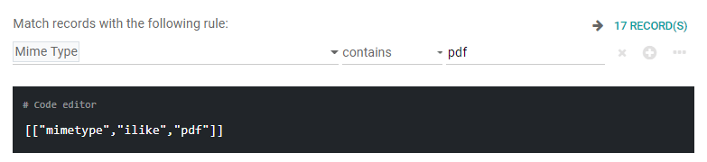

=========
Documents
=========

**Odoo Documents** allows you to store, view and manage files within Odoo.

You can upload any type of file (max 64MB per file on Odoo Online/SaaS), and organize them in
various workspaces.

.. seealso::
  - `Odoo Documents: product page <https://www.odoo.com/app/documents>`_
  - `Odoo Tutorials: Documents basics <https://www.odoo.com/slides/slide/documents-basics-674>`_
  - `Odoo Tutorials: Using Documents with your Accounting App <https://www.odoo.com/slides/slide/using-documents-with-your-accounting-app-675?fullscreen=1#>`_

Configuration
=============

By going to :menuselection:`Configuration --> Settings`, you can enable the centralization of files
attached to a specific area of your activity. For example, by ticking :guilabel:`Human Resources`,
your HR documents are automatically available in the HR workspace, while documents related to
Payroll are automatically available in the sub workspace Payroll. This can be updated by changing
the value in the dropdown menu. The external link allows you to edit the selected workspace.

.. image:: documents/files-centralization.png
  :align: center
  :alt: Enable the centralization of files attached to a specific area of your activity.

.. note::
  If you enable the centralization of your accounting files and documents, it is necessary to click
  on :guilabel:`Journals` and define each journal independently to allow automatic synchronization.

Workspaces
==========

Workspaces are defined by hierarchical folders having their own set of tags and actions. By-default
workspaces exist, but you can create your own by going to
:menuselection:`Configuration --> Workspaces` and clicking on :guilabel:`CREATE`.

.. note::
  :guilabel:`Sub-workspaces` can also be created, edited, or deleted by clicking on the
  :guilabel:`gear icon` on the main page' left menu in the Documents app.

Tags
====

Tags are used within the workspaces to add a level of differentiation between documents. They are
organized per category and filters can be used  to sort them. Tags can be created and modified by
going to :menuselection:`Configuration --> Tags`.

.. note::
  - The tags of a parent workspace apply to the child workspaces automatically.
  - Tags can also be created, edited or deleted, by clicking on the :guilabel:`gear icon`, on the
    left menu.

Documents Management
====================

When clicking on a specific document, the right panel displays the options that are available for
your document. On the top, you can click on the small icons to :guilabel:`Download`,
:guilabel:`Share this selection`, :guilabel:`Replace`, :guilabel:`Lock` or :guilabel:`Split`. It is
also possible to :guilabel:`Open chatter` or :guilabel:`Archive` the document.

.. image:: documents/right-panel-options.png
  :align: center
  :alt: right panel options

.. note::
   The :guilabel:`Open chatter` option allows to :guilabel:`Send Message` (to everyone following the
   document), to :guilabel:`Log Note`, or to :guilabel:`Schedule activity`. You can also
   :guilabel:`Attach files`, :guilabel:`Follow/Unfollow` the document or show followers.

The name of your file can be edited in the :guilabel:`Document` box. A :guilabel:`Contact` or an
:guilabel:`Owner` can also be assigned to your document. The related :guilabel:`Workspace` can be
modified and you have the possibility to add :guilabel:`Tags`.

.. image:: documents/right-panel-options-2.png
  :align: center
  :alt: right panel options

Finally, different :guilabel:`Actions` are available at the bottom of the right panel, depending on
the workspace where your document is stored.

.. image:: documents/right-panel-options.png
  :align: center
  :alt: right panel actions

Workflow actions
================

For each workspace, it is possible to configure specific workflow actions that are automated actions
that can be created and customized at the level of each workspace. Ie: create documents, process
bills, sign, organize files, etc.

They appear on the right panel when it meets the criteria you set. That way, you can, for example,
add tags to a file or move it to another workspace with a single click. Workflow actions help you
streamline the management of your documents and your overall business operations.

Create workflow actions
-----------------------

To create workflow actions, go to :menuselection:`Documents --> Configuration --> Workspaces` and
select the workspace where the action should apply. Click on the :guilabel:`Actions` smart button,
and then on :guilabel:`Create`.

.. note::
  An action applies to all :guilabel:`Child Workspaces` under the :guilabel:`Parent Workspace` you
  selected.

.. tip::
  You can directly access all your actions by going to :menuselection:`Documents --> Configuration
  --> Actions`.

Set the conditions
------------------

You can :guilabel:`Create` a new :guilabel:`Action` or edit an existing one. You can define the
:guilabel:`Action Name` and then set the conditions that trigger the appearance of the
:guilabel:`action button` on the right-side panel when selecting a file.

There are three basic types of conditions you can set:

#. :guilabel:`Tags`: you can both use the :guilabel:`Contains` and :guilabel:`Does not contain`
   conditions, meaning the files *must have* or *mustn't have* the tags set here.

#. :guilabel:`Contact`: the files must be associated with the contact set here.

#. :guilabel:`Owner`: the files must be associated with the owner set here.

.. image:: documents/basic-condition-example.png
  :align: center
  :alt: Example of a workflow action's basic condition in Odoo Documents

.. tip::
  If you don't set any conditions, the action button appears for all files located inside the
  selected workspace.

Advanced condition type: domain
~~~~~~~~~~~~~~~~~~~~~~~~~~~~~~~

.. important::
  It is recommended to have some knowledge of Odoo development to properly configure
  :guilabel:`Domain` filters.

To access the :guilabel:`Domain` condition, the :ref:`developer mode <developer-mode>` needs to be
activated. Once it is done, select the :guilabel:`Domain` condition type, and click on
:guilabel:`Add Filter`.

To create a rule, select a :guilabel:`field`, an :guilabel:`operator`, and a
:guilabel:`value`. For example, if you want to add a workflow action to all the PDF files inside a
workspace, set the :guilabel:`field` to *Mime Type*, the :guilabel:`operator` to *contains*, and the
:guilabel:`value` to *pdf*.

Click on :guilabel:`Add node` (plus-circle icon) and :guilabel:`Add branch` (ellipsis icon) to add
conditions and sub-conditions.

You can also specify if your rule should match :guilabel:`ALL` or :guilabel:`ANY` conditions and you
can edit the rule using the :guilabel:`Code editor`.

Configure the actions
---------------------

Select the :guilabel:`Actions` tab to set up your action. You can simultaneously:

- **Set Contact**: add a contact to the file, or replace an existing contact with a new one.
- **Set Owner**: add an owner to the file, or replace an existing owner with a new one.
- **Move to Workspace**: move the file to any workspace.
- **Create**: create one of the following items attached to the file in your database:

  - :guilabel:`Link to record`
  - :guilabel:`Product template`: create a product you can edit directly.
  - :guilabel:`Task`: create a Project task you can edit directly.
  - :guilabel:`Signature PDF Template`: : open PDF in Sign to create a template.
  - :guilabel:`PDF to sign`: open PDF in Sign to create a template.
  - :guilabel:`Applicant`: create a new HR application you can edit directly.
  - :guilabel:`Vendor bill`: create a vendor bill using OCR and AI to scrape information from the file content.
  - :guilabel:`Customer invoice`: create a customer invoice using OCR and AI to scrape information from the file.
  - :guilabel:`Vendor credit note`: create a vendor credit note using OCR and AI to scrape information from the file.
  - :guilabel:`Credit note`: create a customer credit note using OCR and AI to scrape information from the file.

- **Set Tags**: add, replace by or remove any number of tags.

In the :guilabel:`Activities` section, you can decide to:

- :guilabel:`Mark all as Done`: mark all activities linked to the file as done.
- :guilabel:`Schedule Activity`: create a new activity linked to the file as configured in the action.

Digitize documents with OCR and Artificial Intelligence
=======================================================

Documents available in the Finance workspace can be digitized. Select the document you want to
digitize, click on :guilabel:`Create Bill`, :guilabel:`Create Customer Invoice` or
:guilabel:`Create credit note`, and then click on :guilabel:`Send for Digitization`.

.. seealso::
  - `AI-powered document digitization <https://www.odoo.com/documentation/15.0/applications/finance/accounting/payables/supplier_bills/invoice_digitization.html>`_
