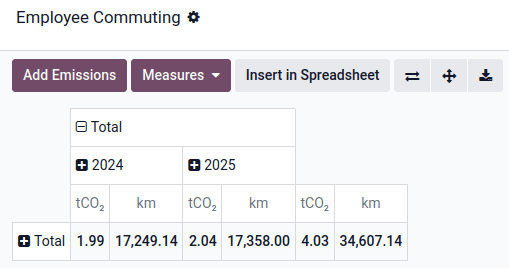

===
ESG
===

The ESG (Environment, Social, and Governance) app helps you automate ESG data collection by
integrating with apps like Accounting, Fleet, Payroll, and Employees. It pulls data from your
operations to build your ESG reports, based on legal and sustainability reporting requirements,
while giving you a real-time view of your emissions and other key ESG metrics.

Carbon footprint
================

The carbon footprint tool automates emissions tracking by collecting data from accounting records
(purchases, expenses, etc.) and employee commuting activity, and supports manual inputs. Emissions
are updated in real time, allowing for continuous monitoring and reporting. You can:

- Track your daily environmental impact.
- Evaluate the immediate effect of your reduction actions.
- Prioritize targeted changes.
- Continuously monitor and refine your sustainability strategy.

.. admonition:: Emissions (kgCO₂e) formula

   `Activity data` × `Emission factor`

Activity data sources
---------------------

The following data sources are used:

- :ref:`Accounting <esg/accounting>`
- :ref:`Fleet <esg/fleet>`
- :ref:`Manual inputs <esg/manual>`

.. _esg/accounting:

Accounting
~~~~~~~~~~

Odoo collects activity data from journal entries posted to expense and asset accounts. These
include:

- Fixed assets
- Expenses
- Other expenses
- Cost of revenue

Only these account types are considered for carbon footprint calculations, in line with the *Bilan
Carbone* methodology.

.. _esg/fleet:

Fleet
~~~~~

Odoo calculates commuting emissions using data from the Fleet and Employees apps.

.. admonition:: Employee commuting emissions formula

   `Days` × `Home-work distance` × `2` × (`Number of office days` / `7`) × `Vehicle model CO₂
   emissions`

To ensure accurate calculations:

- Define the average number of days per week the employees commute to the office by going to
  :menuselection:`ESG --> Configuration --> Settings` and filling in the :guilabel:`Weekly Office
  Attendance`.
- Set the emissions of each vehicle model by going to :menuselection:`Fleet --> Configuration -->
  Models`, selecting a model, and entering its :guilabel:`CO₂ Emissions`.
- Set each employee's home-to-work distance by opening the :guilabel:`Employees` app, selecting an
  employee, and filling in the employee's :guilabel:`Home-Work Distance`.

.. note::
   The employee vehicle's :guilabel:`Start Date` and, if applicable, :guilabel:`End Date`, are used
   to calculate the emissions. Ensure they are set by opening the :guilabel:`Employees` app,
   selecting an employee, and clicking the :guilabel:`Cars` smart button.

To access the employee commuting emissions pivot table, go to :menuselection:`ESG --> Collect -->
Employee Commuting`.

To add the data to the emitted emissions, click :guilabel:`Add Emissions`, define the
:guilabel:`Emissions Period` that should be covered, and click :guilabel:`Save`.

.. _esg/manual:

Manual input
~~~~~~~~~~~~

You can manually enter emissions for activities that not tracked automatically (e.g., employee
lunches, waste, etc.). To do so, go to :menuselection:`ESG --> Collect --> Emitted Emissions` and
click :guilabel:`New`, then:

- Name the activity.
- Select a :guilabel:`Date`.
- Select an :guilabel:`Emission factor`.
- Enter a :guilabel:`Quantity`.

Once saved, the entry appears under :menuselection:`ESG --> Collect --> Emitted Emissions` and is
included in the carbon footprint report.

Emission factors
----------------

An emission factor is a coefficient that indicates the rate at which a specific activity emits
greenhouse gases into the atmosphere.

Source database
~~~~~~~~~~~~~~~

Import the data from a certified emission factors database by going to :menuselection:`ESG -->
Configuration --> Source Databases`. Click :guilabel:`Download` on the `ADEME
<https://www.ademe.fr/en/our-missions/data>`_ database to import its emission factors and sources.

Main components of an emission factor
~~~~~~~~~~~~~~~~~~~~~~~~~~~~~~~~~~~~~

Source
******

Each emission factor is assigned to a scope, following the GHG Protocol:

- Scope 1 – Direct emissions (e.g., fuel burned on-site or in company vehicles)
- Scope 2 – Indirect emissions from purchased energy (e.g., electricity or heat)
- Scope 3 – All other indirect emissions across the value chain (e.g., purchased goods, travel,
  waste)

Scopes can be structured hierarchically (parent-child) for more detailed categorization, such as
"Scope 3: Others Indirect > Purchased Goods > Electronics".

Uncertainty
***********

Uncertainty represents the potential margin of error in an emission factor. It reflects how precise
or reliable the factor is when estimating emissions for a given activity, based on the quality of
data, assumptions used, and calculation methodology.

It helps you assess the confidence level of the emissions data used in the reporting.

Compute method
**************

The compute method determines whether emissions are calculated using physical quantities (e.g., kg,
liters, units) or monetary values (e.g., € spent). In physical mode, the system uses the quantity
from the transaction (e.g., 10 units × :abbr:`EF (emission factor)` per unit). In monetary mode, it
uses the transaction amount (e.g., €500 × :abbr:`EF (emission factor)` per €).

Gas emissions lines
*******************

Each emission factor can include multiple gas emission lines, representing the different greenhouse
gases involved in the activity. The ESG app includes the six main gases from the Kyoto Protocol —
CO₂, CH₄, N₂O, HFCs, PFCs, SF₆ — each with a predefined Global Warming Potential (GWP) used to
convert them into a common unit: CO₂-equivalent (kgCO₂e).

.. tip::
   Add more specific gases by going to :menuselection:`ESG --> Configuration --> Gases`.

Each gas line can be linked to an activity type such as production, transport, or use, allowing for
detailed breakdowns in your emissions reporting.

The final emission factor value is the sum of all these gases’ emissions converted into
CO₂-equivalents.

Assignation rules
~~~~~~~~~~~~~~~~~

Assignation rules allow emission factors to be automatically applied to relevant activity data based
on specific criteria: the product, partner, and/or account involved in the transaction.

.. example::
   You have assigned an emission factor to the *Zenith Pro Computer* product and later receive a
   vendor bill for 150 units; the system automatically applies the assigned emission factor,
   multiplying the emission factor's emissions (kgCO₂e) by 150.

To define assignation rules on emissions factors, go to :menuselection:`ESG --> Configuration -->
Emission Factors` and select an emission factor. Under the :guilabel:`Assignations` tab, click
:guilabel:`Add a line`, and select a record for one or more of the following attributes:
:guilabel:`Product`, :guilabel:`Partner`, and :guilabel:`Account`.

All attributes have to match for the rule to be applied.

.. important::
   Ensure the unit of measure set next to the product's :guilabel:`Cost` matches the emission
   factor's :guilabel:`Unit of Measure`.

   .. image:: esg/product-unit-of-measure.png
      :alt: A product's unit of measure

   If the field is not displayed, go to :menuselection:`Accounting --> Configuration --> Settings`
   and enable the :guilabel:`Units of Measure & Packagings` option.

.. tip::
   Accounting journal entries with a missing emission factor can be found by clicking
   :guilabel:`Emissions to define` under the :guilabel:`Collect Emissions` card on the dashboard.

Rules priority
**************

When multiple assignation rules match, Odoo prioritizes the most specific rule based on the
following criteria:

#. Attribute specificity: Odoo first evaluates rules by the most precise attribute, following this
   priority hierarchy (from most to least specific):

   #. Product
   #. Partner
   #. Account

#. Attribute count: if multiple rules share the same level of attribute specificity, Odoo then
   considers the number of attributes in the rule. The rule with more attributes defined will take
   priority.

.. example::
   **Example 1**

   *Emission factor #1 assignation rule*

   .. list-table::
      :header-rows: 1

      * - Account
        - Partner
        - Product
      * - *Any Account*
        - *Any Partner*
        - **Zenith Pro Computer**

   *Emission factor #2 assignation rule*

   .. list-table::
      :header-rows: 1

      * - Account
        - Partner
        - Product
      * - *Any Account*
        - **Digital Den**
        - *Any Product*

   Given the assignation rules above, all products purchased from **Digital Den** will be assigned
   emission factor **#2**, except the **Zenith Pro Computer** product, which will be assigned
   emission factor **#1**.

   **Example 2**

   *Emission factor #1 assignation rule*

   .. list-table::
      :header-rows: 1

      * - Account
        - Partner
        - Product
      * - *Any Account*
        - *Any Partner*
        - **Zenith Pro Computer**

   *Emission factor #2 assignation rule*

   .. list-table::
      :header-rows: 1

      * - Account
        - Partner
        - Product
      * - *Any Account*
        - **Digital Den**
        - **Zenith Pro Computer**

   Given the assignation rules above, any purchased **Zenith Pro Computer** will be assigned
   emission factor **#1**, except if purchased from the **Digital Den**, which will be assigned
   emission factor **#2**.

Apply retroactively
*******************

Once your emission factors are configured with assignation rules, you can also apply them
retroactively to past activity data.

To do so, go to :menuselection:`ESG -->  Configuration --> Emission Factors`, select an emission
factor, and click :guilabel:`Assign`. Select an :guilabel:`Application Period`, and, if desired,
enable the :guilabel:`Replace existing assignations` option.

.. tip::
   Apply emission factors in bulk by selecting multiple emission factors in :icon:`oi-view-list`
   list view and clicking :icon:`fa-cog` (:guilabel:`Actions`) :menuselection:`--> Assign Emission
   Factors`.

Sex parity and pay gap
======================

Sex parity tracks the distribution of sexes across the workforce, such as comparing women and
men in technical vs. administrative roles, permanent vs. temporary contracts, different office
locations, or management vs. non-management positions.

These insights, based on employee data, are essential for CSRD reporting under ESRS S1 and will also
support future VSME standards.

To view a company's sex parity and pay gap measures, set the sex of each employee by opening the
:guilabel:`Employees` app and selecting an employee. Under the :guilabel:`Private Information` tab,
select the employee's :guilabel:`Gender`.

The pay gap is calculated using the wages set on the employees' Payroll contracts for the same jobs.

.. admonition:: Pay gap formula

   ((`Average male salary` – `Average female salary`) / `Average male salary`) × `100`

Access the measures by clicking :menuselection:`ESG --> Measure --> Sex Parity / Pay Gap`.

.. tip::
   Use the different :ref:`Group By <search/group>` options to break down the data by
   :guilabel:`Leadership Level`, :guilabel:`Department`, :guilabel:`Job Position`,
   :guilabel:`Contract Type`, or :guilabel:`Country`.

   .. image:: esg/sex-graph-group-by.png
      :alt: The sex parity graph filtering options

Initiatives
===========

Go to :menuselection:`ESG --> Act --> Initiatives` to access all the :doc:`Project
<../services/project>` features, and start taking action on your impact. You can estimate CO₂
savings for each task, track progress, and assign team members with deadlines.

.. note::
   Estimated CO₂ reductions do not immediately lower your carbon footprint. The real impact shows
   only when these reductions are reflected in your operations.
