:show-content:

========
Expenses
========

Odoo **Expenses** streamlines the management of expenses. After an employee submits their expenses
in Odoo, the expenses are reviewed by management and accounting teams. Once approved, payments can
then be processed and disbursed back to the employee for reimbursement(s).

.. seealso::
   `Odoo Expenses: product page <https://www.odoo.com/app/expenses>`_

Set expense categories
======================

The first step to track expenses is to configure the different types of expenses for the company
(managed as *expense categories* in Odoo). Each category can be as specific or generalized as
needed. Go to :menuselection:`Expenses app --> Configuration --> Expense Categories` to view the
current expensable categories in a default list view.

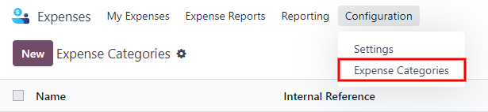

To create a new expense category, click :guilabel:`New`. A product form will appear, with the
description field labeled :guilabel:`Product Name`.

.. note::
   Expense categories are managed like products in Odoo. The expense category form follows the
   standard product form in Odoo, and the information entered is similar. Expense products will be
   referred to as expense categories throughout this document since the main menu refers to these as
   :guilabel:`Expense Categories`.

Only two fields are required, the :guilabel:`Product Name` and the :guilabel:`Unit of Measure`.
Enter the :guilabel:`Product Name` in the field, and select the :guilabel:`Unit of Measure` from the
drop-down menu (most products will be set to :guilabel:`Units`).

.. tip::
   The *Sales* app is where specification on the units of measure are created and edited (e.g.
   units, miles, nights, etc.). Go to :menuselection:`Sales app --> Configuration --> Settings` and
   ensure `Units of Measure` is enabled in the `Product Catalog` section. Click on the
   :guilabel:`Units of Measure` internal link to :doc:`view, create, and edit the units of measure
   <../inventory_and_mrp/inventory/product_management/product_replenishment/uom>`.

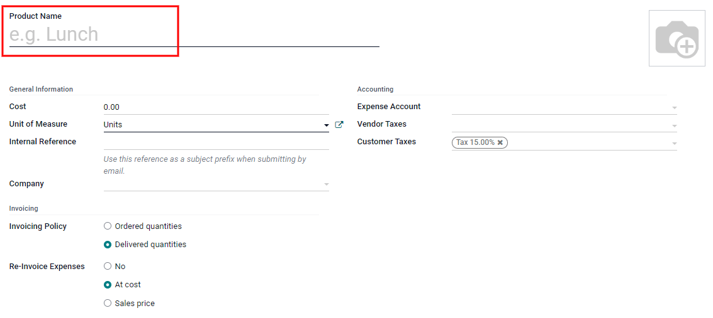

The :guilabel:`Cost` field on the product form is populated with a value of `0.00` by default. When
a specific expense should always be reimbursed for a particular price, enter that amount in the
:guilabel:`Cost` field. Otherwise, leave the :guilabel:`Cost` set to `0.00`, and employees will
report the actual cost when submitting an expense report.

.. note::
   The :guilabel:`Cost` field is always visible on the expense category form, but the
   :guilabel:`Sales Price` field is *only* visible if the :guilabel:`Sales Price` is selected under
   the :guilabel:`Re-Invoice Expenses` section. Otherwise, the :guilabel:`Sales Price` field is
   hidden.

.. example::
   Here are some examples for when to set a specific :guilabel:`Cost` on a product vs. leaving the
   :guilabel:`Cost` at `0.00`:

   - **Meals**: Set the :guilabel:`Cost` to `0.00`. When an employee logs an expense for a meal,
     they enter the actual amount of the bill and will be reimbursed for that amount. An expense for
     a meal costing $95.23 would equal a reimbursement for $95.23.
   - **Mileage**: Set the :guilabel:`Cost` to `0.30`. When an employee logs an expense for
     "mileage", they enter the number of miles driven in the :guilabel:`Quantity` field, and are
     reimbursed 0.30 per mile they entered. An expense for 100 miles would equal a reimbursement for
     $30.00.
   - **Monthly Parking**: Set the :guilabel:`Cost` to `75.00`. When an employee logs an expense for
     "monthly parking", the reimbursement would be for $75.00.
   - **Expenses**: Set the :guilabel:`Cost` to `0.00`. When an employee logs an expense that is not
     a meal, mileage, or monthly parking, they use the generic :guilabel:`Expenses` product. An
     expense for a laptop costing $350.00 would be logged as an :guilabel:`Expenses` product, and
     the reimbursement would be for $350.00.

Select an :guilabel:`Expense Account` if using the Odoo *Accounting* app. It is recommended to check
with the accounting department to determine the correct account to reference in this field as it
will affect reports.

Set a tax on each product in the :guilabel:`Vendor Taxes` and :guilabel:`Customer Taxes` fields, if
applicable. It is considered good practice to use a tax that is configured with :ref:`Tax Included
in Price <taxes/included-in-price>`. Taxes will be automatically configured if this is set.

.. _expenses/new:

Record expenses
===============

Manually create a new expense
-----------------------------

To record a new expense, begin in the main :menuselection:`Expenses` app dashboard, which presents
the default :guilabel:`My Expenses` view. This view can also be accessed from
:menuselection:`Expenses app --> My Expenses --> My Expenses`.

First, click :guilabel:`New`, and then fill out the various fields on the form.

- :guilabel:`Description`: Enter a short description for the expense in the :guilabel:`Description`
  field. This should be short and informative, such as `lunch with client` or `hotel for
  conference`.
- :guilabel:`Category`: Select the expense category from the drop-down menu that most closely
  corresponds to the expense. For example, an airplane ticket would be appropriate for an expense
  :guilabel:`Category` named :guilabel:`Air Travel`.
- :guilabel:`Total`: Enter the total amount paid for the expense in one of two ways:

  #. If the expense is for one single item/expense, and the category selected was for a single item,
     enter the cost in the :guilabel:`Total` field (the :guilabel:`Quantity` field is hidden).
  #. If the expense is for multiples of the same item/expense with a fixed price, the
     :guilabel:`Unit Price` is displayed. Enter the quantity in the :guilabel:`Quantity` field, and
     the total cost is automatically updated with the correct total (the :guilabel:`Unit Price` x
     the :guilabel:`Quantity` = the total). Be advised, the word "total" does not appear, the total
     cost simply appears below the :guilabel:`Quantity`.

     .. example::
        For example, in the case of mileage driven, the :guilabel:`Unit Price` is populated as the
        cost *per mile*. Set the :guilabel:`Quantity` to the *number of miles* driven, and the total
        is calculated.

- :guilabel:`Included Taxes`: If taxes were configured on the expense category, the tax percentage
  and amount appear automatically after entering either the :guilabel:`Total` or the
  :guilabel:`Quantity`.

  .. note::
     When a tax is configured on an expense category, the :guilabel:`Included Taxes` value will
     update in real time as the :guilabel:`Total` or :guilabel:`Quantity` is updated.

- :guilabel:`Employee`: Using the drop-down menu, select the employee this expense is for.
- :guilabel:`Paid By`: Click the radio button to indicate who paid for the expense and should be
  reimbursed. If the employee paid for the expense (and should be reimbursed) select
  :guilabel:`Employee (to reimburse)`. If the company paid directly instead (e.g. if the company
  credit card was used to pay for the expense) select :guilabel:`Company`. Depending on the expense
  category selected, this field may not appear.
- :guilabel:`Bill Reference`: If there is any reference text that should be included for the
  expense, enter it in this field.
- :guilabel:`Expense Date`: Using the calendar module, enter the date the expense was incurred. Use
  the :guilabel:`< (left)` and :guilabel:`> (right)` arrows to navigate to the correct month, then
  click on the specific day to enter the selection.
- :guilabel:`Account`: Select the expense account that this expense should be logged on from the
  drop-down menu.
- :guilabel:`Customer to Reinvoice`: If the expense is something that should be paid for by a
  customer, select the :abbr:`SO (Sales Order)` and customer that will be invoiced for this expense
  from the drop-down menu. All sales orders in the drop-down menu list both the :abbr:`SO (Sales
  Order)` as well as the company the sales order is written for, but after the expense is saved, the
  customer name disappears and only the :abbr:`SO (Sales Order)` is visible on the expense.

  .. example::
     A customer wishes to have an on-site meeting for a custom garden (design and installation) and
     agrees to pay for the expenses associated with it (such as travel, hotel, meals, etc.). All
     expenses tied to that meeting would indicate the sales order for the custom garden (which also
     references the customer) as the :guilabel:`Customer to Reinvoice`.

- :guilabel:`Analytic Distribution`: Select the account(s) the expense should be written against
  from the drop-down menu for either :guilabel:`Projects`, :guilabel:`Departments`, or both.
  Multiple accounts can be listed for each category if needed. Adjust the percentage for each
  analytic account by typing in the percentage value next to the account.
- :guilabel:`Company`: If multiple companies are set up, select the company this expense should be
  filed for from the drop-down menu. The current company will automatically populate this field.
- :guilabel:`Notes...`: If any notes are needed in order to clarify the expense, enter them in the
  notes field.

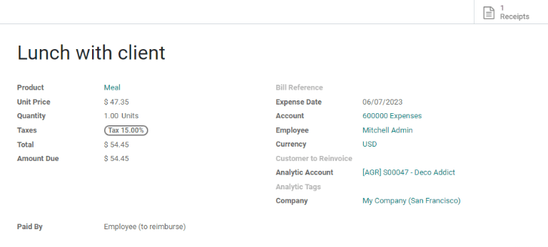

Attach a receipt
~~~~~~~~~~~~~~~~

After the expense is created, the next step is to attach a receipt. Click the :guilabel:`Attach
Receipt` button, and a file explorer appears. Navigate to the receipt to be attached, and click
:guilabel:`Open`. The new receipt is recorded in the chatter, and the number of receipts will appear
next to the :guilabel:`📎 (paperclip)` icon beneath the expense form. More than one receipt can be
attached to an individual expense, as needed. The number of receipts attached to the expense will be
noted on the paperclip icon.

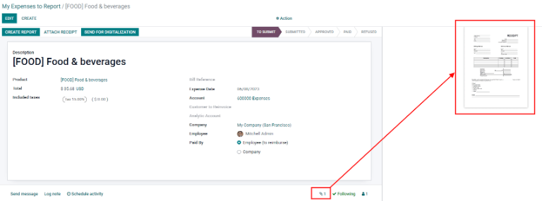

Create new expenses from a scanned receipt
------------------------------------------

Rather than manually inputting all of the information for an expense, expenses can be created by
scanning a PDF receipt.

First, in the main :guilabel:`Expenses` app dashboard view (this view can also be accessed from
:menuselection:`Expenses app --> My Expenses --> My Expenses`), click :guilabel:`Scan`, and a file
explorer pops up. Navigate to the receipt to be uploaded, click on it to select it, and then click
:guilabel:`Open`.

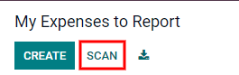
         view.

The receipt is scanned, and a new entry is created with today's date as the :guilabel:`Expense
Date`, and any other fields it can populate based on the scanned data, such as the total. Click on
the new entry to open the individual expense form, and make any changes needed. The scanned receipt
appears in the chatter.

.. _expenses/new_from_email:

Automatically create new expenses from an email
-----------------------------------------------

Instead of individually creating each expense in the *Expenses* app, expenses can be automatically
created by sending an email to an email alias.

To do so, first, an email alias needs to be configured. Go to :menuselection:`Expenses app -->
Configuration --> Settings`. Ensure :guilabel:`Incoming Emails` is enabled.

.. image:: expenses/email-alias.png
   :align: center
   :alt: Create the domain alias by clicking the link.

.. note::
   If the domain alias needs to be set up, :guilabel:`Setup your domain alias` will appear beneath
   the incoming emails check box instead of the email address field. Refer to this documentation for
   setup instructions and more information:
   :doc:`/applications/websites/website/configuration/domain_names`. Once the domain alias is
   configured, the email address field will be visible beneath the incoming emails section.

Next, enter the email address to be used in the email field, and then click :guilabel:`Save`. Now
that the email address has been entered, emails can be sent to that alias to create new expenses
without having to be in the Odoo database.

To submit an expense via email, create a new email and enter the product's *internal reference* code
(if available) and the amount of the expense in the email subject. Next, attach the receipt to the
email. Odoo creates the expense by taking the information in the email subject and combining it with
the receipt.

To check an expense categories internal reference, go to :menuselection:`Expenses app -->
Configuration --> Expense Categories`. If an internal reference is listed on the expense category,
it is listed in the :guilabel:`Internal Reference` column.

.. image:: expenses/ref.png
   :align: center
   :alt: Internal reference numbers are listed in the main Expense Categories view.

To add an internal reference on an expense category, click on the category to open the form. Enter
the internal reference in the field. Beneath the :guilabel:`Internal Reference` field, this sentence
appears: :guilabel:`Use this reference as a subject prefix when submitting by email.`

.. image:: expenses/mileage-internal-reference.png
   :align: center
   :alt: Internal reference numbers are listed in the main Expense Products view.

.. note::
   For security purposes, only authenticated employee emails are accepted by Odoo when creating an
   expense from an email. To confirm an authenticated employee email address, go to the employee
   card in the :menuselection:`Employees` app, and refer to the :guilabel:`Work Email`

   .. image:: expenses/authenticated-email-address.png
      :align: center
      :alt: Create the domain alias by clicking the link.

.. example::
   If submitting an expense via email for a $25.00 meal during a work trip, the email subject would
   be `FOOD $25.00`.

   Explanation:

   - The :guilabel:`Internal Reference` for the expense category `Meals` is `FOOD`
   - The :guilabel:`Cost` for the expense is `$25.00`

.. _expenses/report:

Create an expense report
========================

When expenses are ready to submit (such as at the end of a business trip, or once a month), an
*expense report* needs to be created. Go to the main :menuselection:`Expenses` app dashboard, which
displays a default :guilabel:`My Expenses` view, or go to :menuselection:`Expenses app --> My
Expenses --> My Expenses`.

Expenses are color coded by status. Any expense with a status of :guilabel:`To Report` (expenses
that still need to be added to an expense report) the text appears in blue. All other statuses
(:guilabel:`To Submit`, :guilabel:`Submitted`, and :guilabel:`Approved`) the text appears in black.

First, select each individual expense for the report by clicking the check box next to each entry,
or quickly select all the expenses in the list by clicking the check box next to :guilabel:`Expense
Date`.

Another way to quickly add all expenses that are not on an expense report is to click
:guilabel:`Create Report` without selecting any expenses, and Odoo will select all expenses with a
status of :guilabel:`To Submit` that are not already on a report.

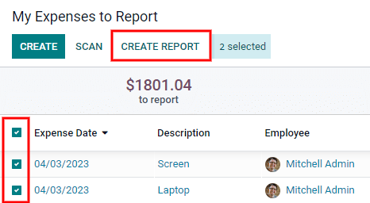

.. note::
   Any expense can be selected from the :guilabel:`My Expenses` list, regardless of status. The
   :guilabel:`Create Report` button is visible as long as there is a minimum of 1 expense with a
   status of :guilabel:`To Report` selected. When the :guilabel:`Create Report` button is clicked,
   only expenses with a status of :guilabel:`To Submit` that are *not* currently on another expense
   report will appear in the newly created expense report.

Once the expenses have been selected, click the :guilabel:`Create Report` button. The new report
appears with all the expenses listed in the :guilabel:`Expense` tab. If there is a receipt attached
to an individual expense, a :guilabel:`📎 (paperclip)` icon appears next to the :guilabel:`Customer
to Reinvoice` and :guilabel:`Analytic Distribution` columns.

When the report is created, the date range for the expenses appears in the :guilabel:`Expense Report
Summary` field by default. It is recommended to edit this field with a short summary for each report
to help keep expenses organized. Enter a short description for the expense report (such as `Client
Trip NYC`, or `Repairs for Company Car`) in the :guilabel:`Expense Report Summary` field. Next,
select a :guilabel:`Manager` from the drop-down menu to assign a manager to review the report. If
needed, the :guilabel:`Journal` can be changed. Use the drop-down menu to select a different
:guilabel:`Journal`.

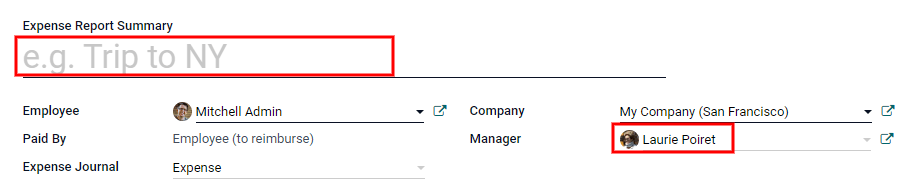

If some expenses are not on the report that should be, they can still be added. Click :guilabel:`Add
a line` at the bottom of the :guilabel:`Expense` tab. A pop up appears with all the available
expenses that can be added to the report (with a status of :guilabel:`To Submit`). Click the check
box next to each expense to add, then click :guilabel:`Select`. The items now appear on the report
that was just created. If a new expense needs to be added that does *not* appear on the list, click
:guilabel:`New` to create a new expense and add it to the report.

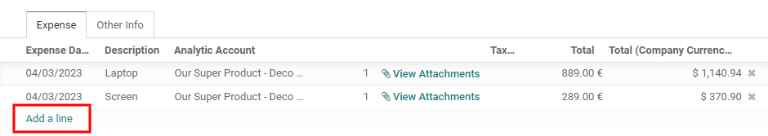

.. note::
   Expense reports can be created in one of three places:

   #. Go to the main :menuselection:`Expenses` app dashboard (also accessed by going to
      :menuselection:`Expenses app --> My Expenses --> My Expenses`)
   #. Go to :menuselection:`Expenses app --> My Expenses --> My Reports`
   #. Go to :menuselection:`Expenses app --> Expense Reports`

   In any of these views, click :guilabel:`New` to create a new expense report.

.. _expenses/submit:

Submit an expense report
------------------------

When an expense report is completed, the next step is to submit the report to a manager for
approval. Reports must be individually submitted, and cannot be submitted in batches. Open the
specific report from the list of expense reports (if the report is not already open). To view all
expense reports, go to :menuselection:`Expenses app --> My Expenses --> My Reports`.

If the list is large, grouping the results by status may be helpful since only reports that have a
:guilabel:`To Submit` status need to be submitted, reports with an :guilabel:`Approved` or
:guilabel:`Submitted` status do not.

The :guilabel:`To Submit` expenses are easily identifiable not just from the :guilabel:`To Submit`
status, but the text appears in blue, while the other expenses text appears in black.

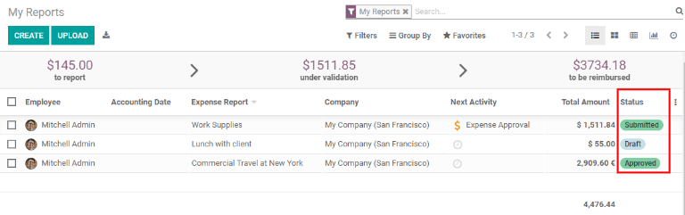

.. note::
   The status of each report is shown in the :guilabel:`Status` column on the right. If the
   :guilabel:`Status` column is not visible, click the :guilabel:`Additional Options (two dots)`
   icon at the end of the row, and enable :guilabel:`Status`.

Click on a report to open it, then click :guilabel:`Submit To Manager`. After submitting a report,
the next step is to wait for the manager to approve it.

.. important::
   The :ref:`expenses/approve`, :ref:`expenses/post`, and :ref:`expenses/reimburse` sections are
   **only** for users with the *necessary rights*.

.. _expenses/approve:

Approve expenses
================

In Odoo, not just anyone can approve expense reports— only users with the necessary rights (or
permissions) can. This means that a user must have at least *Team Approver* rights for the
*Expenses* app. Employees with the necessary rights can review expense reports, approve or reject
them, and provide feedback thanks to the integrated communication tool.

To see who has rights to approve, go to the main :menuselection:`Settings` app and click on
:guilabel:`Manage Users`.

.. note::
   If the *Settings* app is not available, then certain rights are not set on the account. Check the
   :guilabel:`Access Rights` tab of a user's card in the :menuselection:`Settings` app. the
   :guilabel:`Administration` section (bottom right of the :guilabel:`Access Rights` tab) is set to
   one of three options:

   - :guilabel:`None (blank)`: The user cannot access the *Settings* app at all.
   - :guilabel:`Access Rights`: The user can only view the :guilabel:`User's & Companies` section of
     the *Settings* app.
   - :guilabel:`Settings`: The user has access to the entire *Settings* app with no restrictions.

   Please refer to :doc:`this document </applications/general/users>` to learn more about managing
   users and their access rights.

Click on an individual to view their card, which displays the :guilabel:`Access Rights` tab in the
default view. Scroll down to the :guilabel:`Human Resources` section. Under :guilabel:`Expenses`,
there are four options:

- :guilabel:`None (blank)`: A blank field means the user has no rights to view or approve expense
  reports, and can only view their own.
- :guilabel:`Team Approver`: The user can only view and approve expense reports for their own
  specific team.
- :guilabel:`All Approver`: The user can view and approve any expense report.
- :guilabel:`Administrator`: The user can view and approve any expense report, as well as access the
  reporting and configuration menus in the *Expenses* app.

Users who are able to approve expense reports (typically managers) can easily view all expense
reports they have access rights to. Go to :menuselection:`Expenses app --> Expense Reports`, and a
list appears with all expense reports that have a status of either :guilabel:`To Submit`,
:guilabel:`Submitted`, :guilabel:`Approved`, :guilabel:`Posted`, or :guilabel:`Done`. Expense
reports with a status of :guilabel:`Refused` are hidden in the default view.

.. image:: expenses/expense-reports-list.png
   :align: center
   :alt: Reports to validate are found on the Reports to Approve page.

When viewing expense reports, there is a panel of filters that can be enabled or disabled on the
left side. The three categories that filters can be applied on are :guilabel:`Status`,
:guilabel:`Employee`, and :guilabel:`Company`. To view only expense reports with a particular
status, enable the specific status filter to display the expense reports with only that status.
Disable the specific status filter to hide the reports with that status. To view expense reports for
a particular employee and/or company, enable the specific employee name filter and/or company filter
in the :guilabel:`Employee` and :guilabel:`Company` sections.

Reports can be approved in two ways (individually or several at once) and refused only one way. To
approve multiple expense reports at once, remain in the list view. First, select the reports to
approve by clicking the check box next to each report, or click the box next to :guilabel:`Employee`
to select all the reports in the list.

.. important::
   Only reports with a status of :guilabel:`Submitted` can be approved. It is recommended to only
   display the submitted reports by adjusting the status filter on the left side by only having the
   :guilabel:`Submitted` filter enabled.

   If a report is selected that is unable to be approved, the :guilabel:`Approve Report` button
   **will not appear**, indicating there is a problem with the selected report(s).

Next, click the :guilabel:`Approve Report` button.

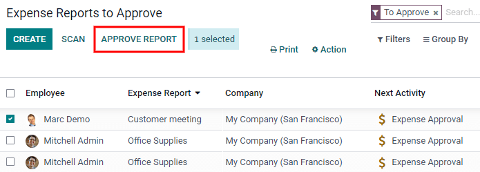

To approve an individual report, click on a report to go to a detailed view of that report. In this
view, several options are presented: :guilabel:`Approve`, :guilabel:`Report in Next Payslip`,
:guilabel:`Refuse`, or :guilabel:`Reset to draft`. Click :guilabel:`Approve` to approve the report.

If :guilabel:`Refuse` is clicked, a pop-up window appears. Enter a brief explanation for the refusal
in the :guilabel:`Reason to Refuse Expense` field, and then click :guilabel:`Refuse`.

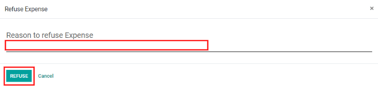

Team managers can easily view all the expense reports for their team members. While in the
:guilabel:`Expense Reports` view, click the drop-down arrow in the right-side of the search box, and
click on :guilabel:`My Team` in the :guilabel:`Filters` section. This presents all the reports for
the manager's team.

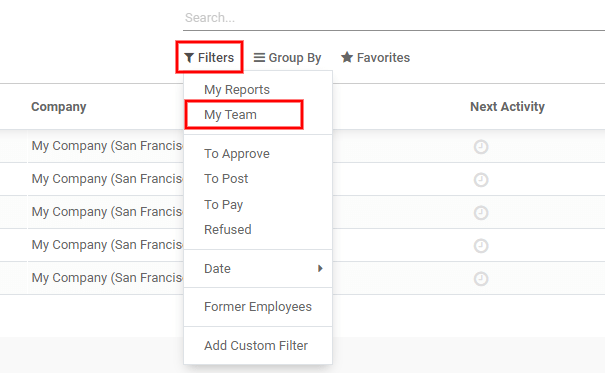

.. tip::
   If more information is needed, such as a missing receipt, communication is easy from the chatter.
   In an individual report, simply click :guilabel:`Send message` to open the message text box. Type
   in a message, tagging the proper person (if needed), and post it to the chatter by clicking
   :guilabel:`Send`. The message is posted in the chatter, and the person tagged will be notified
   via email of the message, as well as any followers.

   The only people that can be tagged in a message are *followers*. To see who is a follower, click
   on the :guilabel:`👤 (person)` icon to display the followers of the expense.

   .. image:: expenses/chatter.png
      :align: center
      :alt: Send messages in the chatter.

.. _expenses/post:

Post expenses in accounting
===========================

Once an expense report is approved, the next step is to post the report to the accounting journal.
To view all expense reports, go to :menuselection:`Expenses app --> Expense Reports`. To view only the
expense reports that have been approved and need to be posted, adjust the filters on the left side
so that only the :guilabel:`Approved` status is enabled.

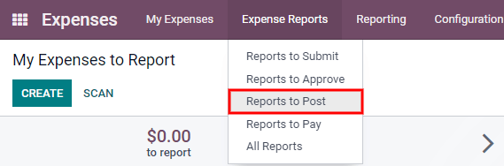

Just like approvals, expense reports can be posted in two ways (individually or several at once). To
post multiple expense reports at once, remain in the list view. First, select the reports to post by
clicking the check box next to each report, or click the box next to :guilabel:`Employee` to select
all the reports in the list. Next, click :guilabel:`Post Entries`.

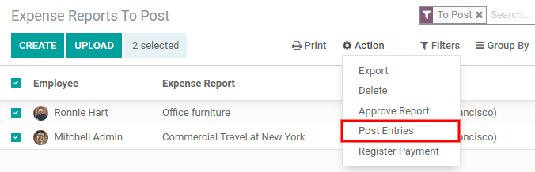

To post an individual report, click on a report to go to the detailed view of that report. In this
view, several options are presented: :guilabel:`Post Journal Entries`, :guilabel:`Report In Next
Payslip`, :guilabel:`Refuse`, or :guilabel:`Reset to Draft`. Click :guilabel:`Post Journal Entries`
to post the report.

If :guilabel:`Refuse` is clicked, a pop-up window appears. Enter a brief explanation for the refusal
in the :guilabel:`Reason to Refuse Expense` field, and then click :guilabel:`Refuse`. Refused
reports can be viewed by going to :menuselection:`Expenses app --> Expense Reports`, then adjusting
the filters on the left so that only :guilabel:`Refused` is selected. This will only show the
refused expense reports.

.. important::
   To post expense reports to an accounting journal, the user must have following access rights:

   - Accounting: Accountant or Adviser
   - Expenses: Manager

.. _expenses/reimburse:

Reimburse employees
===================

After an expense report is posted to an accounting journal, the next step is to reimburse the
employee. To view all the expense reports to pay, go to :menuselection:`Expenses app --> Expense
Reports --> Reports To Pay`.

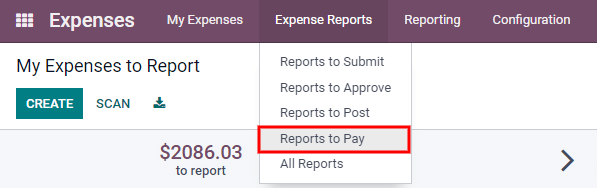

Just like approvals and posting, expense reports can be paid in two ways (individually or several at
once). To pay multiple expense reports at once, remain in the list view. First, select the reports
to pay by clicking the check box next to each report, or click the box next to :guilabel:`Employee`
to select all the reports in the list. Next, click :guilabel:`Register Payment`.

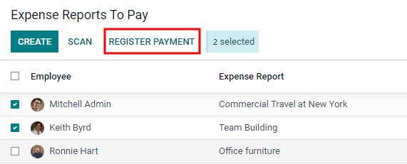

To pay an individual report, click on a report to go to a detailed view of that report. Click
:guilabel:`Register Payment` to pay the employee.

A :guilabel:`Register Payment` pop-up appears, and the :guilabel:`Journal`, :guilabel:`Payment
Method`, and :guilabel:`Payment Date` can be modified, if needed. When the selections are correct,
click :guilabel:`Create Payment` to send the payment to the employee.

To pay an individual report, click on a report in the list view to go to a detailed view of that
report. Click :guilabel:`Register Payment` to pay the employee. A :guilabel:`Register Payment`
pop-up appears, but when paying an individual expense report instead of several at once, more
options appear in the pop-up. In addition to the :guilabel:`Journal`, :guilabel:`Payment Method`,
and :guilabel:`Payment Date` fields, a :guilabel:`Recipient Bank Account`, :guilabel:`Amount`, and
:guilabel:`Memo` field appear. Select the employee's bank account from the drop-down menu to
directly deposit the payment to their account. When all other selections are correct, click
:guilabel:`Create Payment` to send the payment to the employee.

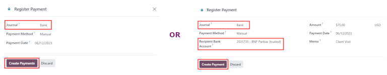
         expense reports at once.

Re-invoice expenses to customers
================================

If expenses are tracked on customer projects, expenses can be automatically charged back to the
customer. This is done by creating an expense, referencing the :abbr:`SO (Sales Order)` the expense
should be added to, and then creating the expense report. Next, managers approve the expense report,
and the accounting department posts the journal entries. Finally, once the expense report is posted
to a journal, the expense(s) appears on the :abbr:`SO (Sales Order)` that was referenced. The sales
order can then be invoiced, thus invoicing the customer for the expense.

Setup
-----

First, specify the invoicing policy for each expense category. Go to :menuselection:`Expenses app
--> Configuration --> Expense Categories`. Click on the expense category to open the expense
category form. Under the :guilabel:`Invoicing` section, click the radio button next to the desired
selection for :guilabel:`Re-Invoicing Expenses`. Options are :guilabel:`None`, :guilabel:`At cost`,
and :guilabel:`Sales price`.

:guilabel:`Re-Invoicing Expenses`:

- :guilabel:`None`: Expense category will not be re-invoiced.
- :guilabel:`At cost`: Expense category will invoice expenses at their real cost.
- :guilabel:`At sales price`: Expense category will invoice the price set on the sale order.

Create an expense
-----------------

First, when :ref:`creating a new expense <expenses/new>`, the correct information needs to be
entered in order to re-invoice a customer. Select the *sales order* the expense will appear on in
the :guilabel:`Customer to Reinvoice` section, from the drop-down menu. Next, select the
:guilabel:`Analytic Account` the expense will be posted to. After the expense(s) are created, the
expense report needs to be :ref:`created <expenses/report>` and :ref:`submitted <expenses/submit>`
as usual.

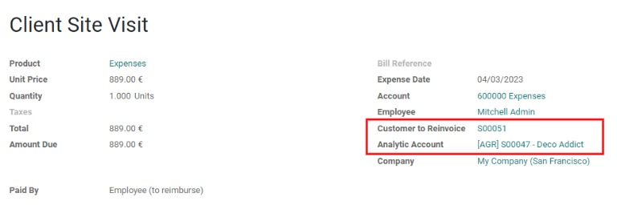

.. important::
   Selecting a :guilabel:`Customer to Reinvoice` when creating an expense is critical, since this is
   what causes the expenses to be automatically invoiced after an expense report is approved.

   The :guilabel:`Customer to Reinvoice` field can be modified *until an expense report is*
   **approved**, then the field is no longer able to be modified.

Validate and post expenses
--------------------------

Only employees with permissions (typically managers or supervisors) can :ref:`approve expenses
<expenses/approve>`. Before approving an expense report, ensure the :guilabel:`Analytic
Distribution` is set on every expense line of a report. If an :guilabel:`Analytic Distribution` is
missing, assign the correct account(s) from the drop-down menu, and then click :guilabel:`Approve`
or :guilabel:`Refuse`.

The accounting department is typically responsible for :ref:`posting journal entries
<expenses/post>`. Once an expense report is approved, it can then be posted. The :abbr:`SO (Sales
Order)` is **only** updated *after the journal entries are posted*. One the journal entries are
posted, the expenses now appear on the referenced :abbr:`SO (Sales Order)`.

Invoice expenses
----------------

Once the :abbr:`SO (Sales Order)` has been updated, it is time to invoice the customer. After the
expense report has been approved and the journal entries have been posted, click the
:guilabel:`Sales Orders` smart button to open the :abbr:`SO (Sales Order)`. The expenses to be
re-invoiced are now on the :abbr:`SO (Sales Order)`.

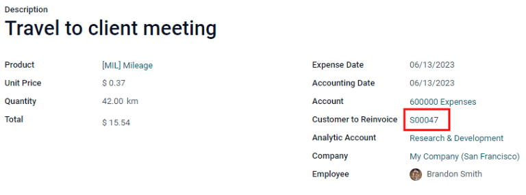
         by clicking on the sales order number.

.. note::
   More than one :abbr:`SO (Sales Order)` can be referenced on an expense report. If more than one
   :abbr:`SO (Sales Order)` is referenced, the :guilabel:`Sales Orders` smart button will list the
   number of :abbr:`SO (Sales Order)`'s. If multiple :abbr:`SO (Sales Order)`'s are listed, the
   :guilabel:`Sales Orders` smart button opens a list view of all the :abbr:`SO (Sales Order)`'s on
   the expense report. Click on a :abbr:`SO (Sales Order)` to open the individual :abbr:`SO (Sales
   Order)`.

The expenses are listed in the :abbr:`SO (Sales Order)` :guilabel:`Order Lines` tab.

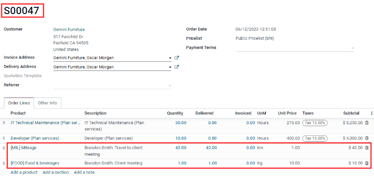

Next, click :guilabel:`Create Invoice`, and select if the invoice is for a :guilabel:`Regular
invoice`, a :guilabel:`Down payment (percentage)`, or a :guilabel:`Down payment (fixed amount)` by
clicking the radio button next to it. Then, click :guilabel:`Create Invoice`. The customer has now
been invoiced for the expenses.
