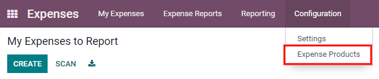
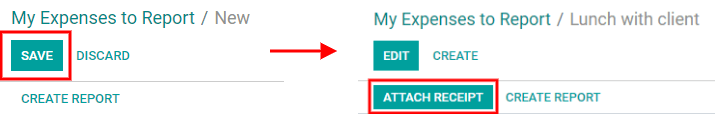
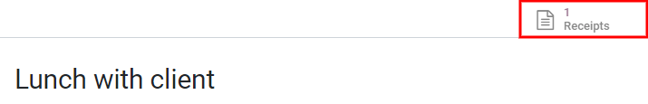
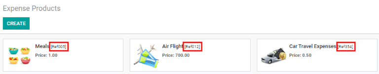
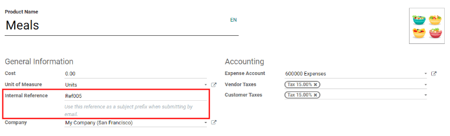
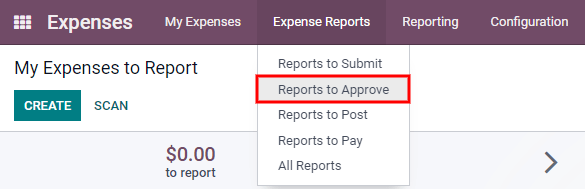
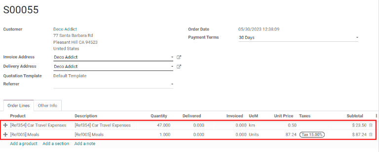

:show-content:

========
Expenses
========

Odoo **Expenses** streamlines the management of expenses.  After an employee submits their expenses
in Odoo, the expenses are reviewed by management and accounting teams. Once approved, payments can
then be processed and disbursed back to the employee for reimbursement(s).

.. seealso::
   `Odoo Expenses: product page <https://www.odoo.com/app/expenses>`_

Set expense types
=================

The first step to track expenses is to configure the different *expense types* for the company
(managed as *products* in Odoo). Each "product" can be as specific or generalized as needed. Go to
:menuselection:`Expenses app --> Configuration --> Expense Products` to view the current expensable
products in a default kanban view.

To create a new expense product, click :guilabel:`Create`. A product form will appear. Only two
fields are required, the :guilabel:`Product Name` and the :guilabel:`Unit of Measure`. Enter the
:guilabel:`Product Name` in the field, and select the :guilabel:`Unit of Measure` from the drop-down
menu (most products will be set to :guilabel:`Units`).

.. tip::
   The *Sales* app is where specification on the units of measure are created and edited (e.g.
   units, miles, nights, etc.). Go to :menuselection:`Sales app --> Configuration --> Settings` and
   ensure `Units of Measure` is checked off in the `Product Catalog` section. Click on the
   :guilabel:`Units of Measure` internal link to view, create, and edit the units of measure. Refer
   to :doc:`this document </applications/inventory_and_mrp/inventory/management/products/uom>` to
   learn more about units of measure and how to configure them.

.. image:: expenses/new-expense-product.png
   :align: center
   :alt: Set expense costs on products.

The :guilabel:`Cost` field on the product form is populated with a value of `0.00` by default. When
a specific expense should always be reimbursed for a particular price, enter that amount in the
:guilabel:`Cost` field. Otherwise, leave the :guilabel:`Cost` set to `0.00`, and employees will
report the actual cost when submitting an expense report.

.. example::
   Here are some examples for when to set a specific :guilabel:`Cost` on a product vs. leaving the
   :guilabel:`Cost` at `0.00`:

   - **Meals**: Set the :guilabel:`Cost` to `0.00`. When an employee logs an expense for a meal, they
     enter the actual amount of the bill and will be reimbursed for that amount. An expense for a
     meal costing $95.23 would equal a reimbursement for $95.23.
   - **Mileage**: Set the :guilabel:`Cost` to `0.30`. When an employee logs an expense for
     "mileage", they enter the number of miles driven, and are reimbursed 0.30 per mile they
     entered. An expense for 100 miles would equal a reimbursement for $30.00.
   - **Monthly Parking**: Set the :guilabel:`Cost` to `75.00`. When an employee logs an expense for
     "monthly parking", the reimbursement would be for $75.00.
   - **Expenses**: Set the :guilabel:`Cost` to `0.00`. When an employee logs an expense that is not
     a meal, mileage, or monthly parking, they use the generic :guilabel:`Expenses` product. An
     expense for a laptop costing $350.00 would be logged as an :guilabel:`Expenses` product, and
     the reimbursement would be for $350.00.

Select an :guilabel:`Expense Account` if using the Odoo *Accounting* app. It is recommended to check
with the accounting department to determine the correct account to reference in this field as it
will affect reports.

Set a tax on each product in the :guilabel:`Vendor Taxes` and :guilabel:`Customer Taxes` fields if
applicable. It is considered good practice to use a tax that is configured with :ref:`Tax Included
in Price <taxes/included-in-price>`. Taxes will be automatically configured if this is set.

.. _expenses/new:

Record expenses
===============

Manually create a new expense
-----------------------------

To record a new expense, begin in the main :menuselection:`Expenses` app dashboard, which presents
the default :guilabel:`My Expenses to Report` view. This view can also be accessed from
:menuselection:`Expenses app --> My Expenses --> My Expenses to Report`.

First, click :guilabel:`Create`, and then fill out the various fields on the form.

- :guilabel:`Description`: Enter a short description for the expense in the :guilabel:`Description`
  field. This should be short and informative, such as `lunch with client` or `hotel for
  conference`.
- :guilabel:`Product`: Select the product from the drop-down menu that most closely corresponds to
  the expense. For example, an airplane ticket would be appropriate for an expense
  :guilabel:`Product` named :guilabel:`Air Travel`.
- :guilabel:`Unit Price`: Enter the total amount paid for the expense in one of two ways:

  #. If the expense is for one single item/expense, enter the cost in the :guilabel:`Unit Price`
     field, and leave the :guilabel:`Quantity` `1.00`.
  #. If the expense is for multiples of the same item/expense, enter the price *per unit* in the
     :guilabel:`Unit Price` field, and enter the *quantity of units* in the :guilabel:`Quantity`
     field.

     .. example::
        In the case of a hotel stay, for example, the :guilabel:`Unit Price` would be set as the
        cost *per night*, and set the :guilabel:`Quantity` to the *number of nights* stayed.

- :guilabel:`Taxes`: If taxes were paid on the expense, select the tax percentage using the
  drop-down menu. Tax options are pre-configured based on the localization setting selected when the
  database was created. Adding any new taxes should only be done when necessary.

  .. note::
     When a tax is selected, the :guilabel:`Total` value will update in real time to show the added
     taxes.

- :guilabel:`Paid By`: Click the radio button to indicate who paid for the expense and should be
  reimbursed. If the employee paid for the expense (and should be reimbursed) select
  :guilabel:`Employee (to reimburse)`. If the company paid directly instead (e.g. if the company
  credit card was used to pay for the expense) select :guilabel:`Company`.
- :guilabel:`Expense Date`: Using the calendar module, enter the date the expense was incurred. Use
  the :guilabel:`< (left)` and :guilabel:`> (right)` arrows to navigate to the correct month, then
  click on the specific day to enter the selection.
- :guilabel:`Bill Reference`: If there is any reference text that should be included for the
  expense, enter it in this field.
- :guilabel:`Account`: Select the expense account that this expense should be logged on from the
  drop-down menu.
- :guilabel:`Employee`: Using the drop-down menu, select the employee this expense is for.
- :guilabel:`Customer to Reinvoice`: If the expense is something that should be paid for by a
  customer, select the customer that will be invoiced for this expense from the drop-down menu. For
  example, if a customer wishes to have an on-site meeting, and agrees to pay for the expenses
  associated with it (such as travel, hotel, meals, etc.), then all expenses tied to that meeting
  would indicate that customer as the :guilabel:`Customer to Reinvoice`.
- :guilabel:`Analytic Account`: Select the account the expense should be written against from the
  drop-down menu.
- :guilabel:`Company`: If multiple companies are set-up, select the company this expense should be
  filed for from the drop-down menu. If there is only one company, this field will be automatically
  populated.
- :guilabel:`Notes...`: If any notes are needed in order to clarify the expense, enter them in the
  notes field.

Once all the fields have been filled out, click :guilabel:`Save`.

.. image:: expenses/expense-filled-in.png
   :align: center
   :alt: A filled in expense form for a client lunch.

Attach a receipt
~~~~~~~~~~~~~~~~

After the expense is saved, the next step is to attach a receipt. A new :guilabel:`Attach Receipt`
button appears after the entry is saved, beneath the former :guilabel:`Save` button (which turns
into an :guilabel:`Edit` button).

Click the new :guilabel:`Attach Receipt` button, and a file explorer appears. Navigate to the
receipt to be attached, and click :guilabel:`Open`. A new :guilabel:`Receipts` smart button appears
at the top, and the new receipt is recorded in the chatter. More than one receipt can be attached to
an individual expense, as needed. The number of receipts attached to the expense will be noted on
the smart button.

Automatically create new expenses from an email
-----------------------------------------------

Instead of individually creating each expense in the *Expenses* app, expenses can be automatically
created by sending an email to an email alias.

To do so, first, an email alias needs to be configured. Go to :menuselection:`Expenses app -->
Configuration --> Settings`. Ensure :guilabel:`Incoming Emails` is checked off.

.. image:: expenses/email-alias.png
   :align: center
   :alt: Create the domain alias by clicking the link.

.. note::
   If the domain alias needs to be set up, :guilabel:`Setup your domain alias` will appear beneath
   the incoming emails check box instead of the email address field. Refer to this documentation for
   setup instructions and more information:
   :doc:`/applications/websites/website/configuration/domain_names`. Once the domain alias is
   configured, the email address field will be visible beneath the incoming emails section.

Next, enter the email address to be used in the email field, then click :guilabel:`Save`. Now that
the email address has been entered, emails can be sent to that alias to create new expenses without
having to be in the Odoo database.

To submit an expense via email, create a new email and enter the product's *internal reference* code
(if available) and the amount of the expense in the email subject. Next, attach the receipt to the
email. Odoo creates the expense by taking the information in the email subject and combining it with
the receipt.

To check an expense product's internal reference, go to :menuselection:`Expenses app -->
Configuration --> Expense Products`. If an internal reference is listed on the product, it is
visible in this view as :guilabel:`(Ref###)`.

To add an internal reference on an expense product, click on the product, then click
:guilabel:`Edit`. In edit mode, enter the :guilabel:`Internal Reference` in the field. Beneath the
:guilabel:`Internal Reference` field, this sentence appears: :guilabel:`Use this reference as a
subject prefix when submitting by email.`.

.. note::
   For security purposes, only authenticated employee emails are accepted by Odoo when creating an
   expense from an email. To confirm an authenticated employee email address, go to the employee
   card in the :guilabel:`Employees` app, and refer to the :guilabel:`Work Email` in the main field.

   .. image:: expenses/authenticated-email-address.png
      :align: center
      :alt: Create the domain alias by clicking the link.

.. example::
   If submitting an expense via email for a $25.00 meal during a work trip, the email subject would
   be `Ref005 Meal $25.00`.

   Explanation:

   - The :guilabel:`Internal Reference` for the expense product `Meals` is `Ref005`
   - The :guilabel:`Cost` for the expense is `$25.00`

Create an expense report
========================

When expenses are ready to submit (such as at the end of a business trip, or once a month), an
*expense report* needs to be created. Go to the main :menuselection:`Expenses` app dashboard, which
displays a default :guilabel:`My Expenses` view, or go to :menuselection:`Expenses app --> My
Expenses --> My Expenses to Report`.

First, each individual expense for the report must be selected by clicking the check box next to
each entry, or quickly select all the expenses in the list by clicking the check box next to
:guilabel:`Expense Date`.

.. image:: expenses/create-report.png
   :align: center
   :alt: Select the expenses to submit, then create the report.

Once the expenses have been selected, click the :guilabel:`Create Report` button. The new report
appears with all the expenses listed, and the number of documents is visible in the
:guilabel:`Documents` smart button.

It is recommended to add a short summary for each report to help keep expenses organized. Click the
:guilabel:`Edit` button, and the :guilabel:`Expense Report Summary` field appears. Enter a short
description for the expense report (such as `Client Trip NYC`, or `Repairs for Company Car`). Next,
select a :guilabel:`Manager` from the drop-down menu to assign a manager to review the report.

.. image:: expenses/expense-report-summary.png
   :align: center
   :alt: Enter a short description and select a manager for the report.

If some expenses are not on the report that should be, they can still be added. Click :guilabel:`Add
a line` at the bottom of the :guilabel:`Expense` tab. Click the check box next to each expense to
add, then click :guilabel:`Select`. The items now appear on the report that was just created.

.. image:: expenses/add-an-expense-line.png
   :align: center
   :alt: Add more expenses to the report before submitting.

.. note::
   :guilabel:`Add a line` only appears when the document is in edit mode. It does not appear
   otherwise.

When all edits have been completed, click :guilabel:`Save`.

Submit an expense report
------------------------

When an expense report is completed, the next step is to submit the report to a manager for
approval. Reports must be individually submitted, and cannot be submitted in batches. Open the
specific report from the list of expense reports (if the report is not already open). To view all
expense reports, go to :menuselection:`Expenses app --> My Expenses --> My Reports`.

If the list is large, grouping the results by status may be helpful since only reports that are in a
:guilabel:`Draft` mode need to be submitted, reports with an :guilabel:`Approved` or
:guilabel:`Submitted` status do not.

.. image:: expenses/expense-status.png
   :align: center
   :alt: Submit the report to the manager.

.. note::
   The status of each report is shown in the :guilabel:`Status` column on the far right. If the
   :guilabel:`Status` column is not visible, click the :guilabel:`⋮ (additional options)` icon at
   the end of the row, and check the box next to :guilabel:`Status`.

Click on a report to open it, then click :guilabel:`Submit To Manager`. After submitting a report,
the next step is to wait for the manager to approve it.

.. important::
   The :ref:`expenses/approve`, :ref:`expenses/post`, and :ref:`expenses/reimburse` sections are
   **only** for users with the *necessary rights*.

.. _expenses/approve:

Approve expenses
================

In Odoo, not just anyone can approve expense reports— only users with the necessary rights (or
permissions) can. This means that a user must have at least *Team Approver* rights for the
*Expenses* app. Employees with the necessary rights can review expense reports, and approve or
reject them, as well as provide feedback thanks to the integrated communication tool.

To see who has rights to approve, go to the main :menuselection:`Settings` app and click on
:guilabel:`Manage Users`.

.. note::
   If the *Settings* app is not available, then certain rights are not set on the account. In the
   :guilabel:`Access Rights` tab of a user's card in the :menuselection:`Settings` app, the
   :guilabel:`Administration` section is set to one of three options:

   - :guilabel:`None (blank)`: The user cannot access the *Settings* app at all.
   - :guilabel:`Access Rights`: The user can only view the :guilabel:`User's & Companies` section of
     the *Settings* app.
   - :guilabel:`Settings`: The user has access to the entire *Settings* app with no restrictions.

   Please refer to :doc:`this document </applications/general/users/manage_users>` to learn more
   about managing users and their access rights.

Click on an individual to view their card, which displays the :guilabel:`Access Rights` tab in the
default view. Scroll down to the :guilabel:`Human Resources` section. Under :guilabel:`Expenses`,
there are four options:

- :guilabel:`None (blank)`: A blank field means the user has no rights to view or approve expense
  reports, and can only view their own.
- :guilabel:`Team Approver`: The user can only view and approve expense reports for their own
  specific team.
- :guilabel:`All Approver`: The user can view and approve any expense report.
- :guilabel:`Administrator`: The user can view and approve any expense report as well as access the
  reporting and configuration menus in the *Expenses* app.

Users who are able to approve expense reports (typically managers) can easily view all expense
reports to validate. Go to :menuselection:`Expenses app --> Expense Reports  --> Reports to
Approve`. This view lists all the expense reports that have been submitted but not approved, as
noted by the :guilabel:`Submitted` tag in the status column.

Reports can be approved in two ways (individually or several at once) and refused only one way. To
approve multiple expense reports at once, remain in the list view. First, select the reports to
approve by clicking the check box next to each report, or click the box next to :guilabel:`Employee`
to select all reports in the list. Next, click on the :guilabel:`⚙️ Action (gear)` icon, then click
:guilabel:`Approve Report`.

.. image:: expenses/approve-report.png
   :align: center
   :alt: Approve multiple reports by clicking the checkboxes next to each report.

To approve an individual report, click on a report to go to a detailed view of that report. In this
view, several options are presented: :guilabel:`Approve`, :guilabel:`Refuse`, or :guilabel:`Reset to
draft`. Click :guilabel:`Approve` to approve the report.

If :guilabel:`Refuse` is clicked, a pop-up window appears. Enter a brief explanation for the refusal
in the :guilabel:`Reason to refuse Expense` field, then click :guilabel:`Refuse`.

.. image:: expenses/refuse-expense.png
   :align: center
   :alt: Send messages in the chatter.

Team managers can easily view all the expense reports for their team members. While in the
:guilabel:`Reports to Approve` view, click on :guilabel:`Filters`, then click :guilabel:`My Team`.
This presents all the reports for the manager's team.

.. image:: expenses/my-team-filter.png
   :align: center
   :alt: Select the My Team filter.

.. note::
   If more information is needed, such as a receipt is missing, communication is easy from the
   chatter. In an individual report, simply type in a message, tagging the proper person (if
   needed), and post it to the chatter by clicking :guilabel:`Send`. The message is posted in the
   chatter, and the person tagged will be notified via email of the message, as well as anyone
   following.

   .. image:: expenses/chatter.png
      :align: center
      :alt: Send messages in the chatter.

.. _expenses/post:

Post expenses in accounting
===========================

Once an expense report is approved, the next step is to post the report to the accounting journal.
To view all expense reports to post, go to :menuselection:`Expenses --> Expense Reports --> Reports
To Post`.

.. image:: expenses/post-reports.png
   :align: center
   :alt: View reports to post by clicking on expense reports, then reports to post.

Just like approvals, expense reports can be posted in two ways (individually or several at once). To
post multiple expense reports at once, remain in the list view. First, select the reports to post by
clicking the check box next to each report, or click the box next to :guilabel:`Employee` to select
all reports in the list. Next, click on the :guilabel:`⚙️ Action (gear)` icon, then click
:guilabel:`Post Entries`.

.. image:: expenses/post-entries.png
   :align: center
   :alt: Post multiple reports from the Post Entries view.

To post an individual report, click on a report to go to the detailed view of that report. In this
view, several options are presented: :guilabel:`Post Journal Entries`, :guilabel:`Report In Next
Payslip`, or :guilabel:`Refuse`. Click :guilabel:`Post Journal Entries` to post the report.

If :guilabel:`Refuse` is clicked, a pop-up window appears. Enter a brief explanation for the refusal
in the :guilabel:`Reason to refuse Expense` field, then click :guilabel:`Refuse`. Refused reports
can be viewed by going to :menuselection:`Expenses app --> Expense Reports  --> All Reports`. This
list shows all reports, including the refused ones.

.. note::
   To post expense reports to an accounting journal, the user must have following access rights:

   - Accounting: Accountant or Adviser
   - Expenses: Manager

.. _expenses/reimburse:

Reimburse employees
===================

After an expense report is posted to an accounting journal, the next step is to reimburse the
employee. To view all expense reports to pay, go to :menuselection:`Expenses --> Expense Reports -->
Reports To Pay`.

.. image:: expenses/reports-to-pay.png
   :align: center
   :alt: View reports to pay by clicking on expense reports, then reports to pay.

Just like approvals and posting, expense reports can be paid in two ways (individually or several at
once). To pay multiple expense reports at once, remain in the list view. First, select the reports
to pay by clicking the check box next to each report, or click the box next to :guilabel:`Employee`
to select all reports in the list. Next, click on the :guilabel:`⚙️ Action (gear)` icon, then click
:guilabel:`Register Payment`.

.. image:: expenses/register-payment.png
   :align: center
   :alt: Post multiple reports by clicking the checkboxes, clicking the gear, then post the entries.

To pay an individual report, click on a report to go to a detailed view of that report. Click
:guilabel:`Register Payment` to pay the employee.

Re-invoice expenses to customers
================================

If expenses are tracked on customer projects, expenses can be automatically charged back to the
customer. This is done by creating an expense report, then creating a sales order with the expensed
items on it. Then, managers approve the expense report, and the accounting department posts the
journal entries. Finally, the customer is invoiced.

Setup
-----

First, specify the invoicing policy for each expense product. Go to :menuselection:`Expenses app -->
Configuration --> Expense Products`. Click on the expense product to edit, then click
:guilabel:`Edit`. Under the :guilabel:`Invoicing` section, select the :guilabel:`Invoicing Policy`
and :guilabel:`Re-Invoicing Policy` by clicking the radio button next to the desired selection.

:guilabel:`Invoicing Policy`:

- :guilabel:`Ordered quantities`: Expense product will only invoice expenses based on the ordered
  quantity.
- :guilabel:`Delivered quantities`: Expense product will only invoice expenses based on the
  delivered quantity.

:guilabel:`Re-Invoicing Policy`:

- :guilabel:`No`: Expense product will not be re-invoiced.
- :guilabel:`At cost`: Expense product will invoice expenses at their real cost.
- :guilabel:`At sales price`: Expense product will invoice the price set on the sale order.

Create an expense
-----------------

First, when :ref:`creating a new expense <expenses/new>`, the correct information needs to be
entered in order to re-invoice a customer. Select the :guilabel:`Customer to Reinvoice` from the
drop-down menu. Next, select the :guilabel:`Analytic Account` the expense will be posted to.

.. image:: expenses/reinvoice-expense.png
   :align: center
   :alt: Ensure the customer to be invoiced is called out on the expense.

Create a quote and sales order
------------------------------

In the :menuselection:`Sales` app, create a quote for the customer being invoiced, listing the
expense products. First, click :guilabel:`Create` to create a new quotation. Next, select the
:guilabel:`Customer` being invoiced for the expenses from the drop-down menu.

In the :guilabel:`Order Lines` tab, click :guilabel:`Add a product`. In the :guilabel:`Product`
field, select the first item being invoiced from the drop-down menu, or type in the product name.
Then, update the :guilabel:`Quantity`, the :guilabel:`Delivered` quantity, and the :guilabel:`Unit
Price` if needed. Repeat this for all products being invoiced. When all the products have been added
to the quote, click :guilabel:`Confirm` and the quotation becomes a sales order.

Once the quote turns into a sales order, a :guilabel:`Delivered` column appears. The delivered
quantity must be updated for each item. Click on the `0.000` field for each product, and enter the
delivered quantity. When all delivered quantities have been entered, click :guilabel:`Save`.

Validate and post expenses
--------------------------

Only employees with permissions (typically managers or supervisors) can :ref:`approve expenses
<expenses/approve>`. Before approving an expense report, ensure the :guilabel:`Analytic Account` is
set on every expense line of a report. If an :guilabel:`Analytic Account` is missing, click
:guilabel:`Edit` and select the correct account from the drop-down menu, then click
:guilabel:`Approve` or :guilabel:`Refuse`.

The accounting department is typically responsible for :ref:`posting journal entries
<expenses/post>`. Once an expense report is approved, it can then be posted.

Invoice expenses
----------------

Once the quote has turned into a sales order, and the expense report has been approved, it is time
to invoice the customer. Go to :menuselection:`Sales app --> To Invoice --> Orders to Invoice` to
view the sales orders ready to be invoiced.

Next, find the sales order related to the expense report, click into it, and then click
:guilabel:`Create Invoice` and a :guilabel:`Create invoices` pop-up window appears. Select if the
invoice is a :guilabel:`Regular invoice`, :guilabel:`Down payment (percentage)`, or :guilabel:`Down
payment (fixed amount)` by clicking the radio button next to the selection. For either down payment
options, enter the amount (fixed or percentage) in the :guilabel:`Down Payment Amount` field.
Finally, click either :guilabel:`create and view invoice` or :guilabel:`create invoice`.
