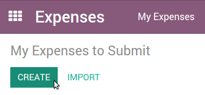
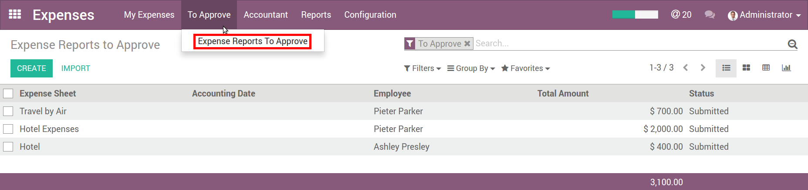
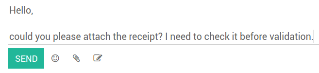
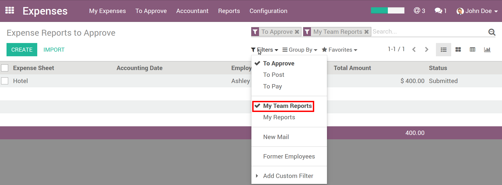

:show-content:

========
Expenses
========

**Odoo Expenses** streamlines the management of expenses. Employees can submit their expenses;
managers can approve them; accountants can record them and process the payments.

.. seealso::
   - `Odoo Expenses: product page <https://www.odoo.com/app/expenses>`_

How to set expense types
========================

The first step to track expenses is to configure the expense types (managed as products in Odoo)
that your company allows, from the *Configuration* menu. 
When a specific expense is reimbursed at a fixed price, set a cost on the product.
Otherwise keep the cost at 0.0 and employees will report the real cost per expense.

.. image:: expenses/product.png
   :align: center

Here are some examples:

* Restaurant:

  * Cost: 0.00 (the cost of the ticket will be recorded on every expense)
* Travel with Personal Car:

  * Cost: 0.30 (the price per mile reimbursed by the company is fixed)
* Hotel:

  * Cost: 0.00 (the cost of the ticket will be recorded on every expense)

* Others:

  * Cost: 0.0

Don't forget to set an expense tax on each expense type 
(and an account if you use Odoo Accounting). 
It's usually a good practice to use a tax that is configured 
with :ref:`Tax Included in Price <taxes/included-in-price>`.
That way, employees report expenses with 
prices including taxes, which is usually the expected behaviour.

.. tip:: 
    The *Sales* app allows you to specify units of measure for your 
    expense types (units, miles, nights, etc.). 
    Go to :menuselection:`Sales --> Configuration --> Settings` and check
    *Some products may be sold/purchased in different units of measure (advanced)*.

How to record expenses
======================

Manually
--------

As an employee (Employee in user access rights), you can record 
expenses from :menuselection:`My Expenses --> Expenses to Submit`.

1. Select the related product and enter either the total amount 
   you paid (with Quantity = 1) or the unit price if Quantity is 
   countable (e.g. number of hotel nights).
2. Enter the expense date.
3. Choose if you paid the bill on your own (and expect to be reimbursed) 
   or if the company paid directly (e.g. if you used a company's credit card).
4. Set the bill reference, add some notes if requested and attach a 
   photo/scan of the receipt from the discussion thread. 
   That will help the manager and the accountant validate it.

.. image:: expenses/submit_02.png
   :align: center

In one click from emails
------------------------

Let your employees record their expenses from a simple email. 
Make a snapshot of the receipt and send it by email, or simply forward a bill!

The only thing to do is setting up an email alias in 
:menuselection:`Expenses --> Configuration --> Settings` (e.g. *expenses* @mycompany.odoo.com). 
For security purposes, only authenticated employee emails 
(cfr. *Work Email* in employee detail form) are accepted.

.. tip::
    The expense product is set automatically if the mail subject contains 
    the product's internal reference in first position.
    Type the expense amount in the mail subject to set it on the expense too (e.g. Ref001 Food 100€).

How to submit expenses to managers
==================================

When you are ready to submit your expenses to your manager 
(e.g. at the end of a business trip, or once a month), 
go to the menu :menuselection:`My Expenses --> Expenses to Submit`. Select all expenses 
from the list view and click on :menuselection:`Action --> Submit to Manager`.
Save the newly created expense report (i.e. set of expenses), 
and wait for your manager to approve it.

.. image:: expenses/submit_03.png
   :align: center

You can also submit expenses one by one from the *Submit to Manager* 
button on the form view of an expense.

All your submitted expense reports can be found in 
:menuselection:`Expenses --> My Expenses --> Expense Reports`.

How to approve expenses
=======================

HR and team managers get an overview of all expense reports to 
validate from the top menu :menuselection:`To Approve --> Expense Reports to Approve`. 
Such users must have at least *Officers* access rights for *Expenses*.

They can review expense reports, approve or reject them, as well as providing 
feedback thanks to the integrated communication tool.

As a team manager you can easily find the expense reports of your team members. 
You need to be set as manager in the detail form of those employees.

How to post expenses in accounting
==================================

Once expense reports approved by managers, the accounting department 
goes to :menuselection:`Expenses --> Accountant --> Expense Reports To Post` to check 
accounts, products and taxes. They can click *Post Journal Entries* 
to post related journal entries into your books. 
To do so, the user must have following access rights:

* Accounting: Accountant or Adviser
* Expenses: Manager

.. note::
    To post an expense, a *Home Address* must be set on the employee. 
    If you get a related blocking message when posting, click the employee, 
    go to *Personal Information* tab and select/create the contact of your employee 
    in the address book. 
    A contact has been automatically created if this person is using Odoo.

How to reimburse employees
==========================

You can now see all the expense reports to reimburse in 
:menuselection:`Expenses --> Accountant --> Expense Reports To Pay`. 
To record the payment or pay by check, click *Register a Payment*.

See how you can easily manage the payment process in Odoo:

* :doc:`accounting/payables/pay/check`
* :doc:`accounting/payables/pay/sepa`

How to re-invoice expenses to your customers
============================================

If you track expenses on customer projects, you can charge them back to
your customers automatically.

Setup
-----

-  Enable **Customer Billing** in the Expenses settings

-  Go to the product configuration menu and set the invoicing method on
   all your Expense types:

   -  Ordered quantities: it will invoice expenses based on the ordered
      quantity

   -  Delivered quantities: it will invoice expenses based on the
      expenses quantity

   -  At cost: will invoice expenses at their real cost.

   -  At sales price: will invoice based on a fixed sales price set on
      the sale order.

Create an order
---------------

-  As a salesman, create and confirm a Sales Order for the services
   delivered to your customer. If you don't put any expense in the
   order, it will be added automatically once posted by the
   accountant.

-  Link the expense to the Sale Order.

Submit, validate and post expenses
----------------------------------

-  As a manager, make sure the analytic account is set on every expense
   line on approving expenses reports. Click the line to add one if
   missing. Employees are already able to set one when submitting.

-  As an accountant, post journal entries.

Invoice expenses
----------------

Now you can invoice the order. It shows up in 
:menuselection:`Sales --> Invoicing --> Sales`
to Invoice. The expenses have been added automatically in the order
lines. Such items show up in blue (i.e. to invoice).

e (i.e. to invoice). 
