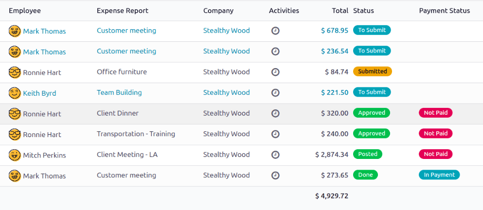
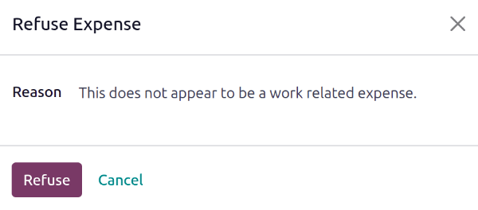

================
Approve expenses
================

In Odoo, not just anyone can approve expense reports, only users with the necessary rights (or
permissions) can. This means that a user **must** have at least *Team Approver* rights for the
*Expenses* app. Employees with the necessary rights can review expense reports, approve or reject
them, and provide feedback thanks to the integrated communication tool.

Please refer to the :doc:`access rights documentation </applications/general/users>` to learn more
about managing users and their access rights.

View expense reports
====================

Users who are able to approve expense reports, typically managers, can easily view all expense
reports they have access rights to. Go to :menuselection:`Expenses app --> Expense Reports`, to view
the :guilabel:`All Reports` dashboard.

A list of all expense reports with a status of either :guilabel:`To Submit`, :guilabel:`Submitted`,
:guilabel:`Approved`, :guilabel:`Posted`, or :guilabel:`Done` appears. Expense reports with a status
of :guilabel:`Refused` are hidden, by default.

Approve expense reports
=======================

Expense reports can be approved in two ways: :ref:`individually <expenses/individual>` or :ref:`in
bulk <expenses/multiple>`.

.. important::
   Only reports with a status of :guilabel:`Submitted` can be approved.

   It is recommended to display only :guilabel:`Submitted` reports by ticking the checkbox beside
   the :guilabel:`Submitted` filter, in the left column, under the :guilabel:`Status` section.

   If a report is **not** able to be approved, the :guilabel:`Approve Report` button **does not**
   appear on the :guilabel:`All Reports` page.

.. _expenses/individual:

Approve individual reports
--------------------------

To approve an individual report, navigate to :menuselection:`Expenses app --> Expense Reports`, and
click on an individual report to view the report form.

From here, several options are presented: :guilabel:`Approve`,  :guilabel:`Refuse`, and
:guilabel:`Reset to draft`.

Click :guilabel:`Approve` to approve the report.

.. _expenses/multiple:

Approve multiple reports
------------------------

To approve multiple expense reports at once, first navigate to :menuselection:`Expenses app -->
Expense Reports` to view a list of expense reports. Next, select the reports to approve by ticking
the checkbox next to each report being approved, or tick the checkbox next to the
:guilabel:`Employee` column title to select all the reports in the list.

Next, click the :guilabel:`Approve Report` button.

.. image:: approve_expenses/approve-report.png
   :align: center
   :alt: Approve multiple reports by clicking the checkboxes next to each report.

.. tip::
   It is possible for team managers to view all the expense reports for just their team members.

   To do so, while on the :guilabel:`All Reports` page, click the :icon:`fa-caret-down`
   :guilabel:`(down arrow)` to the right of the search bar, then click :guilabel:`My Team` in the
   :icon:`fa-filter` :guilabel:`Filters` section.

   This presents all the reports for only the manager's team.

   .. image:: approve_expenses/my-team-filter.png
      :align: center
      :alt: Select the My Team filter.

Refuse expense reports
======================

Expense reports can **only** be refused on the individual expense report, and **not** from the
:guilabel:`All Reports` dashboard. To open an individual expense report, navigate to
:menuselection:`Expenses app --> Expense Reports`, then click on an individual expense report to
view the report form.

If more information is needed, such as a missing receipt, communicate any necessary information
requests in the *chatter* of the report form. On the individual expense report, click
:guilabel:`Send message` to open a message text box.

Type in a message, tagging the proper people, and post it to the *chatter* by clicking
:guilabel:`Send`. The message is posted in the chatter, and the tagged people are notified, via
email.

.. note::
   The only people that can be tagged in a message are *followers* of the specific report. To see
   who is a follower, click the :icon:`fa-user-o` :guilabel:`(user)` icon to display the followers
   of the expense report.

   .. image:: approve_expenses/chatter.png
      :align: center
      :alt: Send messages in the chatter.

To refuse an expense report, click :guilabel:`Refuse`, and a :guilabel:`Refuse Expense` pop-up
window appears. Enter a brief explanation for the refusal beneath the :guilabel:`REASON TO REFUSE
EXPENSE` field, then click :guilabel:`Refuse`.

Once the expense report is refused, the status changes to :guilabel:`Refused`, and the only button
that appears in the top-left is :guilabel:`Reset to Draft`.
