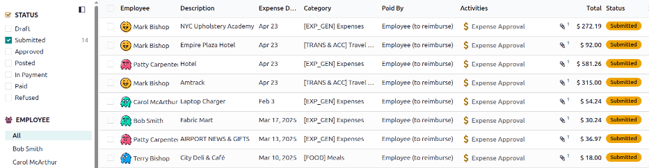

================
Process expenses
================

Once expenses have been created and submitted, they must be processed by an authorized database
user. In Odoo, most users cannot process expenses; only users with the necessary :doc:`access rights
<../../general/users/access_rights>` or permissions can. This means that a user **must** have at
least *Team Approver* rights for the **Expenses** app. Employees with the necessary rights can
review expenses, approve or refuse them, and provide feedback with an integrated :ref:`refuse
expense <expenses/refuse-report>` communication tool.

View expenses
=============

Users who are able to process expenses (typically managers) can view all expenses they have access
rights for in the *Expenses to Process* dashboard. To view the dashboard, navigate to
:menuselection:`Expenses app --> My Expenses --> Expenses to Process`.

A list of all expenses with a status of :guilabel:`Submit` appears, while expenses with a status of
:guilabel:`Draft`, :guilabel:`Approved`, :guilabel:`Posted`, :guilabel:`In Payment`,
:guilabel:`Paid`, or :guilabel:`Refused` are hidden by default. To view expenses with a different
status, click the corresponding :guilabel:`Status` button in the side panel.

Approve expenses
================

Expenses can be approved in two ways: :ref:`individually <expenses/individual>` or :ref:`in bulk
<expenses/multiple>`.

.. important::
   Only reports with a status of :guilabel:`Submitted` can be approved.

.. _expenses/individual:

Approve individual expenses
---------------------------

To approve an individual expense, navigate to :menuselection:`Expenses app --> My Expenses -->
Expenses to Process`, and click on an individual expense to view the details.

From here, several options are presented: :guilabel:`Post Journal Entries`, :guilabel:`Report in
Next Payslip` :guilabel:`Approve`, :guilabel:`Refuse`, :guilabel:`Reset`, :guilabel:`Split Expense`,
and :guilabel:`Attach Receipt`. Click :guilabel:`Approve` to approve the expense.

   .. image:: approve_expenses/approve-individual.png
      :alt: An individual expense report that can be approved or refused.

.. _expenses/multiple:

Approve multiple expenses
-------------------------

To approve multiple expenses at once, first navigate to :menuselection:`Expenses app --> My Expenses
--> Expenses to Process` to view a list of all expenses waiting to be processed. Next, select the
expenses to approve by ticking the checkbox next to each expense being approved, or tick the
checkbox next to the :guilabel:`Employee` column title to select all the expenses in the list.

Next, click the :guilabel:`Approve` button.

   .. image:: approve_expenses/approve-multiple.png
      :alt: Select multiple expense reports at once.

.. tip::
   Team managers can view all the expenses for their team members only. While on the
   :guilabel:`Expenses to Process` page, click the :icon:`fa-caret-down` :guilabel:`(down arrow)` on
   the right-side of the search bar, then click :guilabel:`My Team` in the :icon:`fa-filter`
   :guilabel:`Filters` section. This presents all the expenses for only the manager's team.

.. _expenses/refuse-report:

Refuse expenses
===============

Expenses can **only** be refused individually, and **not** from the :guilabel:`Expenses to Process`
dashboard. To refuse an individual expense, navigate to :menuselection:`Expenses app --> My expenses
--> Expenses to Process`, then click on an individual expense to open the detailed expense record.

If more information is needed, such as a missing receipt, communicate any necessary information
requests in the *chatter* of the expense record. On the individual expense, click either
:guilabel:`Send message` or :guilabel:`Log note` to open a message text box.

Type in a message, tagging the proper people, and post it to the *chatter* by clicking
:guilabel:`Send` or :guilabel:`Log`, depending on the method of communication. The message is posted
in the chatter, and the tagged people are notified via email.

.. note::
   The only people that can be tagged in a message are *followers* of the specific expense. To see
   who is a follower, click the :icon:`fa-user-o` :guilabel:`(Show Followers)` icon to display the
   followers of the expense report. Additional followers can be added by clicking the
   :icon:`fa-user-o` :guilabel:`(Show Followers)` icon, then clicking :guilabel:`Add Followers`.

   .. image:: approve_expenses/chatter.png
      :alt: Send messages in the chatter.

To refuse an expense, click :guilabel:`Refuse`, and a *Refuse Expense* pop-up window loads. Enter a
brief explanation for the refusal in the :guilabel:`Reason` field, then click :guilabel:`Refuse`.

.. important::
   A reason **must** be entered in the :guilabel:`Reason` field, or the expense cannot be refused.

  .. image:: approve_expenses/refuse-expense.png
     :alt: Send messages in the chatter.

Once the expense is refused, the status changes to :guilabel:`Refused`, and the only buttons that
appear are :guilabel:`Add Receipt` and :guilabel:`Reset`.
