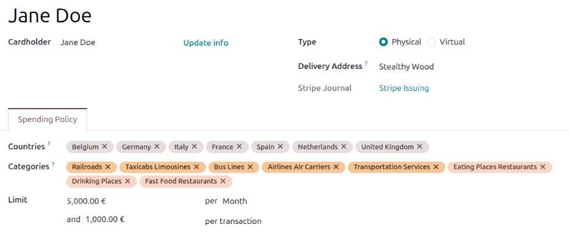

=============
Expense cards
=============

Odoo offers physical and virtual expense cards, allowing for better expense tracking and management.
Using expense cards allows for real time expense management, creating expense records as soon as an
expense transaction occurs, allowing management greater visibility of expense costs as they are
incurred.

The elimination of the need to :doc:`actively create expense records <log_expenses>` allows for a
more streamlined expense workflow, with records automatically created as purchases are made.

To use expense cards, first a :ref:`card is configured <expenses/card-configure>`, then it is
:ref:`activated <expenses/card-activate>`. Before employees can make purchases with their expense
card, a :ref:`Stripe account must be created <expenses/create-stripe>` and configured, then
:ref:`funds must be added <expenses/add-funds>` to the company's Stripe account. Once there is money
available in the account (this typically takes 2-3 business days for the transfer to Stripe),
employees can use their expense cards, and the money is pulled from the company's Stripe account.

.. important::
   To create and use expense cards, both the **Accounting** and **Invoicing** apps **must** be
   :ref:`installed <general/install>`.

.. note::
   Expense cards act like pre-paid debit cards, as they can **only** be used with a connected Stripe
   account, and **only** if funds are added to that account, to be drawn from.

Availability
============

Expense cards are currently available for the following countries:

+-------------+-------------+-------------+-------------+
| Austria     | Belgium     | Croatia     | Cyprus      |
+-------------+-------------+-------------+-------------+
| Estonia     | Finland     | France      | Germany     |
+-------------+-------------+-------------+-------------+
| Greece      | Ireland     | Italy       | Latvia      |
+-------------+-------------+-------------+-------------+
| Lithuania   | Luxembourg  | Malta       | Netherlands |
+-------------+-------------+-------------+-------------+
| Portugal    | Slovakia    | Slovenia    | Spain       |
+-------------+-------------+-------------+-------------+

Only companies located in one of these countries are able to create and use expense cards.

Fees
====

Odoo covers **all fees** associated with creating virtual and physical cards.

.. _expenses/card-settings:

Configuration
=============

Two settings must be configured to use expense cards. Navigate to :menuselection:`Expenses app -->
Configuration --> Settings`. Tick the box next to :guilabel:`Expense Card`, then click
:guilabel:`Save`. The :guilabel:`Settings` page reloads, and two fields now appear beneath the
:guilabel:`Expense Card` option.

A :guilabel:`Journal` field with :guilabel:`Stripe Issuing` appears, populating the field. This is
the default journal, and it is **not** recommended to alter this unless instructed by the accounting
department.

Next, click the text link :guilabel:`terms and conditions` and an :guilabel:`Expense Cards Terms and
Conditions` pop-up window loads, with all the details of the agreement. After this has been read,
click :guilabel:`Close`, then tick the checkbox next to :guilabel:`I confirm agreeing to the terms
and conditions` to accept the terms, then click :guilabel:`Save`.

.. note::
   The terms and conditions **must** be agreed to use expense cards.

After agreeing to the terms and conditions, :ref:`create a Stripe connected account
<expenses/create-stripe>`.

.. _expenses/create-stripe:

Create Stripe connected account
===============================

To create a Stripe connected account, open the **Expenses** app, and ensure the :guilabel:`Expense
Card` option is enabled. Next, click :icon:`oi-arrow-right` :guilabel:`Connect` to create a new
Stripe Issuing connect account.

Fill in the KYC questionnaire provided by Stripe. Stripe takes +/-24 hours to approve or refuse
account creation requests.

A green :guilabel:`Verified` tag now appears next to :icon:`oi-arrow-left` :guilabel:`Refresh`,
indicating the account is properly configured.

Once the account is verified, the company must :ref:`add funds <expenses/add-funds>` to their Stripe
balance.

.. _expenses/add-funds:

Add funds to Stripe account
===========================

For employees to use their expense cards, funds must be available in the company's Stripe account,
to make purchases against. To add funds to the company's Stripe account, open the **Accounting**
app. On the :guilabel:`Stripe Issuing` Kanban card, click :guilabel:`Top-up`, and a
:guilabel:`Top-up` pop-up window loads.

Enter the amount being transferred into the account in the :guilabel:`Amount` field. The
:guilabel:`IBAN` and :guilabel:`BIC` fields are populated according to the Stripe configuration and
cannot be changed. When configured, click :guilabel:`Topup`, and the transfer is initiated.

.. note::
   The user wires money to the IBAN shown using a SEPA Credit Transfer (for the EURO Zone). The
   Stripe issuing partner bank is `Circle Bank`.

.. important::
   It typically takes 2-3 business days for transfers to be processed. Funds are **not** available
   until the transfer is complete.

.. _expenses/card-configure:

Configure expense cards
=======================

To create and configure a new expense card, click :menuselection:`Cards` in the main **Expenses**
app menu to view the :guilabel:`Cards` dashboard. Click :guilabel:`New` and a blank
:guilabel:`Cards` form loads. Enter the following information on the form:

- :guilabel:`Card Name`: The first line on the card form is blank, and displays `Draft`. Enter a
  name for the card in this field. This does **not** need to be a person's name, it can be something
  descriptive to explain the use of the card.

  .. example::
     An employee is going on a week-long business trip to Berlin to visit many clients. The employee
     needs to pay for meals, transportation, and other business-related expenses. Since this is a
     short trip, a virtual card is created to capture all the expenses, with the name `Business Trip
     - Berlin`.

     The marketing department pays for many expenses throughout the year, from email marketing
     services, venue rentals for events, promotional merchandise, etc. Since the expenses do not
     have an end date, and it is used for an entire department, a physical card is ordered with the
     name `Marketing`.

- :guilabel:`Cardholder`: Select the person using the card from the drop-down menu. Once selected,
  the person's name populates the :guilabel:`Draft` field, above :guilabel:`Cardholder`.
- :guilabel:`Update info`: Next to the cardholder's name, click :guilabel:`Update info` and a
  :guilabel:`Cardholder Configuration` pop-up window loads. Update the cardholder's name, birthday,
  phone number, email, and physical address. All the requested information **must** be populated, as
  it is used to create the expense card with Stripe, and to verify the cardholder's identity, when
  needed. If any information is missing from this form, the card **cannot** be created, and an error
  appears when creating or ordering the card.

  .. important::
     The phone number listed is used for two-factor authentication. The phone number can be changed
     in the future. When changing the phone number, an alert is sent to the original phone number,
     notifying them of the change.

- :guilabel:`Type`: Click the radio button next to the desired *type* of expense card. Options are:

  - :guilabel:`Physical`: A physical card is printed and mailed out to the employee. If selected, a
    :guilabel:`Delivery Address` field appears. Using the drop-down menu, select the employee or
    company address the card is mailed to.
  - :guilabel:`Virtual`: Virtual cards are available instantaneously once the card configuration is
    completed and the card is activated.

- :guilabel:`Company`: Select the company the expenses are associated with using the drop-down menu.
  Each card must be associated with a single company, and are **not** available for use between all
  companies or branches in the database. Ensure the selected company has its own Stripe Connect
  account configured, or the expense cards will not work.
- :guilabel:`Stripe Journal`: :guilabel:`Stripe Issuing` populates this field by default, and cannot
  be modified.

Next, configure the following fields in the :guilabel:`Spending Policy` tab of the card form:

- :guilabel:`Countries`: Using the drop-down menu, select the countries the card is able to be used
  in. The company's country location populates this field, by default. All other countries the
  employee may travel to or purchase expensable items from, should be included in this list.
- :guilabel:`Categories`: If the expense card is limited to purchase items within a specific
  *category*, select them using the drop-down menu. If this field is left blank, the card may be
  used for *any* expense category.

  Odoo is able to categorize transactions based on the :abbr:`MCC (Merchant Category Code)` provided
  by the card network provider (such as Mastercard). Every merchant has a corresponding :abbr:`MCC
  (Merchant Category Code)` that identifies their business and product types. When a Stripe-issued
  card is used, the :abbr:`MCC (Merchant Category Code)` is sent with the transaction, allowing
  Stripe to approve or block it based on the card's configuration.

  .. example::
     A company issues an expense card that is only authorized for airline, train, and taxi travel
     expenses.

     To configure this, click into the :guilabel:`Category` field, and click :guilabel:`Search
     more...` at the bottom. In the :guilabel:`Search: Categories` pop-up window, click into the
     search bar and click :guilabel:`Transportation services` in the :icon:`fa-filter`
     :guilabel:`Filters` column.

     Next, tick the checkboxes next to the desired transportation categories. In this example, only
     :guilabel:`Railroads`, :guilabel:`Passenger Railways`, :guilabel:`Taxicabs Limousines`, and
     :guilabel:`Airlines Air Carriers` are selected.

     Click :guilabel:`Select` and the selected transportation categories now populate the
     :guilabel:`Categories` field.

- :guilabel:`Limit`: Configure the two spending limits for the card. The first configuration sets
  the total expense amount allowed during a specific time period. Using the drop-down menu after the
  word :guilabel:`per`, select the time period the limit applies to. The available options are:
  :guilabel:`Day`, :guilabel:`Week`, :guilabel:`Month`, :guilabel:`Year`, or :guilabel:`All Time`.
  Next, enter the maximum amount allowed for the selected time period.

  Next, set the *per transaction* limit. Enter the maximum amount that can be charged on the expense
  card in a single transaction in the field.

  .. example::
     A company allows employees to purchase airline tickets that are less than $1,000.00 total.
     Additionally, there is a monthly cap of $3,000.00 for all expenses.

     The company would configure the limit as follows: `3,000.00` per :guilabel:`Month` and
     `1,000.00` per transaction.

.. tip::
   Card limits can be modified at any point. Once modified, they immediately go into effect.

  .. important::
     All expense cards pull payments from a single Stripe account. It is recommended to set card
     limits to avoid large charges or transactions that may prematurely deplete the expense Stripe
     account.

.. _expenses/card-activate:

Activate expense cards
======================

Once an expense card is configured, the next step is to activate the cards. First, navigate to
:menuselection:`Expenses app --> Cards`, and the :guilabel:`Cards` dashboard loads, displaying all
expense cards in a Kanban view.

All cards display their status on a banner in the upper-right corner of each card. Statuses are
either:

- :guilabel:`Draft`: The card form is filled out, but the card has not been requested or activated.
- :guilabel:`Pending`: A physical card has been ordered, but not activated.
- :guilabel:`Active`: The card is able to be used. This status does **not** display a status banner
  on the card.
- :guilabel:`Paused`: A card has been put *on hold* and no transactions can be processed with this
  status.
- :guilabel:`Blocked`: The physical or virtual card is *cancelled* and cannot be used.

Click on a card to activate, and the card form loads. Ensure all the fields are :ref:`configured
<expenses/card-configure>`, then click either :guilabel:`Order` if requesting a physical card, or
:guilabel:`Activate` if creating a virtual card.

.. note::
   Physical cards take 5 to 10 business days to be delivered. Once ordered, delivery information is
   added to the chatter, and the user who placed the card order receives the information by email.

If a physical card is requested, the card status changes to :guilabel:`Inactive`, while it is being
printed and mailed to the selected address. Once the card arrives, follow the included instructions
to activate the card.

If the card is a virtual card, once :guilabel:`Activate` is clicked, the status changes to
:guilabel:`Active` and it is available for use.

Once the status of an expense card is :guilabel:`Active`, the user can use the card to purchase
expensable items, as long as the purchases are within the limits set on the card.

Demo expense card
=================

To test the expense card feature without using a live Stripe account, :ref:`install
<general/install>` the `Expense Cards: Demo` module. This replaces production functionalities and
allows for the creation of a demo Stripe account, using virtual cards and fake funds to simulate
transactions.

.. note::
   If a production account is already configured, **do not use** the demo module, as it overwrites
   the existing setup.

Using expense cards
===================

Using an expense card is almost identical to using any other credit or debit card. The only
difference is if a :ref:`physical card <expenses/physical>` or a :ref:`virtual card
<expenses/virtual>` is used.

When a charge is made using an expense card, an expense record is automatically created in the
**Expenses** app, linked to the specific card. The next step is to attach the corresponding receipt.

.. note::
   It is best proactive to take a photo of a receipt as soon as it is received, to eliminate the
   risk of losing the receipt and having an expense reimbursement request denied.

Open the expense record by navigating to :menuselection:`Expenses app --> Cards`, and click on the
specific card. Next, click the :icon:`fa-usd` :guilabel:`Expenses` smart button, and the
:guilabel:`Expenses` dashboard loads for that card. Any expense that does *not* have a receipt
attached to the record displays a :icon:`fa-credit-card` :guilabel:`Please upload the receipt.`

Click on the desired expense record to open the detailed expense form. Click the :guilabel:`Attach
Receipt` button, and a file explorer loads. Navigate to the receipt, and click :guilabel:`Open` to
select it and attach it to the expense.

Make any other adjustments to :ref:`the expense record <expenses/manual_expense>`, if necessary.
Once the record is correct, click :guilabel:`Submit` to submit the receipt, or :guilabel:`Split`, if
the receipt needs to be split between multiple expenses.

.. important::
   If a purchase is attempted that either is outside the listed countries, listed categories, or
   exceeds the transaction limit or total expense limit for the specified time period, the expense
   is denied and captured in the :guilabel:`Expenses` dashboard for the card, with a status of
   *Refused*.

   To view the details of why the transaction was refused, click on the :icon:`fa-usd`
   :guilabel:`Expenses` smart button for the card, and click on the refused transaction. The details
   explaining why the transaction was refused appears in the chatter, authored by *OdooBot*.

.. _expenses/physical:

Physical card
=============

When using a physical card, make charges in the same manner as a regular physical pre-paid debit
card.

Once the user receives the card, the cardholder must activate the card using the instructions
provided with the card. Next, open the **Expenses** app, and click on the physical card, which has a
status of :guilabel:`Pending`. Click :guilabel:`Activate`, then when prompted, enter the last four
digits of the card, confirm the phone number, accept the terms and conditions, and complete the
activation.

Card PIN
--------

To view the card's PIN, open the card form in the **Expenses** app, and enter the six-digit code
sent via SMS to the associated phone number. The card and its PIN appear in a pop-up window. The PIN
is displayed below the card and **cannot** be changed.

.. _expenses/virtual:

Virtual card
============

If using a virtual card, there is one additional step to access the card information to use for
purchases.

To obtain the card information, navigate to :menuselection:`Expenses app --> Cards` and click on the
virtual card being used. Next, click into the :guilabel:`Card Details` tab, and two items appear:
the expense card number, with only the last four digits displayed, and the expiration date.

To view the full details, click :icon:`fa-eye` :guilabel:`View Details`, and a :guilabel:`Two-Factor
Authentication` pop-up window loads. Enter the six-digit authentication code that is texted to the
cardholder's phone number. The card appears in the pop-up window, with all the information
displayed: the card number, expiration date, and security code. When done, close the window by
clicking :guilabel:`X`.

.. tip::
   Android users can add their virtual expense cards `to a Google wallet
   <https://support.google.com/wallet/answer/12058983?hl=en>`_.

Lost cards
==========

When a physical card is lost, or if credentials for a virtual card have been compromised, the cards
must be updated in the **Expenses** app so they cannot be used. This is referred to in Odoo as
*blocking*.

To stop any charges on a card, navigate to :menuselection:`Expenses app --> Cards`, and click on the
specific card being deactivated. On the card form, click the :guilabel:`Block` button, and a
:guilabel:`Block a Card` pop-up window loads.

Click into the field next to :guilabel:`Reason`, and select the reason the card is being blocked.
The options are :guilabel:`Lost`, :guilabel:`Stolen`, or :guilabel:`Other`. After making a
selection, click :guilabel:`Block`, and the card is unable to be used, and a red :guilabel:`Blocked`
banner appears on the card in the :guilabel:`Cards` dashboard view.

.. example::
   An employee is given a virtual expense card to use for an upcoming business trip. The employee
   uses this card to purchase an airline ticket and a hotel room, one month before the scheduled
   trip.

   A week before the trip, they receive an email from the airline, explaining there has been a data
   breach, and customer names, contact information, and purchase details including credit card
   numbers have been leaked.

   The employee reaches out to their manager, explaining the situation. The manager opens the
   virtual expense card, and blocks the card using the reason :guilabel:`Other`. Then the manager
   issues another virtual card for the employee to use for their business trip.

Temporary card pauses
=====================

When an employee is out of office for an extended period of time, such as a vacation, or an illness,
it is recommended to temporarily deactivate their card to prevent any fraudulent charges. This is
referred to in Odoo as *pausing* a card.

To pause a card, navigate to :menuselection:`Expenses app --> Cards`, and click on the specific card
being paused. On the card form, click :guilabel:`Pause`, and the card is unable to be used until it
is activated.

.. example::
   An employee in the sales department has a physical expense card to use for client meetings. They
   recently welcomed a new child, and will be out of office on parental leave for three months.

   On the employee's last day, their manager opens the expense card record, and clicks
   :guilabel:`Pause`. When the employee returns to work, the manager opens the expense card form and
   clicks :guilabel:`Active` to reactivate the card.
