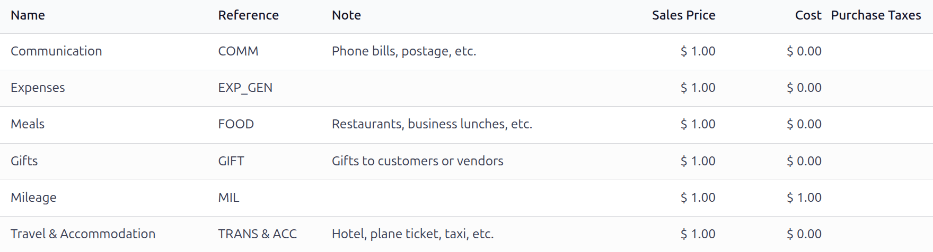
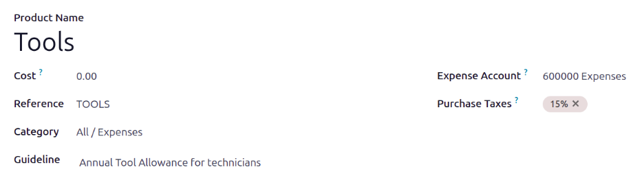

==================
Expense categories
==================

Odoo **Expenses** streamlines the management of expenses. After an employee :doc:`logs their
expenses <../expenses/log_expenses>` and :doc:`submits their expense report
<../expenses/expense_reports>` in Odoo, expenses are reviewed by management and accounting teams.
Once :doc:`approved <../expenses/approve_expenses>`, payments can be processed and :doc:`disbursed
back to the employee <../expenses/reimburse>` for reimbursement.

.. seealso::
   `Odoo Expenses: product page <https://www.odoo.com/app/expenses>`_

View expense categories
=======================

The first step to track expenses is configuring the different types of expenses for the company
(managed as *expense categories* in Odoo). Each category can be as specific or generalized as
needed. Additionally, expense categories can be configured to repay expenses at either a set price
or allow for specific prices to be reported.

To view the default expense categories, navigate to :menuselection:`Expenses app --> Configuration
--> Expense Categories`.

The default expense categories allow creating expenses for common expenses, including communication
costs, meals, gifts, miles driven, and other travel expenses. For expenses outside these default
categories, the general expenses category, :guilabel:`EXP_GEN`, is used. If a company has specific
expenses it commonly reimburses, and wants to track them separately, :ref:`new expense categories
can be made <expenses/new-category>` or existing expense categories can be modified.

.. _expenses/new-category:

Create new expense categories
=============================

Some companies require more expense categories than the **Expenses** app includes. For these
situations, new expense categories can be created.

.. example::
   A company that trains car mechanics allows its technicians to purchase $500 worth of tools in a
   year. In this situation, the company creates a new category called `TOOLS` to track all tool
   expenses.

To create a new expense category, navigate to :menuselection:`Expenses app --> Configuration -->
Expense Categories`. Click :guilabel:`New`, and a new expense category form loads.

.. note::
   Expense *categories* are managed like *products* in Odoo. The expense category form follows the
   standard product form in Odoo, and the information entered is similar. Expense *products* are
   referred to as expense *categories* throughout this document since the main menu refers to these
   as :guilabel:`Expense Categories`.

Enter the following fields on the form:

- :guilabel:`Product Name`: Enter a name for the category that is short and informative.
- :guilabel:`Cost`: If employees can report the actual cost of an expense, and are reimbursed
  the reported amount, leave the field set to `0.00`. If the expense should **always** be reimbursed
  for a specific price, enter the amount in this field. If a price is entered, a :guilabel:`per`
  field appears with :guilabel:`Unit` populated by default. :guilabel:`Unit` covers most expense
  situations, but if the reimbursement is based on weight, length, volume, etc., choose the
  corresponding type of unit using the drop-down menu.

  .. example::
     Here are some examples for when to set a specific :guilabel:`Cost` on a product vs. leaving the
     :guilabel:`Cost` at `0.00`:

     - **Meals**: If employees are reimbursed for their full meal cost, set the :guilabel:`Cost` to
       `0.00`. When an employee logs an expense for a meal, they enter the actual amount of the bill
       and are reimbursed for that amount. An expense for a meal costing $95.23 would equal a
       reimbursement of $95.23.
     - **Mileage**: If employees receive a flat rate for each mile they drive, set the
       :guilabel:`Cost` to `1.00`. When an employee logs an expense for the miles driven, they enter
       the number of miles driven in the :guilabel:`Quantity` field, and are reimbursed $1.00 per
       mile they reported. An expense for 100 miles would equal a reimbursement of $100.00.
     - **Per Diem**: If employees receive a daily flat rate of $125.00 when traveling, set the
       :guilabel:`Cost` to `125.00`. An expense for three days of per diem costs (meals,
       incidentals, taxi fare, etc.) would equal a reimbursement of $375.00.

  .. note::
     The :guilabel:`Cost` field is always visible on the expense category form, but the
     :guilabel:`Sales Price` field is *only* visible if the :guilabel:`Sales Price` is selected
     under the :guilabel:`Re-Invoice Expenses` section. Otherwise, the :guilabel:`Sales Price` field
     is hidden.

- :guilabel:`Reference`: Enter a short reference for the expense, such as `FOOD` or `TRAVEL`. This
  reference is used when :ref:`emailing expenses <expenses/email_expense>`.
- :guilabel:`Category`: Using the drop-down menu, select the category the expense falls under. It is
  recommended to use the default category `All / Expenses`, but another category can be selected if
  the accounting department requires it.
- :guilabel:`Company`: If in a multi-company database, select the company the expense category
  applies to. If the expense category applies to *all* companies, leave this field blank.
- :guilabel:`Guideline`: Enter some rules or important information for the expense category. This is
  visible in the :guilabel:`Note` column on the :guilabel:`Expense Category` dashboard.

  .. example::
     An expense category for expenses related to working from home may have a :guilabel:`Name` of
     `WFH`, and the :guilabel:`Guideline` may say `Monitors, Chairs, & Other Home Working Costs`.

- :guilabel:`Expense Account`: If using the Odoo **Accounting** app, select the :abbr:`CoA (Chart of
  Accounts)` the expense should be logged on.

  .. important::
     Check with the accounting department to determine the correct account to reference in this
     field as it affects various reports.

- :guilabel:`Purchase Taxes` and :guilabel:`Sales Taxes`: Enter the default taxes that are applied
  when purchasing or selling this product, if applicable.

  .. note::
     The :guilabel:`Sales Taxes` field is **only** visible if the **Sales** app is installed, and
     either the :guilabel:`At cost` or :guilabel:`Sales Price` options are selected in the
     :ref:`invoicing section <expenses/invoicing>`.

  .. tip::
     It is considered good practice to use a tax that is configured with :ref:`Tax Included in Price
     <taxes/included-in-price>`. Taxes are automatically configured if these are set.

.. _expenses/invoicing:

Invoicing section
-----------------

If the **Sales** app is installed, an invoicing section is visible. This section allows the expense
to be reinvoiced to customers on sales orders.

If the expense **cannot** be reinvoiced, enable the :guilabel:`No` option. If the expense category
**can** be reinvoiced, enable either of these options:

- :guilabel:`At cost`: Select this option to have the expense item reinvoiced at the price set in
  the :guilabel:`Cost` field.
- :guilabel:`Sales Price`: Select this option to have the expense item reinvoiced at the sales
  price. When enabled, a :guilabel:`Sales Price` field appears beneath the :guilabel:`Product Name`
  field. Enter the sales price in the new field.

.. example::
   A heating and cooling company offers at-home repairs on the furnaces and central air units it
   sells. Their technicians are sub-contracted, and use their own vans, tools, and parts.

   As part of their contracts, technicians are reimbursed for their travel. They receive $1.00 for
   every mile they drive. Additionally, the customer must pay for the travel as part of their
   service contract. The customer pays $1.50 for every mile the technician drives to their location.

   To configure this expense, the :guilabel:`Sales Price` is set to `1.50` and the :guilabel:`Cost`
   is set to `1.00`.

  .. image:: expense_categories/reimbursement-category.png
     :alt: An expense category to reinvoice customers and pay technicians.
