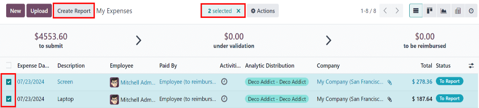
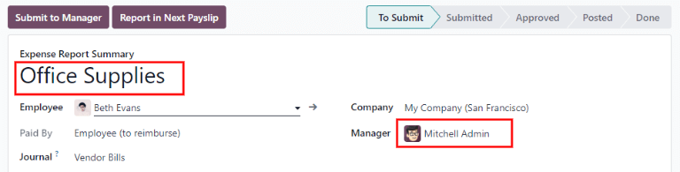

===============
Expense reports
===============

When expenses are ready to submit (such as at the end of a business trip, or once a month), an
*expense report* needs to be created. Open the main **Expenses** app dashboard, which displays the
:guilabel:`My Expenses` dashboard, by default. Alternatively, navigate to :menuselection:`Expenses
app --> My Expenses --> My Expenses`.

All expenses are color-coded by status. Any expense with a status of :guilabel:`To Report` (expenses
that still need to be added to an expense report) appears in blue text. For all other statuses
(:guilabel:`To Submit`, :guilabel:`Submitted`, and :guilabel:`Approved`) the text appears in black.

.. _expenses/create_report:

Create expense reports
======================

First, select the desired expense to be added to the report on the :guilabel:`My Expenses` dashboard
by ticking the checkbox next to each entry.

.. note::
   Any expense can be selected from the :guilabel:`My Expenses` list, except for expenses with a
   status of :guilabel:`Approved`.

   The :guilabel:`Create Report` button is visible as long as there is a minimum of one expense on
   the list with a status of either :guilabel:`To Report` or :guilabel:`To Submit`.

   When the :guilabel:`Create Report` button is clicked, all expenses with a status of :guilabel:`To
   Submit` that are *not* currently on another expense report appear in the newly-created expense
   report.

   If all expenses on the :guilabel:`My Expenses` report are already associated with another expense
   report, an :guilabel:`Invalid Operation` pop-up window appears, stating :guilabel:`You have no
   expenses to report.`

Once the expenses have been selected, click the :guilabel:`Create Report` button.

.. tip::
  Another way to add *all* expenses that are not currently on an expense report is to click the
  :guilabel:`Create Report` button, *without* selecting any expenses, and Odoo automatically selects
  all expenses with a status of :guilabel:`To Submit` that are not already on a report.

The new report loads with all the expenses listed in the :guilabel:`Expense` tab. If there is a
receipt attached to an individual expense, a :icon:`fa-paperclip` :guilabel:`(paperclip)` icon
appears on the expense line.

When the report is created, the date range for the expenses appears as the :guilabel:`Expense Report
Summary`, by default. It is recommended to edit this field with a brief summary for each report to
help keep expenses organized. Enter a description for the expense report, such as `Client Trip NYC`,
or `Office Supplies for Presentation`, in the :guilabel:`Expense Report Summary` field.

The :guilabel:`Employee`, :guilabel:`Paid By`, and :guilabel:`Company` fields are populated with the
information listed on the individual expenses.

.. note::
   The :guilabel:`Company` field only appears in a multi-company database.

Next, select a :guilabel:`Manager` from the drop-down menu to assign a manager to review the report.
If needed, update the :guilabel:`Journal` field using the drop-down menu.

If some expenses are missing from the report, they can still be added from this report form. To do
so, click :guilabel:`Add a line` at the bottom of the :guilabel:`Expense` tab.

An :guilabel:`Add: Expense Lines` pop-up window appears, displaying all the available expenses (with
a :guilabel:`To Submit` status) that can be added to the report. If a new expense needs to be added
that does **not** appear on the list, click :guilabel:`New` to :doc:`create a new expense
<../expenses/log_expenses>` and add it to the report.

Tick the checkbox next to each expense being added, then click :guilabel:`Select`. Doing so closes
the pop-up window, and the items now appear on the report.

.. tip::
   Expense reports can be created in one of two ways:

   #. Navigate to the main :menuselection:`Expenses app` dashboard (also accessible, via
      :menuselection:`Expenses app --> My Expenses --> My Expenses`) and click :guilabel:`Create
      Report`.
   #. Navigate to :menuselection:`Expenses app --> My Expenses --> My Reports` and click
      :guilabel:`New`.

.. _expenses/submit:

Submit expense reports
======================

When an expense report is completed, the next step is to submit the report to a manager for
approval. To view all expense reports, navigate to :menuselection:`Expenses app --> My Expenses -->
My Reports`. Open the specific report from the list of expense reports.

.. note::
   Reports must be individually submitted, and **cannot** be submitted in batches.

If the list is large, grouping the results by status may be helpful, since only reports with a
:guilabel:`To Submit` status need to be submitted; reports with an :guilabel:`Approved` or
:guilabel:`Submitted` status do not. The :guilabel:`To Submit` expenses are identifiable by the
:guilabel:`To Submit` status, and by the blue text, while all other expense text appears in black.

.. image:: expense_reports/submit-report.png
   :alt: Submit the report to the manager.

Click on a report to open it, then click :guilabel:`Submit To Manager`. After submitting a report,
the next step is for management to review and :doc:`approve it <approve_expenses>`.

.. note::
   The status of each report is shown in the :guilabel:`Status` column. If the :guilabel:`Status`
   column is not visible, click the :icon:`oi-settings-adjust` :guilabel:`(additional options)` icon
   at the end of the row, and tick the checkbox beside :guilabel:`Status` from the resulting
   drop-down menu.

.. important::
   :doc:`Approving <../expenses/approve_expenses>` expenses, :doc:`posting
   <../expenses/post_expenses>` expenses, and :doc:`reimbursing <../expenses/reimburse>` expenses
   are **only** for users with the appropriate :doc:`access rights </applications/general/users>`.
