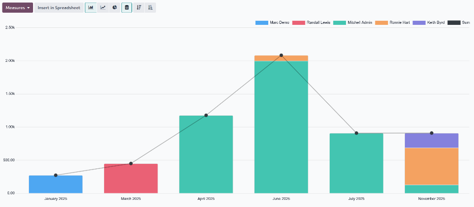

=================
Expenses analysis
=================

It is important for companies to track expenses so they have an understanding of their expenses and
can identify trends. Expense reporting allows for detailed information, such as which expense
categories are reimbursed the most, which employees incur the most expenses, and if there are any
periods of time that tend to incur more expenses than others.

View expense analysis report
============================

To view the default *Expenses Analysis* report, navigate to :menuselection:`Expenses app -->
Reporting --> Expenses Analysis`. The :guilabel:`Expenses Analysis` report displays all expenses for
the current year, in a stacked bar chart, grouped by month.

View expenses by employee
=========================

It is possible to view the data so that the total cost of expenses *by employee* is visible. To view
the report in this way, navigate to :menuselection:`Expenses app --> Reporting --> Expenses
Analysis`. Next, click the :icon:`oi-view-pivot` :guilabel:`(Pivot)` icon to view the data in a
pivot table.

This presents the data with the *employees* populating the rows, and the *total monthly expenses*
populate the columns. Next, click :icon:`fa-minus-square-o` :guilabel:`Total` at the top of the
monthly columns to hide the individual monthly totals, and present only the *total* amount for the
year.

To present the data in either ascending or descending total, click the :guilabel:`Total In Currency`
box, and the information is organized first in ascending order, starting with the smallest amount.
Click :guilabel:`Total In Currency` again to reverse the order, and present the highest amount
first.

.. example::
   In this example it can be determined that :guilabel:`Mike Smith` has the highest amount of
   expenses, totaling :guilabel:`4,216.44`. This is almost seven times higher than :guilabel:`Ronnie
   Hart`, who has the second highest expenses, with a total of :guilabel:`644.74`.

   .. image:: expenses_analysis/by-employee.png
      :alt: A pivot table with the information shown by employee, in descending order.

View expenses by category
=========================

It is possible to view the data so that the total cost of expenses *by category* is visible. To view
the report in this way, navigate to :menuselection:`Expenses app --> Reporting --> Expenses
Analysis`. Next, click the :icon:`oi-view-pivot` :guilabel:`(Pivot)` icon to view the data in a
pivot table.

This presents the data with the *employees* populating the rows, and the *total monthly expenses*
populate the columns. Next, click :icon:`fa-minus-square-o` :guilabel:`Total` at the top of the
employees column. Click :icon:`fa-plus-square` :guilabel:`Total` that appears in place of
:icon:`fa-minus-square-o` :guilabel:`Total`, revealing a drop-down menu of options. Click
:guilabel:`Category`, and the expense categories now populate the rows.

Next, click :icon:`fa-minus-square-o` :guilabel:`Total` at the top of the months column to hide the
individual months, and only show the annual total for each category.

To present the data in either ascending or descending total, click the :guilabel:`Total In Currency`
box, and the information is organized first in ascending order, starting with the smallest amount.
Click :guilabel:`Total In Currency` again to reverse the order, and present the highest amount
first.

.. example::
   In this example, it can be determined that the company spent the most on travel expenses, with
   the expense category :guilabel:`[TRANS & ACC] Travel & Accommodation` incurring
   :guilabel:`2,940.00` of expenses for the year. The company reimbursed mileage the least, with
   only :guilabel:`229.69` in :guilabel:`[MIL] Mileage` expenses.

   .. image:: expenses_analysis/by-category.png
      :alt: A pivot table with the information shown by catrgory in descending order.
